# For Writers: WDCML to OP migration guide for driver documentation

This content is to help writers migrate the driver documentation (the conceptual portion) over to the open publishing platform. At a high level, migration consists of these steps:

1. [Get your Git account and tools set up](#1-get-your-git-account-and-tools-set-up)
2. [Refactor the WDCML TOC (create OP and REF XTOC files)](#2-refactor-the-wdcml-toc-create-op-and-ref-xtoc-files-)
3. [Convert the conceptual topics to OP](#3-convert-the-conceptual-topics-to-op)
4. [Cloning windows-driver-docs-pr & other set up](#4-cloning-windows-driver-docs-pr-other-set-up)
5. [Do a local build of the OP content](#5-do-a-local-build-of-the-op-content)
6. [Create working branch in windows-driver-docs-pr](#6-create-working-branch-in-windows-driver-docs-pr)
7. [Add OP content to the working branch](#7-add-op-content-to-the-working-branch)
8. [Review your branch on MSDNStage](#8-review-your-branch-on-msdn-stage)
9. [Make revisions to your working branch](#9-make-revisions-to-your-working-branch) 
10. [Finishing touches: Run clean-up script and set author](#10-finishing-touches-run-clean-up-script-and-set-author)
11. [Finishing touches: Add your project to the WDK TOC \(in OP\)](#11-finishing-touches-add-your-project-to-the-wdk-toc-in-op-)
12. [Push changes back up to ORIGIN  **<------------------------- Update working branch on MSDNSTAGE**](#12-push-changes-back-up-to-origin-update-working-branch-on-msdnstage-)
13. [Build a .CSV file for redirecting old topics to OP ](#13-build-a-csv-file-for-redirecting-old-topics-to-op)
14. [Create new WDCML parent topic in HW_NODES](#14-create-a-new-wdcml-parent-topic-in-hw_nodes)
15. [Update WDCML TOC to show only reference topics](#15-update-wdcml-toc-to-show-only-reference-topics)
16. [Update Dev Center HXT file for new OP and REF](#16-update-dev-center-hxt-file-for-new-op-and-ref)  

(The next steps are being updated to reflect the new CP Process. Check with the OP CP Coordinator for current information)

[Writer Tasks](#writer-tasks)

W1. [**Pause and prepare for deployment (timing!)**](#w1-prepare-for-deployment)

W2. [Preparing you CP Request](#w2-prepare-cp-request) 

W3. [Optionally have another writer review & approve the pull to Master](#w3-have-another-writer-review-approve-the-pull-to-live)

W4. [Review changes on LIVE environment](#w4-review-changes-on-live-environment)  

W5. [Clean up: Move old WDCML content to Source Depot Archive folder](#w5-clean-up-move-old-wdcml-content-to-source-depot-archive-folder)  

W6. [Clean up: Remove working branch from local and origin](#w6-clean-up-remove-working-branch-from-local-and-origin)  

[OP Cordinator Tasks](#op-cordinator-tasks)

C1. [Submit ProdRequest to MSDNSTAGE & review](#c1-submit-prodrequest-to-msdnstage-review)  

C2. [Ready. Set. Go. Merge your content into the MASTER branch](#c2-ready-set-go-merge-your-content-into-master-branch)  

C3. [Create a pull request to the LIVE branch](#c3-create-a-pull-request-to-the-live-branch)

C4. [Update your MSDN ProdRequest, push to LIVE](#c4-update-your-prodrequest-push-to-live)  

C5. [Submit redirect request to MSDN team](#c5-submit-redirect-request-to-msdn-team)  


##1. Get your Git account and tools set up

You'll want to make sure you have **GitHub set up**, install **Visual Studio Code**, and get **PowerShell** working with Git too. The last two are options, but those tools will be used throughout this topic in examples. 

1. Install Visual Studio Code: [Download Visual Studio Code](https://go.microsoft.com/fwlink/?LinkID=534107)  
  
2. Install PSGET: Open PowerShell and execute the following...  

        (new-object Net.WebClient).DownloadString("http://psget.net/GetPsGet.ps1") | iex
3. Install GIT (the local tool): [https://git-scm.com/downloads](https://git-scm.com/downloads)

4. Install POSH GIT: Open a new PowerShell Window and execute the following...  

        Install-Module posh-git        
5. Install PANDOC.exe: [Download/run the MSI file here](https://github.com/jgm/pandoc/releases/tag/1.14.0.1)

6. Install Microsoft Git Credential Manager for Windows: [Download/run the EXE file here](https://github.com/Microsoft/Git-Credential-Manager-for-Windows/releases/tag/v1.2.2)

7. Set up your local environment variables. Add paths for:  
    * Pandoc.exe (it's probably at C:\Users\yourUserName\AppData\Local\Pandoc)
    * The con2md conversion tool (it's under BuildX\Cmd)
    
   Here's an example of what I set up. Note that my drives are different; I don't have a C drive.
    
   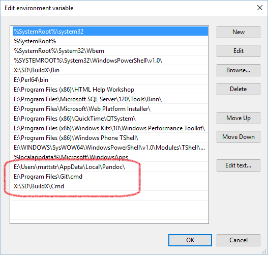

So that you can run the tools as intended:
* Got to IDWEB and become a member of the **MSDN Reporting** security group (choose the **domain** that corresponds to your corporate credentials, such as REDMOND)
* Make sure you've been granted writer permissions on [Open Source Hub](https://opensourcehub.microsoft.com) (*ask Ted*)


##2. Refactor the WDCML TOC (create OP and REF XTOC files)
The WDCML XTOC file is key to refactoring the content. In this process, we'll create three seperate files to make it easier for people to understand which topics are going where. These XTOC files will also be used by tools to convert the OP content, the TOC file, and a redirects CSV file for the MSDN team to remove the old topics. By doing this refactoring in WDCML, we can take advantage of the autokeylinks elements for generating new "In this Section" lists.

### XTOC overview
To start, create three new XTOC files in your WDCML project:

* **projectname-OP.xtoc** This holds the conceputal content that will be migrated to OP. Create it by copying your projectname.xtoc file. 

* **projectname-REF.xtoc** This holds the reference content that will continue being published in WDCML.

* **XX-ToBeRemoved.xtoc** This holds topics that can be removed - reference and conceputal. Good candidates are "useless" orientation topics and DDI reference that is no longer needed. (It starts with XX so that it will appear at the bottom of the UI in XMetal.)


### Migration components
Once the content is split up into those three new XTOC files, they can be used to in the migration as follows...

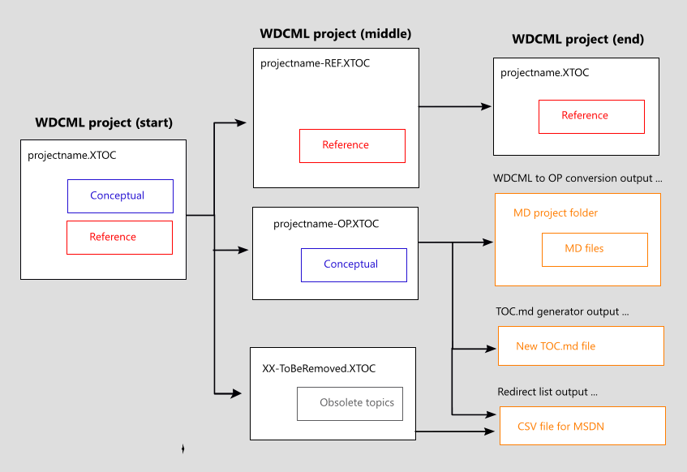

...When all is done, the contents of the **projectname-REF.xtoc** file will replace the contents of the original **projectname.xtoc** file. You'll use the **projectname-OP.xtoc** file with **con2md.exe**, the OP conversion tool, to convert your content from WDCML to MD format. It will also create a new **TOC.md** file for you. Finally, you can use **XX-ToBeRemoved.xtoc** and **projectname-OP.xtoc** to create a redirects CSV file so that MSDN can remove those WDCML topics and redirect requests to the specified topics.

### Refactoring goals
1. Both the OP and REF XTOCs can have **only a single topic at the root of the TOC**. Create a new WDCML topic if you need to. Note that there will be a new WDCML topic that's parent to the future OP and REF content.  

2. No DDI reference content is migrated to OP. 

3. As many low-value "orientation" (list of links) topics are removed.  In a couple of sections, see the for tips on cleaning up your IA.

### Content architecture
While refactoring your project, it's helpful to consider the finished architecture. Because we're splitting conceptual and reference across two different platforms, you'll need to [edit the site-wide Dev Center HXT](#16-update-dev-center-hxt-file-for-new-op-and-ref) and [create a new WDCML parent topic](#14-create-a-new-wdcml-parent-topic-in-hw_nodes) (described later). With those chanages, you'll want to make sure the new topic titles mention the technology, rather than simply say "Design guide" or "Reference".

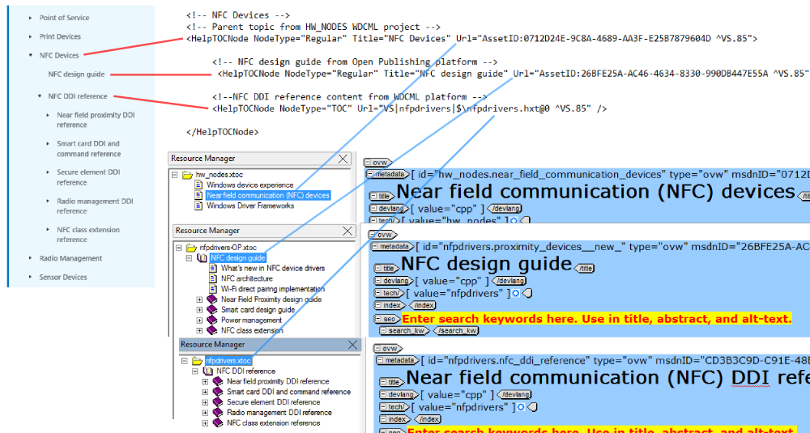

This graphic is described in more detail when you go to [edit the site-wide Dev Center HXT](#16-update-dev-center-hxt-file-for-new-op-and-ref). For now, note that three different XTOC files play a part:

* **hw_nodes.xtoc** : Provides single-topic references to the new parent topics.
* **projectname-OP.xtoc** : The old WDCML topic GUID will guide people to OP via the MSDN redirects.
* **projectname.xtoc** : The end product (containing reference only) will supply the WDCML TOC.


### Tips for editing your XTOC files

* **Build a local CHM of the original XTOC**, projectname.xtoc. This way you can quickly click through topics to see what they look like (if you're trying to distinguish Ref from Conceptual or weed-out the useless orientation topics).

* Although, your original XTOC is in Source Depot, some might want to make a local backup copy of the projectname.xtoc and name it projectname-BACKUP-ORIGINAL.xtoc.

* I recommend **editing using XMetal in tandem with VS Code** to build your new XTOC files. The nice thing about Code is that it makes it easy to collapse and copy whole TOC nodes. 

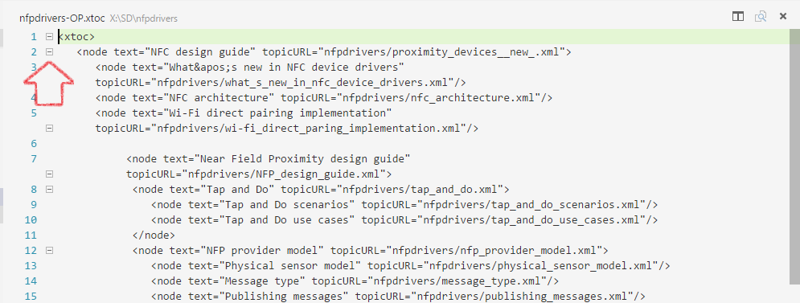

* The other nice thing about VS code is that you can **open multiple tabs** (one for each of the XTOC files) and copy/paste XML nodes between the XTOC files. Even if you only use one tab, VS Code has a **Working files list** in the top left that lets you jump back and forth. As soon as you save a change, XMetal reloads the tree view UI.

* **Use this opportunity to clean up your content architecture.** Remove those useless topics that only provide content organization, such as "Design Guide" and "Reference". This example is in the reference, but the same applies to conceptual content you migrate to OP. Here, a reference section was broken up into several small TOC nodes. Most of them lacked even an intro sentence. The only value they provided is that the TOC provided some notion of what the DDIs were for. You can see here that even the top-most parent, **Secure Element DDI** didn't have all that much content (and a manually-created  inaccurate "In this section" list).

#### BEFORE : Ref topics were grandchildren, children were "useless"
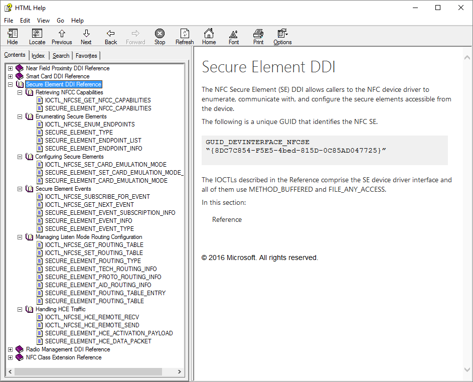

#### AFTER : grandchildren became alphabetized children
The direct children were removed and the reference organization was performed using tables in the parent topic. Then, all references topics were brought up a level and alphabetized to be direct children of the parent topic.

You can also see how a new topic was created to be a single root at the top of the TOC. Depending on your project, this may not be necessary - you may already one that would be a great candidate.
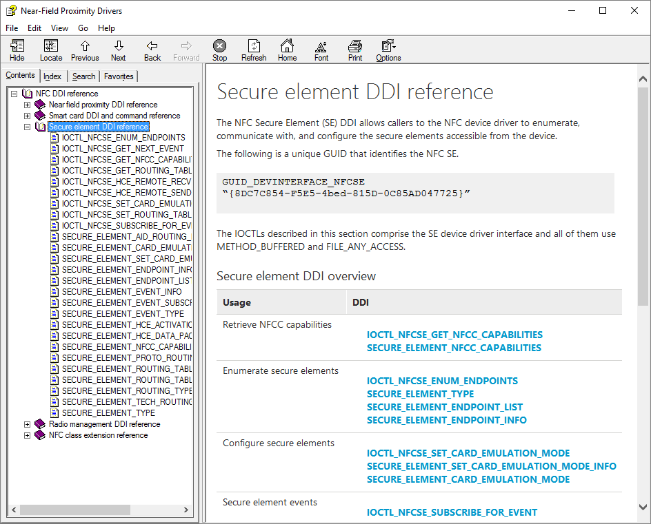


### XTOC quality check
When you're all finished (or you think you are), do a local CHM build of **projectname-OP.xtoc** and **projectname-REF.xtoc** and compare it to the original CHM. 

    CBX ProjectName.xtoc MSDN

Make sure you have the all of the topics from the original CHM accounted for somewhere in the new XTOCs. 


##3. Convert the conceptual topics to OP
The conversion of WDCML topics to MD is performed by the **con2md.exe** tool in your SD folder for the respective project. This tool resides in the BuildX\Cmd folder. Depending on how you set up XMetaL initially, you may need to add this path to your environment variables or you'll need to type the full path to the EXE when you execute it.

###Preparing to convert
Con2md could be enhanced over time. Before you run the conversion, make sure to do an SD sync on the BuildX folder:  

    C:\SD\BuildX>sd sync ...
        
Con2md requires that it be **run at the root of the project folder** and that the content to be converted is in an XTOC by **the same name as the project folder**. Thus, you'll **TEMPORARILY** overwrite your projectname.xtoc file with your projectname-OP.xtoc file. A quick way to do that is run the following at the command line:

    C:\SD\projectname>attrib -r projectname.xtoc
    
Then, overwrite your regular TOC with your OP toc:

    C:\SD\projectname>copy projectname-OP.xtoc projectname.xtoc

###Running the conversion    
Finally, to run the conversion, execute con2md as follows:

    C:\SD\projectname>con2md projectname
    
**WHEN IT FAILS**, try running it a couple times. If it still doesn't work, make sure you have **MSDN Reporting** permissions on IDWEB. You'll also need [Pandoc](https://github.com/jgm/pandoc/releases/tag/1.14.0.1) installed and your machine configured to run builds locally. 

Once it runs successfully, don't forget to go back and reload the projectname.xtoc file from SD using a forced resync:

    C:\SD\projectname>sd sync -f ... 
    
When it finishes, con2md will create a new TOC file and a folder for your MD files and art:

* **TOC file** will be located at --> `projectfolder\build\markdown\TOC.md`
* **MD files** will be located in --> `projectfolder\build\markdown\mdout\`
* **Art files** will be located in --> `projectfolder\build\markdown\mdout\images`

### Moving the TOC.md file
The folder structure we use is to have the TOC.md file reside in the **same folder** as the rest of the markdown files. Thus you need to copy the TOC.md down a level into the folder named after the project.

However, the TOC.md file uses relative links and if you don't revise those links (after having moved the file) then the OP build will fail - because it can't locate the topics. Thus, you will need to go in and remove the name of the project folder from the file path. For example, the NFC TOC.md file originally look like this:

    # [NFC design guide](nfpdrivers/nfc-design-guide.md)
    ## [What's new in NFC device drivers](nfpdrivers/what-s-new-in-nfc-device-drivers.md)  
    ## [NFC architecture](nfpdrivers/nfc-architecture.md)
    ## [Wi-Fi direct pairing implementation](nfpdrivers/wi-fi-direct-paring-implementation.md) 
    ## [Near Field Proximity design guide](nfpdrivers/nfp-design-guide.md)
    ### [Tap and Do](nfpdrivers/tap-and-do.md)

But after removing the folder from the file path, it now looks like:

    # [NFC design guide](nfc-design-guide.md)
    ## [What's new in NFC device drivers](what-s-new-in-nfc-device-drivers.md)  
    ## [NFC architecture](nfc-architecture.md)
    ## [Wi-Fi direct pairing implementation](wi-fi-direct-paring-implementation.md) 
    ## [Near Field Proximity design guide](nfp-design-guide.md)
    ### [Tap and Do](tap-and-do.md)

**TIP:** The other nice thing about removing the folder name from the path is that you are **free to rename the project folder!** For example, we renamed *nfpdrivers* to be simply *nfc* in the repo.

### Rename your TOP-most parent topic
If you don't specify the file name in an OP URL, MSDN will serve up the index.md file if it exists. For this reason, it's a best practice to rename your top parent.
 
1. Find your top-most parent topic and rename it to be **index.md**
2. In TOC.md, change the name of the source file to be index.md
3. Finally, do a search of the MD files for any links to the previous file name. You can use the findstr utility with CMD.exe to find any occurances of that file name. For example, if the old topic was named introduction.md, the findstr command would be:

        c:\SD\projectname\build\markdown\mdout>findstr /S /I /M /C:"introduction.md" *.md
          


##4. Cloning windows-driver-docs-pr & other set up
Before you can start working on OP content, you need to clone the driver docs to your local machine. In this topic, we'll create a folder on the **C:** drive named **MyRepo**, to save the local copies of the driver repository. 

**TIP** : All of the changes you make to your local files are persisted within your local repository file system. This means that you can clone the same repository locally more than once - as long as the two folders never "touch". This lets you use regular file comparison tools if you want to compare the same files on different branches.


**TIP2** : If you use a Shortcut to open PowerShell, in the ShortCut properties, specify your local windows-driver-docs-pr folder as the **Start in** location. Then you'll automatically open to your repo each time you open PowerShell. 

To clone the driver docs repo to your local computer, open Powershell, navigate to the folder you want your the repo to live, and execute..

    C:\myrepo> git clone https://cpubwin.visualstudio.com/_git/drivers

..as illustrated here:

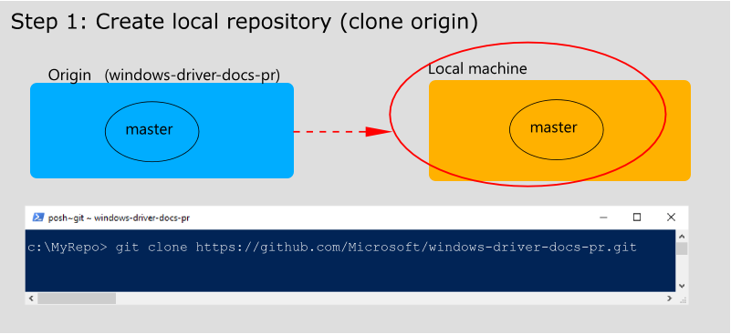

##5. Do a local build of the OP content
You want to make sure your local repository builds fine before you make any changes. 

1. Navigate to your local repo folder and run the following to start a build:

        C:\myrepo\drivers [master]> .\.openpublishing.build.ps1 -parameters:targets=serve

2. When the build "completes", it pauses and opens a CMD.exe window. That's your cue to view your local web server.. 
        
    Open your browser to -->  [http://localhost:8080](http://localhost:8080) 

3. Finally, when you're finish viewing the content, **close the CMD.exe window**. That will complete the build.

If the build doesn't run successfully, make sure you have the necessary permissions discussed at the beginning of this topic.

##6. Create working branch in windows-driver-docs-pr
Now that you know your local repo builds successfully, you can begin preparing to migrate content. The first step is to create a working branch. In these examples, the working branch will be called **working-branch**, but you should call your branch something that makes sense for your technology. For example, **printmigration** for migrating the print content.

Working branches are temporary. We're going to remove it after the migration is complete. It will eventually be pushed up to the team's repo on GitHub, referred to as "origin", so it's a good idea to see what other branches are called. 

To do that, navigate to your repo folder and use **git remote show origin**:

```
X:\myrepo\drivers [master ≡]> git remote show origin
* remote origin
  Fetch URL: https://cpubwin.visualstudio.com/_git/drivers/
  Push  URL: https://cpubwin.visualstudio.com/_git/drivers/
  HEAD branch: master
  Remote branches:
    bringupmigration     tracked
    contributing         tracked
    crumbs               tracked
    horizontal-scroll    tracked
    imagemigration       tracked
    live                 tracked
    master               tracked
    migration-help       tracked
    multifuncmigration   tracked
    printmigration       tracked
    sandbox_build        tracked
    streammigration      tracked
    wdf                  tracked
    wdkappendixmigration tracked
  Local branch configured for 'git pull':
    master merges with remote master
  Local ref configured for 'git push':
    master pushes to master (up to date)
```

Once you've decided on a name, use this command to create your local working branch:

    C:\myrepo\drivers [master]> git checkout -b working-branch
    
...as illustrated here:

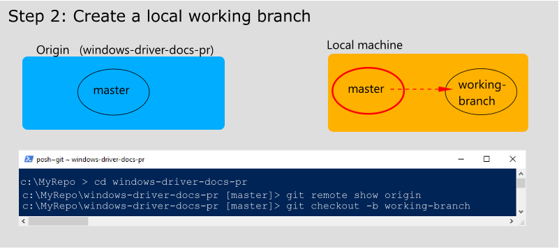

In Git, you use **checkout** to changes branches. When you do this, whole folders can appear and disappear in your local Windows Explorer - depending on which files are associated with which branches.


##7. Add OP content to the working branch
Once you create a working branch, all changes you make to the respositry will be captured in your branch - any files in any folders, not just the ones in your project folder. 

### Create a project folder and copy over your MD files
In your repo, navigate to the driver documentation folder windows-driver-docs-pr\windows-driver-docs-pr. 
    
    c:\myrepo\drivers\windows-driver-docs-pr
    
There you'll see other project folders. You can name your OP project the same thing or change it to be more meaningful. Keep in mind, that folder name **will appear in the OP URL**. For example, *nfpdrivers* became simply *nfc*.

After your project folder is created, copy the images folder and MD files from `projectfolder\build\markdown\projectname\*` and paste them into the new repo project folder.


### Committing changes (new files) to GIT
Commits are the units of change you can track in your repository. Once you're done making revisions or otherwise want to put closure on that unit of change, you can do a git **commit**. 

Now that your new project folder has been added to the repository, you need to capture that change. To do that, use the **add** and **commit** commands to create the commit:

        C:\myrepo\drivers [working-branch]>git add .
        C:\myrepo\drivers [working-branch]>git commit -m "New projectname topics from con2md conversion."

**Note** You can also use Visual Studio Code to commit changes. That will be discussed [later](#committing-changes-new-files-to-git) along with the intro to VS Code.

### Do another local build to make sure things still build okay
You want to make sure your local repository still builds successfully now that you've made changes: 

1. Navigate to your local repo and run the following to start a build:

        C:\myrepo\drivers [working-branch]> .\.openpublishing.build.ps1 -parameters:targets=serve

2. When the build "completes", it pauses and opens a CMD.exe window. That's your cue to view your local web server.. 
        
    Open your browser to -->  [http://localhost:8080](http://localhost:8080) 

3. Finally, when you're finish viewing the content, **close the CMD.exe window**. That will complete the build.

If the build doesn't run successfully, make sure you have the necessary permissions discussed at the beginning of this topic.

### Push your local working repo to the team repo 
Once you know that content builds successfully, you can push it up to origin (on GitHub), so that you can view it on Staging. Before you do that, it's a good practice to make sure your branch has the latest changes from the master branch. To that, refresh your local master...

    C:\myrepo\drivers [working-branch]>git checkout master
    C:\myrepo\drivers [master]>git pull origin
    
...as illustrated here:
 


Then you need to switch back to your working branch so you can merge-in the latest changes from master...

    C:\myrepo\drivers [master]>git checkout working-branch
    C:\myrepo\drivers [working-branch]>git merge master

...as illustrated here:

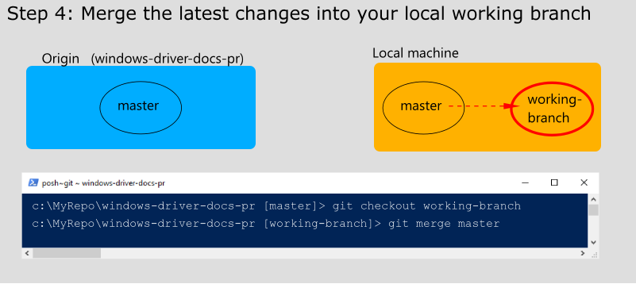

Finally, push your working branch up to the team's repository, origin...


    C:\myrepo\drivers [working-branch]>git push -u origin working-branch

...as illustrated here:

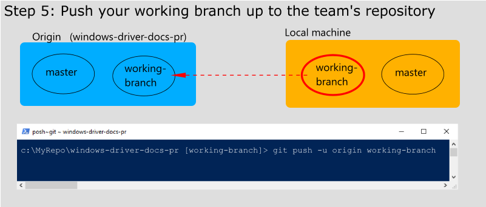

##8. Review your branch on MSDN stage
As soon as your branch gets pushed to origin, it will kick off an automated build. Look for emails from the **Open Publishing Build Service** (vscopbld@microsoft.com). Don't be alarmed if it says it succeeded with Warnings - we've been working for weeks to get those issues resolved. 

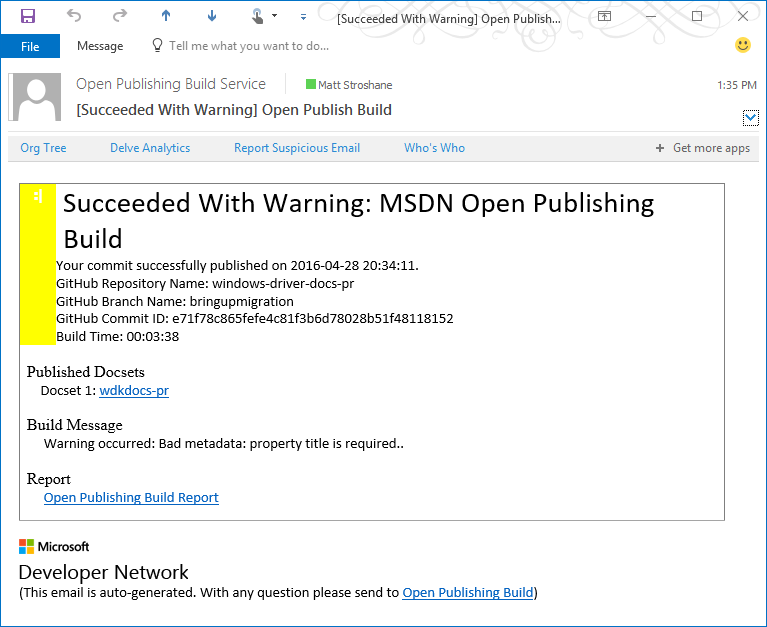

### Monitoring your build progress
To see what's going on while it's building (before you get that email), you can visit the **Open Publishing Service portal**:

[https://op-portal-prod.azurewebsites.net/#/containers/history/repositories/All](https://op-portal-prod.azurewebsites.net/#/containers/history/repositories/All)     (click **Publishing History**)

There you will find the status of the ongoing builds. If it fails through no fault of your content (that happens sometime), you can kick off the build again without having to make another commit.

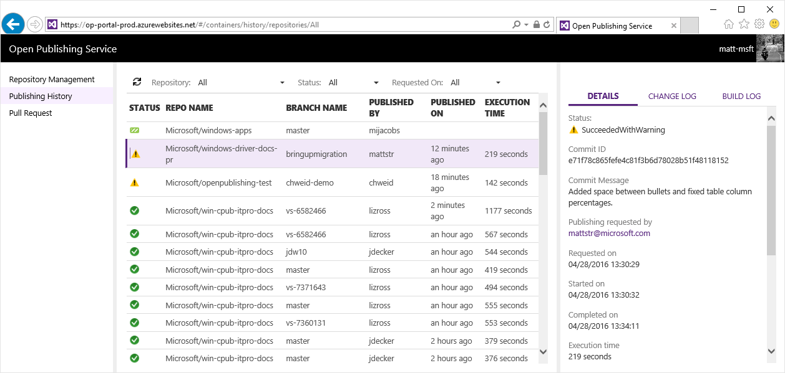

### Kicking off the build again (if you must)
To manually kick off the build again..

1. Go to [Repository Management](https://op-portal-prod.azurewebsites.net/#/containers/repository/repositories/All).
2. Select the row that contains **windows-driver-docs-pr** - *without clicking the link to the repo.*
3. Then at the top of the page, click **Publish** - *you can later select which branch.*
4. A pop-up will appear. Then select the branch you want to publish.

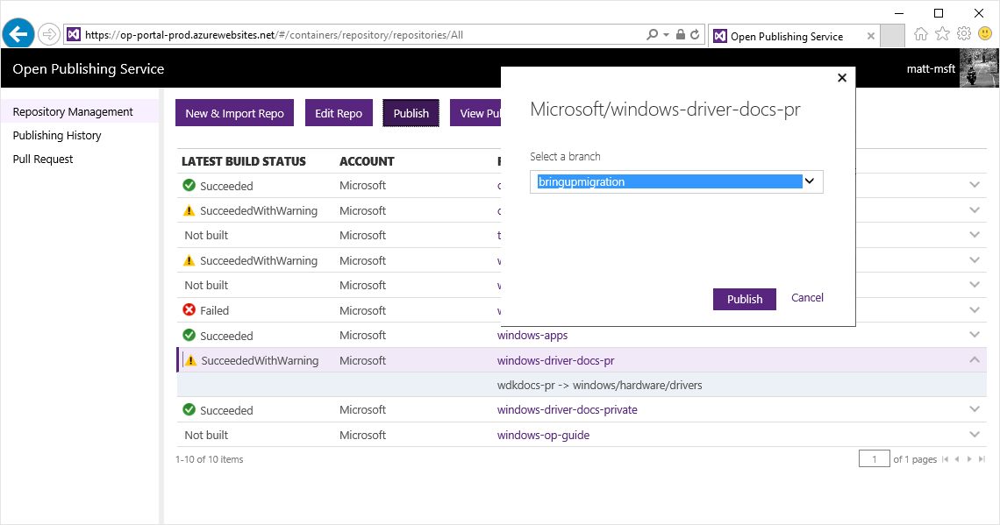

### Finding your content in the Hardware Dev Center (MSDNStage & LIVE)
In general, to find your content on the internal staging server, the URL format goes like this:

    https://msdnstage.redmond.corp.microsoft.com/en-us/windows/hardware/drivers/<projectname>/<topic name>?branch=<branch name>
    
If your top-most parent topic is named index.md, this should work too (omitting the topic):  
    
    https://msdnstage.redmond.corp.microsoft.com/en-us/windows/hardware/drivers/<projectname>?branch=<branch name>

**IMPORTANT**: Once you start navigating around your content, you'll notice that "`?branch=<branchname>`" has disappered from the URL. YOU will be able to continue navigating around your branch because the browser remembers for you. But, if you send those links to other people **without the branch specified in the URL, they will not be able to access the topic.**

After you [merge your project to the master branch](#19-ready-set-go-merge-your-content-into-master-branch-), you no longer need to specify the branch in the URL. All MSDNSTAGE requests go to the master branch by default. This is why your content won't appear when you don't specify the branch (it's not in master yet). Once there, you can simply type:
    
    https://msdnstage.redmond.corp.microsoft.com/en-us/windows/hardware/drivers/<projectname>


Like with WDCML, you can predict the **LIVE URL** by removing `stage.redmond.corp.`:
    
    https://msdn.microsoft.com/en-us/windows/hardware/drivers/<projectname>


### Compare content against WDCML
Click through your OP topics and see that the render well. The conversion process does amazing work, but it still makes mistakes. You'll likely find things that need to be revised in the MD files in order for them to appear as desired. 

I recommend doing a local CHM build of your projectname-OP.xtoc file. That way you can quickly click through the "good example" of each topic as you compare it with the OP versions. 

### Finding bugs
Technically, MSDN is supposed to as good a job rendering markdown as GitHub does. When you find weird behavior, click on the *Contribute* button in the top-right corner to quickly jump to the GitHub version of the topic.

If GitHub displays the same weirdness, your only choice is to revise the MD file. If on the other hand you don't see the weirdness, **you found a bug!** In that case, email [eliotdirs@microsoft.com](mailto:eliotdirs@microsoft.com) for instructions on how to sumbit the issue. But of course, you're always free to bypass the bug by revising the MD file. 


##9. Make revisions to your working branch 
Once the content starts appearing on MSDNStage, you'll likely find lots of revisions you want to make. 

### Working with VS Code
To quickly go from your branch to Visual Studio Code, you can simply type the following from your working branch:

    C:\myrepo\drivers [working-branch]>code .
    
That will open up VS Code to your repositry. Once there, select the files and start making changes as desired. As with Office products you can save by using **Ctrl+S** or the **Alt-F,S** keystrokes. Once you start making changes, you'll see numbers appear in the top left that indicate the number of files affected by changes. 

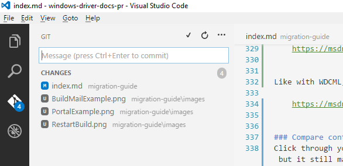

That's VS Code keeping track of your change list. 

###Committing changes to GIT
Commits are the units of change you can push up to origin. Once you're done making revisions or otherwise want to put closure on that unit of change, you can do a ***commit***. You can do this in one of two ways:

* **Use VS Code** : Type the description of the change in the Message window and then press **Ctrl+Enter**. 

* **Use Git** : Use the **add** and **commit** commands to create the commit.

        C:\myrepo\drivers [working-branch]>git add .
        C:\myrepo\drivers [working-branch]>git commit -m 'Your commit description here'

###10. Finishing touches: Run clean-up script and set author
Now is a great time to perform a few additional clean up steps...

The WDCML conversion does not convert the SeeAlso section (named Related links in OP) as you might expect. There is paragraph spacing between the links and no differentation between those links and the "Send feedback to Microsoft..." link. The **mdRelatedLinksProjectCleaner.ps1** script cleans that up and adds a horizontal rule before the Send Feedback link.

If you don't want to be specified as the original author of the topics, you can run **mdAuthorProjectSetter.ps1** to automatically add *windows-driver-content* (the team GitHub account) as the author of all topics in the folder.

I'll write more documentation about these scripts later. But for now, follow these steps to run them on your project folder:

1. Create a folder dedicated to your PowerShell scripts. For now, we’ll call that the PS folder.  

2.	Make a copy of your project folder to somewhere **outside** your repository (then you can compare changes later)  

3.	Copy all four PowerShell scripts there:  

    * **mdRelatedLinksProjectCleaner.ps1** : Cleans up the SeeAlsos for **all** topics in a folder
    * **mdRelatedLinksCleaner.ps1** : Cleans up the SeeAlsos in only **one** topic (called by the other)
    * **mdAuthorProjectSetter.ps1** : Sets the author for **all** topics in a folder
    * **mdAuthorSetter.ps1** : Sets the author in only **one** topic (called by the other)

4.	Run `get-executionpolicy`  

5.	If it returns `unrestricted`, skip to step 6.  

6.	Re-open Powershell as an Administrator and run `set-executionpolicy unrestricted`  

7.	Open Windows explorer and navigate to your local OP **project folder** in your repository (for example C:\myrepo\drivers\windows-driver-docs-pr\**acpi**)  

8.	Copy the path from the address bar  

9.	In PowerShell, navigate to your PS folder. The scripts are designed to be run from the folder they reside. 

    **Tip** : In Windows Explorer, if you have the PS folder open there, you can select **File > Open Windows PowerShell**  

10.	At the prompt, run the following (examples include prompt, put your path in quotes):  

    **IMPORTANT: Did you do step #9?**
    
    **IMPORTANT: Make sure you call the Project version of the scripts, with "Project" in the name.** For example, call mdRelatedLinks**Project**Cleaner.ps1 rather than mdRelatedLinksCleaner.ps1.
    
    **IMPORTANT: Pass the MD folder path as an absolute path, don't use dot notation "." etc.**
    
    **IMPORTANT : Make sure your MD project folder is in the path. If it’s higher, you may end up running it on all MD files in the repository.**

            x:\ps>.\mdRelatedLinksProjectCleaner.ps1 "C:\myrepo\drivers\windows-driver-docs-pr\acpi"
            x:\ps>.\mdAuthorProjectSetter.ps1 "C:\myrepo\drivers\windows-driver-docs-pr\acpi" 

11.	(optional) compare file changes with the folder you created in Step #2.  

12. Add and commit your changes and described in the previous step. Indicate that you ran the cleanup and author scripts.

13.	Finally, do a local build and make sure it looks as desired.  
 
###11. Finishing touches: Add your project to the WDK TOC (in OP)
The OP driver documentation, the Windows Driver Kit (WDK) topic, resides here:

[https://msdn.microsoft.com/en-us/windows/hardware/drivers](https://msdn.microsoft.com/en-us/windows/hardware/drivers)

To make your project appear in the TOC, you need to add it to the TOC.md file located at the root of your directory:

        C:\myrepo\drivers\windows-driver-docs-pr\TOC.md
        
The following shows the TOC after adding the bringup and ACPI projects. This TOC will  evolve over time as we add projects - it doesn't need to match the [WDCML TOC](https://msdn.microsoft.com/en-us/library/windows/hardware/mt269767).

    # [Windows Driver Kit documentation](index.md)
    # [Bring up guide](bringup/)
    # [Developing, Testing, and Deploying Drivers](develop/)
    # [Windows Driver Frameworks](wdf/)
    # [Device and Driver Technologies](device-and-driver-technologies.md)
    ## [ACPI](acpi/)
    ## [NFC devices](nfc/)

When that's finished, don't forget to commit the changes.

###12. Push changes back up to ORIGIN (update working branch on MSDNSTAGE)
To push changes back up to origin, follow the steps described earlier. 

**Note** : Depending on the extent of the changes, you may choose *not* do a local build beforehand. 

1. Switch to the **master** branch  

        C:\myrepo\drivers [working-branch]>git checkout master

2. Pull down the latest changes from **master**  
        
        C:\myrepo\drivers [master]>git pull origin
        
3. Switch to your **working branch**  
        
        C:\myrepo\drivers [master]>git checkout working-branch

4. Merge changes from **master** into your **working branch**  
        
        C:\myrepo\drivers [working-branch]>git merge master

5. Push your **working branch** changes up to origin  
        
        C:\myrepo\drivers [working-branch]>git push -u origin working-branch


##13. Build a .CSV file for redirecting old topics to OP
This step will create a list of links in CSV format that will be used to pave over the 
Converting the CSV is done using the redirectCsvBuilder script. 
First locate the XTOC files that contain the links you want to be removed (the XTOC files we discussed earlier: **projectname-OP.xtoc** and **XX-ToBeRemoved.xtoc**).

###Running the redirectCsvBuilder script
To run the CSV builder, these are the parameters:

1. **xtocPath** – The path to the XTOC file. 

2. **wdcmlFolder** – The folder where the WDCML files live (it pulls the topic GUIDs from each file).

3. **repoFolder** – The folder where the new OP files live. Make sure you have the right branch checked out. It makes sure that the file names exist. 

4. **csvFile** – The name of the CSV file. 

5. **urlPrefix** – This is the prefix to the URL for the new OP topic. Include everything you want to precede the OP file name.

Tip: You may want to use notepad to edit the command line that will be used to call the redirectCsvBuilder script

###Warning Messages
Because we rename the top-most topic to index, it can’t find that file by the original file name in the OP folder. It will give you a message like this as a reminder to update your CSV file after it’s been created.

    !!! Markdown target is missing for XTOC entry --> Simple Peripheral Bus (SPB) Driver Design Guide (TBD added to CSV for 7E9F688B-F473-4343-A1E0-525273391935)*

###Examples


    x:\PS> .\redirectCsvBuilder.ps1 "X:\SD\storage\storage-OP.xtoc" "X:\SD\storage\storage" "X:\GIT-PS-REPO\windows-driver-docs-pr\windows-driver-docs-pr\storage" storage-redirects.csv "https://msdn.microsoft.com/windows/hardware/drivers/storage/"


In this next example, I had copied a folder named SPB to my powershell script folder. Hence, the relative links. 


    x:\PS> .\redirectCsvBuilder.ps1 .\spb\SPB-OP.xtoc .\spb\spb "X:\GIT-PS-REPO\windows-driver-docs-pr\windows-driver-docs-pr\spb" spb-redirects.csv "https://msdn.microsoft.com/windows/hardware/drivers/spb/"


###Testing
Don’t forget to spot-test your CSV file. Open some WDCML topics by GUID on MSDN and make sure the topic matches the URL targets. Then open some OP redirect links (with some tweaks for staging) to make sure there were no typos in the URL parameter. The script does a lot of checking too, but it’s good to double check things. 

A couple notes that apply to all of the scripts:

 • Make sure you run the scripts from the folder that the scripts are in

 • If any of the paths have spaces, put those parameter values in double quotes

### Behind the scenes - What it does (from the script comments)
     It reads the specified XTOC file and creates a MSDN redirect CSV file.

     It checks your input parameters to make sure the XTOC, WDCML folder, and Repo folder exist.
        - If the XTOC file or WDCML folder are missing, it warns you and quits.
        - If the Repo folder is missing, it warns you and sets those CSV targets as "TBD".
        - TROUBLESHOOTING: Make sure your working branch is checked out if that's where it is.

     It ignores XTOC entries that have been excluded from MSDN or the SDK.
        - If excluded topics are found, it warns you and skips them in the CSV.

     It checks each WDCML topic mentioned in the XTOC to get the GUID and make sure it exists.
        - If the specified WDCML topic is missing, it warns you and skips that file in the CSV.
        - If it finds the WDCML file, but can't find the GUID, it warns you and skips that file in the CSV.

     It checks your repo to make sure each target MD file actually exists.
        - If the target MD file is missing, it warns you but puts the target as "TBD".


TBD: Don't forget to change the target URL of the top topic to point to index.md. Any script output will likely include the original MD file name.

TBD: Check with Nathan to see how to submit the CSV list to prod in our consolidated publishing process.

Wait until you go to publish all the changes to LIVE before you [submit the redirect request to MSDN (step 23 below)](#23-submit-redirect-request-to-msdn-team).

**Note** : For more info about the CSV format, see the MSDN [Redirect template](https://microsoft.sharepoint.com/teams/Visual_Studio_China/MSDN/msdnpartner/_layouts/15/WopiFrame.aspx?sourcedoc=%7bCDDAB058-5F12-4C24-B931-E13A62FFDAF4%7d&file=Redirection%20Template.docx&action=default).


##14. Create a new WDCML parent topic in HW_NODES
***Note that this only applies to projects that are being split up - seperating conceptual from reference.***  

To minimize the complextity of the Hardware Dev Center HXT file, we've decided to host the new WDCML parent topic in the **HW_NODES** project. By being in a different WDCML project than the reference topics, we can reference projectname.hxt wholesale, simlifying the site-wide HXT and making the ref project easier to maintain.

### Create an FWLink for testing on MSDNStage
In the Dev Center TOC, the link to the OP content depends on the MSDN redirects. But we don't want to submit those redirects until the very end of this process [(Step #23, Submit redirect request to MSDN team](#23-submit-redirect-request-to-msdn-team)). Thus, in order to test the user experience, you'll need to use an FWLink to link to the OP content from the body of your new parent topic.

### Build a new "In this section" table
Because we can't use auto_keylinks, you may want to simply copy the contents from the NFC topic shown below. This image is to show how simple the new parent can be and point out the FWLink.

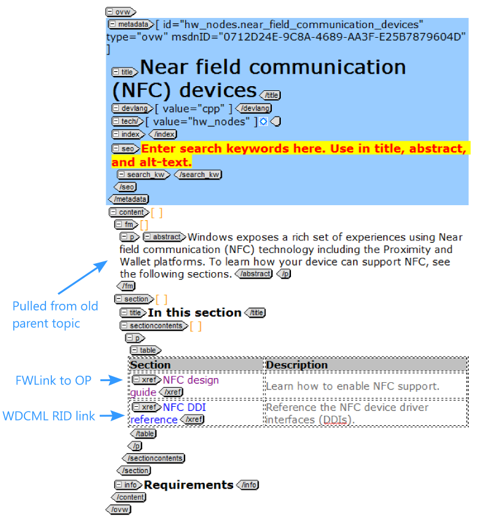


##15. Update WDCML TOC to show only reference topics
Now that you have OP content and a new WDCML parent topic, the next step is to make your WDCML project **reference only**. If you've already created your projectname-REF.xtoc file, all you need to do is:

1. **Check out** your projectname.xtoc file

2. **Overwrite** your project TOC with the new REF TOC  

        C:\SD\projectname>copy projectname-REF.xtoc projectname.xtoc

3. **Check in** your projectname.xtoc file


##16. Update Dev Center HXT file for new OP and REF
As mentioned earlier, your project's TOC is no longer defined exclusively by the WDCML XTOC file - after the migration, that only defines the TOC for the reference content. To get the Dev Center TOC to include the OP node, you'll need to update the site-wide HXT file for the Hardware Dev Center. 

**NOTE** : You won't actually update the site-wide HXT file. Instead, you'll provide it as part of your CP request. That's discussed later, when you [prepare for deployment](#17-prepare-for-deployment-timing-). 

The site-wide HXT is saved in SD here (assuming your enlistment folder is on C:\SD):

    C:\SD\BuildX\MTPS\en-us\hardware_dev_center.hxt
    
For your technology, the new HXT elements will include three parts:

* **A new parent topic** : This is a single-topic reference to the WDCML topic in hw_nodes.xtoc
* **The OP content** : This is a single-topic reference to the old conceptual topic that will be redirected to OP (index.md)
* **The Reference content** : This is a TOC reference to the WDCML project defined by projectname.xtoc

    


To prepare a new Dev Center HXT file:

1. Re-sync the BuildX folder to make sure you have the latest-and-greatest HXT file.  

        c:\SD\BuildX>sd sync ...
        
2. Copy the HXT file somewhere other than BuildX where you can edit the file. **Maintain the same file name so you can easily attach it to your prod request.** Again, that's located here:  
    
        C:\SD\BuildX\MTPS\en-us\hardware_dev_center.hxt
        
3. The read-only attribute will be set on the HXT file so run attrib to make it editable:

        C:\your-file-editing-folder>attrib -r hardware_dev_center.hxt
        
4. Search for the current reference to your project in the TOC (projectname**.hxt**). *Note that it's an HXT rather than an XTOC extension. The daily build creates the HXT form your project's XTOC.*

5. Keep that old HXT reference around a moment, you'll need it to edit the new one...      

6. Paste the following template below that reference:  

    ```
    <!-- TECHNOLOGYNAME device drivers -->
    <!-- Parent topic from HW_NODES WDCML project -->
    <HelpTOCNode NodeType="Regular" Title="TECHNOLOGYNAME device drivers" Url="AssetID:PARENTGUID ^VS.85">

        <!-- TECHNOLOGYNAME driver design guide from Open Publishing platform -->
        <HelpTOCNode NodeType="Regular" Title="TECHNOLOGYNAME driver design guide" Url="AssetID:CONCEPTUALGUID ^VS.85"/>

        <!--TECHNOLOGYNAME DDI reference content from WDCML platform -->
        <HelpTOCNode NodeType="TOC" Url="VS|PROJECTNAME|$\PROJECTNAME.hxt@0 ^VS.85" />

    </HelpTOCNode>
    ```
    
    A few notes about this XML:  
    * The **NodeType** indicates the kind of reference. **Regular** means it's a single-topic reference. *TOC* means the entire child hierarchy is defined by the referenced HXT (your projectname.xtoc).
    * The **Title** element specifies the text **in the TOC nav** and overrides whatever is written in the contents of the specified file. In other words, the title at the top of the page has no bearing on what appears in the TOC nav. The Title is needed when NodeType is TOC - the title is inferred from the contents of the project HXT.
    * The **AssetID** values are the GUIDs specified in the WDCML topic metadata, the msdnID attribute.
    
7. Replace the placeholder values with those from your project. Of course, feel free to change the text in the comments and titles where it makes. But if possible, try to make them consistent with what it was before.   

    * **TECHNOLOGYNAME** : This is the name of your technology / feature area
    * **PARENTGUID** : This is the MSDN ID (the GUID) from the WDCML parent topic in HW_NODES
    * **CONCEPTUALGUID** : This is the MSDN ID (the GUID) of the WDCML topic that was converted to be the new OP parent topic (renamed to be index.md)
    * **PROJECTNAME** : This is the name of the WDCML project now holding only reference topics. You can simply copy/paste to replace the PROJECTNAME line with the old HXT reference to your project.
    
8. Once you're finished revising that TOC node, delete the old HXT reference above the new one. 

9. Then save the changes. Again, keep the site-wide HXT file named the same, **hardware_dev_center.hxt**, so that it can easily be saved to the BuildX folder. 

10. **Compare your revised HXT with the original in BuildX**. It's a good idea to confirm that they only changes are the ones you ***intended*** to make. 


##Writer and OP Cordinator Tasks

To publish your content to MSDN, you will work with the OP Coordinator. In the following sections, the tasks that the OP coordinator and the writer completes are both described.


*************************************************************
##Writer Tasks
*************************************************************

##W1. Prepare for deployment
Before you continue, make sure you have the following items compeleted and ready to go...

###Pre-deployment checklist:
* OP content in working branch is looking good on MSDNStage
* WDCML redirects CSV file is complete and ready to go (including index rename for parent topic)
* Dev Center HXT file revisions are ready to go
* WDCML project projectname.hxt has been updated to show reference only (if applicable)
* You've reviewed SD history to make sure no WDCML change were made after the conversion 
* You've reveiwed the new WDCML parent topic in HW_NODES (use the GUID to view on Stage)
* FWlink to OP content is pointing to OP working branch on Stage

###Timing
The process from this point on looks like this:  

1. **BEFORE YOU PROCEED** : Work with CP Coordinator to publish to LIVE. It is a good idea to bundle our production requests so we don't have conflicting edits to the Dev Center HXT file. 

2. ** CP Cordintator -- Submit Prodrequest to update STAGE** with revised hardware_dev_center.hxt, hw_nodes, and your WDCML project  

3. **Make sure TOC works correctly**   
    * Technology link in the TOC points to new parent in HW_NODES  
    * Design guide link points to single-topic target (the top conceptual topic that will redirect to OP)  
    
4.  ** CP Cordintator -- Publish OP content to the world**  
    1. First merge your *working-branch* to *MASTER*  
    2. Review your content on MSDN Stage (no branch specifier needed in the URL)
    3. Merge your changes in *MASTER* to *LIVE*!
    
5. ** CP Cordintator -- Update your Prodrequest - ask them to push the changes to LIVE**

6. ** CP Cordintator -- Submit redirects CSV to the MSDN team**

7. **Writer -- Review the changes on the LIVE environment**

8. **Writer -- Move old WDCML to the Archive folder in Source Depot**

##W2. Prepare CP Request

Pre-migration checklist:

1.	Confirm OP content in working branch is looking good on MSDN stage: https://msdnstage.redmond.corp.microsoft.com/en-us/windows/hardware/drivers/<projectfolder>?branch=<branchname>
2.	Create WDCML redirects CSV file (If applicable, include index rename for parent topic). For more guidance see:  Migration Guide-Build a .CSV file for redirecting old topics to OP 
3.	Prepare HXT snippet for your project to send to OP Cordinator via CP Bug
4.	Update WDCML project projectname.hxt to show reference only (if applicable)
5.	Review WDCML SD history to make sure no changes were made (missed) after the con2md conversion 
6.	Review the new WDCML parent topic in HW_NODES (use the WDCML GUID to view on Stage) 
7.	Confirm your FWlink to OP content is pointing to the OP working branch on Stage
8.	Make sure you’ll be present on migration day to sign-off on your WDCML and OP MSDNStage content.


##W3. Have another writer review & approve the pull to LIVE
The aim of this step is to get another set of eyes on what's being published. 

1. Navigate to this page to see all open pull requests in the repo:

ToDo: Update link to https://cpubwin.visualstudio.com/_git/drivers

    [https://github.com/Microsoft/windows-driver-docs-pr/pulls](https://github.com/Microsoft/windows-driver-docs-pr/pulls)

2. Review the pull request and take a look at the specified commits (to make sure they make sense)

3. Double check email to see if anyone on the team has objected to completing the pull request

4. Once it looks ready, click the **Merge** button

5. Once the build completes, review the LIVE Dev Center and make sure the content published successfully:

    [https://msdn.microsoft.com/en-us/windows/hardware/drivers/index](https://msdn.microsoft.com/en-us/windows/hardware/drivers/index)


##W4. Review changes on LIVE environment
Finally, go to the Dev Center and make sure your WDCML & HXT changes appear:

**Develop node** --> [https://msdn.microsoft.com/en-us/library/windows/hardware/mt269767](https://msdn.microsoft.com/en-us/library/windows/hardware/mt269767)

Note that it may take some time for the redirects to take effect across the various web servers. 

##W5. Clean up: Move old WDCML content to Source Depot Archive folder

Now you need to use `sd integrate` and `sd delete` to move the WDCML files that you migrated to the SD archive:

`//depot/DevDoc/archive/`

If you'd prefer, please provide a pointer to your **projectname-OP.xtoc** to <tedhudek@microsoft.com>, who will be happy to do the archival operation on your behalf.

If you are archiving an entire WDCML project, you should also search for the project name and remove it if it appears in any of the following files:

```
SDROOT\buildx\schema\xsd\validtechvalues.xsd
SDROOT\buildx\script2\config\adjustments_projectlevel.xml
SDROOT\buildx\script2\config\*tech*.xml
SDROOT\buildx\script2\templates\indexing_boilerplates.xslt
SDROOT\*.txt
```

##W6. Clean up: Remove working branch from local and origin
Once all your changes have been merged into MASTER and LIVE, and you're finished with your working branch, please remove your working branch. You will remove it in two places, local and origin.

Clean up the repository as follows...

1. Navigate to a branch that is **NOT** your working branch.

        C:\myrepo\drivers [working-branch]> git checkout master

1. Confirm **working-branch** still exists on local and origin.   

        C:\myrepo\drivers [master]> git remote show origin
        
1. To **remove your local branch**, use the **branch** command with the **-d** switch as follows (where *working-branch* is the name of your working branch):

        C:\myrepo\drivers [master]> git branch -d working-branch

1. Look again to make sure the **local working-branch** was removed. 

        C:\myrepo\drivers [master]> git remote show origin
        
1. **BE VERY CAREFUL HERE** : Next delete your **remote working-branch** using the **push origin :** command. Make absolutely certain that you specify your working branch.  

        C:\myrepo\drivers [master]> git push origin :working-branch

1. Confirm **working-branch** was removed from origin.   

        C:\myrepo\drivers [master]> git remote show origin
        
   **Note** : If others remove a branch, you will see that origin branch marked as stale. To clean up the results of your query, run: `git remote prune origin`
 

*************************************************************
## OP Cordinator Tasks
*************************************************************


##C1. Submit ProdRequest to MSDNSTAGE & review
The first order of business is testing the new TOC changes on MSDNStage. We don't want to move the OP content in the MASTER branch just yet because we don't know how long it will take to get assistance from the production team.

**BEFORE YOU PROCEED** : Double check if anyone else on the team is about to publish their WDCML-to-OP migration. Group projects into the same ProdRequest if possible (instructions below). 

###How to submit a ProdRequest for MSDNSTAGE:
1. Open your browser to [http://prodrequest](http://prodrequest)

2. Fill out the web form as follows:
    * Click **New request**
    * What type of request? = **Production services**
    * Area = **WDCML/Library**
    * Request = **Other**
    * For Title consistency, try to use **HXT update for WDCML to OP migration (projectname)**
    * For Additional information, use this template (keep hw_nodes in there if applicable). You may or may not want to put a time limit on the request before proceeding, as shown:  
    
        ```
        [Note: If this can't be completed today, please do not proceed with this request]
        
        Please update the Staging environment with the following changes:

        1. Update the master hardware_dev_center.hxt with the changes specified in the attached HXT file. The master hardware_dev_center.hxt file is located in Source Depot here:                  
            //depot/DevDoc/Main/BuildX/mtps/en-us/hardware_dev_center.hxt

        2. Re-build these projects: projectname, hw_nodes

        3. Push to Stage: projectname, hw_nodes, hardware_dev_center.hxt

        Please wait and do not push these changes to LIVE until the changes can be verified in the staging environment.

        Thanks!
        ```
        
3. Then click **Submit** and wait for the email to arrive.
4. Once the email arrives, navigate to the VSO work item and add your modified HXT file to the task.
5. Don't forget to click **Save** after you attach your HXT file.    
     

##C2. Ready. Set. Go. Merge your content into MASTER branch
The **master** branch, for all intents and purposes, is the MSDNStage staging server. But unlike WDCML content, **it could be pushed to LIVE by any of the writers on the team at any time.**

**IMPORTANT** : Don't merge anything to **master** that can't be pushed to LIVE. But at the same token, it's polite to give your team advanced notice when you intend to push content from master over to LIVE. 

### First-timers: Consider working with another OP writer on your first merge into master
If you follow the guidance in this section, you should be fine. But it does involve pushing to the ***same branch that everyone else depends on to get content out to LIVE.*** No pressure(!) I know I felt a lot better working someone who had experience on my first big merge to master, and I highly recommend doing the same thing.

### How to merge your working branch into master
The goal is to get all of the latest changes from master into your working branch before you turn around and merge your working branch back into master.

**Complete the following steps in the same block of time. If you have to step away for a while before completing them, start over.**

The first step is to make sure you get the latest-and-greatest changes from origin. You want to do this all in one go to minimize the number of changes on master between this step and the last step - when you push your changes up to origin...

    C:\myrepo\drivers [working-branch]>git checkout master
    C:\myrepo\drivers [master]>git pull origin

...as illustrated here:

  

Next, get your working branch to match what's in origin/master (with the exception of the differences in your branch).

    C:\myrepo\drivers [master]>git checkout working-branch
    C:\myrepo\drivers [working-branch]>git merge master
        
...as illustrated here:
     
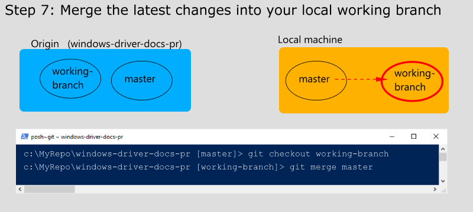  


Then merge the differences from your branch into your local master branch. 

    C:\myrepo\drivers [working-branch]>git checkout master
    C:\myrepo\drivers [master]>git merge working-branch

...as illustrated here: 

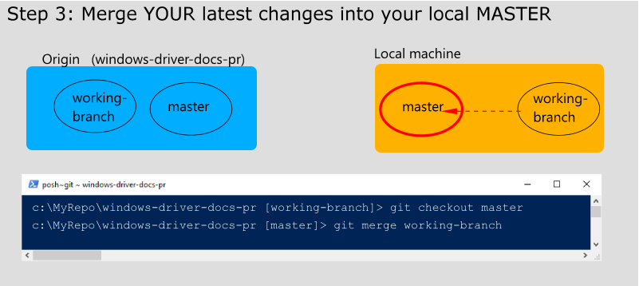  

Finally, push your local master up to the master on origin. 

    C:\myrepo\drivers [master]>git push -u origin master
    

...as illustrated here:

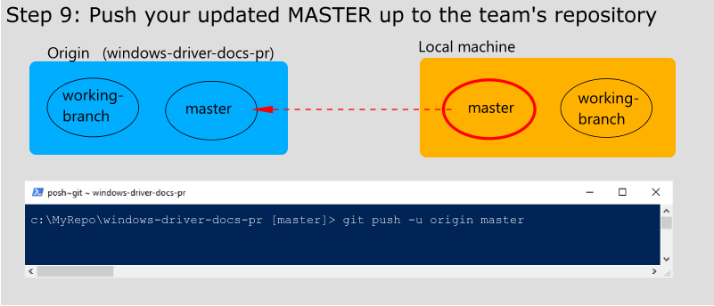  

###Review your OP content on MSDNSTAGE (the MASTER branch)
You can find your content here (I've added the branch qualifier in case your browser is still trying to send you to your working branch).

[https://msdnstage.redmond.corp.microsoft.com/en-us/windows/hardware/drivers/index?branch=master](https://msdnstage.redmond.corp.microsoft.com/en-us/windows/hardware/drivers/index?branch=master)

If you forgot to add your project to the TOC, see [Add your project to the WDK TOC \(in OP\)](#11-finishing-touches-add-your-project-to-the-wdk-toc-in-op-).


##C3. Create a pull request to the LIVE branch
Due to the significance of the LIVE branch, we use a different process to move changes into it. Rather than merge locally, we're going to do a pull request.

1. Go to GitHub and **compare the LIVE branch to the MASTER branch**:  

ToDo: Update link to https://cpubwin.visualstudio.com/_git/drivers

    [https://github.com/Microsoft/windows-driver-docs-pr/compare/live...master?expand=1](https://github.com/Microsoft/windows-driver-docs-pr/compare/live...master?expand=1)

    You should see the **Open a pull request** page, and a list of all the commits corresponding to the unmerged changes. If not, your changes may not have been sent to origin/master.

2. Add a title such as:  

        Publishing projectname to OP

3. Add a message that includes our secret team alias, **@Microsoft/wdg-driver-docs**, and add the ProdRequest link if that handy too:
    
    ```
    Hi @Microsoft/wdg-driver-docs, We're publishing the new projectname folder to LIVE today via this Pull Request. We're also publishing the corresponding WDCML projects later this afternoon too (projectname, hw_nodes, and the hardware_dev_center.hxt file). That is being tracked by this ProdRequest: https://microsoft.visualstudio.com/DefaultCollection/OS/_workitems?_a=edit&id=TBD
    ```  
    
  **Important** : The goal of this step is to let others know that content in the MASTER branch is about to be published LIVE. Using **@Microsoft/wdg-driver-docs** in the message triggers an email to everyone on the team. It's possible that someone accidently put changes in MASTER that they **don't** want to go out - they may be in the process of trying to revert the changes. This warms them and gives them a chance to stop the Pull from happening. 
      
  Here's an example:  
  
  
  
4. Once the pull request is ready, click **Create pull request**


##C4. Update your ProdRequest, push to LIVE
As soon as you see OP content appear on the LIVE Dev Center, you can proceed with pushing your WDCML changes to LIVE. Reply to the email thread and let the WDG FE Publishing team know they can promote the changes to LIVE. 


##C5. Submit redirect request to MSDN team
Next, immediately submit the redirect request to MSDN using MSDN Help:

1. Go to [http://msdnhelp](http://msdnhelp)  

2. Click **Library Support**

3. In the form, fill out these values:  

   * Set **Work request title** something to the effect of..  
    
            WDCML redirect request for projectname OP migration 
   * **Request Type** = Redirect  
   
   * **Priority** = 1  
   
   * Set **Description** to something like..  
   
        	One or more WDCML projects was recently migrated to OP and published live. Please remove the WDCML topics at the specified GUIDs and redirect requests to the specified URLs/GUIDs. 
	
	        Please expedite these redirects. Until these redirects are performed, our site-wide TOC will not be working as intended. 
	
            Thank you! 

4. Then click **Submit**  

5. On the following page, drag your CSV file (created earlier) from Windows Explorer onto the web page where you can add the attacment.  

    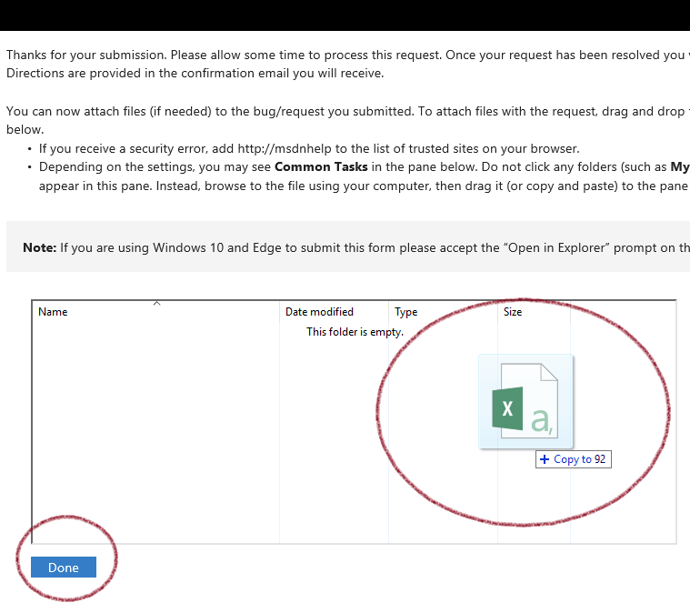
    
6. Click **Done** to add the CSV attachment

  
----------------
##THE END
