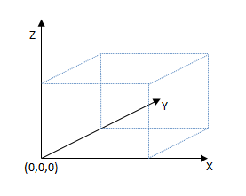

# 3D manufacturing keywords overview


The Print Schema 3D manufacturing keywords identify possible settings for an 3D manufacturing device’s capabilities or selected settings for a particular device configuration. These keywords each describe a particular concept in a well-defined manner in order to maximize clarity in the communication of settings between producers and consumers of Print Schema documents for 3D manufacturing.

Producers and consumers SHOULD use the Print Schema 3D manufacturing keywords in favor of defining keywords for similar functionality in a private keyword extension. Keywords identify individual Print Schema Framework elements via the **name** attribute. The name given to a particular keyword SHOULD be representative of the setting or characteristic that keyword represents.

Keyword instances appearing within a PrintCapabilities or PrintTicket document SHOULD conform to the scoping prefix rules defined in section 1.6, Scoping prefixes, of this article . See §5.4, "Scoping Prefixes" in the Print Schema Specification for more details on scoping prefixes.

## 1.1. XML namespaces


The namespace URI for the Print Schema keywords for 3D manufacturing is:

```xml
http://schemas.microsoft.com/3dmanufacturing/2013/01/pskeywords3d
```

In this specification, the namespace prefix **psk3d:** is used to denote elements, attributes, and attribute values drawn from the Print Schema keywords for 3D manufacturing namespace. Producers MUST generate each prefixed element, attribute, or attribute value with a namespace prefix associated with the namespace declaration for the related Print Schema namespace. Consumers MUST resolve namespace prefixes against the namespace declarations to ensure that the qualified name is drawn from the correct namespace. Consumers MUST NOT rely on the namespace prefix **psk3d:** to be correctly declared and associated with the Print Schema keywords for 3D manufacturing namespace. Individual producers MAY use different Print Schema keywords for 3D manufacturing namespace prefixes or declare this namespace as the default namespace and omit the namespace prefixes for elements, attributes, and attribute values drawn from this namespace. It is NOT RECOMMENDED, however, to assign this keyword namespace to the default namespace.

In this specification, the namespace prefix **vnd:** is used for example purposes only to denote private keyword extension attribute values drawn from a vendor-defined namespace. Vendors SHOULD define their own unique namespace prefix for any namespace they define. Vendors SHOULD NOT define the **vnd:** namespace prefix for their namespaces. Producers SHOULD NOT generate Print Schema documents that use the **vnd:** namespace.

Additionally, in this specification the namespace prefix xsd: is used to denote elements and attributes drawn from the XML Schema namespace and the namespace prefix **xsi:** is used to denote elements and attributes drawn from the XML Schema Instance namespace. XML content MUST NOT contain elements or attributes drawn from the "xml" or "xsi" namespaces unless they are explicitly permitted by the XSD schema or other requirements in this specification or the Print Schema Specification.

See §1.2, "XML Usage in the Print Schema" in the Print Schema Specification for additional XML requirements and namespaces defined for use in the context of the Print Schema Framework.

## 1.2. 3D manufacturing keywords versioning


This specification might be periodically updated with new keywords. To ensure proper forward and backward compatibility, each new set of keywords will be given a unique namespace. Keywords defined in a particular namespace will not be modified or extended once that keyword set is released for production use. See §1.3.2, "Keyword Versioning" in the Print Schema Specification for more information.

## 1.3. Common Keyword Terminology


The terms in this section provide a basic framework and vocabulary for describing the specific 3D manufacturing keywords in the remainder of this specification.

### 1.3.1. Model

The *model*, in this specification, refers to the object or objects to be created via 3D manufacturing processes as a single job. It might include a single object, multiple homogenous objects, multiple heterogeneous objects, an object fully enclosed in another object, or multiple objects in an interlocked and inseparable *assembly*.

### 1.3.2. Coordinate space

The 3D manufacturing print schema keywords are based on a right-handed coordinate space, with the model coordinates appearing in the positive XYZ space. Producers and consumers MUST define and map the origin of the coordinate space to the bottom-left corner of the print output field, with the x-axis increasing to the right of the output field, the y-axis increasing to the back of the output field, and the z-axis increasing to the top of the output field.

Producers and consumers MUST use the unit resolution of the coordinate space as one micron. The model MUST be transformed to this coordinate space before applying a print schema for 3D manufacturing keyword.



### 1.3.3. Relative directions and measurement

Relative directions in this specification are defined as follows. The term *top* refers to the XY plane of the coordinate space with the maximum printable Z value. The term *bottom* refers to the minimum printable XY plane of the coordinate space, defined as the XY plane with a Z value of 0. This is typically coincident with the print bed surface. The term *left* refers to the minimum printable YZ plane of the coordinate space, defined as the YZ plane with an X value of 0. The term *right* refers to the YZ plane of the coordinate space with the maximum printable X value. The term *front* refers to the minimum printable XZ plane of the coordinate space, defined as the XZ plane with a Y value of 0. The term *back* refers to the XZ plane of the coordinate space with the maximum printable Y value.

These terms are also applied to models, in which case they are defined relative to the bounding box of the model when transformed to the coordinate space defined in this specification.

Producers and consumers MUST interpret relative coordinates in relation to the coordinate space defined in this specification.

## 1.4. Interpreting keyword descriptions


Print Schema 3D manufacturing keywords are specified in this document using one of a few standard tables. The contents and requirements of each of these tables follow the same format as those in the Print Schema Specification, §5.2.

## 1.5. Keyword usage in print schema documents


Print Schema 3D manufacturing keywords MUST NOT be used in any context that is not explicitly described by this specification.

Elements with a **name** attribute value containing a private keyword extension MAY be a child of any element permitted by the Print Schema Framework.

Any Print Schema 3D manufacturing keyword MAY appear as the character data contents of a Value child of an element identified with a private keyword extension, if that character data refers to the original element identified by the Print Schema 3D manufacturing keyword that is properly used elsewhere in the same Print Schema document.

## 1.6. Scoping prefixes


A scoping prefix is a textual label appended to the beginning of a keyword to describe the intended breadth of impact of the keyword. Using a scoping prefix allows ascribing a specific and well-understood context to keywords in a rigorous manner. 3D manufacturing keywords SHOULD have a "Job3D" scoping prefix. Document and Page scoping prefixes MUST NOT be used in a 3D manufacturing Print Schema document. See §5.4, "Scoping Prefixes" of the Print Schema Specification for more information.

## 1.7. Resource identifiers


Resource identifiers MAY be used in Print Schema 3D manufacturing keywords, but MUST follow the requirements in §5.5 "Resource Identifiers" of the Print Schema Specification.

## 1.8. Parameter types


Parameters in the Print Schema 3D manufacturing keyword set follows the same requirements for parameters as the Print Schema keyword set. See §5.6, "Parameter Types" in the Print Schema Specification.

### 1.8.1. MaterialMapParamType

<table>
<colgroup>
<col width="33%" />
<col width="33%" />
<col width="33%" />
</colgroup>
<thead>
<tr class="header">
<th>Child</th>
<th>xsi:type</th>
<th>Value</th>
</tr>
</thead>
<tbody>
<tr class="odd">
<td>Property psf:DataType</td>
<td>xsd:QName</td>
<td>Parameter is materialMap type and must be psk3d:MaterialMap.</td>
</tr>
<tr class="even">
<td>Property psf:MaxLength</td>
<td>xsd:integer</td>
<td><p>Specifies the maximum length of the string that this Parameter can be initialized to.</p>
<p>The Value SHOULD be no greater than is reasonably needed for a particular keyword. Print Schema - defined Parameters MUST NOT specify a Value greater than 65535 characters. The Value MUST be a positive integer or 0. The Value MUST be greater than or equal to the Value of psf:MinLength.</p></td>
</tr>
<tr class="odd">
<td>Property psf:MinLength</td>
<td>xsd:integer</td>
<td><p>Specifies the minimum length of the string that this Parameter can be initialized to.</p>
<p>The Value MUST be a positive integer or 0.</p></td>
</tr>
<tr class="even">
<td>Property psf:Mandatory</td>
<td>xsd:QName</td>
<td>Specifies when the Parameter MUST be initialized. See §2.1.3.1.1, &quot;Parameter psf:Mandatory Property&quot; for description and requirements for this Property.</td>
</tr>
<tr class="odd">
<td>Property psf:UnitType</td>
<td>xsd:string</td>
<td>The value must be MaterialMapUnitType.</td>
</tr>
<tr class="even">
<td>Property psk3d:Job3DMaterialSelected</td>
<td>xsd:QName</td>
<td>This value represents the Job3DMaterial this Parameter corresponds to.</td>
</tr>
</tbody>
</table>

 

## 1.9. Common properties


This specification uses the same common properties as the Print Schema keywords, defined in §5.7, "Common Properties" of the Print Schema Specification.

Property values that specify the xsd:decimal type MUST have be expressible as an IEEE 754 single-precision floating-point value.

## 1.10. Parameter unit types


In addition to the Parameter unit types specified in §2.1.3.1.2, "Parameter psf:UnitType Property" of the Print Schema Specification, the following unit types are added by this specification:

| Unit type   | xsi:type    | Description                                                                                                                                                  |
|-------------|-------------|--------------------------------------------------------------------------------------------------------------------------------------------------------------|
| Quantity    | xsd:integer | The contents of the Value of the Parameter represents a count or other quantity.                                                                             |
| Temperature | xsd:decimal | The contents of the Value of the Parameter represents a temperature, in Celsius. This parameter must always be rounded to the nearest hundredth of a degree. |
| materialMap | xsd:string  | The contents of the Value of the Parameter must be expressed as a semi-colon delimited list of materialids.                                                  |

 

 

 


