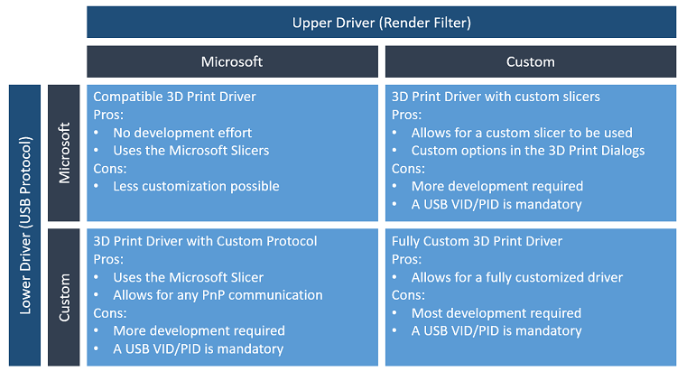

# 3D print partner onboarding guide

Joining the Microsoft 3D print ecosystem enables 3D printer manufacturers to offer a great plug-and-play experience on Windows 10. This strategy removes the potential for problems encountered by users when locating and manually installing drivers. Additionally, Windows Update ensures that the users are always using the latest driver for their device and are getting the best experience available.

## 3D print driver overview

A plug-and-play 3D printer on Windows 10 is implemented through a pair of drivers published on Windows Update:

**Upper driver (Render filter)**

-   Implements the slicer. The driver takes [3MF](http://www.3mf.io) as input and produces G-Code or other similar machine level data.

-   Creates the print queue. The device appears under **Devices and Printers** and in the **3D Print Dialog** for compatible [3D Printing applications](https://developer.microsoft.com/windows/hardware/3d-software-partners).

**Lower driver (USB driver)**

-   Implements wire protocol (typically USB Serial or native USB)

-   Kernel mode driver creates the ENUM\\3DPRINTER device node for the upper driver

-   User mode component (Partner DLL) sends the G-Code to the device

-   Reports device capabilities, job status and implements job cancel

-   Installs 3D print service and the 3D port monitor (3dmon)

## Choosing the right driver model




## 3D print driver with custom slicer

1. Obtain and verify the device USB hardware ID

    - Ensure the device firmware has a unique Vendor ID and Product ID (VID/PID) allocated by the [USB Implementers Forum (USB-IF)](http://www.usb.org). For USBSER devices, we strongly recommended that you use a unique serial number to prevent conflicts on a USB port changes.

2. Install Microsoft tools and SDKs

    - Download and install [Visual Studio Community Edition](https://go.microsoft.com/fwlink/p/?LinkId=534599)

    - Download and install the [Windows 10 SDK](https://go.microsoft.com/fwlink/p/?LinkID=822845)

    - Download and install the [3D printing SDK](http://go.microsoft.com/fwlink/p/?LinkId=394375)

> [!NOTE]
> The 3D printing SDK will be installed in C:\\Program Files (x86)\\Microsoft SDKs\\3D Printing.

3. Implement the USB driver

    - A manufacturer can use the Microsoft USB driver for their 3D printer by creating a partner DLL. For more information, see [3D printer custom USB interface support](3d-printer-custom-usb-interface.md).

    - If the printer is using the Microsoft Slicer, the Hardware ID that it creates must be **Enum\\3DPrint\\MS3DPrint**

> [!NOTE]
> If the printer is using a custom slicer, continue with steps 4-7.

4. Build the Fabrikam driver (slicer template only)

    - Build and obtain the driver package. This creates a x64 folder with the slicer part.

5. Adding the custom slicer

    - Modify the cpp file to include:

        -   3MF parser (use the Windows 10 version 1607 3MF API)

        -   Write G-Code

6. Adding the printer node

    - Open the inf in Fabrikam Print driver

    - Replace the entries hardware IDs:

        ```INF
        %DeviceName%=FabrikamPrintDriverV4\_Install,3DPRINTER\\Fabrikam1

        %DeviceNamePlus%=FabrikamPrintDriverV4\_Install,3DPRINTER\\Fabrikam2

        DeviceName="CONTOSO FABRIKAM 1"

        DeviceNamePlus="CONTOSO FABRIKAM 2"
        ```

7. Publish and distribute the driver

    - Follow the guidance in the [Windows Hardware Dev Center dashboard](https://docs.microsoft.com/windows-hardware/drivers/dashboard) topics to publish your driver.


