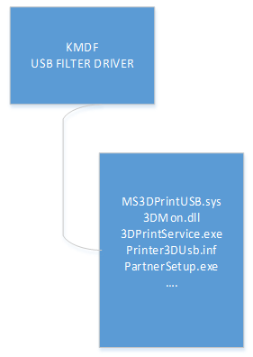
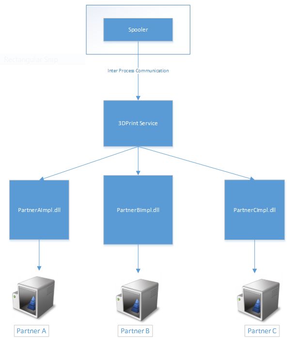
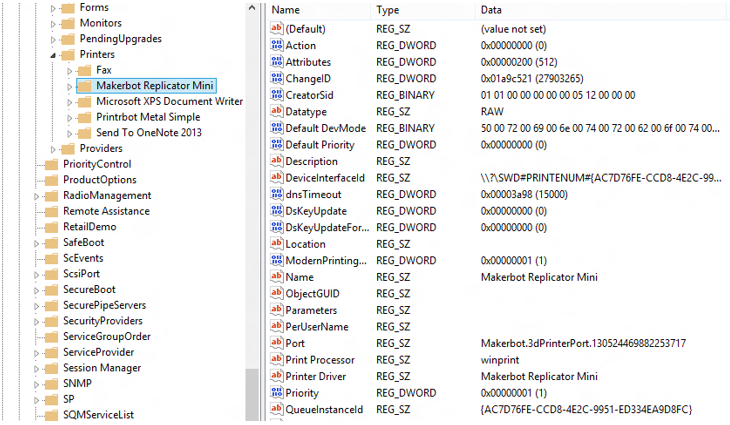

# Enable a custom USB interface for a 3D printer

The architecture described in this topic enables support for custom USB interface 3D printers in the v3 and v4 print ecosystems. A standard port monitor, **3dmon.dll**, forwards 3D print job commands to a Windows **3DPrintService** running with local service credentials. The service loads and communicates with a partner DLL to execute the custom commands needed for a 3D print job. The partner DLL, as well as the **3dmon.dll** and **3dprintservice.exe** redistributables, are installed by the device's USB driver package. The partner DLL must implement and export a set of functions to communicate with the **3DPrintService**. The rest of the required functionality to interact with the print spooler service is implemented in **3dmon.dll**.

**Note** This architecture requires the partner DLL to multi-instance, thread safe.

## Architecture Decisions

The **3DPrintService** windows service is used to load and invoke specific defined APIs in partner-provided DLLs during a print workflow. These APIs will allow for communication with the printer. 

The KMDF USB Filter driver packages are published on Windows Update for installing via PnP for a supported 3D printer. The KMDF driver installs partner software and creates a 3D printer device node. The 3D printer device node is installed using a partner-published v4 print driver from Windows Update.

## Packaging Decisions

### Binaries and Binary Dependencies

The architectue uses a driver published by the hardware manufacturer on Windows Update. This driver includes the following Microsoft-provided redistributable binaries and their dependencies:

- 3dmon.dll

- 3dprintservice.exe

- ms3dprintusb.sys

#### Kernel mode USB filter driver

The KMDF driver is published by the partner and consists of components shown in the diagram below. This matches the device with a hardware ID (typically, a VID & PID). The driver creates a 3D printer device node on installation which triggers installation of the print queue and the slicer drivers. The partner provids v4 printer drivers for the 3D printer device node that is created.



##### MS3DPrintUSB.sys

The kernel mode device driver that creates the 3D printer dev node under Enum\\3DPrint. It is invoked by the PnP subsystem via a direct match of the VID & PID based on the device node created by Winusb.sys. The driver .inf file sets up the custom DLL used to set the **3DPrintService** (if not already installed on the system).

##### 3dmon.dll

3DMon.dll is a Microsoft-published port monitor redistributable binary invoked by the spooler to communicate with the 3D printer.

#####  3dprintservice.exe

3DPrintService.exe is a Microsoft-published binary installed as a Windows service during driver setup. 3DMon communicates with this service to perform operations like printing, bidi, and so on with the 3D printer.

##### Partnerimpl.dll

Partnerimp.dll is partner's implementation of the published Microsoft interface. The DLL communicates with the partner's device using their protocols. 3DPrintService.exe loads this DLL at runtime to drive the operations of the 3D printer device.



### Printer usage sequence

- The spooler communicates with 3dmon.dll which sends commands to the 3DPrintService windows service

- The 3DPrintService.exe runs with the account credentials of NetworkService

- The spooler, via 3dmon.dll, sends commands to 3DPrintService anytime the 3D printer is used

- The 3DPrintService processes commands and invokes APIs at runtime on partner-provided implementation DLLs

- The 3DPrintService hands off the responses from partner-provided DLLs back to the spooler

## Interfaces and Interactions

The partner DLL must export the following API functions:

### HRESULT Install(\[in\] LPCWSTR args);

This API is optional and can be used by the manufacturer to install custom software or registration for their device. For example, installation of modelling included with the driver package for the device. This API is invoked with SYSTEM credentials to enable installation.

### DWORD PrintApiSupported();

This API is used by the third-party manufacturers to indicate the version of the 3D print service API supported. The APIs below are compatible with version 1 of the 3DPrintService.

### HRESULT InitializePrint(LPCWSTR pPrinterName, LPCWSTR pPortName, DWORD dwJobId, LPVOID\* ppPartnerData)

This API is invoked prior to a print event starting to initialize the printer. The printer can save job specific state in the ppPartnerData parameter. This call is analogous to a StartDocPort invocation.

> **jobId** - job id used to track the job
>
> **portName** - portname for the 3D printer
>
> **printerName** - name of the printer this print job is being sent to
>
> **ppPartnerData** - pointer to pointer that can be used to store any job specific data

### HRESULT PrintFile(\[in\] DWORD jobId, \[in\] LPWSTR portName, \[in\] LPWSTR printerName, \[in\] LPWSTR pathToRenderedFile,\[in\]LPVOID\* ppPartnerData);

This API is used by third-party manufacturers to print the document on their printer.

> **jobId** - job id used to track the job
>
> **portName** - portname for the 3D printer
>
> **printerName** - name of the printer the print job is being sent to
>
> **pathToRenderedFile** - UNC path to the location of the spooled file after rendering has been performed. The third-party manufacturer processes the file from this location and print the document on their device
>
> **ppPartnerData** - pointer to pointer that isused to store partner specific data setup during the InitializePrint API call.
>
> **printerName** can be obtained from the registry using the port name. Third-party manufacturers maynot be able to use the port name to communicate with their device. The printer name is unique on a Windows machine and their software will be capable of identifying which printer to print the job on. All printers active on a machine can be found at the following registry key:

    **HKEY\_LOCAL\_MACHINE\\SYSTEM\\CurrentControlSet\\Control\\Print\\Printers**



### HRESULT Query(\_In\_ LPCWSTR command, \_In\_ LPCWSTR commandData, \_Out\_ LPWSTR resultBuffer, \_Out\_ resultBufferSize, , \_In\_ LPVOID\* ppPartnerData)

> **command** - string command sent as a query
>
> **commandData** - command arguments (optional)
>
> **resultBuffer** - result of invocation of query arguments>
>
> **resultBufferSize** - size of the result buffer string
>
> **ppPartnerData** - pointer to pointer for the current partner DLL instance

The 3Dprint service invokes the partner DLL to get the size of the buffer to allocate for the command. 

After allocating memory to hold the response string, the DLL will be invoked again to get the actual result. 

The DLL can use the instance data from a previous **IntializePrint()** call to communicate with the device without opening a new communication channel each time the **Query()** function is called.

This API is used to communicate with the printer to obtain information on the device configuration, print progress, or to notify the partner DLL of device unplug events. 

The commands below must be supported by the manufacturer:

| Command | CommandData | Output | Comments |
|---------|-------------|--------|----------|
| \\\\Printer.3DPrint:JobStatus | | Job Commenced = {"Status": "ok"} <br> Status to be used on Completion  {"Status": "Completed"} | The spooler will display any returned value in the print queue UI. This lets the device display relevant information during a print on the print queue UI. The device can return an arbitrary string here (for example "Busy" or "33% complete") and this will be displayed verbatim in the print queue job status. |
| \\\\Printer.3DPrint:JobCancel | | {"Status": "Completed"} | The spooler will invoke this command when a user cancels a print. The partner DLL returns this value when the cancellation was successful and the handles and threads have been closed. |
| \\\\Printer.Capabilities:Data | | XML string conforming to the PrintDeviceCapabilites (PDC) schema. | The PDC query is invoked by apps that wish to obtain more information about the printer. The data is used to describe the capabilities of the device and can include the slicer settings if the driver relies on the Microsoft slicer. See below for a sample PDC. |
| \\\\Printer.3DPrint:Disconnect | | {"Status": "OK"} | This query is triggered whenever there is a PnP disconnection of the printer device. Partners can undertake any required actions, for example close any open handles to allow proper reconnect. |
| \\\\Printer.3DPrint:Connect | | {"Status":"OK"} | This query is triggered whenever there is a PnP connection of the printer device. Partners can undertake any required actions. |

#### Print Device Capabilities XML

The following print device capabilities XML can be used as an example:

```xml
<?xml version="1.0"?>
<PrintDeviceCapabilities
    xmlns:xsi="http://www.w3.org/2001/XMLSchema-instance"
    xmlns:xsd="http://www.w3.org/2001/XMLSchema"
    xmlns:xml="http://www.w3.org/XML/1998/namespace"
    xmlns:psk="http://schemas.microsoft.com/windows/2003/08/printing/printschemakeywords"
    xmlns:psk3d="http://schemas.microsoft.com/3dmanufacturing/2013/01/pskeywords3d"
    xmlns:psk3dx="http://schemas.microsoft.com/3dmanufacturing/2014/11/pskeywords3dextended"
    xmlns:pskv="http://schemas.microsoft.com/3dmanufacturing/2014/11/pskeywordsvendor"
    xmlns:psf="http://schemas.microsoft.com/windows/2003/08/printing/printschemaframework"
    xmlns:psf2="http://schemas.microsoft.com/windows/2013/12/printing/printschemaframework2"
    xmlns="http://schemas.microsoft.com/windows/2013/12/printing/printschemaframework2"
    version="2">
    <CapabilitiesChangeID xsi:type="xsd:string">{9F58AF07-DCB6-4865-8CA3-A52EA5DCB05F}</CapabilitiesChangeID>

  <psk3d:Job3DOutputArea psf2:psftype="Property">
    <psk3d:Job3DOutputAreaWidth>150001</psk3d:Job3DOutputAreaWidth>
    <psk3d:Job3DOutputAreaDepth>150001</psk3d:Job3DOutputAreaDepth>
    <psk3d:Job3DOutputAreaHeight>150001</psk3d:Job3DOutputAreaHeight>
  </psk3d:Job3DOutputArea>

  <psk3d:Job3DMaterials psf2:psftype="Property">

      <psk3dx:MaterialPLA>
         <psk:DisplayName>PLA</psk:DisplayName>
         <psk3d:Job3DMaterialType>psk3d:PLA</psk3d:Job3DMaterialType>
         <psk3d:MaterialColor>#FFFFFFFF</psk3d:MaterialColor>

         <psk3dx:platformtemperature>0</psk3dx:platformtemperature>
         <psk3dx:filamentdiameter>1750</psk3dx:filamentdiameter>
         <psk3dx:filamentcalibrationoverride>1.0</psk3dx:filamentcalibrationoverride>
         <psk3dx:extrudertemperature>207</psk3dx:extrudertemperature>

         <psk3dx:SpeedFactor>1.0</psk3dx:SpeedFactor>

         <psk3dx:SetupCommands>
            <!-- Executed during pre-commands: nozzle pre-heating, priming, etc --> 
            <psk3dx:command>M104 S207 T1</psk3dx:command>
            <psk3dx:command>M140 S50</psk3dx:command>
         </psk3dx:SetupCommands>

         <psk3dx:SelectCommands>
            <!-- Executed during printing: T0/T1 selection, nozzle wiping sequence,turn fan on/off/gradual, retract the material, temperature, etc--> 
            <psk3dx:command>; PLA on</psk3dx:command>
            <psk3dx:command>M108 T1</psk3dx:command>
         </psk3dx:SelectCommands>

         <psk3dx:DeselectCommands>
            <!-- Executed during printing: retract the material, park the nozzle, reduce temperature, etc --> 
            <psk3dx:command>; PLA off</psk3dx:command>
         </psk3dx:DeselectCommands>


      </psk3dx:MaterialPLA>
  </psk3d:Job3DMaterials>

  <psk3dx:customStatus>Slicing</psk3dx:customStatus>
  <psk3dx:userprompt>Confirm the 3D printer is calibrated and ready for the next print</psk3dx:userprompt>

   <!— Additional Slicer settings follow (optional) --> 

</PrintDeviceCapabilities>
```

For 3D printers that do not have on-board display and buttons to allow the user to interact with the device at the beginning of the print, we advocate returning a PDC xml with a suitable user prompt message set as shown above in **psdk3dx:userPrompt**. This is to prevent starting a new print on top of an existing one. The custom status message *&lt;psk3dx:customStatus&gt;* is used to display any message during slicing.

### HRESULT Cleanup(LPCWSTR pPrinterName, LPCWSTR pPortName, DWORD dwJobId, LPVOID\* ppPartnerData)

> **dwJobId** - job id used to track the job in the spooler
>
> **pPortName** - portname for the 3D printer
>
> **pPrinterName** - name of the printer this print job is being sent to
>
> **ppPartnerData** - pointer to pointer that holds the job specific data setup during an InitializePrint API invocation

Cleanup is invoked on successful completion of a print job, or on completion of a cancel query on a print job. It provides an opportunity for the partner DLL to cleanup resources that were initialized for this print.

### HRESULT UnInstall(\[in\]LPCWSTR args);

This API is called when uninstaling the 3D printer device and provides a mechanism for manufacturer to uninstall software they might have installed.


