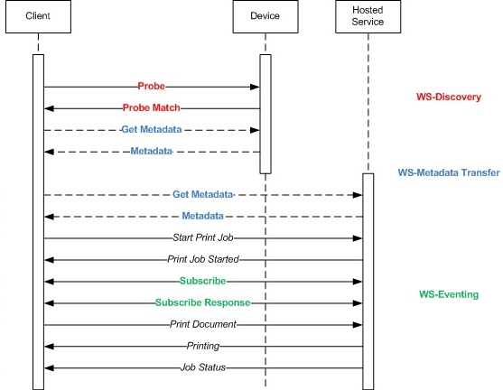

# Enable WSPrint 2.0 on a device


This topic describes the settings required to enable WSPrint 2.0 on a device.

## Broadcast a Mdns printer service


This must be done using the service type of PrintService.\_printer.\_tcp.local on port 80.

## Implement a HTTP endpoint 


The endpoint needs to be able to respond to WSPrint 2.0 operations. You do not need to perform SOAP validation and processing. You can instead use string detection and replacement.

Once the WSPrint endpoint is functioning, you need to customize the XML returned from the GetPrinterElements call with a custom device id:

```xml
<wprt:DeviceId>MFG:MS3D; CMD:XPS; MDL:Compat; CLS:Printer; DES:Compat; CID:MS3DWSD</wprt:DeviceId>
```
This matches with the Compatible ID in the published INF:

```xml
WSDPRINT\MS3DCompatE2D2
```

## WSPrint interactions


The following diagram shows WSPrint 2.0 interactions:



The following steps are a more detailed description of WSPrint 2.0 interactions:

1.  Probe – Network Discovery bootstrap

2.  Resolve – Network Discovery bootstrap

3.  Get – Printer MetaData Query

4.  GetPrinterElements – Printer MetaData Query

5.  Subscribe – Event model registration

6.  Unsubscribe – Event unregistration

7.  SetEventRate – Event rate

8.  Renew – Renew 

9.  PrepareToPrint – Print initialization

10. CreatePrintJob – Print submission

11. CreatePrintJob2 – Print submission

12. GetPrintDeviceResources – Allows retrieval of localized resources in ResX (Multi Part Outgoing Response)

13. GetPrintDeviceCapabilities  - Allows retrieval of Print Device Capabilities (Multi Part Outgoing Response)

14. GetBidiSchemaExtensions - Allows retrieval of Bidi Schema extensions (Multi Part Outgoing Response)

15. CancelJob – Job Cancellation

16. GetActiveJobs – Job Progress 

17. GetJobHistory – Job History

18. AddDocument – Add document to current print

19. GetJobElements – Get job statuses

20. SendDocument – Actual print data (Multi Part Incoming Request)

For more information on WSPrint 2.0, see the following resources:

[Implementing Web Services on Devices for Printing](https://go.microsoft.com/fwlink/p/?linkid=867155)

[WSPrint 2.0 specification](http://go.microsoft.com/fwlink/p/?LinkId=534008) 


