# Install the driver and sample app

This section provides information on installing the driver and the WSD sample app.

## Install the driver on a Windows 8.1 machine

To install the print driver included in the 3D printing SDK, selecting the driver's .inf file, right-click on the file, and then select **Install**.

## Install the sample app

Start by installing Microsoft Visual Studio 2013 (Professional or Ultimate) and applying any required service packs or updates.

The sample implementation consists of an Microsoft Internet Information Services (IIS) web service implemented in ASP.NET with a http handler that responds to the WS-Print protocol requests.

Directed discovery can operate with the web service running as it works off the http protocol without UDP discovery.

### Installation requirements

Deployment of the web service on a windows machine requires that the machine have IIS and ASP.NET installed along with Microsoft .NET 4.5.

### Install IIS

1.  To install IIS, press the **Windows** + **R** key combination to bring up a **Run** dialog box, then type `appwiz.cpl` and press **Enter**.

    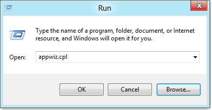

    This will open Control Panel **Programs and Features**.

2.  On the **Control Panel Home** pane, click **Turn Windows features on or off**.

    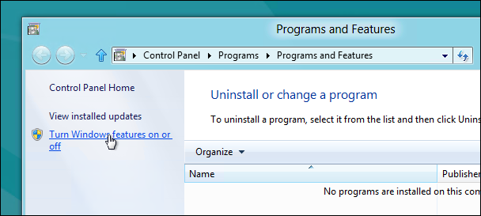

3.  In the **Windows Features** dialog, select the **Internet Information Services** check box.

    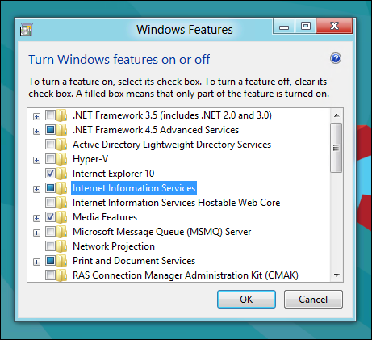

4.  Expand the **Internet Information Services** check box and expand **World Wide Web Services**.

    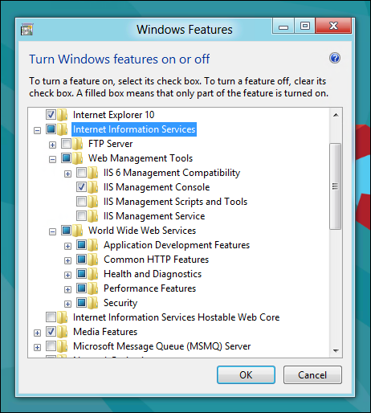

5.  Expand **Application Development Features** and select and the sub-features shown here:

    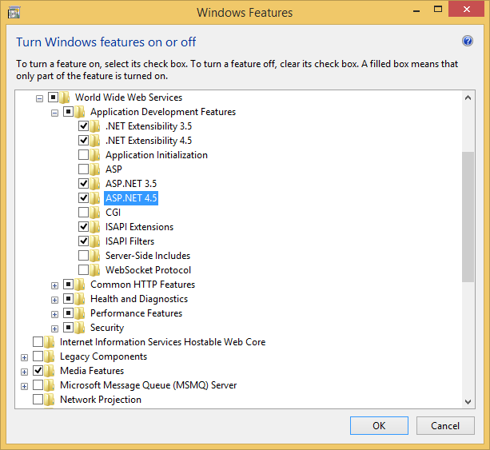

6.  Click **OK**. The **Applying changes** dialog will show the progress of the installation.

    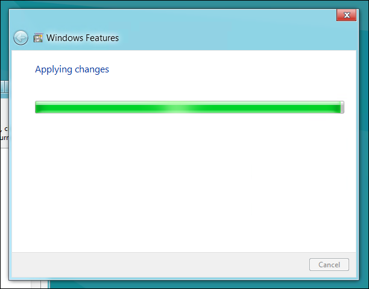

7.  When the **Applying changes** dialog closes, open a browser and navigate to http://localhost.

    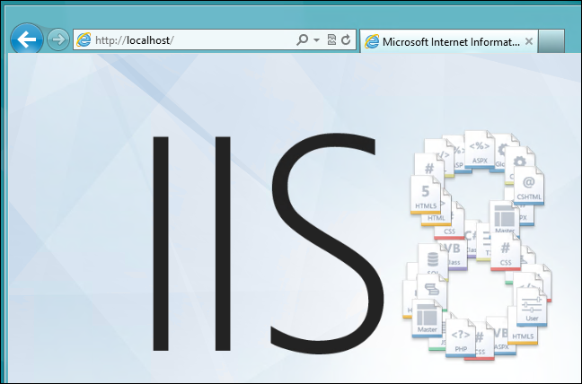

### Publish the project

Publish the Handler project to localhost to deploy the web service.

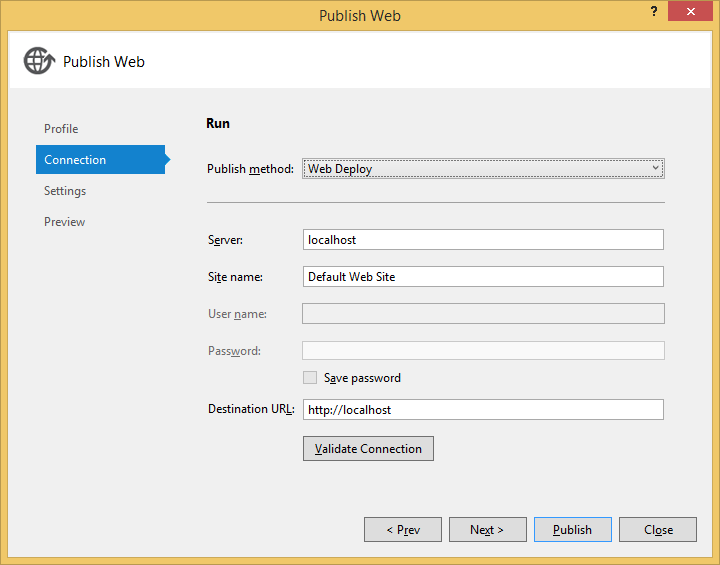

Once publishing is successful, browsing to http://localhost will result in an empty file being sent back. If the handler is not setup correctly, you will receive an error message or potentially see the default IIS web page.

You can switch the **DefaultAppPool** to run with the **NetworkService** identity and it will continue to work as expected. **DefaultAppPool** should also work across the network as well.

### Verify site bindings

if you need to support IPv6, ensure that the ASP.NET site bindings are created for IPv6.

The Handler project publishes the project to **Default Web Site**.

By default, the site is bound to port 80 on all IP addresses.

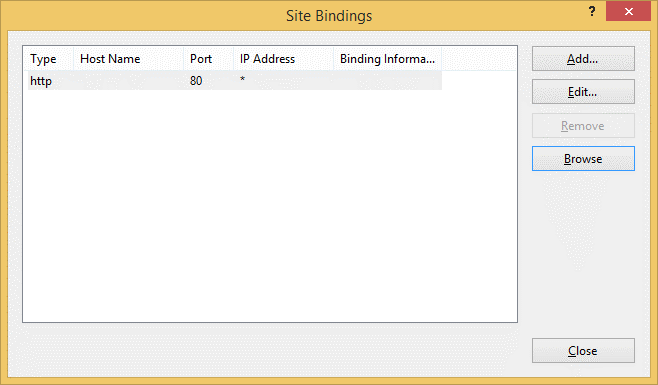

### Update Windows Firewall

By default, Windows blocks port 80 on a machine, so you will need to update Windows Firewall to allow World Wide Web Services (http) traffic inbound. Without turning this on, incoming http requests from clients will fail.

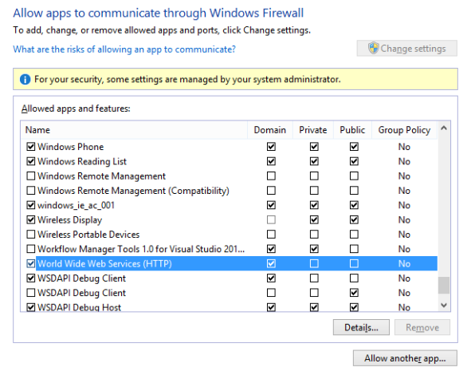

### Install the Fabrikam Printer

### Directed Discovery via Http endpoint

1.  Open **Devices and Printers** in **Control Panel**.

2.  Select **Add a printer**.

3.  Select **The printer I want isn't listed**.

    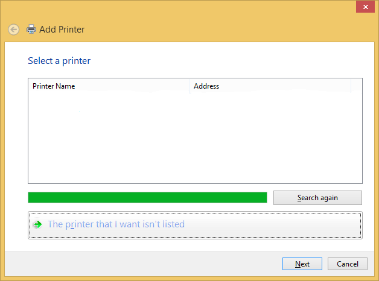

4.  Select **Add a printer using TCP/IP address or hostname**.

    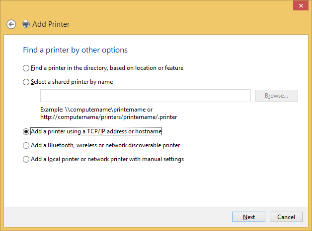

5.  Select **Web Services Device** from **Device type** list.

    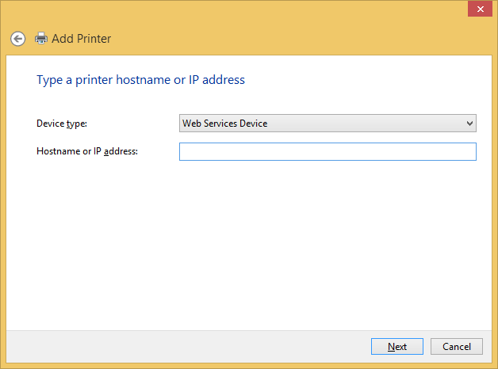

6.  Type a hostname or IP address and click **Next**.

    The **Contacting printer...** progress bar will appear.

    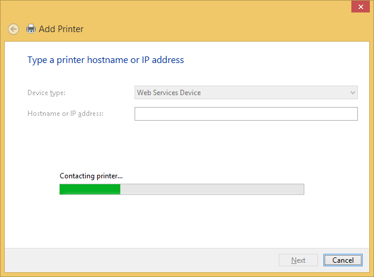

    When the Fabrikam printer is installed the following message will display:

    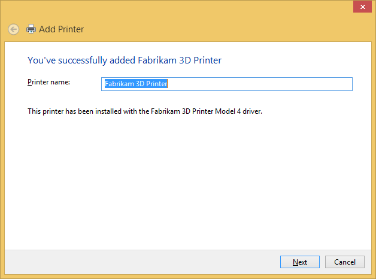

### Ad-Hoc Discovery via UDP Multicast

Ad-hoc discovery can be performed by implementing a UDP server that listens to discovery events on port 3702.

For more information on the exchange sequence, see [Discovery and Metadata Exchange Message Patterns](https://msdn.microsoft.com/library/windows/desktop/bb513677.aspx).

 

 

