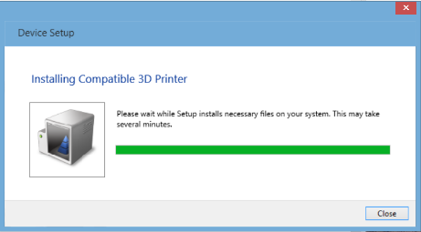
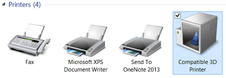
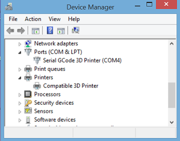
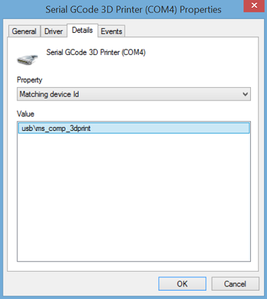
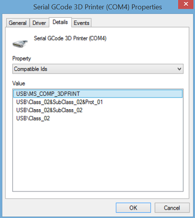
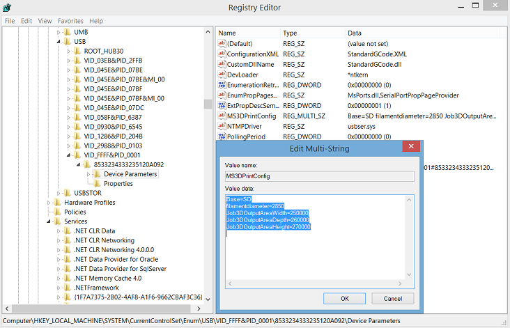
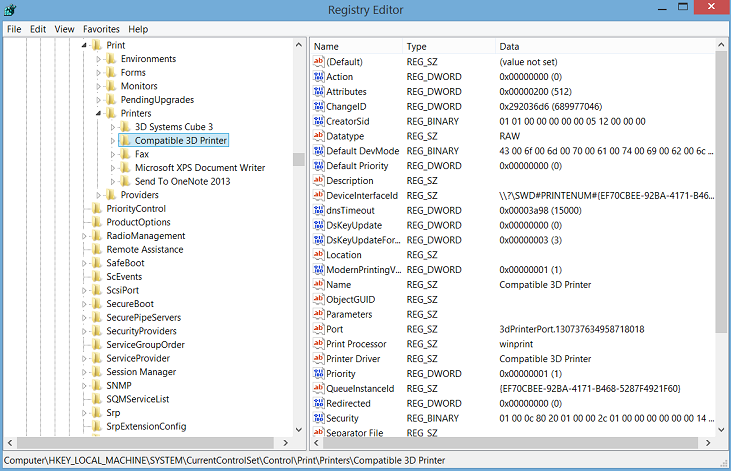

# Getting started guide - Microsoft Standard Driver for 3D Printers


The Microsoft Standard Driver for 3D Printers allows developers to easily make their printer compatible with Windows 10. Any printer that uses Microsoft OS descriptors can be recognized as a compatible 3D printer. Using a concrete example, this article will show how to create a firmware that allows a device to be recognized as a 3D printer by Windows 10 and communicate its print capabilities.

## Introduction


The Microsoft Standard Driver relieves the burden of writing their own driver from independent hardware vendors (IHVs) who want their 3D printers to be compatible with Windows 10. Versions of Windows that are aware of Microsoft OS descriptors use control requests to retrieve the information and use it to install and configure the device without requiring any user interaction.

The general process to get a 3D printer working on Windows 10 includes the following steps:

1.  **Compatible ID**. The independent hardware vendor (IHV) has to include the "3D Print" compatible ID in the firmware of the printer. This allows the device to be recognized as a 3D printer.

2.  **Standard Driver**. Once the device is plugged in, Windows Update will download the 3D print standard driver and detect the current device as a 3D printer that uses a default configuration.

3.  **Extended properties descriptor**. Several base configurations for 3D printers are made available as part of the standard driver. A developer can therefore choose a base configuration that matches their 3D printer. On top of choosing a base configuration, a developer can override some of the properties to better match their 3D printer and include them in the new firmware.

4.  **Plug and play**. Once the firmware is burned in the flash memory of the 3D printer, whenever a user plugs it into a Windows 10 machine, the standard driver will automatically be downloaded and will use the custom print capabilities that the developer has chosen.

In the following sections, we will illustrate each of these steps using a concrete example.

For more information, see [Microsoft OS Descriptors](http://go.microsoft.com/fwlink/p/?LinkId=533944).

## Compatible ID


To specify to the Windows operating system that we are currently using a 3D printer, we have to use the right compatible ID. The list of Microsoft Compatible ID are available at [Microsoft OS Descriptors](http://go.microsoft.com/fwlink/p/?LinkId=533944).

The compatible ID for a 3D printer is shown in the following table:

<table>
<colgroup>
<col width="33%" />
<col width="33%" />
<col width="33%" />
</colgroup>
<thead>
<tr class="header">
<th>Compatible ID</th>
<th>Sub-compatible ID</th>
<th>Description</th>
</tr>
</thead>
<tbody>
<tr class="odd">
<td><p>&quot;3DPRINT&quot;</p>
<p>(0x33 0x44 0x50 0x52 0x49 0x4E 0x54 0x00)</p></td>
<td><p>Varies</p></td>
<td><p>MS3DPRINT G-Code Printer</p></td>
</tr>
</tbody>
</table>

 

In the header file that is included in the 3D printer firmware, the IHV must specify the Compatible ID as shown here:

```cpp
#define MS3DPRINT_CONFIG_SIZE 232

#define MS3DPRINT_OSP_SIZE (4+4+2+0x20+4+MS3DPRINT_CONFIG_SIZE)

#define MS3DPRINT_XPROP_SIZE (4+2+2+2+MS3DPRINT_OSP_SIZE)

#define SIZE_TO_DW(__size)                \
        ((uint32_t)__size) & 0xFF,        \
        (((uint32_t)__size)>>8) & 0xFF,   \
        (((uint32_t)__size)>>16) & 0xFF,  \
        (((uint32_t)__size)>>24) & 0xFF 

// CompatibleID and SubCompatibleID
static const uint8_t PROGMEM ms3dprint_descriptor[40] = {
    0x28, 0x00, 0x00, 0x00,                          // dwLength
    0x00, 0x01,                                      // bcdVersion
    0x04, 0x00,                                      // wIndex
    0x01,                                            // bCount
    0x00, 0x00, 0x00, 0x00, 0x00, 0x00, 0x00,        // RESERVED
    0x00,                                            // bFirstInterfaceNumber
    0x01,                                            // RESERVED
    '3', 'D', 'P', 'R', 'I', 'N', 'T', 0x00,         // compatibleID ("3DPRINT")
                                                 // subCompatibleID
    0x00, 0x00, 0x00, 0x00, 0x00, 0x00, 0x00, 0x00   /*        */  
,
    0x00, 0x00, 0x00, 0x00, 0x00, 0x00               // RESERVED
};
```

This line in the code above is the compatible ID of a 3D Printer:

`'3', 'D', 'P', 'R', 'I', 'N', 'T', 0x00,         // compatibleID ("3DPRINT")`

With this specific configuration, IHVs can compile their firmware and flash the device. Then when the device is plugged in, the 3D Print Standard Driver will automatically get downloaded from Windows Update.

At this stage the printer is using the standard driver default configuration, the parameters used by the default configuration are accessible in the folder %SYSTEMROOT%\\System32\\MS3DPrint in the file StandardGCode.xml. Additionally, a developer can chose to use a different base configuration, a list of base configurations are available in the same folder %SYSTEMROOT%\\System32\\MS3DPrint. This list is regularly populated with new configuration as new 3D printers emerge on the market.

## Extended Properties OS Feature Descriptor


As stated in the above section, IHVs have access to several base configurations. This has the advantage of minimizing the amount of information that has to be stored in the printer’s flash memory. Developers can inspect the base configurations made available and choose the one that is the closest to their printers. In this example we are going to choose the SD card base configuration and override some of the properties with the parameters below:

| Parameters            | Value  |
|-----------------------|--------|
| Job3DOutputAreaWidth  | 250000 |
| Job3DOutputAreaDepth  | 260000 |
| Job3DOutputAreaHeight | 270000 |
| Filamentdiameter      | 2850   |

 

For more information about these parameters, please refer to the *MS3DPrint Standard G-Code Driver.docx* document in the [3D Printing SDK](http://go.microsoft.com/fwlink/p/?LinkId=394375) documentation.

To specify which base configuration to use and which parameters to override, the developer has to specify it through the Extended Properties OS Feature Descriptor as shown here:

```cpp
// Modifiers to the base configuration
static const uint8_t PROGMEM ms3dprint_properties_descriptor[] = {
    SIZE_TO_DW(MS3DPRINT_XPROP_SIZE),                   // dwLength
    0x00, 0x01,                                         // bcdVersion
    0x05, 0x00,                                         // wIndex
    0x01, 0x00,                                         // wCount
    
    SIZE_TO_DW(MS3DPRINT_OSP_SIZE),                     // dwSize
    0x07, 0x00, 0x00, 0x00,                             // dwPropertyDataType  (1=REG_SZ, 4=REG_DWORD, 7=REG_MULTI_SZ)

    0x20, 0x00,                                         // wPropertyNameLength
    'M', 0x0, 'S', 0x0, '3', 0x0, 'D', 0x0,             // bPropertyName
    'P', 0x0, 'r', 0x0, 'i', 0x0, 'n', 0x0,
    't', 0x0, 'C', 0x0, 'o', 0x0, 'n', 0x0,
    'f', 0x0, 'i', 0x0, 'g', 0x0, 0x0, 0x0,

    SIZE_TO_DW(MS3DPRINT_CONFIG_SIZE),                  // dwPropertyDataLength

    // Data
    0x42, 0x00, 0x61, 0x00, 0x73, 0x00, 0x65, 0x00, 0x3D, 0x00, 0x53, 0x00, 0x44, 0x00, 0x00, 0x00,  /* Base=SD  */  
    0x4A, 0x00, 0x6F, 0x00, 0x62, 0x00, 0x33, 0x00, 0x44, 0x00, 0x4F, 0x00, 0x75, 0x00, 0x74, 0x00,  /* Job3DOut */  
    0x70, 0x00, 0x75, 0x00, 0x74, 0x00, 0x41, 0x00, 0x72, 0x00, 0x65, 0x00, 0x61, 0x00, 0x57, 0x00,  /* putAreaW */  
    0x69, 0x00, 0x64, 0x00, 0x74, 0x00, 0x68, 0x00, 0x3D, 0x00, 0x32, 0x00, 0x35, 0x00, 0x30, 0x00,  /* idth=250 */  
    0x30, 0x00, 0x30, 0x00, 0x30, 0x00, 0x00, 0x00, 0x4A, 0x00, 0x6F, 0x00, 0x62, 0x00, 0x33, 0x00,  /* 000 Job3 */  
    0x44, 0x00, 0x4F, 0x00, 0x75, 0x00, 0x74, 0x00, 0x70, 0x00, 0x75, 0x00, 0x74, 0x00, 0x41, 0x00,  /* DOutputA */  
    0x72, 0x00, 0x65, 0x00, 0x61, 0x00, 0x44, 0x00, 0x65, 0x00, 0x70, 0x00, 0x74, 0x00, 0x68, 0x00,  /* reaDepth */  
    0x3D, 0x00, 0x32, 0x00, 0x36, 0x00, 0x30, 0x00, 0x30, 0x00, 0x30, 0x00, 0x30, 0x00, 0x00, 0x00,  /* =260000  */  
    0x4A, 0x00, 0x6F, 0x00, 0x62, 0x00, 0x33, 0x00, 0x44, 0x00, 0x4F, 0x00, 0x75, 0x00, 0x74, 0x00,  /* Job3DOut */  
    0x70, 0x00, 0x75, 0x00, 0x74, 0x00, 0x41, 0x00, 0x72, 0x00, 0x65, 0x00, 0x61, 0x00, 0x48, 0x00,  /* putAreaH */  
    0x65, 0x00, 0x69, 0x00, 0x67, 0x00, 0x68, 0x00, 0x74, 0x00, 0x3D, 0x00, 0x32, 0x00, 0x37, 0x00,  /* eight=27 */  
    0x30, 0x00, 0x30, 0x00, 0x30, 0x00, 0x30, 0x00, 0x00, 0x00, 0x66, 0x00, 0x69, 0x00, 0x6C, 0x00,  /* 0000 fil */  
    0x61, 0x00, 0x6D, 0x00, 0x65, 0x00, 0x6E, 0x00, 0x74, 0x00, 0x64, 0x00, 0x69, 0x00, 0x61, 0x00,  /* amentdia */  
    0x6D, 0x00, 0x65, 0x00, 0x74, 0x00, 0x65, 0x00, 0x72, 0x00, 0x3D, 0x00, 0x32, 0x00, 0x38, 0x00,  /* meter=28 */  
    0x35, 0x00, 0x30, 0x00, 0x00, 0x00, 0x00, 0x00                                                   /* 50       */  
};
```

Information regarding the extended properties OS feature descriptor are in the *OS\_Desc\_Ext\_Prop.doc* file. See [Microsoft OS Descriptors](http://go.microsoft.com/fwlink/p/?LinkId=533944) for more information.

## Verifying the print capabilities


Once the device has the firmware burned in flash memory , the device will automatically be detected by Windows 10 and the print capabilities will be stored in registry.



It is very important that the IHV changes the VID/PID of the device to their own. You should never use the Vendor ID (VID) or Product ID (PID) of another existing device as the operating system will not be able to detect the device properly as the VID and PID take priority over the OS descriptor.

If the device has been properly installed, the device should be listed in **Devices and Printers**.



In the **Device Manager**, the matching device id and the compatible id can be verified.







The USB driver properties can be obtained by visiting the registry at **HKEY\_LOCAL\_MACHINE\\SYSTEM\\CurrentControlSet\\Enum\\USB**.



The 3D Print driver properties can be obtained by visiting the registry at **HKEY\_LOCAL\_MACHINE\\SYSTEM\\CurrentControlSet\\Control\\Print\\Printers**.



## Additional resources


For more information, see the following documents and resources:

[3D Printing in Windows](http://go.microsoft.com/fwlink/p/?LinkId=534206)

[3D Printing SDK (MSI download)](http://go.microsoft.com/fwlink/p/?LinkId=394375)

[Microsoft OS Descriptors](http://go.microsoft.com/fwlink/p/?LinkId=533944)

[USB 2.0 Specification](http://go.microsoft.com/fwlink/p/?linkid=533945)

You can also contact the Microsoft 3D Printing team at [Ask 3D Printing Questions](http://go.microsoft.com/fwlink/p/?LinkId=534751) (ask3dprint@microsoft.com).

 

 


