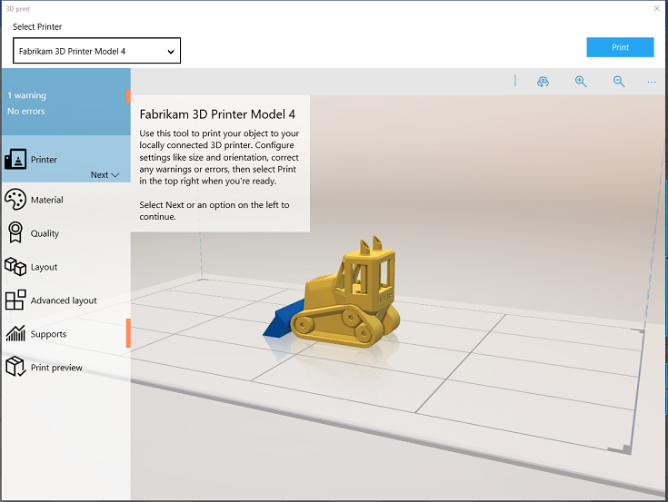
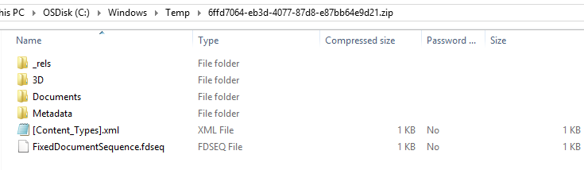

# Print files to the WSD sample

This section describes how to print to the WSD sample.

## Printing the files to the WSD sample

1.  Launch the 3D Builder app.

2.  Choose a 3D model and click print.

    

The files sent to the printer from the 3d Builder app go to the C:\\Windows\\Temp folder and are zip files.

The folder structure of a zip file printed from 3D Builder is shown here:

 

 

