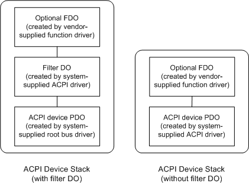

# Device Stacks for an ACPI Device

This section describes the device stacks for an ACPI device that include an optional functional device object ([*FDO*](https://msdn.microsoft.com/library/windows/hardware/ff556280#wdkgloss-fdo)) created by a vendor-supplied WDM function driver.

The system creates one of the two device stacks shown in the following figure for each device in the system's ACPI namespace.

If an ACPI device is a hardware device integrated into the system board, the system creates a device stack with a bus filter device object (filter DO). The device's physical device object ([*PDO*](https://msdn.microsoft.com/library/windows/hardware/ff556325#wdkgloss-pdo)) is created by the system-supplied root bus driver and the ACPI driver creates a bus filter DO. The presence of the filter DO is transparent to other device objects above it in the device stack.

If the device is not a hardware device integrated into the system board, the ACPI driver enumerates the device and creates a PDO. In either case, a vendor can supply an optional FDO.

### System-Supplied Root Bus Driver and ACPI Driver

Microsoft supplies the root bus driver and the [ACPI driver](https://msdn.microsoft.com/library/windows/hardware/ff540493). On systems that have an ACPI BIOS, the HAL causes the ACPI driver to be loaded during system startup at the base of the device tree, where it acts as the interface between the operating system and the BIOS. The ACPI driver is transparent to other drivers.

### Vendor-Supplied Function Driver

A vendor can supply an optional WDM function driver for an ACPI device. The function driver implements the device's operation region and the related device-specific operation.

 

 

