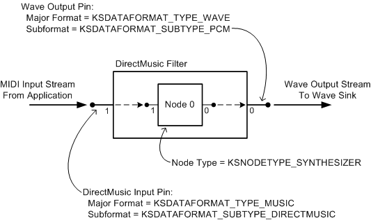

# A Wave Sink for Kernel-Mode Software Synthesizers

## 

As explained in [Synthesizers and Wave Sinks](synthesizers-and-wave-sinks.md), the DMus port driver implements the wave sink for a software synthesizer that operates in kernel mode. The miniport driver for the synthesizer exposes an [ISynthSinkDMus](https://msdn.microsoft.com/library/windows/hardware/ff537011) interface to the port driver. The port driver's wave sink uses this interface to read the wave data that is produced by the synthesizer.

To make use of the DMus port driver's wave sink, a DMus miniport driver should define a DirectMusic filter with two types of pin:

-   A DirectMusic input pin or MIDI input pin. This pin is a sink for a render stream containing MIDI messages.

-   A wave output pin. This pin is a source for a render stream containing PCM samples.

The following figure shows a DirectMusic filter containing a synthesizer node ([**KSNODETYPE\_SYNTHESIZER**](https://msdn.microsoft.com/library/windows/hardware/ff537203)). This filter meets the preceding requirements for a kernel-mode software synthesizer by providing a DirectMusic input pin and a wave output pin. (In addition, a DMus miniport driver that supports legacy MIDI synthesis can provide a MIDI input pin.)

On the left side of the figure, a MIDI stream enters the filter through the DirectMusic input pin. This pin has an [IMXF](https://msdn.microsoft.com/library/windows/hardware/ff536782) interface that it exposes to the port driver. The port driver obtains this interface by calling the [**IMiniportDMus::NewStream**](https://msdn.microsoft.com/library/windows/hardware/ff536701) method. The port driver feeds MIDI messages to the pin by calling the [**IMXF::PutMessage**](https://msdn.microsoft.com/library/windows/hardware/ff536791) method.

On the right side of the figure, a wave stream exits the filter through the wave output pin and flows to the port driver's wave sink. The port driver communicates with the pin through its **ISynthSinkDMus** interface. The port driver obtains this interface by first calling **IMiniportDMus::NewStream** to obtain a stream object with an **IMXF** interface, and then querying the object for its **ISynthSinkDMus** interface. The wave sink pulls wave data from the pin by calling the [**ISynthSinkDMus::Render**](https://msdn.microsoft.com/library/windows/hardware/ff537015) method.

Although a hardware synthesizer could, in principle, rely on the port driver's wave sink for rendering, the call to **ISynthSinkDMus::Render** adds enough latency to the MIDI stream to make it unattractive for many interactive applications. To reduce stream latency, hardware synthesizers are likely to have internal connections to mixing and wave-rendering hardware instead of using the port driver's wave sink. This type of synthesizer replaces the wave output pin on the right side of the preceding figure with a hardwired connection (represented as a [*bridge pin*](https://msdn.microsoft.com/library/windows/hardware/ff556272#wdkgloss_bridge_pin)) to a hardware mixer.

The **ISynthSinkDMus** interface provides methods to render wave data through a wave sink, convert from reference time to sample time and back, and synchronize to the master clock:

[**ISynthSinkDMus::RefTimeToSample**](https://msdn.microsoft.com/library/windows/hardware/ff537013)

[**ISynthSinkDMus::Render**](https://msdn.microsoft.com/library/windows/hardware/ff537015)

[**ISynthSinkDMus::SampleToRefTime**](https://msdn.microsoft.com/library/windows/hardware/ff537018)

[**ISynthSinkDMus::SyncToMaster**](https://msdn.microsoft.com/library/windows/hardware/ff537019)

**ISynthSinkDMus** inherits from the **IMXF** interface. For more information, see [ISynthSinkDMus](https://msdn.microsoft.com/library/windows/hardware/ff537011).

The DMus miniport driver in the preceding figure identifies its DirectMusic input pin and wave output pin as follows:

-   To identify its DirectMusic input pin, the miniport driver defines the pin's data range to have a major format of type KSDATAFORMAT\_TYPE\_MUSIC and a subformat of type KSDATAFORMAT\_SUBTYPE\_DIRECTMUSIC. This combination indicates that the pin accepts a time-stamped MIDI stream. The data range descriptor is a structure of type [**KSDATARANGE\_MUSIC**](https://msdn.microsoft.com/library/windows/hardware/ff537097). (For an example, see [DirectMusic Stream Data Range](directmusic-stream-data-range.md).) The miniport driver defines the pin's data flow direction to be KSPIN\_DATAFLOW\_IN. (The [**PCPIN\_DESCRIPTOR**](https://msdn.microsoft.com/library/windows/hardware/ff537721) structure's **KsPinDescriptor**.DataFlow member indicates the data flow direction.) When calling **IMiniportDMus::NewStream** to create the stream object for this pin, the port driver sets the *StreamType* parameter to DMUS\_STREAM\_MIDI\_RENDER.

-   To identify its wave output pin, the miniport driver defines the pin's data range to have a major format of type KSDATAFORMAT\_TYPE\_AUDIO and a subformat of type KSDATAFORMAT\_SUBTYPE\_PCM. This combination indicates that the pin emits a wave audio stream containing PCM samples. The data range descriptor is a structure of type [**KSDATARANGE\_AUDIO**](https://msdn.microsoft.com/library/windows/hardware/ff537096). (See the example in [PCM Stream Data Range](pcm-stream-data-range.md).) The miniport driver defines the pin's data flow direction to be KSPIN\_DATAFLOW\_OUT. When calling **IMiniportDMus::NewStream** to create the stream object for this pin, the port driver sets the *StreamType* parameter to DMUS\_STREAM\_WAVE\_SINK.

In addition, if the driver were to support a MIDI input pin for the synthesizer, its definition would be similar to that of the DirectMusic input pin, but the pin definition would specify a subformat of type KSDATAFORMAT\_SUBTYPE\_MIDI, and the pin would accept a raw MIDI stream rather than a time-stamped MIDI stream.

 

 

