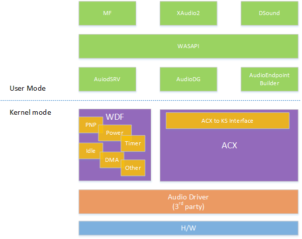

# ACX Audio Class Extensions overview

>[!IMPORTANT]
> Some information relates to a prerelease product which may be substantially modified before it's commercially released. Microsoft makes no warranties, express or implied, with respect to the information provided here.

This topic provides a high level summary of the ACX Audio Class Extensions.

### ACX framework is built on top of the Windows Driver Framework

To allow audio drivers to be more reliable and offer the best possible experience for PC users, Audio Class eXtension (ACX) is now available in early preview. ACX defines a new Windows Driver Framework (WDF) class extension for the audio domain. For more information about WDF see [Introduction to Framework Objects](/windows-hardware/drivers/wdf/introduction-to-framework-objects). Many WDF concepts such as WDF IO targets, are available in ACX. For more information about WDF IO targets, see [Introduction to I/O Targets](/windows-hardware/drivers/wdf/introduction-to-i-o-targets). 

ACX is built using the Kernel Mode Driver Framework (KMDF) and not the User Mode Driver Framework (UMDF) to avoid any latency associated with task-switching multiple times from User to Kernel mode while streaming. Portcls audio drivers, the current legacy model, are WDM, kernel mode based drivers.

The use of the ACX framework makes it easy to create working audio drivers ‘out of the box’. For example, ACX  supports default completion for most of its settings. This makes it easier for the driver to use the correct setting, yet still allows for customization.

The ACX framework exposes audio concepts as WDF objects that driver can interact with (stream, format, etc.). This allows for a consistent programming experience and enables a larger community of audio driver developers. 

### ACX goals

The audio class extensions (ACX) have the following goals.

- Simplify the effort and know-how required to develop simple stand-alone audio drivers. 
- Reduce the amount of code that a 3rd party needs to develop. Fewer lines of code decreases maintenance and makes debugging easier.
- Allows existing upper user-mode clients (services and apps) to run as is.
- Simplify the power-pnp management of the audio stack drivers.
- No impact the overall performance, i.e., no additional/noticeable latency. 
- Simplify the effort required to develop multi-stack audio drivers.
- Allow 3rd party driver to specify the locking mechanism to be used when streaming.
- Uses the Microsoft component deployment isolation solution that makes drivers/APOs modules self-contained and reusable.

### ACX architecture 

This diagram illustrates the acx architecture showing existing user mode apps and ACX objects in kernel mode and audio hardware at the bottom of the stack. In addition to the ACX objects, the driver developer has access to the WDF objects to take advantage of in their driver code, for example for power management.



### ACX coexistance with existing audio drivers

ACX is designed to co-exist with existing audio drivers, to allow for a flexible migration to new ACX drivers.

-	Binary compatibility of exiting, unchanged (WDM-based) audio miniport drivers is maintained by existing legacy Windows class drivers. 
-	Only WaveRT based streaming is currently supported by ACX.
-	Legacy PortCls/Ks and new ACX stacks run side-by-side. Using ACX does not force 3rd party to port their current audio drivers to the new model. As the model offers many advantages, 3rd parties may voluntarily opt to use it for their future audio development. 

## ACX common definitions 

*Circuit* - A driver component representing a partial or full audio path. The circuit represents an existing endpoint and its capabilities. 

*Stream* -  A driver component that’s created to represent an audio stream, created by a Circuit. The Stream is composed of a list of Elements created based on the parent Circuit’s Elements.  

*Stream Circuit* - the circuit in a multi-stack architecture (partial audio path) that directly interface with upper user-mode streaming service. 

*Core Circuit* - The circuit in a multi-stack architecture (partial audio path) that gives the identity of the audio endpoint device.

*Element* - A subcomponent of a Circuit or Stream, representing an audio capability of the underline hardware. This could be a Volume, or Mute, or Jack element, or a Module element on a DSP circuit, etc. 

*Endpoint Audio Path* - A single or group of Circuit objects connected together to represent a single audio endpoint. The Circuit objects must come from different device stacks belonging to the same or different drivers. 

## Summary of ACX Objects 

For a summary of the base ACX objects, see [Summary of ACX Objects](acx-summary-of-objects.md).

## Sample ACX driver

The sample audio driver, SYSVAD will be updated to make use of ACX. When this sample is available, it will be linked here.

## ACX Driver Logging

Software tracing for drivers is usually based on Event Tracing for Windows (ETW), a kernel-level facility that logs trace messages for both kernel-mode and user-mode processes. As ACX drivers are WDF drivers, all of the WDF logging and eventing capabilities are available for ACX driver developers.

### WPP 

Because ETW can be somewhat complicated to use, most driver developers use the Windows software trace preprocessor (WPP), which simplifies and enhances the process of instrumenting a driver for ETW tracing.

ACX uses WPP logs for tracing and debugging. For more information, see [Using WPP Software Tracing in KMDF Drivers](/windows-hardware/drivers/wdf/using-wpp-software-tracing-in-kmdf-drivers) and [Adding WPP Software Tracing to a Windows Driver](/windows-hardware/drivers/devtest/adding-wpp-software-tracing-to-a-windows-driver).

### In-Flight recorder (IFR)

In-Flight recorder (IFR) is supported and can be viewed via WDFKD, RCDRKD or with the ACXKD debugger extension when it is available. For general information working with IFR logs, see [Using Inflight Trace Recorder (IFR) in KMDF and UMDF 2 Drivers](/windows-hardware/drivers/devtest/using-wpp-recorder) and [Video: Accessing driver IFR logs without a debugger](/windows-hardware/drivers/wdf/video--accessing-driver-ifr-logs-without-a-debugger)

ACX logs key events using other ETW providers to simplify the visualization of these special events. 

### Adding logging to your driver

3rd party drivers are highly encouraged to use WPP and ETW events as well.  

This example code, shows checking a return value and logging an appropriate error.

```cpp

    //
    // The driver uses this DDI to delete the circuits from the current device. 
    //
    status = AcxDeviceRemoveCircuit(Device, devCtx->Speaker);
    if (!NT_SUCCESS(status)) { DrvLogError(g_AudioDspLog, FLAG_INIT, L"Failed to remove speaker circuit, continuing with ReleaseHardware, %!STATUS!", status); }
    status = AcxDeviceRemoveCircuit(Device, devCtx->MicArray);
    if (!NT_SUCCESS(status)) { DrvLogError(g_AudioDspLog, FLAG_INIT, L"Failed to remove micarray circuit, continuing with ReleaseHardware, %!STATUS!", status); }
    status = AcxDeviceRemoveCircuit(Device, devCtx->SpeakerHp);
    if (!NT_SUCCESS(status)) { DrvLogError(g_AudioDspLog, FLAG_INIT, L"Failed to remove speakerHp circuit, continuing with ReleaseHardware, %!STATUS!", status); }
    status = AcxDeviceRemoveCircuit(Device, devCtx->MicrophoneHp);
    if (!NT_SUCCESS(status)) { DrvLogError(g_AudioDspLog, FLAG_INIT, L"Failed to remove microphoneHp circuit, continuing with ReleaseHardware, %!STATUS!", status); }
    status = AcxDeviceRemoveCircuit(Device, devCtx->HDMI);
    if (!NT_SUCCESS(status)) { DrvLogError(g_AudioDspLog, FLAG_INIT, L"Failed to remove HDMI circuit, continuing with ReleaseHardware, %!STATUS!", status); }
```

The featured version of the Toaster driver sample code provides examples of WMI tracing as well as reusable tracing code. For more information about the Toaster sample, see [Toaster Sample Driver](/samples/microsoft/windows-driver-samples/toaster-sample-driver/).

### Recommendations for ACX Driver logging

To improve the reliability of your ACX driver consider the following behaviors for logging.

- Unexpected return values from stream buffer IO or other regular signal processing activity. 
- Unexpected power states or power state transitions.
- Errors related to calls made during updates or re-installation.
- Other behaviors that may lead to “no audio” could be considered for logging.

### Using the WMI Tracing debugger extensions

To view trace events in the debugger, use the WMI extension, Wmitrace.dll. It contains a library of functions designed to control and view WMI event tracing. For more information, see [WMI Tracing Extensions (Wmitrace.dll)](/windows-hardware/drivers/debugger/wmi-tracing-extensions--wmitrace-dll-).

 
## ACX driver debugging

ACX drivers are WDF drivers, so the debugging techniques described for WDF drivers, apply to ACX drivers. See the following topics for information on debugging WDF drivers. 

#### General information about the debugging tools

[Debugging Tools for Windows (WinDbg, KD, CDB, NTSD)](/windows-hardware/drivers/debugger/)

#### KMDF debugging 

- [Summary of Debugger Extensions in Wdfkd.dll](/windows-hardware/drivers/wdf/debugger-extensions-for-kmdf-drivers)

- This walk through uses the traditional Sysvad audio driver, but illustrates some techniques that may be help to ACX drivers. 
[Debug Drivers - Step by Step Lab (Sysvad Kernel Mode)](/windows-hardware/drivers/debugger/debug-universal-drivers--kernel-mode-)

#### Video Walkthroughs

- [Video: Debugging your driver with WDF source code](/windows-hardware/drivers/wdf/video--debugging-your-driver-with-wdf-source-code)
- [Video Series: Debugging Kernel-Mode Driver Framework Drivers](/windows-hardware/drivers/wdf/debugging-kernel-mode-driver-framework-drivers)

#### ACX kernel debugger extension library (AcxKd.dll)

To aid debugging, ACX has a companion kernel debugger extension library (AcxKd.dll). This library aids developers in tracking down issue on single and multi-stack audio paths. The kd extension allows developer to look inside ACX structures. 

>[!NOTE]
> This debugger extension is under development and information will be provided here when it is available. 

## Driver Verifier

The use of driver verifier is encouraged for all Windows drivers, including ACX drivers. Use driver verifier to surface latent errors, decrease the power consumption and increase the reliability of your driver. For more information, see [Driver Verifier](/windows-hardware/drivers/devtest/driver-verifier).


## ACX Multi-stack driver standardized cross communications

It is common for the audio path to go through multiple hardware components handled by different driver stacks to create a complete audio experience.  It is typical for a system to have the DSP, CODEC and AMP functionality implemented by different audio technology vendors. 

In a multi-stack architecture without a well-defined standard, each vendor is forced to define its own proprietary interface and communications protocol. It is a goal of ACX to facilitate the development of multi-stack audio drivers by taking ownership of the synchronization between these stacks and providing a simple re-usable pattern for drivers communicate with each other. 

For more information, see [ACX multi stack cross driver communications](acx-audio-multi-stack.md).

## ACX reference documentation

The following acx headers have preliminary reference documentation available.

Just like WDF drivers, DEVICE and DRIVER are used to initialize the base driver.

- [acxdevice.h](/windows-hardware/drivers/ddi/acxdevice/)
- [acxdriver.h](/windows-hardware/drivers/ddi/acxdriver/)

Pins, streams and circuits are used to route audio signals.

- [acxpin.h](/windows-hardware/drivers/ddi/acxpin/)
- [acxstreams.h](/windows-hardware/drivers/ddi/acxstreams/)
- [acxcircuit.h](/windows-hardware/drivers/ddi/acxcircuit/)
- [acxtargets.h](/windows-hardware/drivers/ddi/acxtargets/)

The data formats are controlled using this header.

- [acxdataformat.h](/windows-hardware/drivers/ddi/acxdataformat/)

The acxelements header provides access to specific audio system elements, such as volume, mute, peakmeter and the keyword spotter.

- [acxelements.h](/windows-hardware/drivers/ddi/acxelements/)

Events and requests allow for notification.

- [acxevents.h](/windows-hardware/drivers/ddi/acxevents/)
- [acxrequest.h](/windows-hardware/drivers/ddi/acxrequest/)

An object bag, which can be used to store and retrieve configuration information and is defined in acxmisc.

- [acxmisc.h](/windows-hardware/drivers/ddi/acxmisc/)
 
The ACX manager is used for supporting composite audio endpoints. 

- [acxmanager.h](/windows-hardware/drivers/ddi/acxmanager/)


## See also

[Summary of ACX Objects](acx-summary-of-objects.md)

[ACX multi stack cross driver communications](acx-audio-multi-stack.md)
