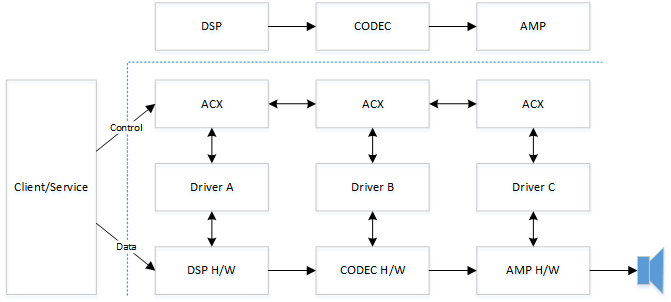
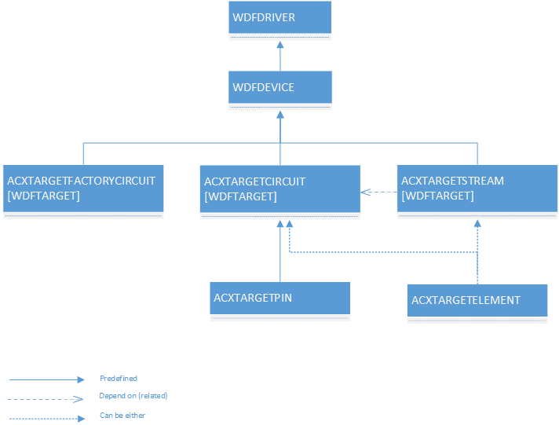
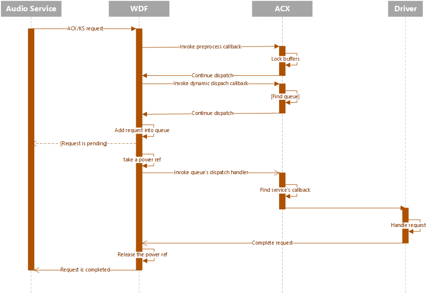
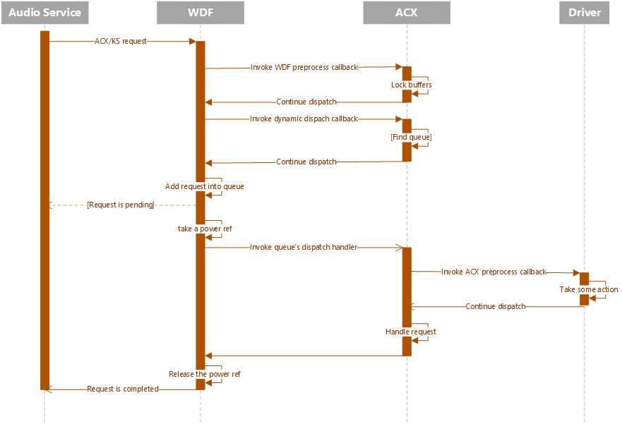

# ACX multi stack cross driver communications

>[!IMPORTANT]
> Some information relates to a prerelease product which may be substantially modified before it's commercially released. Microsoft makes no warranties, express or implied, with respect to the information provided here.

This topic provides a summary of the Audio Class eXtensions (ACX) multi stack cross driver communications.

For general information about the ACX, see [ACX Audio Class Extensions Overview](acx-audio-class-extensions-overview.md) and [Summary of ACX Objects](acx-summary-of-objects.md).


## Single-Stack Audio Drivers

Legacy PortCls and KS audio class drivers only support “single stack” audio drivers. The legacy audio framework communicates and interface with only one miniport driver. It is up to the miniport driver to manage the communication and synchronization with other driver stacks when necessary.  

ACX fully supports single-stack audio drivers. Audio developers can replace their current Portcls and KS miniport driver with an ACX-based driver while keeping the same behavior in relation with other stacks. Although if the audio subsystem uses multi-audio stacks, a better approach would be use to use the multi-stack support in ACX, and let ACX synchronize all these stacks together, as described in the next section of this topic. 


## Multi-Stack Audio Drivers - Componentization

It is very common for the audio path to go through multiple hardware components handled by different driver stacks to create a complete audio experience.  It is typical for a system to have the DSP, CODEC and AMP functionality implemented by different audio technology vendors as shown in the following diagram. 


In a multi-stack architecture without a well-defined standard, each vendor is forced to define its own proprietary interface and communications protocol. It is a goal of ACX to facilitate the development of multi-stack audio drivers by taking ownership of the synchronization between these stacks and providing a simple re-usable pattern for drivers communicate with each other. 

Using ACX, the example system DSP, CODEC and AMP hardware design can be supported with the following software architecture.



Note that any type of component type instead of the shown DSP, CODEC and AMP, could be used, as ACX does not depend on any specific component type, or specific arrangements of components.
  
Third party drivers communicate with each other via ACX with a well-defined protocol.  One advantage of this approach is that a single stack could be replaced with another one from a different vendor without requiring changes to the adjacent software stacks. One of the primary goals of the audio class extensions (ACX) framework is to simplify the effort required to develop multi-stack audio drivers assembled from components from different vendors.

## ACX Targets

ACX uses [WdfIoTarget](/windows-hardware/drivers/ddi/wdfiotarget/) to facilitate communications between ACX objects, circuits, pins, streams, elements and circuit factories. WdfIoTarget is an existing WDF abstraction to facilitate the communication between two different stacks. 

Drivers use [AcxTargetCircuit](/windows-hardware/drivers/ddi/acxtargets/) to communicate with a remote circuit exposed by a different stack. AcxTargetCircuit is implemented using a WdfIoTarget.

Drivers use [AcxTargetPin](/windows-hardware/drivers/ddi/acxpin/) to communicate with a remote circuit’s pin exposed by a different stack. AcxTargetPin is implemented using a WdfIoTarget to send messages to the remote pin entity.

Drivers use [AcxTargetStream](/windows-hardware/drivers/ddi/acxstream/) to communicate with a remote circuit’s stream exposed by a different stack. AcxTargetStream is implemented using a WdfIoTarget to create a remote stream and change the state of the remote stream.

Drivers use [AcxTargetElement](/windows-hardware/drivers/ddi/acxtargets/) to communicate with a remote circuit’s element exposed by a different stack. AcxTargetElement is implemented using a WdfIoTarget to send messages to the remote element entity.

Drivers use [AcxTargetFactoryCircuit](/windows-hardware/drivers/ddi/acxtargets/) to communicate with a remote circuit factory instance. AcxTargetFactoryCircuit is implemented using a WdfTarget to send messages to the remote circuit factory.

To interact with the remote circuit, each of the ACX types listed above supports:

- properties
- methods 
- events

All these types are built on top of the [WdfIoTarget](/windows-hardware/drivers/ddi/wdfiotarget/) object types.

This diagram shows the ACX target architecture and the inheritance from the WDF Driver and Device objects.  




## ACX Driver Synchronization and Serialization

The term synchronization is a general term, and it is used to reference the operations needed to share resources (memory, I/O, etc.) between multiple concurrent clients. 

The term serialization is used to reference one type of synchronization for one type of object (I/O requests, callbacks, etc.).

ACX Drivers are WDF Drivers, which means that the synchronization of ACX Drivers is based on the synchronization capabilities of WDF:

- The use of reference counts and the hierarchical object model.
- Driver-configurable flow control for I/O queues.
- Object presentation lock for device objects and I/O queues.
- Automatic serialization of Plug and Play and power callbacks.

For an in-depth description of Synchronization and Serialization, see [Using Automatic Synchronization](/windows-hardware/drivers/wdf/using-automatic-synchronization). For a more complete explanation, see the [Developing Drivers with Windows Driver Foundation](/windows-hardware/drivers/wdf/developing-drivers-with-wdf) Microsoft Press Book.  

WDF supports the following synchronization scopes:

-	No scope (default in KMDF).  
-	Device scope, WDF acquires the device object presentation lock to serialize operations.

The default ACX queue is a passive, serial queue with no locking. The driver must complete the I/O operation before the next one is delivered.

ACX doesn’t support the queue scope option. With this option the driver serializes I/O on a specific queue. Different queues may have different synchronization scopes. 

ACX doesn’t support device scope serialization. By default, ACX serializes requests using a serial I/O queue with no locking. Every circuit and stream object have its own dedicated queue. For more info about streaming I/Os please see the ACX Streaming topic.

If a driver holds a lock, it should never call (explicitly or implicitly) code outside its control until the lock is released.

For historical reference, the original PortCls uses a synchronization scope like the WDF device scope synchronization, where all I/O for any audio sub-devices created on this device go through the same serialization lock. This type of serialization was, and still is, the cause of various glitches. In later versions of Windows 10 (Version 1511 - TH2) PortCls was updated to use a different lock for stream position I/O requests.

##	IRP/Request Dispatching

An ACX client specifies an action via a driver request (IRP). For general information about IRPs, see, [I/O request packets](/windows-hardware/drivers/gettingstarted/i-o-request-packets) and [Packet-Driven I/O with Reusable IRPs](/windows-hardware/drivers/kernel/packet-driven-i-o-with-reusable-irps). 

The client sends this request to a circuit/pin/element/stream by using the circuit or stream handle. The request ID is a triplet: 

- set (guid), 
- id/index (ulong) 
- optional pin-id/node-id (ulong) value.  

At creation time the driver can optionally associates properties/methods/events with one of more of following objects: 

- pin
- circuit
- stream
- element

Each property/method/event is identified by an ID and a callback handler. By default, ACX defines all the properties/methods/events required by KS-clients (user-mode layers), thus drivers do not need to redefine them. Drivers only need to define their custom properties/methods/events. 

When ACX receives an ACX/KS style IoCtrl request, it validates the request and locks the caller’s buffers in memory. This validation and buffer lock down is done in a WDM preprocess callback that ACX registered at initialization time. During this phase, the ACX adds its own completion callback to the WDM IRP before forwarding it back to WDF for normal dispatching. The completion callback gives ACX an opportunity to add/inject any compatibility workarounds as needed.

Next WDF invokes the dynamic dispatch IRP callback, in this callback ACX/driver (optionally) associates a WDF queue with the request. In this callback ACX locates the target ACX object: circuit, pin, circuit-element or stream using the handle on which this request was sent, and the optional pin-id/node-id/circuit-element within the request. 

In an audio composite device it is possible that the target object (circuit-only) may be located on a different stack than the one on which the request is originally sent on. In addition, a request may need to act on multiple stacks, an example of this, is a stream change state. 

After the target has been identified, ACX checks if the target circuit/stream-object specifies an override for the default processing queue, if not, ACX uses the default queue associated with current handle. The ACX/driver then instructs WDF to insert the request into the either the specified or the default queue.

Next WDF invokes the in-caller process callback if present. ACX doesn’t need/use the in-caller process callback because it already locked the buffers in memory in the preprocess callback. Thus, ACX informs WDF to not invoke the in-process callback after specifying the target queue for the request.

### Secondary queue usage

The default ACX queue is a power-managed, serial, no-locking queue. The driver should move any request taking an undetermined amount of time into a secondary queue. The driver managed queue could be a manual-passive queue, where the driver can hold on to these requests until it is ready to complete them later. 

### Power reference requests

ACX automatically power up the device before dispatching a request to the driver. This is done implicitely by using a WDF power managed queues. This creates a behavior similar to portcls. That is, a power reference is taken, before dispatching the request. 

### Invoking the queue’s dispatch handler

Next WDF takes a power reference and invokes the queue’s dispatch handler. The default queue which is associated with the ACX handler checks for any preprocess overrides, and if present, ACX invokes the registered driver’s preprocess callback. ACX allows the driver to specify overrides based on the type of request (property, event, and method) and (optionally) request IDs.  

If a preprocess callback was specified, after ACX invokes the callback, the request is owned by the driver. The driver may complete the request or forward it back to ACX for normal dispatching.

If a preprocess callback was not specified, or if the driver gives back the request to ACX, ACX retrieves the target ACX object and locates the declared property/event/method’s callback. It then invokes the callback passing the WDF request and the target ACX Object (circuit/stream/circuit-element).

Next ACX (or for custom properties, the driver) performs the requested action and completes the request, or if the request takes an undetermined amount of time, the driver can move the request to a secondary queue. The driver is responsible for serializing and completing any active pending requests. 

This diagram illustrates the typical request dispatch workflow.


 
This diagram illustrates the dispatch workflow when driver has an ACX preprocess callback defined, although in the end the request is handled by the ACX framework.
 



###  ACX Targets Communications Example - Circuit

This example code shows the use of AcxTargetCircuit and AcxTargetCircuitGetWdfIoTarget to communicate with a remote circuit exposed by a different stack. For more information about ACX Circuits, see [acxcircuit.h](/windows-hardware/drivers/ddi/acxcircuit/).

This fairly complex aggregator locates circuits and then creates an ioTarget using AcxTargetCircuitGetWdfIoTarget. It then sets custom WDF send options and asynchronously sends the request. Lastly, it checks the status of the send to confirm the request was sent.

```cpp
NTSTATUS
Aggregator_SendModuleCommand(
    _In_ PAGGREGATOR_RENDER_CIRCUIT_CONTEXT CircuitCtx,
    _In_ ACX_REQUEST_PARAMETERS             Params,
    _Out_ ULONG_PTR *                       OutSize
    )
{
    NTSTATUS                    status = STATUS_NOT_SUPPORTED;
    PKSAUDIOMODULE_PROPERTY     moduleProperty = nullptr;
    ULONG                       aggregationDeviceIndex = 0;
    PLIST_ENTRY                 ple;

    *OutSize = 0;

    moduleProperty = CONTAINING_RECORD(Params.Parameters.Property.Control, KSAUDIOMODULE_PROPERTY, ClassId);;
    aggregationDeviceIndex = AUDIOMODULE_GET_AGGDEVICEID(moduleProperty->InstanceId);

    ple = CircuitCtx->AggregatorCircuit->AggregatorEndpoint->AudioPaths[aggregationDeviceIndex]->TargetCircuitList.Flink;
    while (ple != &CircuitCtx->AggregatorCircuit->AggregatorEndpoint->AudioPaths[aggregationDeviceIndex]->TargetCircuitList)
    {
        PAUDIO_CIRCUIT circuit = (PAUDIO_CIRCUIT)CONTAINING_RECORD(ple, AUDIO_CIRCUIT, ListEntry);

        if (circuit->Modules)
        {
            for(ULONG i = 0; i < circuit->Modules->Count; i++)
            {
                PACX_AUDIOMODULE_DESCRIPTOR descriptor = ((PACX_AUDIOMODULE_DESCRIPTOR)(circuit->Modules + 1) + i);

                // we've identified which aggregation device this call is targeting, 
                // now locate which circuit implements this module. Within an aggregated device,
                // the module class id + instance id must uniquely identify a module. There should
                // never be duplicates.
                if (IsEqualGUIDAligned(descriptor->ClassId, moduleProperty->ClassId) &&
                    descriptor->InstanceId == moduleProperty->InstanceId)
                {
                    WDFREQUEST                  request = NULL;
                    WDF_REQUEST_SEND_OPTIONS    sendOptions;
                    WDF_OBJECT_ATTRIBUTES       attributes;
                    WDFIOTARGET                 ioTarget;

                    // We've now identified which aggregated device this call is targeting.
                    // The cached module information contains the ID adjusted with the aggregation device
                    // index. remove the aggregation device index before forwarding the call to the aggregated circuit.
                    moduleProperty->InstanceId = AUDIOMODULE_GET_INSTANCEID(moduleProperty->InstanceId);

                    ioTarget = AcxTargetCircuitGetWdfIoTarget(circuit->AcxTargetCircuit);

                    WDF_OBJECT_ATTRIBUTES_INIT(&attributes);
                    attributes.ParentObject = CircuitCtx->AggregatorCircuit->Circuit;
                    status = WdfRequestCreate(&attributes, ioTarget, &request);    
                    if (!NT_SUCCESS(status)) 
                    {
                        goto exit;
                    }

                    status = AcxTargetCircuitFormatRequestForProperty(circuit->AcxTargetCircuit, request, &Params);
                    if (!NT_SUCCESS(status))
                    {
                        goto exit;
                    }

                    WDF_REQUEST_SEND_OPTIONS_INIT(&sendOptions, WDF_REQUEST_SEND_OPTION_SYNCHRONOUS);
                    WDF_REQUEST_SEND_OPTIONS_SET_TIMEOUT(&sendOptions, WDF_REL_TIMEOUT_IN_SEC(REQUEST_TIMEOUT_SECONDS));

                    // Whether WdfRequestSend succeeds or fails, we return the status & information, so
                    // there's no need to inspect the result.
                    WdfRequestSend(request, ioTarget, &sendOptions);
                    status = WdfRequestGetStatus(request);
                    *OutSize = WdfRequestGetInformation(request);

                    WdfObjectDelete(request);
                    goto exit;
                }
            }
        }

        ple = ple->Flink;
    }

    status = STATUS_SUCCESS;

exit:
    return status;
}
```

###  ACX Targets Communications Example - Pin

This example code shows the use of AcxTargetPin to communicate with a remote circuit’s pin exposed by a different stack. For more information about ACX Pin, see [acxpin.h](/windows-hardware/drivers/ddi/acxpin/).

It selects the last Volume and Mute elements that are both present in the same circuit in the Endpoint Path.

```cpp
NTSTATUS FindDownstreamVolumeMute(
    _In_    ACXCIRCUIT          Circuit,
    _In_    ACXTARGETCIRCUIT    TargetCircuit
)
{
    NTSTATUS status;
    PDSP_CIRCUIT_CONTEXT circuitCtx;
    ACX_REQUEST_PARAMETERS  params;
    WDF_REQUEST_SEND_OPTIONS sendOptions;
    WDF_OBJECT_ATTRIBUTES attributes;
    WDF_REQUEST_REUSE_PARAMS reuseParams;

    circuitCtx = GetDspCircuitContext(Circuit);

    //
    // Note on behavior: This search algorithm will select the last Volume and Mute elements that are both
    // present in the same circuit in the Endpoint Path.
    // This logic could be updated to select the last Volume and Mute elements, or the first or last
    // Volume or the first or last Mute element.
    //

    //
    // First look through target's pins to determine if there's another circuit downstream.
    // If there is, we'll look at that circuit for volume/mute.
    //
    for (ULONG pinIndex = 0; pinIndex < AcxTargetCircuitGetPinsCount(TargetCircuit); ++pinIndex)
    {
        ACXTARGETPIN targetPin = AcxTargetCircuitGetTargetPin(TargetCircuit, pinIndex);
        ULONG targetPinFlow = 0;
        ACX_REQUEST_PARAMETERS_INIT_PROPERTY(&params,
                                             KSPROPSETID_Pin,
                                             KSPROPERTY_PIN_DATAFLOW,
                                             AcxPropertyVerbGet,
                                             AcxItemTypePin,
                                             AcxTargetPinGetId(targetPin),
                                             nullptr, 0,
                                             &targetPinFlow,
                                             sizeof(targetPinFlow));

        RETURN_NTSTATUS_IF_FAILED(SendProperty(targetPin, &params, nullptr));

        //
        // Searching for the downstream pins. For Render, these are the dataflow out pins
        //
        if (circuitCtx->IsRenderCircuit && targetPinFlow != KSPIN_DATAFLOW_OUT)
        {
            continue;
        }
        else if (!circuitCtx->IsRenderCircuit && targetPinFlow != KSPIN_DATAFLOW_IN)
        {
            continue;
        }

        // Get the target pin's physical connection. We'll do this twice: first to get size and allocate, second to get the connection
        PKSPIN_PHYSICALCONNECTION pinConnection = nullptr;
        auto connection_free = scope_exit([&pinConnection]()
        {
            if (pinConnection)
            {
                ExFreePool(pinConnection);
                pinConnection = nullptr;
            }
        });

        ULONG pinConnectionSize = 0;
        ULONG_PTR info = 0;
        for (ULONG i = 0; i < 2; ++i)
        {
            ACX_REQUEST_PARAMETERS_INIT_PROPERTY(&params,
                                                 KSPROPSETID_Pin,
                                                 KSPROPERTY_PIN_PHYSICALCONNECTION,
                                                 AcxPropertyVerbGet,
                                                 AcxItemTypePin,
                                                 AcxTargetPinGetId(targetPin),
                                                 nullptr, 0,
                                                 pinConnection,
                                                 pinConnectionSize);

            status = SendProperty(targetPin, &params, &info);

            if (status == STATUS_BUFFER_OVERFLOW)
            {
                // Pin connection already allocated, so how did this fail?
                RETURN_NTSTATUS_IF_TRUE(pinConnection != nullptr, status);

                pinConnectionSize = (ULONG)info;
                pinConnection = (PKSPIN_PHYSICALCONNECTION)ExAllocatePool2(POOL_FLAG_NON_PAGED, pinConnectionSize, DRIVER_TAG);
                // RETURN_NTSTATUS_IF_NULL_ALLOC causes compile errors
                RETURN_NTSTATUS_IF_TRUE(pinConnection == nullptr, STATUS_INSUFFICIENT_RESOURCES);
            }
            else if (!NT_SUCCESS(status))
            {
                // There are no more connected circuits. Continue with processing this circuit.
                break;
            }
        }

        if (!NT_SUCCESS(status))
        {
            // There are no more connected circuits. Continue handling this circuit.
            break;
        }

        ACXTARGETCIRCUIT nextTargetCircuit;
        RETURN_NTSTATUS_IF_FAILED(CreateTargetCircuit(Circuit, pinConnection, pinConnectionSize, &nextTargetCircuit));
        auto circuit_free = scope_exit([&nextTargetCircuit]()
        {
            if (nextTargetCircuit)
            {
                WdfObjectDelete(nextTargetCircuit);
                nextTargetCircuit = nullptr;
            }
        });

        RETURN_NTSTATUS_IF_FAILED_UNLESS_ALLOWED(FindDownstreamVolumeMute(Circuit, nextTargetCircuit), STATUS_NOT_FOUND);
        if (circuitCtx->TargetVolumeMuteCircuit == nextTargetCircuit)
        {
            // The nextTargetCircuit is the owner of the volume/mute target elements.
            // We will delete it when the pin is disconnected.
            circuit_free.release();

            // We found volume/mute. Return.
            return STATUS_SUCCESS;
        }

        // There's only one downstream pin on the current targetcircuit, and we just processed it.
        break;
    }

    //
    // Search the target circuit for a volume or mute element.
    // This sample code doesn't support downstream audioengine elements.
    // 
    for (ULONG elementIndex = 0; elementIndex < AcxTargetCircuitGetElementsCount(TargetCircuit); ++elementIndex)
    {
        ACXTARGETELEMENT targetElement = AcxTargetCircuitGetTargetElement(TargetCircuit, elementIndex);
        GUID elementType = AcxTargetElementGetType(targetElement);

        if (IsEqualGUID(elementType, KSNODETYPE_VOLUME) &&
            circuitCtx->TargetVolumeHandler == nullptr)
        {
            // Found Volume
            circuitCtx->TargetVolumeHandler = targetElement;
        }
        if (IsEqualGUID(elementType, KSNODETYPE_MUTE) &&
            circuitCtx->TargetMuteHandler == nullptr)
        {
            // Found Mute
            circuitCtx->TargetMuteHandler = targetElement;
        }
    }

    if (circuitCtx->TargetVolumeHandler && circuitCtx->TargetMuteHandler)
    {
        circuitCtx->TargetVolumeMuteCircuit = TargetCircuit;
        return STATUS_SUCCESS;
    }

    //
    // If we only found one of volume or mute, keep searching for both
    //
    if (circuitCtx->TargetVolumeHandler || circuitCtx->TargetMuteHandler)
    {
        circuitCtx->TargetMuteHandler = circuitCtx->TargetVolumeHandler = nullptr;
    }

    return STATUS_NOT_FOUND;
}
```

###  ACX Targets Communications Example - Stream

This example code shows the use of AcxTargetStream to communicate with a remote circuit’s stream.  For more information about ACX Streams, see [acxstreams.h](/windows-hardware/drivers/ddi/acxstreams/).

```cpp

    NTSTATUS                        status;
    PRENDER_DEVICE_CONTEXT          devCtx;
    WDF_OBJECT_ATTRIBUTES           attributes;
    ACXSTREAM                       stream;
    STREAM_CONTEXT *                streamCtx;
    ACXELEMENT                      elements[2] = {0};
    ACX_ELEMENT_CONFIG              elementCfg;
    ELEMENT_CONTEXT *               elementCtx;
    ACX_STREAM_CALLBACKS            streamCallbacks;
    ACX_RT_STREAM_CALLBACKS         rtCallbacks;
    CRenderStreamEngine *           streamEngine = NULL;

    PAGED_CODE();
    UNREFERENCED_PARAMETER(Pin);
    UNREFERENCED_PARAMETER(SignalProcessingMode);
    UNREFERENCED_PARAMETER(VarArguments);

    // This unit-test added support for RAW and DEFAULT.
    ASSERT(IsEqualGUID(*SignalProcessingMode, AUDIO_SIGNALPROCESSINGMODE_RAW) ||
           IsEqualGUID(*SignalProcessingMode, AUDIO_SIGNALPROCESSINGMODE_DEFAULT));
    
    devCtx = GetRenderDeviceContext(Device);
    ASSERT(devCtx != NULL);

    //
    // Init streaming callbacks.
    //
    ACX_STREAM_CALLBACKS_INIT(&streamCallbacks);
    streamCallbacks.EvtAcxStreamPrepareHardware         = EvtStreamPrepareHardware;
    streamCallbacks.EvtAcxStreamReleaseHardware         = EvtStreamReleaseHardware;
    streamCallbacks.EvtAcxStreamRun                     = EvtStreamRun;
    streamCallbacks.EvtAcxStreamPause                   = EvtStreamPause;
    streamCallbacks.EvtAcxStreamAssignDrmContentId      = EvtStreamAssignDrmContentId;

    status = AcxStreamInitAssignAcxStreamCallbacks(StreamInit, &streamCallbacks);
    if (!NT_SUCCESS(status))
    {
        ASSERT(FALSE);
        goto exit;
    }
    
    //
    // Init RT streaming callbacks.
    //
    ACX_RT_STREAM_CALLBACKS_INIT(&rtCallbacks);
    rtCallbacks.EvtAcxStreamGetHwLatency                = EvtStreamGetHwLatency;
    rtCallbacks.EvtAcxStreamAllocateRtPackets           = EvtStreamAllocateRtPackets;
    rtCallbacks.EvtAcxStreamFreeRtPackets               = EvtStreamFreeRtPackets;
    rtCallbacks.EvtAcxStreamSetRenderPacket             = R_EvtStreamSetRenderPacket;
    rtCallbacks.EvtAcxStreamGetCurrentPacket            = EvtStreamGetCurrentPacket;
    rtCallbacks.EvtAcxStreamGetPresentationPosition     = EvtStreamGetPresentationPosition;    
    
    status = AcxStreamInitAssignAcxRtStreamCallbacks(StreamInit, &rtCallbacks);
    if (!NT_SUCCESS(status))
    {
        ASSERT(FALSE);
        goto exit;
    }

    //
    // Create the stream.
    //
    WDF_OBJECT_ATTRIBUTES_INIT_CONTEXT_TYPE(&attributes, STREAM_CONTEXT);
    attributes.EvtCleanupCallback = EvtStreamCleanup;
    attributes.EvtDestroyCallback = EvtStreamDestroy;
    status = AcxRtStreamCreate(Device, Circuit, &attributes, &StreamInit, &stream);
    if (!NT_SUCCESS(status)) 
    {
        ASSERT(FALSE);
        goto exit;
    }

    // START-TESTING: inverted create-stream sequence.
    {
        ACXSTREAMBRIDGE             bridge          = NULL;
        ACXPIN                      bridgePin       = NULL;
        ACXTARGETSTREAM             targetStream    = NULL;
        ACX_STREAM_BRIDGE_CONFIG    bridgeCfg;
    
        ACX_STREAM_BRIDGE_CONFIG_INIT(&bridgeCfg);
        bridgeCfg.InModesCount = 0;     // no in-modes. this stream-bridge is manually managed. 
        bridgeCfg.InModes      = NULL; 
        bridgeCfg.OutMode      = NULL;  // no mode, i.e., default (1st) and raw (2nd).
        bridgeCfg.Flags |= AcxStreamBridgeInvertChangeStateSequence;

        WDF_OBJECT_ATTRIBUTES_INIT(&attributes);
        attributes.ParentObject = WdfGetDriver(); // bridge is deleted by driver obj in case of error.

        status = AcxStreamBridgeCreate(Circuit, &attributes, &bridgeCfg, &bridge);
        if (!NT_SUCCESS(status))
        {
            ASSERT(FALSE);
            goto exit;
        }
        
        ...
        
        status = AcxStreamBridgeAddStream(bridge, stream);
        if (!NT_SUCCESS(status))
        {
            ASSERT(FALSE);
            goto exit;
        }

        // Get the Target Stream
        targetStream = AcxStreamBridgeGetTargetStream(bridge, stream);
        if (targetStream == NULL)
        {
            ASSERT(FALSE);
            goto exit;
        }
```

###  ACX Targets Communications Example - Element

This example code shows the use of AcxTargetElement to communicate with a circuit’s element. For more information about the ACX Targets, see [acxtargets.h](/windows-hardware/drivers/ddi/acxtargets/).

```cpp
    _In_    ACXCIRCUIT          Circuit,
    _In_    ACXTARGETCIRCUIT    TargetCircuit

...

    //
    // Search the target circuit for a volume or mute element.
    // This sample code doesn't support downstream audioengine elements.
    // 
    for (ULONG elementIndex = 0; elementIndex < AcxTargetCircuitGetElementsCount(TargetCircuit); ++elementIndex)
    {
        ACXTARGETELEMENT targetElement = AcxTargetCircuitGetTargetElement(TargetCircuit, elementIndex);
        GUID elementType = AcxTargetElementGetType(targetElement);

        if (IsEqualGUID(elementType, KSNODETYPE_VOLUME) &&
            circuitCtx->TargetVolumeHandler == nullptr)
        {
            // Found Volume
            circuitCtx->TargetVolumeHandler = targetElement;
        }
        if (IsEqualGUID(elementType, KSNODETYPE_MUTE) &&
            circuitCtx->TargetMuteHandler == nullptr)
        {
            // Found Mute
            circuitCtx->TargetMuteHandler = targetElement;
        }
    }
```

## See also

[ACX Audio Class Extensions Overview](acx-audio-class-extensions-overview.md) 

[Summary of ACX Objects](acx-summary-of-objects.md)

