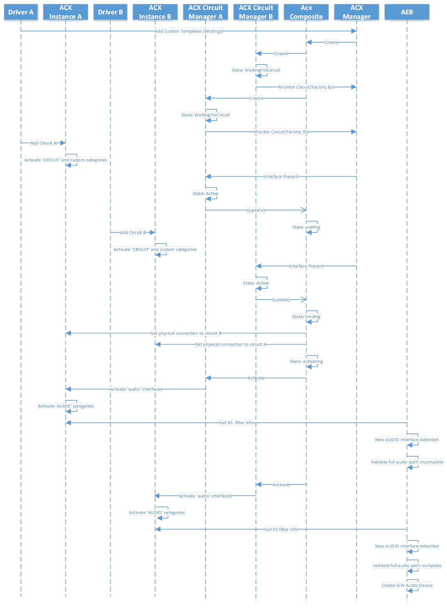

# ACX multicircuit composition

This topic discusses ACX multi circuit composition. For a general overview of ACX and list of ACX terms, see [ACX audio class extensions overview](acx-audio-class-extensions-overview.md).

As described in [Summary of ACX objects](acx-summary-of-objects.md), an AcxCircuit represents a partial or full audio path to a user perceived audio device (speakers, mic, etc.). An AcxCircuit has at least one input pin and one output pin (ACXPIN), and it may aggregate one or more AcxElements-like objects.

## ACX circuit identification

Every ACX circuit has a circuit identifier. ACX defines the following:

- *Name (str)*, uniquely identifies this circuit audio device type. It is used to locate INF’s setting, and it is part of the symbolic link used to access this circuit from a remote device. Example: “Render0”, “Render1” or “Capture0”.

- *Symbolic link*. A symbolic link is associated with all the exposed circuits. Clients use this symbolic link to open a communication path with the device/circuit.

- *Circuit’s component ID (guid)*. Uniquely identifies the circuit instance (vendor specific). It cannot be used in the AcxCircuitTemplate bindings if the Circuit URI was specified.

- *Circuit’s component URI (str)*. Uniquely identifies the circuit instance (vendor specific). It cannot be used in the AcxCircuitTemplate bindings if the Circuit ID was specified.

- *Circuit Factory’s component ID (guid)*. Uniquely identifies the circuit factory instance (vendor specific). It cannot be used in the AcxCircuitTemplate bindings if the Circuit Factory URI was specified.

- *Circuit Factory’s component URI (str)*. Uniquely identifies the circuit factory instance (vendor specific). It cannot be used in the AcxCircuitTemplate bindings if the Circuit Factory ID was specified.

## ACX circuit composition

ACX binds circuits together until they form a complete audio path. ACX uses audio bindings to connect audio circuits together. At the same time, each ACX circuit is converted into a KS filter, these KS filters are then detected by the Audio Endpoint Builder (AEB) which runs as user-mode service. AEB scans the detected KS filter graph and creates the software audio endpoint representing the underline audio infrastructure when it detects a complete audio path.  

The following diagram shows the ACX objects used by ACX to detect, build, and monitor the circuits making up the composite audio endpoint.

>[!IMPORTANT]
> Note that only the types shown in blue are public: ACXCIRCUITTEMPLATE, ACXCOMPOSITETEMPLATE (not shown), ACXMANAGER, ACXCIRCUITFACTORY and ACXCIRCUIT. All types shown in violet are internal, and they are listed here only for illustration purposes. The internal types are not guaranteed to stay the same, or be available in different releases of ACX, and must not be called or used directly.

ACX manager parses the circuit templates at driver init time when the ACX drivers register them with the ACX manager. ACX drivers register composite templates/binding using ACXCIRCUTTEMPLATES (#1).

When ACX manager receives a circuit template it checks if this is an instance-template or a generic class-template.

For instance-templates, ACX creates an ACXCOMPOSITEMANAGER (#4), for generic class-templates, ACX creates a ACXCOMPOSITEFACTORY (#2), which is responsible for creating ACXCOMPOSITEMANAGER items (#3) when it detects the ‘core’ circuit of the composite. Core circuits are the circuits that give the identity to a composite audio endpoint.

The ACXCOMPOSITEMANAGER in turns creates the ACXCOMPOSITE (#5) to represent the underline composite audio endpoint. The composite manager is responsible for monitoring any optional circuit segment that may come up after the composite has been created/initialized.

The ACXCOMPOSITE in turn creates an ACXCIRCUITMANAGER (#6) for each circuit that is part of the composite. The ACXCIRCUITMANAGER is responsible for creating, monitoring, and controlling a single circuit (#7).

It may be possible for a circuit to be tagged ‘on-demand’, in such case, the ACXCIRCUITMANAGER finds its circuit factory and request a new circuit for the composite (#8). The ACXCIRCUITFACTORY creates an ACXCIRCUIT as request (#9).

When all the ACXCIRCUITs are detected and active, the ACXCOMPOSITE becomes active as well and instructs the ACXCIRCUITMANAGERS to turn on the ‘audio’ interfaces for their circuits.  

The following sequence diagram shows how two ACX circuits (Circuit A and B) are bound together to create a full audio path, which is represented by the audio endpoint builder (AEB) with an software audio device.

## Multi circuit format negotiation

This section describes the format negotiation taking places when the audio endpoint is composed by two or more circuits.  For general information about ACX Circuits, see [ACX multi stack cross driver communications](acx-multi-stack.md).

### Downlevel bridge pins

Downlevel bridge pins are the pins that send data to (render) or receive data from (capture) a physical audio device directly or indirectly. This type of pins may or may not have ACXMODEFORMATLISTs associated with them. These bridge pins have a ‘AcxPinQualifierBridgeB’ or ‘AcxPinQualifierBridgeDevice’ type. For more information about ACXMODEFORMATLIST, see the [acxdataformat.h header](/windows-hardware/drivers/ddi/acxdataformat/).

In this diagram, and article, uplevel and downlevel is used to describe the flow direction, as the direction of the up or down stream flow is dependent on if the pins are sending data to (render) or receiving data (capture).

### Downlevel bridge pins without ACXMODEFORMATLIST(s)

A driver may choose not to expose mode-format lists on its downlevel pin. If the mode-format lists are not available on a downlevel bridge pin, a user (via sound-control panel) or other software entity cannot directly control/specify the audio format of this pin and associated streams. These are some scenarios where these lists are not needed:

- Streaming-only circuits which can be connected to a DSP circuit, to a CODEC circuit, or directly to the audio device. These circuits simply move the data from point A to point B without modifying it.  These circuits do not change the data sample rate of the incoming/outgoing stream(s).  In this case the mode-format lists are associated with the uplevel pin.

- Single stream circuits without elements that modify the incoming/outgoing sample rate. An example of this is the USB audio device circuit. In this scenario the mode-format lists are associated with the uplevel pin.

The absence of the data-format list implies that the stream's data-format originating from this pin is compatible with one of the data-formats of the attached circuit’s uplevel pin.

#### Downlevel bridge pins with ACXMODEFORMATLIST(s)

A driver may choose to expose mode-format lists on its downlevel pins. If the mode-format lists are available on a downlevel bridge pin, a user (via sound-control panel) or other software entity can directly control/specify the audio format of this pin and associated streams.  

These are some valid scenarios where these mode-format lists are used:

- DSP circuits - normally this type of circuits support multiple streams running at different sample rates, these streams are internally converted to a common sample rate and mixed before the data moves to the next circuit. The data-format list controls/specifies the final (for this circuit) sample rate.

When the data-format list is present, these data-formats need to match data-format samples in the uplevel pin of the next circuit’s pin. Note that modes do not need to match, see the discussion of modes, in the sections below.

The downlevel format lists, gives the opportunity to user/upper-layer to control the format of the resulting stream, in this case the default value of the list is the sample rate used until an explicit action is taken to change the format on this pin.

For more information about format lists, see the [acxdataformat.h header](/windows-hardware/drivers/ddi/acxdataformat/).

### Uplevel bridge pins

Uplevel bridge pins are the pins that receive data from (render) or send data to (capture) a software module directly or indirectly. This type of pins should have ACXMODEFORMATLISTs associated with them. These bridge pins have a ‘AcxPinQualifierBridgeA’ type.

The previous diagram shown here again, can also be used to show the render and capture data flow between a streaming pin, two circuits and a device.

#### Uplevel [Bridge] pins without ACXMODEFORMATLIST(s)

Uplevel pins without mode-format lists are not a valid combination and this results in a misconfigured endpoint. The endpoint is not visible from user point of view.

#### Uplevel [Bridge] pins with ACXMODEFORMQATLIST(s)

Uplevel pins must always have one or more ACXMODEFORMATLISTs. The mode-format-lists specify all possible sample rates for a mode and its default sample rate. Different modes may have different sets of sample rates. The default sample rate is the preferred sample rate for that mode.

### Modes and circuits

Uplevel pins of single stream circuits or multi-stream circuits can support one or more mode format lists. Single stream circuits have one mode active at one time, while multi-stream circuits can have two or more streams running at the same time possibility using different modes.

### Mode mapping

This section gives a brief introduction of the standard modes and explains why ‘mode’ mapping is used.

**RAW mode:** the stream/circuit doesn’t apply any effects on the stream (except for possibly volume, mute, and safety constraints like speaker protection).

**DEFAULT mode:** the stream/circuit does some default effect.

`<mode_name> mode`: the stream/circuit applies effects that are specific to the <mode_name> mode selected.

It is mandatory for streaming pins to support the raw and/or default mode. It is optional for streaming pins to support any other `<mode_name> modes`.

In a composite endpoint, it may be possible for the uplevel circuit to support multiple modes, and for the downlevel circuits to support only RAW and/or DEFAULT.  

Example in a two-circuit endpoint:

- The uplevel circuit’s downlevel pin supports the modes and associated formats m1{f1,f2} and m2{f3,f4}, i.e., this means that the pin’s stream has a format of f1 or f2 when m1 is used, or a format of f3 or f4 when m2 is used. This assumes that the uplevel circuit is a single stream circuit.  

- The downlevel circuit’s uplevel pin supports default-mode{f1,f2,f3}.

In this case the mode of the stream is converted from <mode_name> mode to the default mode while keeping the same sample rates.

*m1/f1 to >  default/f1*

*m1/f2 to >  default/f2*

*m2/f3 to >  default/f3*

Invalid Entry: *m2/f4 to >  None*

The mode mapping is done by the driver with the help of ACX. In the table above, the last entry is invalid, the uplevel circuit’s downlevel pin should remove the *m2/f4* as option for its supported formats.  Note that this could have happened in the reverse, i.e., the downlevel circuit’s uplevel pin could have supported also f4 and f5.  In which case default-f4 was supported but the default-f5 was not. In such a case it is the downlevel circuit’s uplevel pin responsible to not list m?/f5 as option from its list. Further sections below explain this process.

#### Format negotiations

Before ACX enables the audio interfaces of the circuits making up the composite device, it makes sure the circuits can negotiate the mode/formats of the audio data. ACX performs this circuit notification by invoking the composite initialize callback on all the circuits of the composite. The sequence is from downlevel (device side) to uplevel (system side). Circuits have an opportunity to update their formats during this phase.

#### Device format control panel display

The current sound control panel logic shows the device format list as follows:

- If the audio device supports an audio engine element, the list of data-formats displayed in the control panel is the device data-format list, i.e., the data-format list attached to the downlevel pin (which is connected to the audio engine element output pin).
- If the audio device doesn’t support an audio engine element, the list of data-formats displayed in the control panel is the streaming pin data-format list, i.e., the data-format list attacked to the uplevel pin.

## Multi circuit automatic downlevel stream creation

ACX uses ACXSTREAMBRIDGE object(s) associated with a downlevel bridge pin to automatically propagate create-stream(s) request to remote circuits.

When a client app creates a stream, that request is first received by a streaming pin. ACX notifies the driver owing the streaming pin about the create-stream request via the provided callback specified at circuit-creation time. In the callback the driver creates an ACXSTREAM object representing the stream and then it returns the control back to ACX. When ACX receives back the control, it checks if it needs to forward this create-request to the next (downlevel) circuit. Optionally the driver can forward the create-request to the next (downlevel) circuit before returning from its create-stream callback. The latter option allows for the driver to do any post operations after downlevel circuits had the opportunity to process their create-requests.

ACX uses the following default logic for stream creation:

- If there is no downlevel bridge pin, all done.
- If the driver has already manually associated the stream with an ACXSTREAMBRIDGE, all done.
- If the downlevel bridge pin doesn’t have an ACXSTREAMBRIDGE for the specified MODE, fail the request.
- ACX adds the new stream the driver created with the retrieved ACXSTREAMBRIDGE.

The ACXSTREAMBRIDGE acts as a multi-in/single-out. As long as there is an in-stream, ACXSTREAMBRIDGE keeps an out-stream present. The out-stream is deleted only when the last in-stream is removed.  ACXSTREAMBRIDGE uses the ACXDATAFORMATLISTs associated with the downlevel bridge pin when deciding the mode and format to be used for the remote circuit.

ACXSTREAMBRIDGE uses the following logic for selecting the out stream's mode and data-format:

- If MODE for out-stream is not specified, check if there is a ‘default’ format list.
- If MODE for out-stream is not specified and ‘default’ format list is not present, check if there is a ‘raw’ format list.
- If MODE is NULL_GUID, check if there is a format list associated with the MODE of the first in-stream.
- If MODE is specified, check if there is a format list for this MODE.
- If format list is found, get the default format from the format list.
- If format is not found, ACXSTREAMBRIDGE uses the format of the first in-stream.

- ACXSTREAMBRIDGE builds a stream create-request using the ACXTARGETSTREAM using the retrieved MODE and data-format as follows:  
    - If MODE was specified, that MODE is used.
    - If MODE was NULL_GUID, the MODE of the first in-stream is used.
    - Else no mode is used.

ACX takes care to delete/close out the target stream when the last in-stream is removed.

Another job of the ACXSTREAMCIRCUIT is to automatically propagate a stream state along the streaming chain.

A driver has the opportunity to turn off the default circuit’s remote stream bridge creation by calling [AcxCircuitInitDisableDefaultStreamBridgeHandling](/windows-hardware/drivers/ddi/acxcircuit/nf-acxcircuit-acxcircuitinitdisabledefaultstreambridgehandling) or by manually associating the ACXSTREAM object with a ACXSTREAMBRIDGE before returning control to ACX. In the latter case, the remote stream is created before driver returns from the ‘create-stream’ [EVT_ACX_CIRCUIT_CREATE_STREAM callback function](/windows-hardware/drivers/ddi/acxcircuit/nc-acxcircuit-evt_acx_circuit_create_stream).

For circuits using multiple capture/render pins, like host/offload/loopback/kws, i.e., when audio-engine element is supported, the driver must create a stream-bridge without any in-mode(s) specified, and manually add the incoming ACXSTREAM objects to the stream-bridge when processing the create-stream callback. 

For more information about stream bridge creation, see:
- [AcxStreamBridgeCreate function](/windows-hardware/drivers/ddi/acxstreams/nf-acxstreams-acxstreambridgecreate)
- [AcxPinAddStreamBridges function](/windows-hardware/drivers/ddi/acxpin/nf-acxpin-acxpinaddstreambridges)
- [AcxStreamBridgeAddStream function](/windows-hardware/drivers/ddi/acxstreams/nf-acxstreams-acxstreambridgeaddstream)

## Multi circuit automatic stream state propagation to downlevel streams

ACXSTREAMBRIDGE automatically propagates a stream-state request down-level to remote circuits. When the state of a stream changes, the ACXSTREAMBRIDGE computes the mixed state of the out-stream and sends that new ‘stream-state’ request to the remote stream using the ACXTARGETSTREAM.

The ACXSTREAM together with the ACXSTREAMBRIDGE use the following logic:

- Change the uplevel streams’ states first in these scenarios:
    - Render && going from Stop->Run
    - Capture && going from Run->Stop
    - Other && going from Run->Stop

- Change the uplevel streams’ states last in these scenarios:
    - Render && going from Run->Stop
    - Capture && going from Stop->Run
    - Other && going from Stop->Run

Drivers have an option to reverse this order via a config setting.

>[!NOTE]
> It is a requirement for a driver/circuit/stream to always succeed stream transitions from run to stop. On the other hand, it is allowed for a driver to fail the reverse, i.e., from stop to run.

## See also

[ACX audio class extensions overview](acx-audio-class-extensions-overview.md)

[ACX multi stack cross driver communications](acx-multi-stack.md)

[Summary of ACX Objects](acx-summary-of-objects.md)
