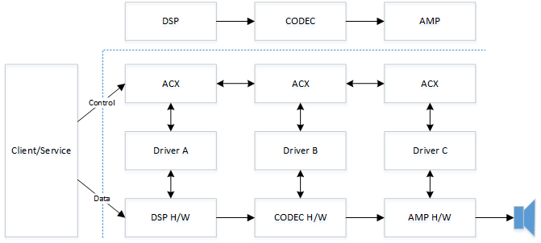

# ACX multi stack cross driver communications

This topic provides a summary of the Audio Class eXtensions (ACX) multi stack cross driver communications.

For general information about the ACX, see [ACX audio class extensions overview
](acx-audio-class-extensions-overview.md) and [Summary of ACX Objects](acx-summary-of-objects.md).

For basic information on ACX targets, see [ACX targets and driver synchronization](acx-targets.md) and [ACX IO request packet IRPs](acx-irps.md).

>[!NOTE]
> The ACX headers and libraries are not included in the  WDK 10.0.22621.2428 (released October 24, 2023), but are available in previous versions, as well as the latest (25000 series builds) Insider Preview of the WDK. For more information about preview versions of the WDK, see [Installing preview versions of the Windows Driver Kit (WDK)](../installing-preview-versions-wdk.md).

## Single-Stack audio drivers

Legacy PortCls and KS audio class drivers only support “single stack” audio drivers. The legacy audio framework communicates and interface with only one miniport driver. It is up to the miniport driver to manage the communication and synchronization with other driver stacks when necessary.  

ACX fully supports single-stack audio drivers. Audio developers can replace their current Portcls and KS miniport driver with an ACX-based driver while keeping the same behavior in relation with other stacks. Although if the audio subsystem uses multi-audio stacks, a better approach would be use to use the multi-stack support in ACX, and let ACX synchronize all these stacks together, as described in the next section of this topic.

## Multi-Stack audio drivers - componentization

It is very common for the audio path to go through multiple hardware components handled by different driver stacks to create a complete audio experience.  It is typical for a system to have the DSP, CODEC and AMP functionality implemented by different audio technology vendors as shown in the following diagram.


In a multi-stack architecture without a well-defined standard, each vendor is forced to define its own proprietary interface and communications protocol. It is a goal of ACX to facilitate the development of multi-stack audio drivers by taking ownership of the synchronization between these stacks and providing a simple re-usable pattern for drivers communicate with each other.

Using ACX, the example system DSP, CODEC and AMP hardware design can be supported with the following software architecture.



Note that any type of component type instead of the shown DSP, CODEC and AMP, could be used, as ACX does not depend on any specific component type, or specific arrangements of components.
  
Third party drivers communicate with each other via ACX with a well-defined protocol.  One advantage of this approach is that a single stack could be replaced with another one from a different vendor without requiring changes to the adjacent software stacks. One of the primary goals of the audio class extensions (ACX) framework is to simplify the effort required to develop multi-stack audio drivers assembled from components from different vendors.

### ACX targets communications example - Circuit

This example code shows the use of AcxTargetCircuit and [AcxTargetCircuitGetWdfIoTarget](/windows-hardware/drivers/ddi/acxtargets/nf-acxtargets-acxtargetcircuitgetwdfiotarget) to communicate with a remote circuit exposed by a different stack. For more information about ACX Circuits, see [acxcircuit.h](/windows-hardware/drivers/ddi/acxcircuit/).

This fairly complex aggregator locates circuits and then creates an ioTarget using AcxTargetCircuitGetWdfIoTarget. It then sets custom WDF send options and asynchronously sends the request. Lastly, it checks the status of the send to confirm the request was sent.

```cpp
NTSTATUS
Aggregator_SendModuleCommand(
    _In_ PAGGREGATOR_RENDER_CIRCUIT_CONTEXT CircuitCtx,
    _In_ ACX_REQUEST_PARAMETERS             Params,
    _Out_ ULONG_PTR *                       OutSize
    )
{
    NTSTATUS                    status = STATUS_NOT_SUPPORTED;
    PKSAUDIOMODULE_PROPERTY     moduleProperty = nullptr;
    ULONG                       aggregationDeviceIndex = 0;
    PLIST_ENTRY                 ple;

    *OutSize = 0;

    moduleProperty = CONTAINING_RECORD(Params.Parameters.Property.Control, KSAUDIOMODULE_PROPERTY, ClassId);;
    aggregationDeviceIndex = AUDIOMODULE_GET_AGGDEVICEID(moduleProperty->InstanceId);

    ple = CircuitCtx->AggregatorCircuit->AggregatorEndpoint->AudioPaths[aggregationDeviceIndex]->TargetCircuitList.Flink;
    while (ple != &CircuitCtx->AggregatorCircuit->AggregatorEndpoint->AudioPaths[aggregationDeviceIndex]->TargetCircuitList)
    {
        PAUDIO_CIRCUIT circuit = (PAUDIO_CIRCUIT)CONTAINING_RECORD(ple, AUDIO_CIRCUIT, ListEntry);

        if (circuit->Modules)
        {
            for(ULONG i = 0; i < circuit->Modules->Count; i++)
            {
                PACX_AUDIOMODULE_DESCRIPTOR descriptor = ((PACX_AUDIOMODULE_DESCRIPTOR)(circuit->Modules + 1) + i);

                // we've identified which aggregation device this call is targeting, 
                // now locate which circuit implements this module. Within an aggregated device,
                // the module class id + instance id must uniquely identify a module. There should
                // never be duplicates.
                if (IsEqualGUIDAligned(descriptor->ClassId, moduleProperty->ClassId) &&
                    descriptor->InstanceId == moduleProperty->InstanceId)
                {
                    WDFREQUEST                  request = NULL;
                    WDF_REQUEST_SEND_OPTIONS    sendOptions;
                    WDF_OBJECT_ATTRIBUTES       attributes;
                    WDFIOTARGET                 ioTarget;

                    // We've now identified which aggregated device this call is targeting.
                    // The cached module information contains the ID adjusted with the aggregation device
                    // index. remove the aggregation device index before forwarding the call to the aggregated circuit.
                    moduleProperty->InstanceId = AUDIOMODULE_GET_INSTANCEID(moduleProperty->InstanceId);

                    ioTarget = AcxTargetCircuitGetWdfIoTarget(circuit->AcxTargetCircuit);

                    WDF_OBJECT_ATTRIBUTES_INIT(&attributes);
                    attributes.ParentObject = CircuitCtx->AggregatorCircuit->Circuit;
                    status = WdfRequestCreate(&attributes, ioTarget, &request);    
                    if (!NT_SUCCESS(status)) 
                    {
                        goto exit;
                    }

                    status = AcxTargetCircuitFormatRequestForProperty(circuit->AcxTargetCircuit, request, &Params);
                    if (!NT_SUCCESS(status))
                    {
                        goto exit;
                    }

                    WDF_REQUEST_SEND_OPTIONS_INIT(&sendOptions, WDF_REQUEST_SEND_OPTION_SYNCHRONOUS);
                    WDF_REQUEST_SEND_OPTIONS_SET_TIMEOUT(&sendOptions, WDF_REL_TIMEOUT_IN_SEC(REQUEST_TIMEOUT_SECONDS));

                    // Whether WdfRequestSend succeeds or fails, we return the status & information, so
                    // there's no need to inspect the result.
                    WdfRequestSend(request, ioTarget, &sendOptions);
                    status = WdfRequestGetStatus(request);
                    *OutSize = WdfRequestGetInformation(request);

                    WdfObjectDelete(request);
                    goto exit;
                }
            }
        }

        ple = ple->Flink;
    }

    status = STATUS_SUCCESS;

exit:
    return status;
}
```

### ACX targets communications example - Pin

This example code shows the use of AcxTargetPin to communicate with a remote circuit’s pin exposed by a different stack. For more information about ACX Pin, see [acxpin.h](/windows-hardware/drivers/ddi/acxpin/).

It selects the last Volume and Mute elements that are both present in the same circuit in the Endpoint Path.

```cpp
NTSTATUS FindDownstreamVolumeMute(
    _In_    ACXCIRCUIT          Circuit,
    _In_    ACXTARGETCIRCUIT    TargetCircuit
)
{
    NTSTATUS status;
    PDSP_CIRCUIT_CONTEXT circuitCtx;
    ACX_REQUEST_PARAMETERS  params;
    WDF_REQUEST_SEND_OPTIONS sendOptions;
    WDF_OBJECT_ATTRIBUTES attributes;
    WDF_REQUEST_REUSE_PARAMS reuseParams;

    circuitCtx = GetDspCircuitContext(Circuit);

    //
    // Note on behavior: This search algorithm will select the last Volume and Mute elements that are both
    // present in the same circuit in the Endpoint Path.
    // This logic could be updated to select the last Volume and Mute elements, or the first or last
    // Volume or the first or last Mute element.
    //

    //
    // First look through target's pins to determine if there's another circuit downstream.
    // If there is, we'll look at that circuit for volume/mute.
    //
    for (ULONG pinIndex = 0; pinIndex < AcxTargetCircuitGetPinsCount(TargetCircuit); ++pinIndex)
    {
        ACXTARGETPIN targetPin = AcxTargetCircuitGetTargetPin(TargetCircuit, pinIndex);
        ULONG targetPinFlow = 0;
        ACX_REQUEST_PARAMETERS_INIT_PROPERTY(&params,
                                             KSPROPSETID_Pin,
                                             KSPROPERTY_PIN_DATAFLOW,
                                             AcxPropertyVerbGet,
                                             AcxItemTypePin,
                                             AcxTargetPinGetId(targetPin),
                                             nullptr, 0,
                                             &targetPinFlow,
                                             sizeof(targetPinFlow));

        RETURN_NTSTATUS_IF_FAILED(SendProperty(targetPin, &params, nullptr));

        //
        // Searching for the downstream pins. For Render, these are the dataflow out pins
        //
        if (circuitCtx->IsRenderCircuit && targetPinFlow != KSPIN_DATAFLOW_OUT)
        {
            continue;
        }
        else if (!circuitCtx->IsRenderCircuit && targetPinFlow != KSPIN_DATAFLOW_IN)
        {
            continue;
        }

        // Get the target pin's physical connection. We'll do this twice: first to get size and allocate, second to get the connection
        PKSPIN_PHYSICALCONNECTION pinConnection = nullptr;
        auto connection_free = scope_exit([&pinConnection]()
        {
            if (pinConnection)
            {
                ExFreePool(pinConnection);
                pinConnection = nullptr;
            }
        });

        ULONG pinConnectionSize = 0;
        ULONG_PTR info = 0;
        for (ULONG i = 0; i < 2; ++i)
        {
            ACX_REQUEST_PARAMETERS_INIT_PROPERTY(&params,
                                                 KSPROPSETID_Pin,
                                                 KSPROPERTY_PIN_PHYSICALCONNECTION,
                                                 AcxPropertyVerbGet,
                                                 AcxItemTypePin,
                                                 AcxTargetPinGetId(targetPin),
                                                 nullptr, 0,
                                                 pinConnection,
                                                 pinConnectionSize);

            status = SendProperty(targetPin, &params, &info);

            if (status == STATUS_BUFFER_OVERFLOW)
            {
                // Pin connection already allocated, so how did this fail?
                RETURN_NTSTATUS_IF_TRUE(pinConnection != nullptr, status);

                pinConnectionSize = (ULONG)info;
                pinConnection = (PKSPIN_PHYSICALCONNECTION)ExAllocatePool2(POOL_FLAG_NON_PAGED, pinConnectionSize, DRIVER_TAG);
                // RETURN_NTSTATUS_IF_NULL_ALLOC causes compile errors
                RETURN_NTSTATUS_IF_TRUE(pinConnection == nullptr, STATUS_INSUFFICIENT_RESOURCES);
            }
            else if (!NT_SUCCESS(status))
            {
                // There are no more connected circuits. Continue with processing this circuit.
                break;
            }
        }

        if (!NT_SUCCESS(status))
        {
            // There are no more connected circuits. Continue handling this circuit.
            break;
        }

        ACXTARGETCIRCUIT nextTargetCircuit;
        RETURN_NTSTATUS_IF_FAILED(CreateTargetCircuit(Circuit, pinConnection, pinConnectionSize, &nextTargetCircuit));
        auto circuit_free = scope_exit([&nextTargetCircuit]()
        {
            if (nextTargetCircuit)
            {
                WdfObjectDelete(nextTargetCircuit);
                nextTargetCircuit = nullptr;
            }
        });

        RETURN_NTSTATUS_IF_FAILED_UNLESS_ALLOWED(FindDownstreamVolumeMute(Circuit, nextTargetCircuit), STATUS_NOT_FOUND);
        if (circuitCtx->TargetVolumeMuteCircuit == nextTargetCircuit)
        {
            // The nextTargetCircuit is the owner of the volume/mute target elements.
            // We will delete it when the pin is disconnected.
            circuit_free.release();

            // We found volume/mute. Return.
            return STATUS_SUCCESS;
        }

        // There's only one downstream pin on the current targetcircuit, and we just processed it.
        break;
    }

    //
    // Search the target circuit for a volume or mute element.
    // This sample code doesn't support downstream audioengine elements.
    // 
    for (ULONG elementIndex = 0; elementIndex < AcxTargetCircuitGetElementsCount(TargetCircuit); ++elementIndex)
    {
        ACXTARGETELEMENT targetElement = AcxTargetCircuitGetTargetElement(TargetCircuit, elementIndex);
        GUID elementType = AcxTargetElementGetType(targetElement);

        if (IsEqualGUID(elementType, KSNODETYPE_VOLUME) &&
            circuitCtx->TargetVolumeHandler == nullptr)
        {
            // Found Volume
            circuitCtx->TargetVolumeHandler = targetElement;
        }
        if (IsEqualGUID(elementType, KSNODETYPE_MUTE) &&
            circuitCtx->TargetMuteHandler == nullptr)
        {
            // Found Mute
            circuitCtx->TargetMuteHandler = targetElement;
        }
    }

    if (circuitCtx->TargetVolumeHandler && circuitCtx->TargetMuteHandler)
    {
        circuitCtx->TargetVolumeMuteCircuit = TargetCircuit;
        return STATUS_SUCCESS;
    }

    //
    // If we only found one of volume or mute, keep searching for both
    //
    if (circuitCtx->TargetVolumeHandler || circuitCtx->TargetMuteHandler)
    {
        circuitCtx->TargetMuteHandler = circuitCtx->TargetVolumeHandler = nullptr;
    }

    return STATUS_NOT_FOUND;
}
```

### ACX targets communications example - Stream

This example code shows the use of AcxTargetStream to communicate with a remote circuit’s stream.  For more information about ACX Streams, see [acxstreams.h](/windows-hardware/drivers/ddi/acxstreams/).

```cpp

    NTSTATUS                        status;
    PRENDER_DEVICE_CONTEXT          devCtx;
    WDF_OBJECT_ATTRIBUTES           attributes;
    ACXSTREAM                       stream;
    STREAM_CONTEXT *                streamCtx;
    ACXELEMENT                      elements[2] = {0};
    ACX_ELEMENT_CONFIG              elementCfg;
    ELEMENT_CONTEXT *               elementCtx;
    ACX_STREAM_CALLBACKS            streamCallbacks;
    ACX_RT_STREAM_CALLBACKS         rtCallbacks;
    CRenderStreamEngine *           streamEngine = NULL;

    PAGED_CODE();
    UNREFERENCED_PARAMETER(Pin);
    UNREFERENCED_PARAMETER(SignalProcessingMode);
    UNREFERENCED_PARAMETER(VarArguments);

    // This unit-test added support for RAW and DEFAULT.
    ASSERT(IsEqualGUID(*SignalProcessingMode, AUDIO_SIGNALPROCESSINGMODE_RAW) ||
           IsEqualGUID(*SignalProcessingMode, AUDIO_SIGNALPROCESSINGMODE_DEFAULT));
    
    devCtx = GetRenderDeviceContext(Device);
    ASSERT(devCtx != NULL);

    //
    // Init streaming callbacks.
    //
    ACX_STREAM_CALLBACKS_INIT(&streamCallbacks);
    streamCallbacks.EvtAcxStreamPrepareHardware         = EvtStreamPrepareHardware;
    streamCallbacks.EvtAcxStreamReleaseHardware         = EvtStreamReleaseHardware;
    streamCallbacks.EvtAcxStreamRun                     = EvtStreamRun;
    streamCallbacks.EvtAcxStreamPause                   = EvtStreamPause;
    streamCallbacks.EvtAcxStreamAssignDrmContentId      = EvtStreamAssignDrmContentId;

    status = AcxStreamInitAssignAcxStreamCallbacks(StreamInit, &streamCallbacks);
    if (!NT_SUCCESS(status))
    {
        ASSERT(FALSE);
        goto exit;
    }
    
    //
    // Init RT streaming callbacks.
    //
    ACX_RT_STREAM_CALLBACKS_INIT(&rtCallbacks);
    rtCallbacks.EvtAcxStreamGetHwLatency                = EvtStreamGetHwLatency;
    rtCallbacks.EvtAcxStreamAllocateRtPackets           = EvtStreamAllocateRtPackets;
    rtCallbacks.EvtAcxStreamFreeRtPackets               = EvtStreamFreeRtPackets;
    rtCallbacks.EvtAcxStreamSetRenderPacket             = R_EvtStreamSetRenderPacket;
    rtCallbacks.EvtAcxStreamGetCurrentPacket            = EvtStreamGetCurrentPacket;
    rtCallbacks.EvtAcxStreamGetPresentationPosition     = EvtStreamGetPresentationPosition;    
    
    status = AcxStreamInitAssignAcxRtStreamCallbacks(StreamInit, &rtCallbacks);
    if (!NT_SUCCESS(status))
    {
        ASSERT(FALSE);
        goto exit;
    }

    //
    // Create the stream.
    //
    WDF_OBJECT_ATTRIBUTES_INIT_CONTEXT_TYPE(&attributes, STREAM_CONTEXT);
    attributes.EvtCleanupCallback = EvtStreamCleanup;
    attributes.EvtDestroyCallback = EvtStreamDestroy;
    status = AcxRtStreamCreate(Device, Circuit, &attributes, &StreamInit, &stream);
    if (!NT_SUCCESS(status)) 
    {
        ASSERT(FALSE);
        goto exit;
    }

    // START-TESTING: inverted create-stream sequence.
    {
        ACXSTREAMBRIDGE             bridge          = NULL;
        ACXPIN                      bridgePin       = NULL;
        ACXTARGETSTREAM             targetStream    = NULL;
        ACX_STREAM_BRIDGE_CONFIG    bridgeCfg;
    
        ACX_STREAM_BRIDGE_CONFIG_INIT(&bridgeCfg);
        bridgeCfg.InModesCount = 0;     // no in-modes. this stream-bridge is manually managed. 
        bridgeCfg.InModes      = NULL; 
        bridgeCfg.OutMode      = NULL;  // no mode, i.e., default (1st) and raw (2nd).
        bridgeCfg.Flags |= AcxStreamBridgeInvertChangeStateSequence;

        WDF_OBJECT_ATTRIBUTES_INIT(&attributes);
        attributes.ParentObject = WdfGetDriver(); // bridge is deleted by driver obj in case of error.

        status = AcxStreamBridgeCreate(Circuit, &attributes, &bridgeCfg, &bridge);
        if (!NT_SUCCESS(status))
        {
            ASSERT(FALSE);
            goto exit;
        }
        
        ...
        
        status = AcxStreamBridgeAddStream(bridge, stream);
        if (!NT_SUCCESS(status))
        {
            ASSERT(FALSE);
            goto exit;
        }

        // Get the Target Stream
        targetStream = AcxStreamBridgeGetTargetStream(bridge, stream);
        if (targetStream == NULL)
        {
            ASSERT(FALSE);
            goto exit;
        }
```

### ACX targets communications example - Element

This example code shows the use of AcxTargetElement to communicate with a circuit’s element. For more information about the ACX Targets, see [acxtargets.h](/windows-hardware/drivers/ddi/acxtargets/).

```cpp
    _In_    ACXCIRCUIT          Circuit,
    _In_    ACXTARGETCIRCUIT    TargetCircuit

...

    //
    // Search the target circuit for a volume or mute element.
    // This sample code doesn't support downstream audioengine elements.
    // 
    for (ULONG elementIndex = 0; elementIndex < AcxTargetCircuitGetElementsCount(TargetCircuit); ++elementIndex)
    {
        ACXTARGETELEMENT targetElement = AcxTargetCircuitGetTargetElement(TargetCircuit, elementIndex);
        GUID elementType = AcxTargetElementGetType(targetElement);

        if (IsEqualGUID(elementType, KSNODETYPE_VOLUME) &&
            circuitCtx->TargetVolumeHandler == nullptr)
        {
            // Found Volume
            circuitCtx->TargetVolumeHandler = targetElement;
        }
        if (IsEqualGUID(elementType, KSNODETYPE_MUTE) &&
            circuitCtx->TargetMuteHandler == nullptr)
        {
            // Found Mute
            circuitCtx->TargetMuteHandler = targetElement;
        }
    }
```

## See also

[ACX audio class extensions overview](acx-audio-class-extensions-overview.md)

[Summary of ACX Objects](acx-summary-of-objects.md)

[ACX reference documentation](acx-reference.md)

[ACX IO request packet IRPs](acx-irps.md)

[ACX targets and driver synchronization](acx-targets.md)

[ACX reference documentation](acx-reference.md)