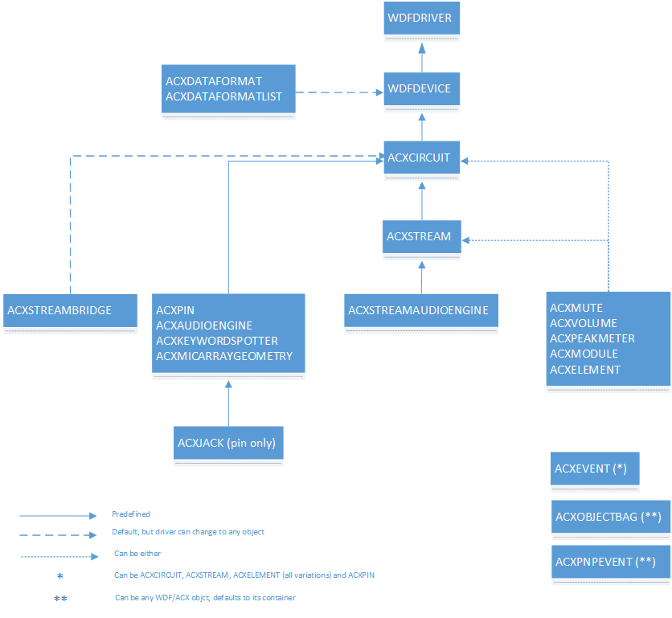
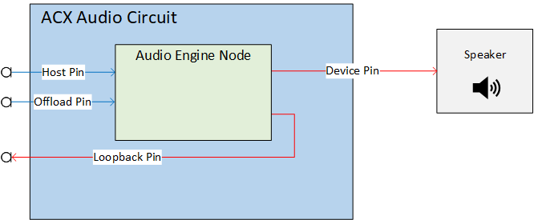

# Summary of ACX objects

This topic provides a high level summary of Audio Class Extensions (ACX) objects that form the base of an ACX audio driver. For a general overview of ACX, see [ACX audio class extensions overview](acx-audio-class-extensions-overview.md).

ACX objects are Windows Driver Framework (WDF) objects - WDFOBJECT. For more information about WDF see [Introduction to Framework Objects](../wdf/introduction-to-framework-objects.md). For a summary of WDF objects see [Summary of Framework Objects](../wdf/summary-of-framework-objects.md).

## ACX object hierarchy

In ACX (as in WDF), the driver object is the root object, and all other objects are its children/descendants. All ACX objects are children of the driver object directly or indirectly via other ACX or WDF objects. An ACX driver can specify the parent of an ACX object during creation time. If the parent is not specified, ACX uses a default parent as described in these sections.

## ACX Circuit

An AcxCircuit represents a partial or full audio path to a user perceived audio device (speakers, mic, etc.). An AcxCircuit has at least one input pin and one output pin (ACXPIN), and it may aggregate one or more AcxElements-like objects. By default, AcxElements are ‘connected’ in the same order of assembly.

The audio circuit is the core building block of ACX. In the new ACX framework, an audio driver creates one or more ACX circuit objects to represent a partial or complete audio data/control path. ACX assembles these ACX circuit objects together to create a complete audio path which represents an audio endpoint. ACX is responsible for managing the ACX circuits and their dependencies. The order on how these circuits are assembled can be statically defined at initialization time or dynamically defined at run time.

An audio endpoint in the ACX frameworks is a collection of one or more ACX circuits. Each ACX circuit in a multi circuit audio path must belong to a different PnP device stack. An ACX driver may create one or more circuits at initialization time, or it may create circuits at run time, as side effect of an external event, such as after detecting a new audio component, or because it registered itself with ACX as a factory for a specific circuit type, and ACX framework asked the factory component to create a new circuit of that type (see ACX circuit manager/factory described later in this topic).

- An AcxCircuit may have one or more streams.

- An AcxCircuit has a dedicated WDF queue. For more information about WDF queues, see [Framework Queue Objects](../wdf/creating-i-o-queues.md).

The DDIs for ACX circuits are described in the [acxcircuit.h](/windows-hardware/drivers/ddi/acxcircuit) header.

## ACX Pin

Just as in WDM Portcls audio drivers, and AcxPin object represent the logical connections (not physical connections) through which data streams enter the adapter from the system communications bus or enter the system communications bus from the adapter. 

The DDIs for Pin are described in the [acxpin.h](/windows-hardware/drivers/ddi/acxpin/) header.

## ACX Stream

An AcxStream represents an audio stream on a specific circuit’s hardware.  An AcxStream may aggregate one or more AcxElements-like objects. By default, AcxElements are ‘connected’ in the same order of assembly. An AcxStream is associated with only one ACX circuit. 

- An AcxStream has a dedicated WDF queue.  For more information about WDF queues, see [Framework Queue Objects](../wdf/creating-i-o-queues.md)
- An AcxStream support different states. These states indicate when audio is flowing (RUN state) or not flowing (PAUSE or STOP state).
- Currently ACX supports two types of streams: basic ACX stream objects used by non-streaming circuits, and ACX RT stream objects used by streaming circuits.

The DDIs for stream are defined in the [acxstreams.h](/windows-hardware/drivers/ddi/acxstreams) header.

## ACX Targets

WdfIoTarget is a WDF abstraction to facilitate the communication between two different stacks. For more information about WDF IO targets, see [Introduction to I/O Targets](../wdf/introduction-to-i-o-targets.md). 

- Drivers use AcxTargetCircuit to communicate with a remote circuit exposed by a different stack. AcxTargetCircuit is implemented using a WdfIoTarget.
- Drivers use AcxTargetPin to communicate with a remote circuit’s pin exposed by a different stack. AcxTargetPin is implemented using a WdfIoTarget to send messages to the remote pin entity.
- Drivers use AcxTargetElement to communicate with a remote circuit’s element exposed by a different stack. AcxTargetElement is implemented using a WdfIoTarget to send messages to the remote element entity.
- Drivers use AcxTargetStream to communicate with a remote circuit’s stream exposed by a different stack. AcxTargetStream is implemented using a WdfIoTarget to create a remote stream and change the state of the remote stream.
- Drivers use AcxTargetFactoryCircuit to communicate with a remote circuit factory instance. AcxTargetFactoryCircuit is implemented using a WdfTarget to send messages to the remote circuit factory.

Each of the above ACX types supports properties, methods, and events to interact with the remote circuit. All these types are built on top of the WdfIoTarget object.

The DDIs for targets are defined in the [acxtargets.h](/windows-hardware/drivers/ddi/acxtargets) header.

## ACX Stream Bridge

The AcxStreamBridge object is used by a circuit to propagate a stream creation, stream’s states transitions and DRM settings between circuit segments. This object is only used in a multi circuit (audio composite) scenario. A driver may associate one or more ACXSTREAMBRIDGE objects to a bridge pin. A bridge pin is the ACXPIN that logically connects to the correspoinding ACXPIN on the other circuit.

The DDIs for Stream are described in the [acxstreams.h](/windows-hardware/drivers/ddi/acxstreams) header.

## Example of ACX audio engine node circuit layout

The following diagram illustrates an ACX circuit. The host and offload pins are inputs to the circuit with a loopback pin that could be used for echo cancellation. The output could be a bridge pin that routes to a speaker.

Note that driver doesn't need to perform the step of explicitly connecting when circuit/elements are connected in the  same order as they were added to the circuit. 

By default ACX connects the elements starting from the circuit's ACX request sink pin and ending with the circuit's device bridge pin for both render and capture devices.

## ACX Manager

The ACX manager is used for system tasks such as supporting composite audio endpoints. These types of endpoints are managed by one or more driver stacks from same or different vendors. Clients can pre-configure this configuration in ACPI or use the ACX Manager’s DDI directly. The DDIs for the ACX manager are described in the [acxmanager.h](/windows-hardware/drivers/ddi/acxmanager/) header.

## ACX Object Bag

The ACX Object Bag is used to store various data types. ACXOBJECTBAG can be passed as argument in various DDIs.  The DDIs for Object Bag are described in the [acxmisc.h](/windows-hardware/drivers/ddi/acxmisc/) header.

## ACX object summary  

The following table lists all of the ACX objects and provides some basic information about each object. 

| Handle                  | Name                   | Purpose                                                                                                           |
|-------------------------|------------------------|-------------------------------------------------------------------------------------------------------------------|
| ACXMANAGER              | The ACX Manager        | ACX Manager object that is used to manage and control other objects.                                              |
| ACXOBJECTBAG            | Object Bag             | Used for storing data for use with objects.                                                                       |
| ACXEVENT                | ACX Event              | For KS (kernel-streaming) events.                                                                                 |
| ACXEVENTDATA            | Event data             | The data associated with an event.                                                                                |
| ACXPNPEVENT             | Pnp Event              | For plug and play events.                                                                                         |
| ACXCIRCUIT              | Circuit                | An ACX Circuit described above in this topic.                                                                     |
| ACXPIN                  | Pin                    | An ACX pin object represent the logical connections and is described above in this topic.                         |
| ACXELEMENT              | Element                | Used to represent any element that can be added to an AcxCircuit or AcxStream, such as AcxVolume                  |
| ACXAUDIOENGINE          | Audio Engine           | The ACX audio engine that is used in a render circuit to represent a DSP.                                         |
| ACXSTREAMAUDIOENGINE    | Stream Audio Engine    | Used in a render stream to represent a DSP.                                                                       |
| ACXKEYWORDSPOTTER       | Key word spotter       | A keyword spotter, used in a capture circuit for keyword detection in an audio stream.                            |
| ACXVOLUME               | Volume                 | Used to represent a volume, gain, boost.                                                                          |
| ACXMUTE                 | Mute                   | Used to represent a mute element.                                                                                 |
| ACXJACK                 | Jack                   | Used to represent an audio jack or other physical connector.                                                      |
| ACXMICARRAYGEOMETRY     | Mic Array Geometry     | Used to represent the mic array geometry, such as the location of the microphones.                                |
| ACXPEAKMETER            | Peak Meter             | Used when hardware supports peak-meter functionality.                                                             |
| ACXSTREAM               | Stream                 | Used to represent an audio stream created by a circuit, described above in this topic.                            |
| ACXDATAFORMAT           | Data format            | A data format represents a data format supported by the audio device.                                             |
| ACXDATAFORMATLIST       | Data Format List       | A list of audio data formats available for use.                                                                   |
| ACXTARGETCIRCUIT        | Target Circuit         | Used to communicate with a remote circuit exposed by a different stack.                                           |
| ACXTARGETPIN            | Target Pin             | Used to communicate with a remote circuit’s pin exposed by a different stack.                                     |
| ACXTARGETELEMENT        | Target Element         | Used to represent a target element that can be added to an AcxCircuit or AcxStream, such as AcxVolume             |
| ACXTARGETSTREAM         | Target Stream          | Used to communicate with a remote circuit’s stream exposed by a different stack.                                  |
| ACXTARGETFACTORYCIRCUIT | Target Circuit Factory | Used to communicate with a remote circuit's factory.                                                              |
| ACXSTREAMBRIDGE         | Stream Bridge          | Used by a circuit to propagate a stream creation, states transitions and DRM between circuit segments.            |
| ACXCOMPOSITE            | Composite              | Used to represent multi circuit/multi-stack/multiple-vendors stream architectures.                                |
| ACXCOMPOSITEFACTORY     | Composite Factory      | A factory that creates composite audio circuits.                                                                  |
| ACXFACTORYCIRCUIT       | Factory Circuit        | A factory that creates circuits using a specific template.                                                        |
| ACXCIRCUITMANAGER       | Circuit Manager        | A circuit provider that is used for dynamic circuit creation.                                                     |
| ACXCOMPOSITETEMPLATE    | Composite Template     | A composite template represents a partial or complete audio binding. A composite template can have one or more circuit templates. |
| ACXCIRCUITTEMPLATE      | Circuit Template       | A circuit template represent a partial audio path.                                                                |
| ACXAUDIOMODULE          | Audio Module           | For custom 3rd party add on functionality.                                                                        |

The following ACX objects are used to store circuit, stream and circuit factory information.

| Handle                 | Purpose                                                    | 
|------------------------|------------------------------------------------------------|
| ACXCIRCUIT_INIT        | Stores ACX circuit initialization data                     |
| ACXSTREAM_INIT         | Stores ACX stream initialization data                      |  
| ACXFACTORYCIRCUIT_INIT | Stores initialization data used by an ACX circuit  factory |

## See also

[ACX audio class extensions overview](acx-audio-class-extensions-overview.md)

[ACX reference documentation](acx-reference.md)
