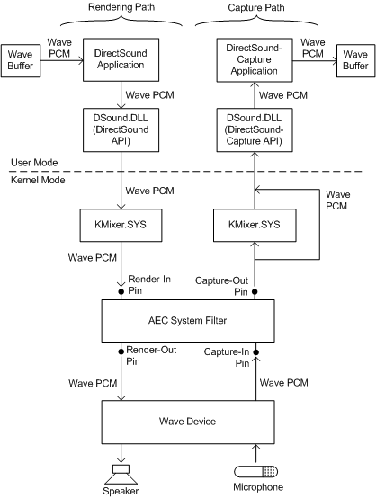

# AEC System Filter

## 

The AEC system filter (Aec.sys) implements the acoustic echo cancellation (AEC) and noise suppression (NS) algorithms in software. This filter is a standard operating-system component in Windows XP and later. For information about how DirectSoundCapture applications enable use of the AEC system filter, see the Microsoft Windows SDK documentation.

### Constraints Imposed by AEC System Filter

An audio filter graph that incorporates a capture effect that is implemented in the AEC system filter is subject to the following restrictions:

-   The AEC system filter can connect only to pins that handle PCM data formats.

-   The bit depth must be 16 bits for the capture stream and 8 or 16 bits for the render stream.

-   The AEC system filter performs all internal processing at 16 kHz. The input and output streams are source-rate converted as necessary.

-   In Windows XP SP1, Windows Server 2003, and later, the AEC system filter's capture-out and render-in pins (see the following figure) must have the same sample rate, but the sample rates at the capture-in and render-out pins can each be selected independently of the other pins. The sample rate at the capture-in pin can be (in order of preference) 16 kHz, 48 kHz, 44.1 kHz, or 8 kHz. (The order of preference is based on processing time and audio quality.) The sample rate at the render-out pin can be (in order of preference) 16 kHz, 48 kHz, or 44.1 kHz. Note that the render-out pin does not support a sample rate of 8 kHz.

-   The AEC and NS nodes (see figure in [Exposing Hardware-Accelerated Capture Effects](exposing-hardware-accelerated-capture-effects.md)) can handle only monophonic streams. If the capture stream is multichannel (for example, two-channel stereo), all channels other than the first are ignored (and discarded). Only monophonic streams can be processed by the render side.

-   In Windows XP SP1, Windows Server 2003, and later, this limitation does not exist. The AEC system filter correctly handles mismatches between the clocks for the capture and render streams, and separate devices can be used for capture and rendering.

-   When the AEC system filter is used, the [SysAudio system driver](kernel-mode-wdm-audio-components.md#sysaudio_system_driver) turns off hardware acceleration for mixing, sample-rate conversion, 3D spatialization, and so on. All mixing of streams is done in software emulation by the [KMixer system driver](kernel-mode-wdm-audio-components.md#kmixer_system_driver). This restriction is necessary to ensure that all audio that is played by the rendering device can be canceled out of the capture stream by the AEC system filter.

-   Any signal processing that is done before the AEC or NS node on the capture side of the graph or after the AEC or NS node on the render side must be linear time-invariant. Performing any nonlinear or time-varying signal processing in either of these locations prevents AEC from canceling the echo in the capture signal.

-   AEC filtering cancels only echoes coming from the AEC-filtered channels in your computer. Audio that is output through channels that do not pass through AEC is not echo-canceled. Echoes in a non-AEC audio channel are functionally equivalent to echoes in the audio that is playing on a radio in the office next to your computer. AEC has no way of canceling (and no effect on) echoes from either a radio or a non-AEC channel.

The preceding requirements apply to all kernel-streaming audio filter graphs that incorporate capture effects that are implemented in Aec.sys. These restrictions reflect fundamental assumptions in the design and implementation of the AEC system filter. The constraints on stream formats might change in future versions of Windows.

Any product design that uses the AEC system filter should take the preceding constraints into account. The following questions and answers show how these constraints can affect AEC filtering behavior:

Q: I've created a DirectSound buffer for stereo rendering, but both channels sound the same when I'm using AEC. Why is this?

A: AEC works only on mono streams, so KMixer is mixing the stereo stream back to mono to meet this constraint.

Q: Why does my 44-kHz, 16-bit audio sound like 16 kHz when I use AEC?

A: Because the AEC system filter performs all internal processing at 16 kHz.

Q: Why can't I get a hardware-accelerated DirectSound buffer with AEC?

A: Because SysAudio turns off hardware-accelerated mixing when AEC is enabled.

Q: Will the AEC system filter work with my old Sound Blaster 16 card?

A: Yes. Although the Sound Blaster16 card is unable to simultaneously manage 16-bit rendering and capture streams, it can simultaneously manage an 8-bit rendering stream and a 16-bit capture stream, which is a combination that the AEC system filter's render-out and capture-in pins support. New audio cards should be designed to support bit depths of at least 16 bits for both rendering and capture.

### Summary of Data Formats for AEC Pins

A DirectSound application that enables the AEC system filter can choose for its DirectSound buffers any sample rate or sample size that KMixer supports. KMixer converts the data from the application's rendering buffer to a 16-kHz mono 16-bit format before it enters the AEC system filter. Similarly, KMixer can convert the data that is destined for a DirectSoundCapture application's capture buffer to a 16-kHz mono 16-bit format after it leaves the AEC system filter. However, to both minimize the amount of processing done in the graph and achieve the highest audio quality, the applications should use a 16-kHz mono 16-bit format for both the rendering and capture buffers.

If you want your audio hardware to work with the AEC system filter, then the hardware rendering pin must support at least one of the sample rates supported by the AEC render-out pin, and the hardware capture pin must support one of the sample rates supported by the AEC capture-in pin. To achieve the best AEC performance, your hardware should support a 16-kHz sample rate in addition to any higher rates it supports. By supporting the 16-kHz rate, the hardware reduces the amount of processing that the AEC system filter must do by eliminating the need to do sample-rate conversion.

The AEC system filter's render-in pin connects to KMixer's output pin. KMixer performs the necessary conversion of its input streams to the format that the render-in pin requires. The render-in pin supports only two data formats:

-   A 16-kHz mono PCM format with a sample size of 16 bits

-   A 16-kHz mono PCM format with a sample size of 8 bits

The capture-out pin supports only one format:

-   A 16-kHz mono PCM format with a sample size of 16 bits

If the DirectSoundCapture application's buffer format is 16-kHz mono 16-bit PCM, the AEC capture-out pin can bypass KMixer and connect directly to DSound.DLL (see preceding figure). Otherwise, the AEC capture-out pin connects to KMixer, which converts the 16-kHz mono 16-bit PCM stream from the pin into whatever format the application's capture buffer uses.

The AEC render-out pin can handle any of the following formats:

-   16-kHz 16-bit PCM with two channels (stereo)

-   16-kHz 8-bit PCM with two channels

-   48-kHz 16-bit PCM with two channels

-   48-kHz 8-bit PCM with two channels

-   44.1-kHz 16-bit PCM with two channels

-   44.1-kHz 8-bit PCM with two channels

The render-out pin produces a stereo stream by copying the single channel from the AEC node into both channels of the output stream.

The capture-in pin can handle any of the following formats:

-   16-kHz 16-bit PCM with any number of channels

-   48-kHz 16-bit PCM with any number of channels

-   44.1-kHz 16-bit PCM with any number of channels

-   8-kHz 16-bit PCM with any number of channels

The capture-in pin uses only the first channel and ignores (and discards) the others.

All of the AEC system filter's pins use the data-format parameter values shown in the following table.

<table>
<colgroup>
<col width="50%" />
<col width="50%" />
</colgroup>
<thead>
<tr class="header">
<th align="left">KSDATARANGE Member</th>
<th align="left">Parameter Value</th>
</tr>
</thead>
<tbody>
<tr class="odd">
<td align="left">
<strong>MajorFormat</strong>
</td>
<td align="left">
KSDATAFORMAT_TYPE_AUDIO
</td>
</tr>
<tr class="even">
<td align="left">
<strong>SubFormat</strong>
</td>
<td align="left">
KSDATAFORMAT_SUBTYPE_PCM
</td>
</tr>
<tr class="odd">
<td align="left">
<strong>Specifier</strong>
</td>
<td align="left">
KSDATAFORMAT_SPECIFIER_WAVEFORMATEX
</td>
</tr>
</tbody>
</table>

 

For more information about the **MajorFormat**, **SubFormat**, and **Specifier** members, see [**KSDATARANGE**](https://msdn.microsoft.com/library/windows/hardware/ff561658). For an example of a [**KSDATARANGE\_AUDIO**](https://msdn.microsoft.com/library/windows/hardware/ff537096) data-range descriptor that uses these three parameter values, see [PCM Stream Data Range](pcm-stream-data-range.md).

 

 

