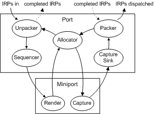

# Allocator

## 

The interfaces to and from the allocator are [IMXF](https://msdn.microsoft.com/library/windows/hardware/ff536782) and [IAllocatorMXF](https://msdn.microsoft.com/library/windows/hardware/ff536491). These interfaces allow you to reuse [**DMUS\_KERNEL\_EVENT**](https://msdn.microsoft.com/library/windows/hardware/ff536340) structures without allocating and deallocating memory. [**IMXF::PutMessage**](https://msdn.microsoft.com/library/windows/hardware/ff536791) gives a structure to the allocator and [**IAllocatorMXF::GetMessage**](https://msdn.microsoft.com/library/windows/hardware/ff536494) retrieves a freshly zeroed DMUS\_KERNEL\_EVENT structure from the allocator for reuse. (The allocator gets created with empty DMUS\_KERNEL\_EVENT structures in the pool so that it never starts out empty.) As shown in the following diagram figure, IRPs (in the form of DMUS\_EVENTHEADER structures) come in from dmusic.dll to the unpacker.

The unpacker calls **IAllocatorMXF::GetMessage** to retrieve an empty [**DMUS\_KERNEL\_EVENT**](https://msdn.microsoft.com/library/windows/hardware/ff536340) structure. The unpacker retrieves the DMUS\_KERNEL\_EVENT structures from the IRP, fills in these structures (one per MIDI event), and passes them down to the sequencer (using its MXF interface). The sequencer reorders them based on their time stamps and, when they are due, passes them to the miniport driver by calling **IMXF::PutMessage**. The miniport driver pulls the MIDI data out of the DMUS\_KERNEL\_EVENT structures so that it can render it into wave data. It passes the used DMUS\_KERNEL\_EVENT structures back to the allocator with another **IMXF::PutMessage** call.

The reverse situation happens for capture. MIDI data comes in from the hardware to the miniport driver and the miniport driver calls **IAllocatorMXF::GetMessage** to get an empty DMUS\_KERNEL\_EVENT structure. DMUS\_KERNEL\_EVENT structures are filled with time stamps and data and passed to the capture sink via **IMXF::PutMessage**. The miniport driver can pass more than one message per structure if it sets the DMUS\_KEF\_EVENT\_INCOMPLETE flag in the DMUS\_KERNEL\_EVENT structure. The capture sink in the DMus port driver parses this raw data stream and emits DMUS\_KERNEL\_EVENT structures that contain time-stamped MIDI messages (one per structure).

It is also possible for the miniport driver itself to emit time-stamped messages to the capture sink. In this case, the driver does not set the DMUS\_KEF\_EVENT\_INCOMPLETE bit in DMUS\_KERNEL\_EVENT. The capture sink passes the time-stamped structures directly to the packer, which packages the messages into IRPs and sends them on to dmusic.dll. DirectMusic capture is only for recording MIDI. For wave recording, use DirectSound capture.

When the packer pulls the data out of a DMUS\_KERNEL\_EVENT structure, it discards the used DMUS\_KERNEL\_EVENT structure into the allocator with **IMXF::PutMessage**. When the IRP buffer is full, it is passed up to dmusic.dll. The packer receives empty IRPs from dmusic.dll, fills them, and completes them. More IRPs keep trickling down so that it always has one to fill.

 

 

