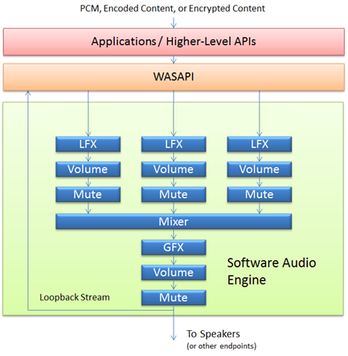
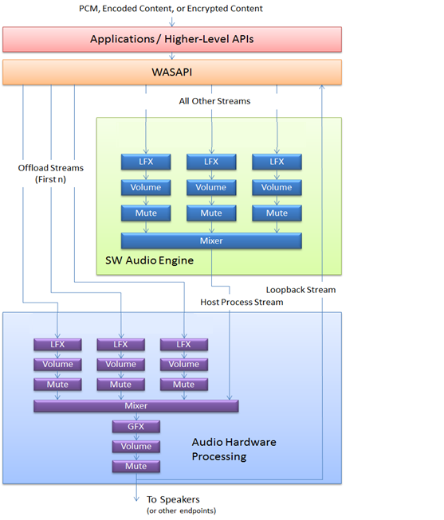

# Architectural Overview

This topic provides an overview of the audio architecture that was introduced in Windows 8, to provide support for a combined hardware/software audio engine.

## The software audio engine

The audio engine in Windows 7 and some earlier versions of Windows, supported a software audio engine that allowed third-party developers to plug in software decoders, encoders, and other generic audio effects at specific points in the processing pipeline.

The following diagram shows the Windows 8 software audio engine.

As you can see in the preceding diagram, audio streams arrive in the software audio engine from the Windows audio session API (WASAPI) layer, and possibly through a higher-level API such as Media Foundation. In the software audio engine local effects (LFX), like volume control and muting are applied on a per-stream basis before the separate streams are mixed, and then passed through any available global effects (GFX) and sent to the speakers.

## The hardware audio engine

The hardware audio engine is implemented in the audio adapter, and largely mirrors the functionality of the software audio engine. And although Windows 8 supports hardware-offloaded audio processing, the audio driver for a given audio adapter is responsible for exposing the underlying capabilities of the audio hardware, using the topology shown in the following diagram.

As shown in the diagram, the hardware audio engine must accept a single host process stream and up to n offloaded streams. These offloaded streams are routed directly from the application layer to be processed in hardware. In other words, the offloaded streams will not be passed through the software audio engine. The diagram shows an implementation that was designed to handle up to three offloaded streams. The host process stream is the final output from the software mixer of all the streams that were processed in the software audio engine. Each hardware audio engine must also contain a hardware mixer.

In order to maintain parity with the software audio engine and the WASAPI interface, it is necessary for the hardware audio engine to provide the final audio output stream back to the audio stack in the form of a loopback stream. This is especially critical for applications and scenarios that rely on Acoustic Echo Cancellation, which requires knowledge of the final output stream to cancel echoes and prevent feedback.

In order to implement a path for a loopback stream, the audio driver is responsible for exposing a loopback pin. This pin will return the audio data from the final audio engine output, if the data is encoded to a PCM format. Otherwise, the post-mixing (but pre-encoding) result will be returned. This means that in the case of audio data that is processed with a hardware GFX that encodes to a non-PCM format, the loopback stream is taken directly after the hardware mixer, before the GFX stage in the hardware audio engine. For information about the new KS-filter topology that represents the hardware audio engine, see [Implementation Overview](implementation-overview.md).

## The overall architecture

The following diagram shows an overview of the resulting architecture when a hardware audio engine works in concert with the Windows 8 software audio engine.

This means that in a scenario where the audio driver has indicated its support for offloaded audio processing, the first n (in this case, three) streams that are initialized will be routed directly from the WASAPI layer to the hardware audio engine, bypassing the software audio engine. Any new audio streams subsequent to the n supported by the hardware audio engine will be routed through the software audio engine for processing. The resulting stream from the software audio engine is then sent to the hardware audio engine as a host process stream. The host process stream is mixed with the first n streams, GFX processing is applied, and the resulting stream is then sent to the speakers.

**Note**  In general, GFX processing is applied before volume adjustment. But there is an exception in cases where the GFX is encoded to a non-PCM format; in this case the GFX/volume control order is reversed so that volume control can be applied to uncompressed data before GFX processing takes place. The Windows 7 software audio engine follows the same model.

 

 

 

