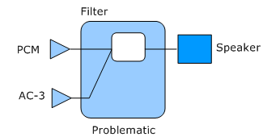
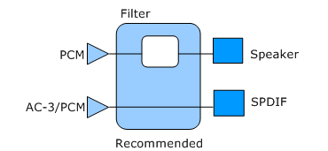
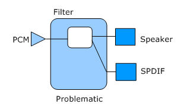
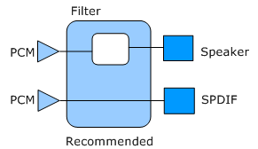

# Audio Endpoint Builder Algorithm

In Windows Vista and later versions of Windows, the AudioEndpointBuilder is a system service that enumerates, initializes, and activates the audio endpoints in a system. This topic provides an overview of the algorithm that is used by the AudioEndpointBuilder service.

The AudioEndpointBuilder service uses an algorithm to discover and enumerate endpoints. The algorithm was designed to simplify the system access to multiplexed (MUXed) capture devices and to help work with topologies that involve multiple host pins and multiple bridge pins, or both.

In Windows XP, the audio model used the term audio device to refer to a conceptual device in the Plug and Play (PnP) tree. In Windows Vista and later versions of Windows, the concept of an audio device has been redesigned to better represent the device that the user physically interacts with.

With two new APIs in Windows Vista, [MMDevice API](https://go.microsoft.com/fwlink/p/?linkid=130863) and [WASAPI](https://go.microsoft.com/fwlink/p/?linkid=130864), you can access and manipulate these new audio devices. The MMDevice API refers to the new audio devices as endpoints.

The AudioEndpointBuilder service monitors the [**KSCATEGORY\_AUDIO**](https://msdn.microsoft.com/library/windows/hardware/ff548261) class for device interface arrivals and removals. When an audio device driver registers a new instance of the KSCATEGORY\_AUDIO device interface class, the AudioEndpointBuilder service detects the device interface notification and uses an algorithm to examine the topology of the audio devices in the system and take appropriate action.

The following list summarizes how the algorithm that is used by AudioEndpointBuilder works:

1.  Looks for any unconnected bridge pins.

2.  Creates an endpoint for any unconnected bridge pins. For example, when the AudioEndpointBuilder finds an unconnected bridge pin with a pin-category GUID of KSNODETYPE\_SPEAKER, it creates a speaker endpoint for this bridge pin. For more information about KSNODETYPE\_SPEAKER and other pin-category GUIDS, see Ksmedia.h in WinDDK\\&lt;build number&gt;\\inc\\api.

3.  Sets the default properties for the endpoint. For example, AudioEndpointBuilder sets the name, icon, and the form factor.

4.  Determines whether there is a path from the endpoint to a host pin that supports pulse code modulation (PCM), audio codec-3 (AC3), or Windows media video (WMV). A host pin is a KSPIN structure with its Communication member set to KSPIN\_COMMUNICATION\_SINK or KSPIN\_COMMUNICATION\_BOTH. For more information about the KSPIN structure, see [**KSPIN**](https://msdn.microsoft.com/library/windows/hardware/ff563483).

5.  Populates the endpoint PropertyStore with property information from the registry keys of the audio device interface.

6.  Sets the state of the endpoint. The state of the endpoint can be one of the following three values:

    -   Active. This indicates that a path exists as described in Step 4.

    -   Unplugged. If the audio device supports jack detection, this state indicates that a path exists for the endpoint, and the jack is unplugged from the physical connector on the audio adapter.

    -   Not present. This state indicates that a path was not found in Step 4, and jack detection is not supported by this endpoint.

7.  Sets this endpoint as the default endpoint, if that is what is specified in the associated INF file.

After the endpoints have been enumerated, clients of the audio system can manipulate them directly by using the new Windows Vista APIs (as indicated previously) or indirectly by using the more familiar APIs such as Wave, [DShow](https://go.microsoft.com/fwlink/p/?linkid=130871) or [DirectSound.](https://go.microsoft.com/fwlink/p/?linkid=130872) New API methods have been provided so that audio clients can start with the MMDevice ID of an endpoint and access the Wave or DirectSound ID for the same endpoint.

When you use endpoints, you can take advantage of the following:

-   The same globally unique ID (GUID) is available regardless of how often you restart your machine. Having this persistent GUID is more reliable than saving a waveOut ID or a friendly name for the endpoint.

-   The same PropertyStore is available regardless of how often you restart your machine. The audio device-related metadata is saved in the endpoint PropertyStore.

-   Multiplexed (MUX) and de-multiplexed (DEMUX) pins are managed automatically and enumerated by the AudioEndpointBuilder service.

If you develop your own audio device driver and INF file to work with your audio device, and develop an audio application, or both, it is best to be aware of the following issues and best practices. When you develop drivers and applications with these recommendations in mind, you produce drivers, INF files, and audio clients that work more effectively with the AudioEndpointBuilder.

-   Naming convention. The naming convention that is used for the endpoints is based on the friendly names of the bridge pins. However, in the case of speaker endpoints, the name has been hardcoded to "Speakers" and cannot be altered by your driver or a third-party application.

-   Suboptimal topologies. Certain topologies are considered to be suboptimal because of the algorithm that is used by the AudioEndpointBuilder to enumerate endpoints. For example, when you create one of these suboptimal topologies, you create host pins that have hidden endpoints and cannot be seen by the AudioEndpointBuilder or splitters (split endpoints) that the AudioEndpointBuilder cannot link to their associated host pins.

    -   **Hidden endpoints**

        In the following diagram, the KS filter is shown to have two host pins that are connected to a single bridge pin (Speaker).

        

        When the AudioEndpointBuilder discovers this bridge pin, it traces a path back to only one of the host pins, sets the default values for the bridge pin, creates and activates a Speaker endpoint, and continues to discover other bridge pins. Thus, the other host pin remains hidden from the AudioEndpointBuilder.

        

        In the preceding diagram, the problematic topology has been redesigned so that the AudioEndpointBuilder can discover the two host pins (PCM and AC-3/ PCM) because it can now see two bridge pins (Speaker and SPDIF).

    -   **Splitters**

        Another type of suboptimal topology is created when one host pin connects to more than one bridge pin. The following diagram shows a topology in which a PCM host pin connects to a Speaker bridge pin and a SPDIF bridge pin.

        

        In this case the AudioEndpointBuilder discovers one bridge pin and traces a path back to the PCM host pin, sets default values, and then creates and activates a Speaker endpoint. When the AudioEndpointBuilder discovers the next bridge pin, it traces a path back to the same PCM host pin, sets default values, and then creates and activates a SPDIF endpoint. However, although both endpoints have been initialized and activated, streaming to one of them makes it impossible to stream to the other at the same time; in other words, they are mutually exclusive endpoints.

        The following diagram shows a redesign of this topology in which separate connections exist. This design makes it possible for the AudioEndpointBuilder to trace a path back to the PCM host pin for each of the two bridge pins.

        

-   Endpoint format. When the audio engine is running in shared mode, the format for the endpoint assumes a specific setting as directed by the INF file at the time of installation. For example, the audio driver for an audio device uses its associated INF file to set the default endpoint to a 44.1-kHz, 16-bit, stereo PCM format. After installation, you must use Control Panel or a third-party application to change the endpoint format.

-   Default device. The endpoint that is set as the default device is selected at the time of installation by using information in the INF file. After installation has completed, you must use Control Panel or a third-party application to select another endpoint to be the default endpoint.

**Note**   If your INF file does not select an endpoint to be set as default during installation, a client application can use the MMDevice API to select an endpoint. The API bases its selection on the form factor rank and whether the endpoint is a render or a capture endpoint. The following table shows the selection order.
<table>
<colgroup>
<col width="50%" />
<col width="50%" />
</colgroup>
<thead>
<tr class="header">
<th align="left">Render rank</th>
<th align="left">Capture rank</th>
</tr>
</thead>
<tbody>
<tr class="odd">
<td align="left">
Speakers
</td>
<td align="left">
Microphone
</td>
</tr>
<tr class="even">
<td align="left">
Line-out
</td>
<td align="left">
Line-in
</td>
</tr>
<tr class="odd">
<td align="left">
SPDIF
</td>
<td align="left">
SPDIF
</td>
</tr>
</tbody>
</table>

 

 

If you use the MMDevice API to select a default endpoint and the available endpoints are ranked the same, the MMDevice API will alphabetize the Endpoint IDs to determine which endpoint to select as default. For example, if an audio adapter has both line-out and line-in connectors, and the associated INF file does not select either one to be the default at the time of installation, the MMDevice API identifies which Endpoint IDs is first alphabetically and sets that connector as the default. This selection persists after you restart the system because the Endpoint IDs are persistent. However, the selection does not persist if a higher-ranking endpoint (for example, a second adapter with a microphone connector) appears in the system.

 

 

