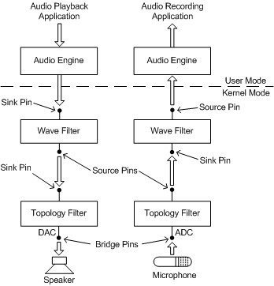

# Audio Filter Graphs

## 

A KS filter graph is a collection of KS filters that have been connected together to process one or more data streams. An audio filter graph is a KS filter graph that consists of filters that process audio data streams. For example, the following figure is a simplified diagram of an audio filter graph that performs audio rendering and capture.

In the figure, the filter graph extends from the pins at the top of the two wave filters to the pins at the bottom of the two topology filters. The user-mode software modules and external audio devices (that is, the speaker and microphone) lie outside the graph.

The four filters in the lower half of the figure represent hardware devices on an audio adapter that can render and capture wave streams. Each of the filters shown in the figure is implemented by binding a port driver to a miniport driver. The adapter driver forms a wave filter by binding the WaveRT, WavePci, or WaveCyclic port driver to a corresponding Wave*Xxx* miniport driver. The adapter driver forms a topology filter by binding the Topology port driver to a Topology miniport driver.

On the left side of the figure, the audio stream from a DirectSound or waveOut application (top) plays through a speaker (bottom). On the right side, a DirectSoundCapture or waveIn application (top) records the stream that is input from a microphone (bottom). On both sides, an instance of the audio engine, which performs mixing for the system in Windows Vista, is interposed between the wave filter and the application. (In Windows Server 2003, Windows XP, Windows 2000, and Windows Me/98, the [KMixer system driver](kernel-mode-wdm-audio-components.md#kmixer_system_driver) is the system mixer.)

The audio engine is a versatile software filter that runs in user mode and can readily convert between a variety of audio formats and sample rates at its source and sink pins. The audio engine can typically accommodate the differences between the stream format that the hardware is configured for and the stream format that the application expects.

At the bottom of the preceding figure, the source pin that drives the speaker and the sink pin that receives the microphone signal are labeled as bridge pins. A bridge pin bridges the boundary between a filter graph and the external world.

In the preceding figure, the data path shown between each wave filter and its corresponding topology filter typically represents a physical connection: a fixed, hardware connection on the audio adapter that cannot be configured by software.

Because a bridge pin or a pin with a physical connection is permanently connected, the pin exists implicitly and cannot be instantiated or deleted. Thus, there are no bridge pin objects (instances of bridge pins) to send IRPs to, although you can query a filter object for the [KSPROPSETID\_Pin](https://msdn.microsoft.com/library/windows/hardware/ff566584) properties of its bridge pins. The same rule applies to pins with physical connections.

The signal that passes through a bridge pin or physical connection can be either analog or digital.

For example, in the preceding figure, the two bridge pins both handle analog signals. The bridge pin on the left transmits the output signal from a DAC (digital-to-analog converter), which drives a speaker. The bridge pin on the right receives the signal from a microphone, which enters an ADC (analog-to-digital converter). However, a bridge pin might also represent an S/PDIF connector on an audio device. In this case, the signal that passes through the bridge pin is digital rather than analog.

 

 

--------------------
[Send comments about this topic to Microsoft](mailto:wsddocfb@microsoft.com?subject=Documentation%20feedback%20[audio\audio]:%20Audio%20Filter%20Graphs%20%20RELEASE:%20%287/18/2016%29&body=%0A%0APRIVACY%20STATEMENT%0A%0AWe%20use%20your%20feedback%20to%20improve%20the%20documentation.%20We%20don't%20use%20your%20email%20address%20for%20any%20other%20purpose,%20and%20we'll%20remove%20your%20email%20address%20from%20our%20system%20after%20the%20issue%20that%20you're%20reporting%20is%20fixed.%20While%20we're%20working%20to%20fix%20this%20issue,%20we%20might%20send%20you%20an%20email%20message%20to%20ask%20for%20more%20info.%20Later,%20we%20might%20also%20send%20you%20an%20email%20message%20to%20let%20you%20know%20that%20we've%20addressed%20your%20feedback.%0A%0AFor%20more%20info%20about%20Microsoft's%20privacy%20policy,%20see%20http://privacy.microsoft.com/default.aspx. "Send comments about this topic to Microsoft")

