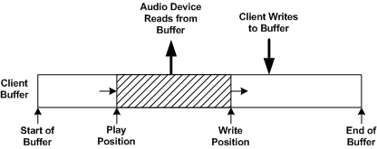

# Audio Position Property

The client of an audio driver uses the [**KSPROPERTY\_AUDIO\_POSITION**](https://msdn.microsoft.com/library/windows/hardware/ff537297) property to get and set the current position in an audio stream. The property uses a [**KSAUDIO\_POSITION**](https://msdn.microsoft.com/library/windows/hardware/ff537091) structure to describe the current position. The structure contains two members: **PlayOffset** and **WriteOffset**.

The **PlayOffset** and **WriteOffset** members define the boundaries of the region of the client buffer that is currently reserved for the exclusive use of the audio device. The client must assume that the device might currently be accessing any of the data contained in this region. Hence, the client must access only the portions of the buffer that lie outside this region. The boundaries of the region move as the stream advances.

If the client buffer is looped (that is, the stream type is [**KSINTERFACE\_STANDARD\_LOOPED\_STREAMING**](https://msdn.microsoft.com/library/windows/hardware/ff563381)), **PlayOffset** and **WriteOffset** are buffer-relative offsets. That is, they are specified as byte offsets from the start of the looped client buffer. When either offset increments to the end of the buffer, it wraps around to the start of the buffer. (The offset at the start of the buffer is zero.) Thus, neither offset ever exceeds the buffer size.

If the client buffer is nonlooped (that is, the stream type is [**KSINTERFACE\_STANDARD\_STREAMING**](https://msdn.microsoft.com/library/windows/hardware/ff563384)), **PlayOffset** and **WriteOffset** are stream-relative offsets. That is, they are specified as byte offsets from the start of the stream. These offsets can be thought of as offsets into an idealized buffer that contains the entire stream and is contiguous from beginning to end.

In the case of a render stream, the **PlayOffset** member specifies the play position of the stream, and the **WriteOffset** member specifies the write position of the stream. The following figure shows the play and write positions in a client buffer.

The play position is the byte offset of the sample that is currently being played (that is, the sample that is latched at the input of the digital-to-analog converter, or DAC). The write position is the position beyond which the client can safely write to the buffer. As the stream plays, the play and write positions move from left to right in the preceding figure. The client's writes must stay ahead of the write position. In addition, if the buffer is looped, the client's writes must never overtake the play position.

Although the WaveCyclic or WavePci port driver relies on the miniport driver to keep track of the play position, the port driver keeps track of the write position. The WaveCyclic and WavePci port drivers update the write position as follows:

-   **WaveCyclic**

    Each time the WaveCyclic port driver calls [**IDmaChannel::CopyTo**](https://msdn.microsoft.com/library/windows/hardware/ff536558) to copy a new block of data to the cyclic buffer (from the client buffer), the write position advances to the location (in the client buffer) of the last byte in the data block.

-   **WavePci**

    By default, each time the WavePci miniport driver calls [**IPortWavePciStream::GetMapping**](https://msdn.microsoft.com/library/windows/hardware/ff536909) to acquire a new mapping (of a portion of the client buffer) and the call succeeds, the write position advances to the location (in the client buffer) of the last byte in the new mapping.

    If the WavePci miniport driver overrides the default behavior by specifying a prefetch offset to the port driver, the current write position is always equal to the sum of the current play position and the prefetch offset. For more information, see [Prefetch Offsets](prefetch-offsets.md).

In the case of a capture stream, the **PlayOffset** member specifies the record position of the stream, and the **WriteOffset** member specifies the read position of the stream. The following figure shows the record and read positions in a client buffer.

The record position is the byte offset of the latest sample to be latched at the output of the analog-to-digital converter, or ADC. (This position specifies the buffer location into which the audio device's DMA engine will eventually write the sample.) The read position is the position beyond which the client cannot safely read from the buffer. As the recording of the stream progresses, the read and record positions advance from left to right in the preceding figure. The client's reads must trail the read position. In addition, if the buffer is looped, the client's reads must stay ahead of the record position.

Although the WaveCyclic or WavePci port driver relies on the miniport driver to keep track of the record position, the port driver keeps track of the read position. The WaveCyclic and WavePci port drivers update the read position as follows:

-   **WaveCyclic**

    Each time the WaveCyclic port driver calls [**IDmaChannel::CopyFrom**](https://msdn.microsoft.com/library/windows/hardware/ff536557) to copy a new block of data from the cyclic buffer (to the client buffer), the read position advances to the location (in the client buffer) of the last byte in the data block.

-   **WavePci**

    Each time the WavePci miniport driver calls [**IPortWavePciStream::ReleaseMapping**](https://msdn.microsoft.com/library/windows/hardware/ff536911) to release a previously acquired mapping (of a portion of the client buffer), the read position advances to the location (in the client buffer) of the last byte in the released mapping.

Miniport drivers do not need to implement handler routines for KSPROPERTY\_AUDIO\_POSITION property requests. Instead, the WaveCyclic and WavePci port drivers handle these requests on behalf of miniport drivers. When handling a get-property request, a WaveCyclic or WavePci port driver already has all the information it needs to calculate the **WriteOffset** value, but it still needs information from the miniport driver to calculate the **PlayOffset** value. To obtain this information, the port driver calls the miniport driver's [**IMiniportWaveCyclicStream::GetPosition**](https://msdn.microsoft.com/library/windows/hardware/ff536716) or [**IMiniportWavePciStream::GetPosition**](https://msdn.microsoft.com/library/windows/hardware/ff536727) method.

For a render stream, the **GetPosition** method retrieves the play position - the byte offset of the sample that is currently being played through the DAC. For a capture stream, the **GetPosition** method retrieves the record position - the byte offset of the latest sample to be captured by the ADC.

Note that the offset value retrieved by a **GetPosition** call is either a play position corresponding to the signal currently being transmitted through the speaker jack or a record position corresponding to the signal currently being received through the microphone jack. It is not the DMA position. (The DMA position is the byte offset of the sample that the DMA engine in the audio device is currently transferring to or from the DMA buffer.)

Some audio hardware contains a position register to keep track of the byte offset of the sample currently in each DAC or ADC, in which case the **GetPosition** method simply retrieves the contents of the position register for the appropriate stream. Other audio hardware can only supply the driver with the DMA position, in which case the **GetPosition** method must provide a best estimate of the byte offset of the sample in the DAC or ADC by taking into account the current DMA position and the buffering delays internal to the device.

Although the property handler in the WaveCyclic or WavePci port driver must distinguish between looped and nonlooped buffers to determine whether to provide a stream-relative or buffer-relative byte offset, this detail (that is, whether a buffer is looped or nonlooped) is transparent to the miniport driver.

The **IMiniportWaveCyclicStream::GetPosition** method always reports a buffer-relative play or record position regardless of whether the client buffer is looped or nonlooped. If the client buffer is looped, the property handler converts the buffer-relative position reported by the miniport driver, which is expressed as an offset into the cyclic buffer, to an offset into the client buffer, which the handler then writes to the **PlayOffset** member. If the client buffer is nonlooped, the property handler converts the buffer-relative play position to a stream-relative play position before writing it to the **PlayOffset** member.

The **IMiniportWavePciStream::GetPosition** method always reports a stream-relative play or record position regardless of whether the client buffer is looped or nonlooped. If the client buffer is looped, the property handler converts the stream-relative play position to a buffer-relative play position (expressed as an offset into the client buffer) before writing it to the **PlayOffset** member in the KSAUDIO\_POSITION structure in the property request. If the client buffer is nonlooped, the property handler writes the stream-relative position to the **PlayOffset** member.

The play or record position is zero immediately following initialization of the stream. A transition to the KSSTATE\_STOP state (see [**KSSTATE**](https://msdn.microsoft.com/library/windows/hardware/ff566856)) resets the position to zero. When the stream is halted by a transition from KSSTATE\_RUN to KSSTATE\_PAUSE or KSSTATE\_ACQUIRE, the position freezes. It unfreezes when the stream transitions from KSSTATE\_PAUSE or KSSTATE\_ACQUIRE back to KSSTATE\_RUN.

For example implementations of **GetPosition** methods for WaveCyclic and WavePci miniport drivers, see the sample audio drivers in the Windows Driver Kit (WDK).

 

 

