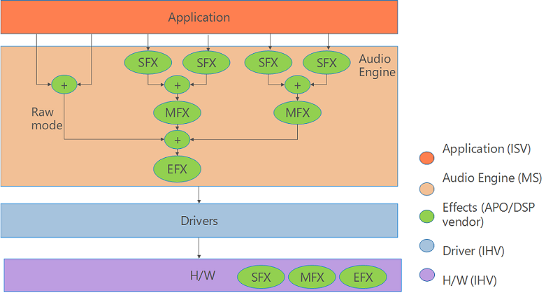
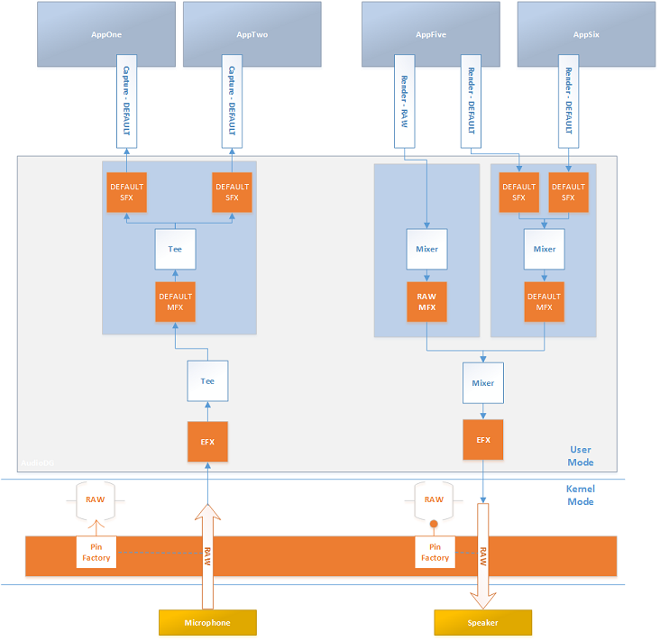
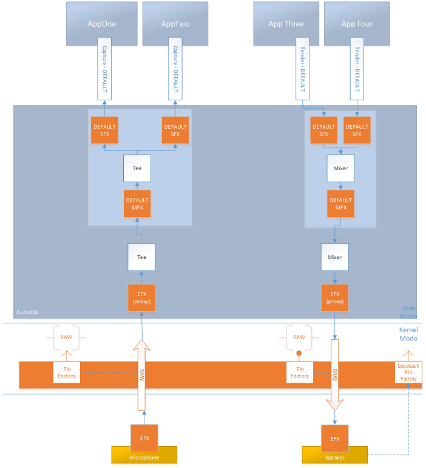
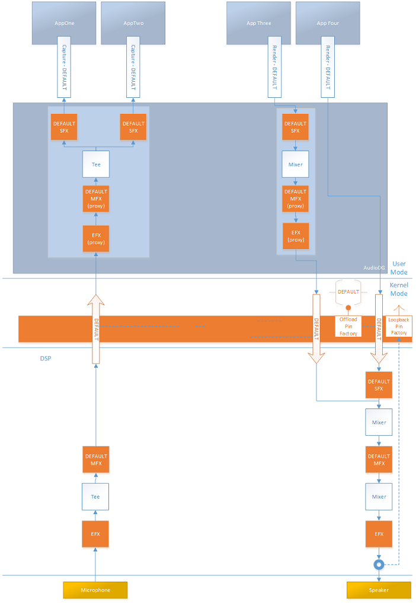

# Audio Processing Object Architecture

Audio processing objects (APOs), provide customizable software based digital signal processing for Windows audio streams.

## Audio Processing Objects Overview

Windows allows OEMs and third-party audio hardware manufacturers to include custom digital signal processing effects as part of their audio driver's value-added features. These effects are packaged as user-mode system effect Audio Processing Objects (APOs).

Audio processing objects (APOs), provide software based digital signal processing for Windows audio streams. An APO is a COM host object that contains an algorithm that is written to provide a specific Digital Signal Processing (DSP) effect. This capability is known informally as an "audio effect." Examples of APOs include graphic equalizers, reverb, tremolo, Acoustic Echo Cancellation (AEC) and Automatic Gain Control (AGC). APOs are COM-based, real-time, in-process objects.

**Note**   The descriptions and terminology in this documentation refers mostly to output devices. However, the technology is symmetric and works essentially in reverse for input devices.

 

**Software APOs vs. Hardware DSP**

A hardware digital signal processor (DSP) is a specialized microprocessor (or a SIP block), with its architecture optimized for the operational needs of digital signal processing. There can be significant advantages to implement audio processing in purpose built hardware vs. using a software APO. One advantage is that the CPU use and associated power consumption may be lower with a hardware implemented DSP.

There are other advantages and disadvantages to consider, specific your projects goals and constraints that you will want to consider before implementing a software based APO.

Software based effects are inserted in the software device pipe on stream initialization. These solutions do all their effects processing on the main CPU and do not rely on external hardware. This type of solution is best for traditional Windows audio solutions such as HDAudio, USB and Bluetooth devices when the driver and hardware only support RAW processing. For more information about RAW processing, see [Audio Signal Processing Modes](audio-signal-processing-modes.md).

**Proxy APO for Hardware DSP**

Any effects applied in hardware DSP need to be advertised via a proxy APO. Microsoft provides a default proxy APO (MsApoFxProxy.dll). To use the Microsoft provided APO, this property set and property must be supported.

-   [KSPROPSETID\_AudioEffectsDiscovery](https://msdn.microsoft.com/library/windows/hardware/dn457709)
-   [KSPROPERTY\_AUDIOEFFECTSDISCOVERY\_EFFECTSLIST](https://msdn.microsoft.com/library/windows/hardware/dn457706)

Optionally, you can implement your own proxy APO.

**Windows Provided (System) APOs**

Windows installs a default set of APOs, that provide a number of different audio effects. For a list of the system provided APO effects, see [Audio Signal Processing Modes](audio-signal-processing-modes.md).

OEMs can include all of the system supplied APOs or replace some or all of them with custom APOs.

**Custom APOs**

It is possible to create custom APOs to enhance the Windows audio experience by adding additional audio effects.

The OEM can include any combination of the provided Windows APOs and custom APOs when they ship Windows.

A custom APO can be installed by an OEM or a third-party to enhance the audio experience after the device has been purchased. When users install an audio device driver by using the standard INF file, they automatically have access to the system's APOs. Independent hardware vendors (IHVs) and original equipment manufacturers (OEMs) can provide additional custom system effects while still using the Microsoft class drivers. They do so by packaging their DSP algorithms as APOs and modifying the standard INF file to insert their APOs into the audio engine’s signal processing graph.

For more information on creating custom APOs see, [Implementing Audio Processing Objects](implementing-audio-processing-objects.md).

**Custom APO Properties UI**

On desktop PCs, you can create a custom APO properties page to allow the user to configure settings associated with your custom APO. This custom APO page can be made available to the user as an extension of the standard Windows audio settings.

The SYSVAD audio sample includes an example custom APO control sample. This screen shot shows the property page for the SYSVAD audio Swap APO sample.

For more information on adding APO dialog panels see, [Implementing a UI for Configuring APO Effects](implementing-a-ui-for-configuring-apo-effects.md).

**Custom APO Tests and Requirements**

The Microsoft HLK provides tests that can be used with APOs. For more information about audio tests see, [Device.Audio Testing](https://msdn.microsoft.com/library/windows/hardware/jj123955.aspx) and [Device.Audio Tests](https://msdn.microsoft.com/library/windows/hardware/jj124726.aspx).

These two tests can be particularly useful when working with APOs.

[Verify Audio EffectsDiscovery (Manual) - Certification](https://msdn.microsoft.com/library/windows/hardware/dn456312.aspx)

[SysFX Test](https://msdn.microsoft.com/library/windows/hardware/jj124017.aspx)

For information on audio requirements to support APOs, see [Device.Audio Requirements](https://msdn.microsoft.com/library/windows/hardware/jj134354.aspx).

**Custom APO Tools and Utilities**

You can use the "Audio Effects Discovery Sample" to explore the available audio effects. This sample demonstrates how to query audio effects on render and capture audio devices and how to monitor changes with the audio effects. It is included as part of the SDK samples and can be downloaded using this link:

[Audio effects discovery sample](https://code.msdn.microsoft.com/windowsapps/Audio-effects-discovery-5fd65c15)

**Application Audio Effect Awareness**

Applications have the ability to call APIs to determine which audio effects are currently active on the system. For more information on the audio effects awareness APIs, see [AudioRenderEffectsManager class](https://msdn.microsoft.com/library/windows/apps/windows.media.effects.audiorendereffectsmanager.aspx).

## Audio Processing Objects Architecture

**Placement of Audio Effects**

There are three different locations for audio effects implemented as APOs. They are in Stream effects (SFX), Mode effects (MFX), and Endpoint effects (EFX).

**Stream Effect (SFX)**

A stream effect APO has an instance of the effect for every stream. Stream effects are before the mix (render) or after the tee (capture) for a given mode and can be used for changing channel count before the mixer. Stream effects are not used for raw streams.

Some versions of Windows, as an optimization, do not load SFX or MFX APOs in RAW mode.

-   Windows 8.1 does not load RAW SFX or RAW MFX
-   Windows 10 loads RAW MFX but not RAW SFX

**Mode Effect (MFX)**

Mode effects (MFX) are applied to all streams that are mapped to the same mode. Mode effects are applied after the mix (render) or before the tee (capture) for a given mode, but before the mix (render) or after the tee (capture) of all modes. Any scenario specific effect or effect that doesn’t need the specifics of the stream effect should be placed here. It is more power efficient to use a mode effect since there is one instance for multiple streams that share the same characteristics like periodicity and format.

**Endpoint Effect (EFX)**

Endpoint Effect (EFX) are applied to all streams that use the same endpoint. An endpoint effect is always applied, even to raw streams. That is, it is after the mix (render) or before the tee (capture) of all modes. The endpoint effects should be used with care and when in doubt an effect should be place in the Mode area. Some effects that should be placed in the endpoint area are speaker protection and speaker compensation.

This diagram shows the possible locations for stream (SFX), mode (MFX) and endpoint (EFX) effects for Windows 10.

**Multiple Custom APO Effects**

It is possible to configure multiple APO based effects to work with different applications.

This diagram illustrates how multiple applications can access multiple combinations of stream, mode and endpoint APO effects. All of the APOs are COM based and run in user mode. In this scenario, none of the effects are running in hardware or in kernel mode.

**Note**  You can use the scroll bar at the very bottom of this page to view all of this diagram.

 

**Software Mode Effects and Hardware Endpoint Effects for Render and Capture**

This diagram illustrates software mode effects and hardware endpoint effects for render and capture.

**DSP Equipped System with Hardware Effects**

This diagram illustrates a DSP equipped system that implements effects in hardware. In this scenario, a Proxy APO should be created to inform the apps of the effects that are implemented in hardware.

## Related topics
[Windows Audio Processing Objects](windows-audio-processing-objects.md)  
[Implementing a UI for Configuring APO Effects](implementing-a-ui-for-configuring-apo-effects.md)  

