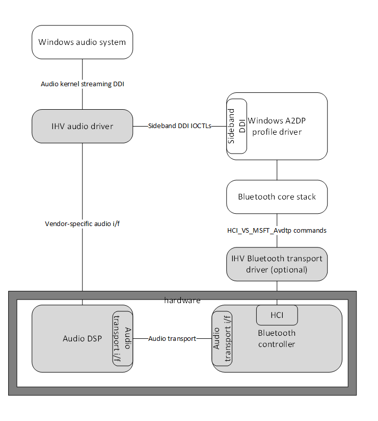

# Audio Sideband A2DP Offload  

This topic describes audio sideband A2DP offload, which is available starting in Windows 11, build 10.0.22000 for Bluetooth.

The primary goal of audio sideband A2DP offload is to reduce power consumption, for example during example music playback.

This document assumes some familiarity with the existing HF sideband solution. See [Bluetooth Bypass Guidelines for Audio Drivers](/windows-hardware/drivers/audio/bluetooth-bypass-guidelines-for-audio-drivers) and the A2DP Bluetooth specifications referenced in the [see also](#see-also) section of this topic.

## Sideband architecture design

Audio sideband A2DP offload builds on existing proven designs for reducing power consumption during playback of linear audio content through integrated (built in) speakers or connected analog headphones. In brief, these designs burst large amounts of audio data (on the order of one second) into an audio DSP through a vendor-specific audio driver. The main processors and most other circuitry enter a low power state while the audio DSP streams the bursted audio data through the built-in speakers. When the audio data is nearly depleted, the DSP raises an interrupt to the audio driver which signals the OS to burst more audio data through the audio driver to the DSP.

Light gray components in the following diagram are supplied by the IHV.



Audio sideband A2DP offload also builds on a common design for the Bluetooth SCO audio path, where the same audio DSP is connected directly to the Bluetooth controller.

This connection is often an [I2S](https://en.wikipedia.org/wiki/I%C2%B2S) or PCM interface, but can also be a richer, more complex bus such as [SLIMbus](https://mipi.org/specifications/mipi-slimbus). Microsoft refers to this architecture as _sideband audio_, reflecting the fact that audio transfers into the Bluetooth (or other) controller through an alternate path rather than the normal controller interface (the &quot;HCI&quot;). In this case, the audio driver transfers audio data from the OS to audio DSP, the audio DSP transfers data over the sideband connection to the hardware bus controller, and the controller transmits audio data to the connected device. (For bidirectional audio, the reverse direction also occurs.) While more components are involved, this may have advantages over the normal controller interface. In some use cases (primarily cellular calls), the entire end-to-end audio signal path is handled by firmware, offloaded from the main processors. It also may provider a better interface for real-time/isochronous audio data transfer to and from host software. For this sideband connection, Microsoft defines a sideband DDI used by the audio driver to support audio endpoints having this physical design.

## Components

### IHV audio driver (audio DSP driver)

This driver controls integrated audio endpoints, cellular audio, and HFP/SCO sideband/offload. This feature requires the driver to also support A2DP offload. The driver’s responsibilities are like those for HFP/SCO.

### IHV Bluetooth transport driver and controller

A2DP offload is not defined in any Bluetooth SIG standard. This feature enhances and adds Microsoft-defined Bluetooth HCI commands. To support this feature, the IHV’s Bluetooth controller or an IHV driver shall support these commands.

### A2DP profile driver

This driver is provided by Windows. Its functions include the following.

- Implements the A2DP and AVDTP specifications
- Exposes PnP device interface instances (the A2DP sideband interface) for the IHV audio driver to discover, open, and send requests
- Supports the sideband IOCTL requests defined in this document
- Sends Microsoft-defined Bluetooth HCI commands for A2DP offload

### IHV audio driver (audio DSP driver) requirement

If an audio driver on a system is configured for A2DP sideband streaming, then it shall publish a device interface with class GUID set to `GUID_SIDEBANDAUDIO_A2DP_SUPPORT_INTERFACE` {2BC51EE4-07AF-49CF-B04B-FB3F1C26AADC}. This device interface should be present no later than PnP startup of the audio driver.

### Sideband data structures

Note that some data structures and constants used by the audio driver are defined in the [sidebandaudio.h](/windows-hardware/drivers/ddi/sidebandaudio/) header.

The following data structures are used for audio sideband A2DP offload.

#### Device Descriptor - [SIDEBANDAUDIO_DEVICE_DESCRIPTOR](/windows-hardware/drivers/ddi/sidebandaudio/ns-sidebandaudio-_sidebandaudio_device_descriptor)

| Element               | Description                                             |
|-----------------------|---------------------------------------------------------|
| **NumberOfEndpoints** | Indicates the number of endpoints on a connected device |

Connected device can be a composite device containing multiple Audio endpoints (speaker, microphone, etc.). The audio driver can iterate for each endpoint and get further details to build KS filters for each endpoint.

#### Endpoint Descriptor - [SIDEBANDAUDIO_ENDPOINT_DESCRIPTOR](/windows-hardware/drivers/ddi/sidebandaudio/ns-sidebandaudio-_sidebandaudio_endpoint_descriptor)

The SIDEBANDAUDIO_ENDPOINT_DESCRIPTOR is defined as follows.

| Element    | Description                                                                          |
|------------|--------------------------------------------------------------------------------------|
| **CbSize** | Total size of the Endpoint Descriptor. This includes the buffer for storing strings. |
| **ContainerId** | GUID for endpoints. A common GUID for multiple endpoints indicates that those endpoints are contained within the same physical container. OS can easily associate such endpoints for various scenarios. |
| **Category** | KSPIN_DESCRIPTOR. Category to indicate form factor for each endpoint. |
| **Direction** | Indicates Capture or Render data flow direction. |
| **Capabilities** | (See table below)  |
| **FriendlyName** | Friendly name for endpoint to be applied to the DEVPKEY_DeviceInterface_FriendlyName on the Endpoint KS Filter interface. |
| **VolumePropertyValuesSize** | Size of KSPROPERTY_DESCRIPTION structure describing the volume stepping and range for each channel. |
| **SidetoneVolumePropertyValueSize** | Size of KSPROPERTY_DESCRIPTION structure describing the volume stepping and range for each channel for Sidetone. |

#### Endpoint Descriptor - [SIDEBANDAUDIO_ENDPOINT_DESCRIPTOR](/windows-hardware/drivers/ddi/sidebandaudio/ns-sidebandaudio-_sidebandaudio_endpoint_descriptor) - Capabilities

Capabilities are defined as follows.

| Element      | Description                              |
|--------------|------------------------------------------|
| **Volume**   | Endpoint supports Volume control         |
| **Mute**     | Endpoint supports Mute control           |
| **Sidetone** | Endpoint supports Sidetone control       |
| **Feedback** | Endpoint has associated feedback channel |

#### SIDEBANDAUDIO_ENDPOINT_DESCRIPTOR2

A2DP sideband uses an updated version of the existing SIDEBANDAUDIO_ENDPOINT_DESCRIPTOR structure to provide more information needed by the Windows audio system for endpoint identification - [SIDEBANDAUDIO_ENDPOINT_DESCRIPTOR2](/windows-hardware/drivers/ddi/sidebandaudio/ns-sidebandaudio-_sidebandaudio_endpoint_descriptor2).

```cpp
// Number of device properties that shall be added to the audio filter factory interface.
ULONG                                   FilterInterfacePropertyCount;
DEVPROPERTY*                            FilterInterfaceProperties;
```

The audio driver obtains this data structure using the new [IOCTL_SBAUD_GET_ENDPOINT_DESCRIPTOR2](/windows-hardware/drivers/ddi/sidebandaudio/ni-sidebandaudio-ioctl_sbaud_get_endpoint_descriptor2) request. Upon completion of the request, the audio driver adds these device properties to its Topology audio filter interface.

### Audio interface parameters

The choice and design of the audio transport between the audio device and the Bluetooth controller is vendor-specific. This audio transport is often an [I2S](https://en.wikipedia.org/wiki/I%C2%B2S) or PCM interface, but can also be a richer, more complex bus such as [SLIMbus](https://mipi.org/specifications/mipi-slimbus) or potentially [SoundWire](https://mipi.org/specifications/soundwire). This feature design places no specific requirements on the audio transport. However, if the Bluetooth codec is implemented in the audio DSP then the Bluetooth controller shall be able to extract the encoded frames from the data transmitted across the audio transport to package these frames into AVDTP media packets for transmission.

Setup and configuration (if any) of the audio transport is considered a vendor-specific task. This is facilitated by vendor-specific audio interface parameters passed between components in this feature. The vendor-specific parameters are defined commonly by the audio driver vendor and Bluetooth controller and/or transport driver vendor. The parameters are used by the audio device and the Bluetooth controller to configure the audio transport between the audio DSP and Bluetooth controller.

For example, this data might include a transport ID if there are multiple physical or logical connections, configuring the use of signals of a PCM interface, or the format of the audio data across the transport.

The audio driver sets and gets vendor-specific audio interface parameters using SIOPs, which identify the data using a GUID and integer. However, to maintain a more natural Bluetooth HCI command set, the Microsoft-defined HCI commands pass vendor-specific audio interface parameters using the following structure.

#### Audio Interface Parameter

| Field                                   | Octet  |
|-----------------------------------------|--------|
| Vendor ID                               | 0..3   |
| Vendor Specific Parameter ID            | 4..5   |
| Length of Vendor Specific Value = (n-9) | 6      |
| Vendor Specific Value                   | 7.. n  |

A Vendor ID is as defined in Bluetooth Assigned Numbers: [https://www.bluetooth.com/specifications/assigned-numbers/company-identifiers](https://www.bluetooth.com/specifications/assigned-numbers/company-identifiers).

The A2DP driver performs a straight-forward conversion between vendor-SIOPs, which are more natural data structure for the audio driver, and an audio interface parameter that is more natural for the Bluetooth HCI. The vendor SIOP GUID is constructed from a base GUID plus 4-character Bluetooth Vendor ID. Only the Vendor ID (not the entire GUID) passes across the Bluetooth HCI.

The base GUID is `SIDEBANDAUDIO_PARAMS_SET_A2DP`.

## Microsoft-defined A2DP SIOPs

Microsoft defines two SIOPs for A2DP that provide codec information. Vendors can define additional SIOPs to support their implementation.

### Codecs (codecs-SIOP)

The audio driver expresses its list of supported A2DP codecs (if any) using this SIOP. The SIDEBANDAUDIO_IO_PARAM_HEADER fields for this SIOP are set as follows.

| Field     | Value                                                                  |
|-----------|------------------------------------------------------------------------|
| ParamsSet | SIDEBANDAUDIO_PARAMS_SET_A2DP ({8FE0297F-3AE6-4384-ACE3-87589E571B9C}) |
| TypeId    | SIDEBANDAUDIO_PARAM_A2DP_CODECS  (1)                                   |
| Size      | Total size of codec capabilities list that follows this header         |

The data that follows this header is a sequence of (variable-sized) codec capability structures as described in Codec capabilities information above.

For the rest of this topic, this parameter is referred to as the codecs-SIOP.

#### Configured codec (configured-codec-SIOP)

The audio driver can retrieve the currently configured A2DP codec using this SIOP. The [SIDEBANDAUDIO_IO_PARAM_HEADER](/windows-hardware/drivers/ddi/sidebandaudio/ns-sidebandaudio-sidebandaudio_io_param_header) fields for this SIOP are set as follows.

| Field     | Value                                                                  |
|-----------|------------------------------------------------------------------------|
| ParamsSet | SIDEBANDAUDIO_PARAMS_SET_A2DP ({8FE0297F-3AE6-4384-ACE3-87589E571B9C}) |
| TypeId    | SIDEANDAUDIO_PARAM_A2DP_CONFIGURED_CODEC   (2)                         |
| Size      | Total size of the codec capability that follows this header            |

The data that follows this header is a single (variable-sized) codec capability structure as described in codec capabilities information above.

This SIOP is updatable, which means the audio driver should use the [IOCTL_SBAUD_GET_SIOP_UPDATE](/windows-hardware/drivers/ddi/sidebandaudio/ni-sidebandaudio-ioctl_sbaud_get_siop_update) request to stay informed of changes in the configured codec.

For the rest of this topic, this parameter is referred to as the configured-codec-SIOP.

#### Codec active latency mode (codec-latency-mode-SIOP)

The audio driver can retrieve the active latency mode of the currently configured A2DP codec using this SIOP. The [SIDEBANDAUDIO_IO_PARAM_HEADER](/windows-hardware/drivers/ddi/sidebandaudio/ns-sidebandaudio-sidebandaudio_io_param_header) fields for this SIOP are set as follows.

| Field     | Value                                       |
|-----------|---------------------------------------------|
| ParamsSet | SIDEBANDAUDIO_PARAMS_SET_A2DP               |
| TypeId    | SIDEBANDAUDIO_PARAM_A2DP_CODEC_LATENCY_MODE |
| Size      | 1 byte                                      |

The data that follows this header is a single byte that is interpreted as an unsigned 8-bit integer. The value `SIDEBANDAUDIO_CODEC_MODE_HIGH_QUALITY` indicates that the currently configured codec is operating in high-quality mode, while the value `SIDEBANDAUDIO_CODEC_MODE_LOW_LATENCY` indicates that the codec is operating in low-latency mode.
This SIOP is updatable, which means the audio driver should use the [IOCTL_SBAUD_GET_SIOP_UPDATE](/windows-hardware/drivers/ddi/sidebandaudio/ni-sidebandaudio-ioctl_sbaud_get_siop_update) request to stay informed of changes in the latency mode.

Currently, this SIOP is only used when the aptX Adaptive codec is active. For more information on aptX, see [Qualcomm aptX Adaptive Audio](https://www.aptx.com/aptx-adaptive).

For the rest of this topic, this parameter is referred to as the codec-latency-mode-SIOP.

#### Codec L2CAP MTU size (mtu-size-SIOP)

The audio driver can retrieve the current L2CAP MTU size (in bytes) by using this SIOP. The [SIDEBANDAUDIO_IO_PARAM_HEADER](/windows-hardware/drivers/ddi/sidebandaudio/ns-sidebandaudio-sidebandaudio_io_param_header) fields for this SIOP are set as follows.

| Field     | Value                                   |
|-----------|-----------------------------------------|
| ParamsSet | SIDEBANDAUDIO_PARAMS_SET_A2DP           |
| TypeId    | SIDEBANDAUDIO_PARAM_A2DP_CODEC_MTU_SIZE |
| Size      | 2 bytes                                 |

The data that follows this header is 2 bytes that are interpreted as an unsigned 16-bit integer. This SIOP is updatable, which means the audio driver should use the [IOCTL_SBAUD_GET_SIOP_UPDATE](/windows-hardware/drivers/ddi/sidebandaudio/ni-sidebandaudio-ioctl_sbaud_get_siop_update) request to stay informed of changes in the MTU size.

Currently, this SIOP is only used when the aptX Adaptive codec is active. For more information on aptX, see [Qualcomm aptX Adaptive Audio](https://www.aptx.com/aptx-adaptive).

For the rest of this topic, this parameter is referred to as the mtu-size-SIOP.

### Use of vendor-defined SIOPs

The audio driver may set vendor-defined SIOPs.

#### Vendor-SIOPs set after opening the sideband interface and before IOCTL_SBAUD_GET_ENDPOINT_DESCRIPTOR

The A2DP driver saves the SIOP values in a collection of system configuration vendor SIOPs. The A2DP driver sends this collection to the Bluetooth controller (using HCI_VS_MSFT_Avdtp_Capabilities_Configuration) while handling [IOCTL_SBAUD_GET_ENDPOINT_DESCRIPTOR2](/windows-hardware/drivers/ddi/sidebandaudio/ni-sidebandaudio-ioctl_sbaud_get_endpoint_descriptor2). Any audio interface parameters returned by the Bluetooth controller are also stored in the collection of _system configuration vendor SIOPs_. The audio driver can get these values at any time after the IOCTL completes.

#### Vendor SIOPs set after IOCTL_SBAUD_GET_ENDPOINT_DESCRIPTOR2

The A2DP driver fails any SIOPs sent by the audio driver after IOCTL_SBAUD_GET_ENDPOINT_DESCRIPTOR2.

#### Vendor SIOPs set after IOCTL_SBAUD_GET_ENDPOINT_DESCRIPTOR and before IOCTL_SBAUD_STREAM_OPEN

The A2DP driver saves the SIOP values in a collection of _stream configuration vendor SIOPs_. The A2DP driver sends this collection to the Bluetooth controller (using HCI_VS_MSFT_Avdtp_Open) while handling [IOCTL_SBAUD_STREAM_OPEN](/windows-hardware/drivers/ddi/sidebandaudio/ni-sidebandaudio-ioctl_sbaud_stream_open). Any audio interface parameters returned by the Bluetooth controller are also stored in the collection of stream configuration vendor SIOPs. The audio driver can get these values at any time after the IOCTL completes.

The A2DP driver clears the collection of stream configuration vendor SIOPs when handling [IOCTL_SBAUD_STREAM_CLOSE](/windows-hardware/drivers/ddi/sidebandaudio/ni-sidebandaudio-ioctl_sbaud_stream_close). (It does not clear the collection of system configuration vendor SIOPs.)

### A2DP sideband interface

A2DP sideband uses the generic IOCTL_SBAUD_\* requests. See the [sidebandaudio.h](/windows-hardware/drivers/ddi/sidebandaudio/) header for a complete list of the IOCTLs. This section provides information specific to A2DP.
  
### PnP interface class

Interface class is `GUID_DEVINTERFACE_A2DP_SIDEBAND_AUDIO` for A2DP sideband Bluetooth audio.

#### IOCTLs used for KS pin state transitions

The audio driver sends these requests on certain KS pin state transitions.

- On first transition above KSSTATE_STOP (normally to KSSTATE_ACQUIRE), send [IOCTL_SBAUD_STREAM_OPEN](/windows-hardware/drivers/ddi/sidebandaudio/ni-sidebandaudio-ioctl_sbaud_stream_open).
- On transition up to KSSTATE_RUN, send [IOCTL_SBAUD_STREAM_START](/windows-hardware/drivers/ddi/sidebandaudio/ni-sidebandaudio-ioctl_sbaud_stream_start).
- On transition below KSSTATE_RUN, send [IOCTL_SBAUD_STREAM_SUSPEND](/windows-hardware/drivers/ddi/sidebandaudio/ni-sidebandaudio-ioctl_sbaud_stream_suspend).
- On closure of KS pin, send [IOCTL_SBAUD_STREAM_CLOSE](/windows-hardware/drivers/ddi/sidebandaudio/ni-sidebandaudio-ioctl_sbaud_stream_close).

### Microsoft-defined Bluetooth HCI extensions for A2DP offload

See [Microsoft-defined Bluetooth HCI extensions](/windows-hardware/drivers/bluetooth/microsoft-defined-bluetooth-hci-commands-and-events#microsoft-defined-bluetooth-hci-events) for the currently defined extensions.

#### HCI_VS_MSFT_Read_Supported_Features

Audio sideband A2DP offload enhances the [HCI_VS_MSFT_Read_Supported_Features](/windows-hardware/drivers/bluetooth/microsoft-defined-bluetooth-hci-commands-and-events#hci_vs_msft_read_supported_features) command by defining another bit in the **Supported_features** return parameter to indicate support for AVDTP offload commands. When this bit is returned set, the remaining commands in this section shall be supported.

For a description of the command and return parameters, refer to [HCI_VS_MSFT_Read_Supported_Features](/windows-hardware/drivers/bluetooth/microsoft-defined-bluetooth-hci-commands-and-events#hci_vs_msft_read_supported_features).

For the **Supported_features** (8 octets) values, also see [HCI_VS_MSFT_Read_Supported_Features](/windows-hardware/drivers/bluetooth/microsoft-defined-bluetooth-hci-commands-and-events#hci_vs_msft_read_supported_features). An additional value is used to indicate that the Controller supports AVDTP offload and the HCI_VS_MSFT_Avdtp_\* commands that are described in [Microsoft-defined AVDTP Bluetooth HCI events](/windows-hardware/drivers/bluetooth/microsoft-defined-bluetooth-hci-commands-and-events#microsoft-defined-bluetooth-avdtp-hci-commands).

### Audio Related Microsoft-defined Bluetooth HCI extensions  

Bluetooth Host-Controller Interface (HCI) specifies all interactions between a host and a Bluetooth radio controller. Bluetooth specifications allow vendor-defined HCI commands and events to enable non-standardized interaction between hosts and controllers. Microsoft defines vendor-specific HCI commands and events that are consumed by Windows. The following Microsoft defines HCI commands are used for audio sideband offload.

The following AVDTP HCI commands are described in the Bluetooth topic - [Microsoft-defined AVDTP Bluetooth HCI events](/windows-hardware/drivers/bluetooth/microsoft-defined-bluetooth-hci-commands-and-events#microsoft-defined-bluetooth-avdtp-hci-commands).

#### HCI_VS_MSFT_Avdtp_Capabilities_Configuration

Subcommand opcode value: 7

Configures the audio transport interface and returns codec capabilities of the Bluetooth controller, which is a list of codec information blocks. Each codec information block describes one supported codec. For more information, see [HCI_VS_MSFT_Avdtp_Capabilities_Configuration](/windows-hardware/drivers/bluetooth/microsoft-defined-bluetooth-hci-commands-and-events#hci_vs_msft_avdtp_capabilities_configuration).

#### HCI_VS_MSFT_Avdtp_Open

Subcommand opcode value: 8

Allocates and configures AVDTP offload resources within the controller. For more information, see [HCI_VS_MSFT_Avdtp__Open](/windows-hardware/drivers/bluetooth/microsoft-defined-bluetooth-hci-commands-and-events#hci_vs_msft_avdtp_open).

#### HCI_VS_MSFT_Avdtp_Start

Subcommand opcode value: 9

This command begins audio streaming from the audio transport to transmitted AVDTP media packets. For more information, see [HCI_VS_MSFT_Avdtp_Start](/windows-hardware/drivers/bluetooth/microsoft-defined-bluetooth-hci-commands-and-events#hci_vs_msft_avdtp_start).

#### HCI_VS_MSFT_Avdtp_Suspend

Subcommand opcode value: 0xA

Stops the streaming activity initiated by HCI_VS_MSFT_Avdtp_Start. For more information, see [HCI_VS_MSFT_Avdtp_Suspend](/windows-hardware/drivers/bluetooth/microsoft-defined-bluetooth-hci-commands-and-events#hci_vs_msft_avdtp_suspend).

#### HCI_VS_MSFT_Avdtp_Close

Subcommand opcode value: 0xB

Releases the AVDTP offload resources allocated by HCI_VS_MSFT_Avdtp_Open. For more information, see [HCI_VS_MSFT_Avdtp_Close](/windows-hardware/drivers/bluetooth/microsoft-defined-bluetooth-hci-commands-and-events#hci_vs_msft_avdtp_close).

### Bluetooth codecs in audio DSP or Bluetooth controller

The implementation accommodates Bluetooth codecs hosted in the audio DSP and/or Bluetooth controller. The codecs-SIOP provides a mechanism for the audio driver to indicate a list of supported codecs. Similarly, the [HCI_VS_MS_Avdtp_Capabilities_Configuration](/windows-hardware/drivers/bluetooth/microsoft-defined-bluetooth-hci-commands-and-events#hci_vs_msft_avdtp_capabilities_configuration) command allows the Bluetooth controller to return a list of supported codecs. Note, at least one of the A2DP driver and the Bluetooth controller shall return a list of supported codecs.

The A2DP driver cannot reliably intersect or merge lists of A2DP codecs supported by both the audio driver and the Bluetooth controller. If both return A2DP supported codecs, Windows uses only the list returned by the Bluetooth transport driver.

If the IHV solution requires intersecting or merging of codec-related capabilities of the audio DSP and Bluetooth controller capabilities, then the audio driver can indicate its capabilities through either the codecs-SIOP (if the standard representation is sufficient) or a vendor-SIOP. The A2DP driver passes SIOPs to the Bluetooth controller which can then intersect the capabilities and return the resulting set of supported codecs from [HCI_VS_MSFT_Avdtp_Capabilities_Configuration](/windows-hardware/drivers/bluetooth/microsoft-defined-bluetooth-hci-commands-and-events#hci_vs_msft_avdtp_capabilities_configuration).

### See also

[Microsoft-defined Bluetooth HCI extensions](/windows-hardware/drivers/bluetooth/microsoft-defined-bluetooth-hci-commands-and-events)

[Bluetooth Bypass Guidelines for Audio Drivers](/windows-hardware/drivers/audio/bluetooth-bypass-guidelines-for-audio-drivers)

[Transport Bus Driver for Bluetooth Power Control Handling Guidelines](/windows-hardware/drivers/bluetooth/transport-bus-driver-for-bluetooth-power-control-handling-guidelines)

[A2DP 1.3.1 (Bluetooth Specification)](https://www.bluetooth.org/DocMan/handlers/DownloadDoc.ashx?doc_id=303201)

[AVDTP 1.3 (Bluetooth Specification)](https://www.bluetooth.org/docman/handlers/DownloadDoc.ashx?doc_id=260860&vId=290084)
