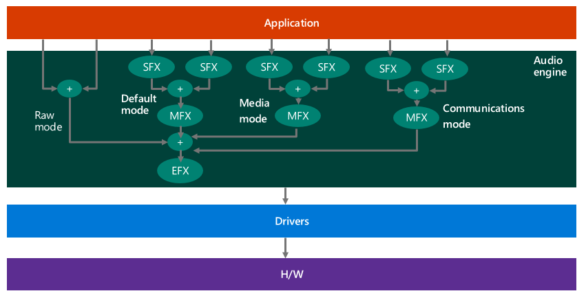

# Audio Signal Processing Modes


Drivers declare the supported audio signal processing modes for each device.

## <span id="Available_Signal_Processing_Modes"></span><span id="available_signal_processing_modes"></span><span id="AVAILABLE_SIGNAL_PROCESSING_MODES"></span>Available Signal Processing Modes


Audio categories (selected by applications) are mapped to audio modes (defined by drivers). Windows defines seven audio signal processing modes. OEMs and IHVs can determine which modes they want to implement. It is recommended that IHVs/OEMs utilize the new modes to add audio effects that optimize the audio signal to provide the best user experience. The modes are summarized in the table shown below.

<table>
<colgroup>
<col width="33%" />
<col width="33%" />
<col width="33%" />
</colgroup>
<tbody>
<tr class="odd">
<td align="left"><strong>Mode</strong></td>
<td align="left"><strong>Render/Capture</strong></td>
<td align="left"><strong>Description</strong></td>
</tr>
<tr class="even">
<td align="left">Raw</td>
<td align="left">Both</td>
<td align="left"><p>Raw mode specifies that there should not be any signal processing applied to the stream.</p>
<p>An application can request a raw stream that is completely untouched and perform its own signal processing.</p></td>
</tr>
<tr class="odd">
<td align="left">Default</td>
<td align="left">Both</td>
<td align="left"><p>This mode defines the default audio processing.</p></td>
</tr>
<tr class="even">
<td align="left">Movies *</td>
<td align="left">Render</td>
<td align="left">Movie audio playback</td>
</tr>
<tr class="odd">
<td align="left">Media *</td>
<td align="left">Both</td>
<td align="left">Music audio playback (default for most media streams)</td>
</tr>
<tr class="even">
<td align="left">Speech *</td>
<td align="left">Capture</td>
<td align="left">Human voice capture (e.g. input to Cortana)</td>
</tr>
<tr class="odd">
<td align="left">Communications *</td>
<td align="left">Both</td>
<td align="left">VOIP render and capture (e.g. Skype, Lync)</td>
</tr>
<tr class="even">
<td align="left">Notification *</td>
<td align="left">Render</td>
<td align="left">Ringtones, alarms, alerts, etc.</td>
</tr>
</tbody>
</table>

 

\* New in Windows 10.

## <span id="Signal_Processing_Mode_Driver_Requirements"></span><span id="signal_processing_mode_driver_requirements"></span><span id="SIGNAL_PROCESSING_MODE_DRIVER_REQUIREMENTS"></span>Signal Processing Mode Driver Requirements


Audio device drivers need to support at least the *Raw* or *Default* mode. Supporting additional modes is optional.

It is possible that not all modes might be available for a particular system. Drivers define which signal processing modes they support (i.e. what types of APOs are installed as part of the driver) and inform the OS accordingly. If a particular mode is not supported by the driver, then Windows will use the next best matching mode.

The following diagram shows a system that supports multiple modes:



## <span id="Windows_Audio_Stream_Categories"></span><span id="windows_audio_stream_categories"></span><span id="WINDOWS_AUDIO_STREAM_CATEGORIES"></span>Windows Audio Stream Categories


In order to inform the system about the usage of an audio stream, applications have the option to tag the stream with a specific audio stream category. Applications can set the audio category, using any of the audio APIs, just after creating the audio stream. In Windows 10 there are nine audio stream categories.

|                |                                                                                                       |
|----------------|-------------------------------------------------------------------------------------------------------|
| **Category**   | **Description**                                                                                       |
| Movie          | Movies, video with dialog (Replaces ForegroundOnlyMedia)                                              |
| Media          | Default category for media playback (Replaces BackgroundCapableMedia)                                 |
| Game Chat      | In-game communication between users (New category in Windows 10)                                      |
| Speech         | Speech input (e.g. personal assistant) and output (e.g. navigation apps) (New category in Windows 10) |
| Communications | VOIP, real-time chat                                                                                  |
| Alerts         | Alarm, ring tone, notifications                                                                       |
| Sound Effects  | Beeps, dings, etc                                                                                     |
| Game Media     | In game music                                                                                         |
| Game Effects   | Balls bouncing, car engine sounds, bullets, etc.                                                      |
| Other          | Uncategorized streams                                                                                 |

 

As mentioned previously, audio categories (selected by applications) are mapped to audio modes (defined by drivers). Applications can tag each of their streams with one of the 10 audio categories.

Applications do not have the option to change the mapping between an audio category and a signal processing mode. Applications have no awareness of the concept of an "audio processing mode". They cannot find out what mode is used for each of their streams.

**WASAPI Code Sample**

The following WASAPI code from the WASAPIAudio sample shows how to set different audio categories.

```cpp
// The ActivateAudioInterfaceAsync is a replacment for IMMDevice::Activate
IActivateAudioInterfaceAsyncOperation *asyncOp = nullptr;
HRESULT hr = S_OK;

String ^defaultRender = Windows::Media::Devices::MediaDevice::GetDefaultAudioRenderId( Windows::Media::Devices::AudioDeviceRole::Default );

hr = ActivateAudioInterfaceAsync( defaultRender->Data(), __uuidof( IAudioClient3 ), nullptr, this, &asyncOp );
if ( FAILED( hr ) ) { … }
…

// the app’s implementation of IActivateAudioInterfaceCompetionHandler is invoked asynchronously
HRESULT ActivateAudioInterfaceCompletionHandler::ActivateCompleted( IActivateAudioInterfaceAsyncOperation *activateOperation ) {
    HRESULT hr = S_OK;
    HRESULT hrActivateResult = S_OK;
    IUnknown *pUnknown = nullptr;
    IAudioClient3 *pAudioClient3 = nullptr;

    hr = activateOperation->GetActivateResult( &hrActivateResult, &pUnknown );
    if ( FAILED( hr ) )  { … }
    if ( FAILED( hrActivateResult ) ) { … }
    
    hr = pUnknown->QueryInterface( IID_PPV_ARGS( &pAudioClient3 ) );
    if ( FAILED( hr ) ) { … }

    // The IAudioClient3::SetClientProperties call needs to happen after activation completes, 
    // but before the call to IAudioClient3::Initialize or IAudioClient3::InitializeSharedAudioStream.
    AudioClientProperties props = {};
    props.cbSize = sizeof(props);
    props.eCategory = AudioCategory_GameEffects;
    pAudioClient3->SetClientProperties( &props );
    if ( FAILED( hr ) ) { … }

    hr = pAudioClient3->InitializeSharedAudioStream( … );
    if ( FAILED( hr ) ) { … }

    …
```

## <span id="Signal_Processing_Modes_and_Effects"></span><span id="signal_processing_modes_and_effects"></span><span id="SIGNAL_PROCESSING_MODES_AND_EFFECTS"></span>Signal Processing Modes and Effects


OEMs define what effects will be used for each mode. Windows defines a list of seventeen types of audio effects.

For information on how to associate APOs with modes, see [Implementing Audio Processing Objects](implementing-audio-processing-objects.md).

It is possible for applications to ask what effects would be applied to a specific stream for either RAW or non- RAW processing. Applications can also ask to be notified when the effects or raw processing state change. The application may use this information to determine if a specific streaming category like communication is available, or if only RAW mode is in use. If only RAW mode is available, the application can determine how much audio processing of its own to add.

If System.Devices.AudioDevice.RawProcessingSupported is true, applications also have the option to set a "use RAW" flag on certain streams. If System.Devices.AudioDevice.RawProcessingSupported is false, applications cannot set the "use RAW" flag.

Applications have no visibility into how many modes are present, with the exception of RAW/non-RAW.

Applications should request the optimal audio effect processing, regardless of the audio hardware configuration. For example, tagging a stream as Communications will let Windows know to pause background music.

For more information about the static audio stream categories, see [AudioCategory enumeration](https://msdn.microsoft.com/library/windows/apps/windows.ui.xaml.media.audiocategory.aspx) and [MediaElement.AudioCategory property](https://msdn.microsoft.com/library/windows/apps/windows.ui.xaml.controls.mediaelement.audiocategory.aspx).

## <span id="CLSIDs_for_System_Effects"></span><span id="clsids_for_system_effects"></span><span id="CLSIDS_FOR_SYSTEM_EFFECTS"></span>CLSIDs for System Effects


**FX\_DISCOVER\_EFFECTS\_APO\_CLSID**

This is the CLSID for the MsApoFxProxy.dll “proxy effect” which queries the driver to get the list of active effects;

```cpp
FX_DISCOVER_EFFECTS_APO_CLSID  = "{889C03C8-ABAD-4004-BF0A-BC7BB825E166}"
```

**KSATTRIBUTEID\_AUDIOSIGNALPROCESSING\_MODE**

KSATTRIBUTEID\_AUDIOSIGNALPROCESSING\_MODE is an identifier to Kernel Streaming that identifies that the specific attribute that is being referenced, is the signal processing mode attribute.

The \#define statements shown here, are available in the KSMedia.h header file.

```cpp
#define STATIC_KSATTRIBUTEID_AUDIOSIGNALPROCESSING_MODE 0xe1f89eb5, 0x5f46, 0x419b, 0x96, 0x7b, 0xff, 0x67, 0x70, 0xb9, 0x84, 0x1
DEFINE_GUIDSTRUCT("E1F89EB5-5F46-419B-967B-FF6770B98401", KSATTRIBUTEID_AUDIOSIGNALPROCESSING_MODE);
#define KSATTRIBUTEID_AUDIOSIGNALPROCESSING_MODE DEFINE_GUIDNAMED(KSATTRIBUTEID_AUDIOSIGNALPROCESSING_MODE)
```

KSATTRIBUTEID\_AUDIOSIGNALPROCESSING\_MODE is used to by mode aware drivers with a [**KSDATARANGE**](https://msdn.microsoft.com/library/windows/hardware/ff561658) structure which contain a [**KSATTRIBUTE\_LIST**](https://msdn.microsoft.com/library/windows/hardware/mt727894). This list has a single element in it which is a [**KSATTRIBUTE**](https://msdn.microsoft.com/library/windows/hardware/ff560987). The Attribute member of the **KSATTRIBUTE** structure is set to KSATTRIBUTEID\_AUDIOSIGNALPROCESSING\_MODE.

## <span id="Audio_Effects"></span><span id="audio_effects"></span><span id="AUDIO_EFFECTS"></span>Audio Effects


The following audio effects are available for use in Windows 10.

<table>
<colgroup>
<col width="50%" />
<col width="50%" />
</colgroup>
<tbody>
<tr class="odd">
<td align="left">Acoustic Echo Cancellation (AEC)</td>
<td align="left"><p>Acoustic Echo Cancellation (AEC) improves audio quality by removing echo, after it after it is already present in the audio stream.</p></td>
</tr>
<tr class="even">
<td align="left">Noise Suppression (NS)</td>
<td align="left"><p>Noise Suppression (NS) suppresses noise such as humming and buzzing, when it is present in the audio stream.</p></td>
</tr>
<tr class="odd">
<td align="left">Automatic Gain Control (AGC)</td>
<td align="left"><p>Automatic Gain Control (AGC) - is designed to provide a controlled signal amplitude at its output, despite variation of the amplitude in the input signal. The average or peak output signal level is used to dynamically adjust the input-to-output gain to a suitable value, enabling a stable level of output, even with a wide range of input signal levels.</p></td>
</tr>
<tr class="even">
<td align="left">Beam Forming (BF)</td>
<td align="left"><p>Beam Forming (BF) is a signal processing technique used for directional signal transmission or reception. This is achieved by combining elements in a phased array in such a way that signals at particular angles experience constructive interference while others experience destructive interference. The improvement compared with omnidirectional reception/transmission is known as the receive/transmit gain (or loss).</p></td>
</tr>
<tr class="odd">
<td align="left">Constant Tone Removal</td>
<td align="left"><p>Constant tone removal is used to attenuate constant background noise such as tape hiss, electric fans or hums.</p></td>
</tr>
<tr class="even">
<td align="left">Equalizer</td>
<td align="left"><p>The Equalizer effect is used to alter the frequency response of an audio system using linear filters. This allows for different parts of the signal to be boosted, similar to a treble or bass setting.</p></td>
</tr>
<tr class="odd">
<td align="left">Loudness Equalizer</td>
<td align="left"><p>The loudness equalizer effect reduces perceived volume differences by leveling the audio output so that louder and quieter sounds are closer to an average level of loudness.</p></td>
</tr>
<tr class="even">
<td align="left">Bass Boost</td>
<td align="left"><p>In systems such as laptops that have speakers with limited bass capability, it is sometimes possible to increase the perceived quality of the audio by boosting the bass response in the frequency range that is supported by the speaker. Bass boost improves sound on mobile devices with very small speakers by increasing gain in the mid-bass range.</p></td>
</tr>
<tr class="odd">
<td align="left">Virtual Surround</td>
<td align="left"><p>Virtual surround uses simple digital methods to combine a multichannel signal into two channels. This is done in a way that allows the transformed signal to be restored to the original multichannel signal, using the Pro Logic decoders that are available in most modern audio receivers. Virtual surround is ideal for a system with a two-channel sound hardware and a receiver that has a surround sound enhancement mechanism.</p></td>
</tr>
<tr class="even">
<td align="left">Virtual Headphones</td>
<td align="left"><p>Virtualized surround sound allows users who are wearing headphones to distinguish sound from front to back as well as from side to side. This is done by transmitting spatial cues that help the brain localize the sounds and integrate them into a sound field. This has the effect of making the sound feel like it transcends the headphones, creating an &quot;outside-the-head&quot; listening experience. This effect is achieved by using an advanced technology called Head Related Transfer Functions (HRTF). HRTF generates acoustic cues that are based on the shape of the human head. These cues not only help listeners to locate the direction and source of sound but it also enhances the type of acoustic environment that is surrounding the listener.</p></td>
</tr>
<tr class="odd">
<td align="left">Speaker Fill</td>
<td align="left"><p>Most music is produced with only two channels and is, therefore, not optimized for the multichannel audio equipment of the typical audio or video enthusiast. So having music emanate from only the front-left and front-right loudspeakers is a less-than-ideal audio experience. Speaker fill simulates a multichannel loudspeaker setup. It allows music that would otherwise be heard on only two speakers to be played on all of the loudspeakers in the room, enhancing the spatial sensation.</p></td>
</tr>
<tr class="even">
<td align="left">Room Correction</td>
<td align="left"><p>Room correction optimizes the listening experience for a particular location in the room, for example, the center cushion of your couch, by automatically calculating the optimal combination of delay, frequency response, and gain adjustments.</p>
<p>The room correction feature better matches sound to the image on the video screen and is also useful in cases where desktop speakers are placed in nonstandard locations. room correction processing is an improvement over similar features in high-end receivers because it better accounts for the way in which the human ear processes sound.</p>
<p>Calibration is performed with the help of a microphone, and the procedure can be used with both stereo and multichannel systems. The user places the microphone where the user intends to sit and then activates a wizard that measures the room response. The wizard plays a set of specially designed tones from each loudspeaker in turn, and measures the distance, frequency response, and overall gain of each loudspeaker from the microphone&#39;s location.</p></td>
</tr>
<tr class="odd">
<td align="left">Bass Management</td>
<td align="left"><p>There are two bass management modes: forward bass management and reverse bass management.</p>
<p><em>Forward bass management</em> filters out the low frequency content of the audio data stream. The forward bass management algorithm redirects the filtered output to the subwoofer or to the front-left and front-right loudspeaker channels, depending on the channels that can handle deep bass frequencies. This decision is based on the setting of the LRBig flag. To set the LRBig flag, the user uses the Sound applet in Control Panel to access the Bass Management Settings dialog box. The user selects a check box to indicate, for example, that the front-right and front-left speakers are full range and this action sets the LRBig flag. To clear this flag, click the check box to clear it.</p>
<p><em>Reverse bass management</em> distributes the signal from the subwoofer channel to the other output channels. The signal is directed either to all channels or to the front-left and front-right channels, depending on the setting of the LRBig flag. This process uses a substantial gain reduction when mixing the subwoofer signal into the other channels. The bass management mode that is used depends on the availability of a subwoofer and the bass-handling capability of the main speakers. In Windows, the user provides this information via the Sound applet in Control Panel.</p></td>
</tr>
<tr class="even">
<td align="left">Environmental Effects</td>
<td align="left"><p>Environmental effects work to increase the reality of audio playback by more accurately simulating real-world audio environments. There are a number of different environments that you can select, for example &quot;stadium&quot; simulates the acoustics of a sports stadium.</p></td>
</tr>
<tr class="odd">
<td align="left">Speaker Protection</td>
<td align="left"><p>The purpose of speaker protection is to suppress resonant frequencies that would cause the speakers to do physical harm to any of the PCs&#39; system components. For example, some physical hard drives can be damaged by playing a loud sound at just the right frequency. Secondarily, speaker protection works to minimize damage to speakers, by attenuating the signal, when it exceeds certain values.</p></td>
</tr>
<tr class="even">
<td align="left">Speaker Compensation</td>
<td align="left"><p>Some speakers are better at reproducing sound than others. For example, a particular speaker may attenuate sounds below 100 Hz. Sometimes audio drivers and firmware DSP solutions have knowledge about the specific performance characteristics of the speakers they are playing to, and they can add processing designed to compensate for the speaker limitations. For example, an endpoint effect (EFX) could be created that applies gain to frequencies below 100 Hz. This effect, when combined with the attenuation in the physical speaker, results in enhanced audio fidelity.</p></td>
</tr>
<tr class="odd">
<td align="left">Dynamic Range Compression</td>
<td align="left"><p>Dynamic range compression amplifies quiet sounds by narrowing or &quot;compressing&quot; an audio signal&#39;s dynamic range. Audio compression amplifies quiet sounds which are below a certain threshold while loud sounds remain unaffected.</p></td>
</tr>
</tbody>
</table>

 

The \#define statements shown here, are available in the KSMedia.h header file.

DEFAULT

```cpp
#define STATIC_AUDIO_SIGNALPROCESSINGMODE_DEFAULT 0xc18e2f7e, 0x933d, 0x4965, 0xb7, 0xd1, 0x1e, 0xef, 0x22, 0x8d, 0x2a, 0xf3
DEFINE_GUIDSTRUCT("C18E2F7E-933D-4965-B7D1-1EEF228D2AF3", AUDIO_SIGNALPROCESSINGMODE_DEFAULT);
#define AUDIO_SIGNALPROCESSINGMODE_DEFAULT DEFINE_GUIDNAMED(AUDIO_SIGNALPROCESSINGMODE_DEFAULT)
```

RAW

```cpp
#define STATIC_AUDIO_SIGNALPROCESSINGMODE_RAW 0x9e90ea20, 0xb493, 0x4fd1, 0xa1, 0xa8, 0x7e, 0x13, 0x61, 0xa9, 0x56, 0xcf
DEFINE_GUIDSTRUCT("9E90EA20-B493-4FD1-A1A8-7E1361A956CF", AUDIO_SIGNALPROCESSINGMODE_RAW);
#define AUDIO_SIGNALPROCESSINGMODE_RAW DEFINE_GUIDNAMED(AUDIO_SIGNALPROCESSINGMODE_RAW)
```

ACOUSTIC ECHO CANCELLATION

```cpp
#define STATIC_AUDIO_EFFECT_TYPE_ACOUSTIC_ECHO_CANCELLATION 0x6f64adbe, 0x8211, 0x11e2, 0x8c, 0x70, 0x2c, 0x27, 0xd7, 0xf0, 0x01, 0xfa
DEFINE_GUIDSTRUCT("6f64adbe-8211-11e2-8c70-2c27d7f001fa", AUDIO_EFFECT_TYPE_ACOUSTIC_ECHO_CANCELLATION);
#define AUDIO_EFFECT_TYPE_ACOUSTIC_ECHO_CANCELLATION DEFINE_GUIDNAMED(AUDIO_EFFECT_TYPE_ACOUSTIC_ECHO_CANCELLATION)
```

NOISE SUPPRESSION

```cpp
#define STATIC_AUDIO_EFFECT_TYPE_NOISE_SUPPRESSION          0x6f64adbf, 0x8211, 0x11e2, 0x8c, 0x70, 0x2c, 0x27, 0xd7, 0xf0, 0x01, 0xfa
DEFINE_GUIDSTRUCT("6f64adbf-8211-11e2-8c70-2c27d7f001fa", AUDIO_EFFECT_TYPE_NOISE_SUPPRESSION);
#define AUDIO_EFFECT_TYPE_NOISE_SUPPRESSION DEFINE_GUIDNAMED(AUDIO_EFFECT_TYPE_NOISE_SUPPRESSION)
```

AUTOMATIC GAIN CONTROL

```cpp
#define STATIC_AUDIO_EFFECT_TYPE_AUTOMATIC_GAIN_CONTROL     0x6f64adc0, 0x8211, 0x11e2, 0x8c, 0x70, 0x2c, 0x27, 0xd7, 0xf0, 0x01, 0xfa
DEFINE_GUIDSTRUCT("6f64adc0-8211-11e2-8c70-2c27d7f001fa", AUDIO_EFFECT_TYPE_AUTOMATIC_GAIN_CONTROL);
#define AUDIO_EFFECT_TYPE_AUTOMATIC_GAIN_CONTROL DEFINE_GUIDNAMED(AUDIO_EFFECT_TYPE_AUTOMATIC_GAIN_CONTROL)
```

BEAMFORMING

```cpp
#define STATIC_AUDIO_EFFECT_TYPE_BEAMFORMING                0x6f64adc1, 0x8211, 0x11e2, 0x8c, 0x70, 0x2c, 0x27, 0xd7, 0xf0, 0x01, 0xfa
DEFINE_GUIDSTRUCT("6f64adc1-8211-11e2-8c70-2c27d7f001fa", AUDIO_EFFECT_TYPE_BEAMFORMING);
#define AUDIO_EFFECT_TYPE_BEAMFORMING DEFINE_GUIDNAMED(AUDIO_EFFECT_TYPE_BEAMFORMING)
```

CONSTANT TONE REMOVAL

```cpp
#define STATIC_AUDIO_EFFECT_TYPE_CONSTANT_TONE_REMOVAL      0x6f64adc2, 0x8211, 0x11e2, 0x8c, 0x70, 0x2c, 0x27, 0xd7, 0xf0, 0x01, 0xfa
DEFINE_GUIDSTRUCT("6f64adc2-8211-11e2-8c70-2c27d7f001fa", AUDIO_EFFECT_TYPE_CONSTANT_TONE_REMOVAL);
#define AUDIO_EFFECT_TYPE_CONSTANT_TONE_REMOVAL DEFINE_GUIDNAMED(AUDIO_EFFECT_TYPE_CONSTANT_TONE_REMOVAL)
```

EQUALIZER

```cpp
#define STATIC_AUDIO_EFFECT_TYPE_EQUALIZER                  0x6f64adc3, 0x8211, 0x11e2, 0x8c, 0x70, 0x2c, 0x27, 0xd7, 0xf0, 0x01, 0xfa
DEFINE_GUIDSTRUCT("6f64adc3-8211-11e2-8c70-2c27d7f001fa", AUDIO_EFFECT_TYPE_EQUALIZER);
#define AUDIO_EFFECT_TYPE_EQUALIZER DEFINE_GUIDNAMED(AUDIO_EFFECT_TYPE_EQUALIZER)
```

LOUDNESS EQUALIZER

```cpp
#define STATIC_AUDIO_EFFECT_TYPE_LOUDNESS_EQUALIZER         0x6f64adc4, 0x8211, 0x11e2, 0x8c, 0x70, 0x2c, 0x27, 0xd7, 0xf0, 0x01, 0xfa
DEFINE_GUIDSTRUCT("6f64adc4-8211-11e2-8c70-2c27d7f001fa", AUDIO_EFFECT_TYPE_LOUDNESS_EQUALIZER);
#define AUDIO_EFFECT_TYPE_LOUDNESS_EQUALIZER DEFINE_GUIDNAMED(AUDIO_EFFECT_TYPE_LOUDNESS_EQUALIZER)
```

BASS BOOST

```cpp
#define STATIC_AUDIO_EFFECT_TYPE_BASS_BOOST                 0x6f64adc5, 0x8211, 0x11e2, 0x8c, 0x70, 0x2c, 0x27, 0xd7, 0xf0, 0x01, 0xfa
DEFINE_GUIDSTRUCT("6f64adc5-8211-11e2-8c70-2c27d7f001fa", AUDIO_EFFECT_TYPE_BASS_BOOST);
#define AUDIO_EFFECT_TYPE_BASS_BOOST DEFINE_GUIDNAMED(AUDIO_EFFECT_TYPE_BASS_BOOST)
```

VIRTUAL SURROUND

```cpp
#define STATIC_AUDIO_EFFECT_TYPE_VIRTUAL_SURROUND           0x6f64adc6, 0x8211, 0x11e2, 0x8c, 0x70, 0x2c, 0x27, 0xd7, 0xf0, 0x01, 0xfa
DEFINE_GUIDSTRUCT("6f64adc6-8211-11e2-8c70-2c27d7f001fa", AUDIO_EFFECT_TYPE_VIRTUAL_SURROUND);
#define AUDIO_EFFECT_TYPE_VIRTUAL_SURROUND DEFINE_GUIDNAMED(AUDIO_EFFECT_TYPE_VIRTUAL_SURROUND)
```

VIRTUAL HEADPHONES

```cpp
#define STATIC_AUDIO_EFFECT_TYPE_VIRTUAL_HEADPHONES         0x6f64adc7, 0x8211, 0x11e2, 0x8c, 0x70, 0x2c, 0x27, 0xd7, 0xf0, 0x01, 0xfa
DEFINE_GUIDSTRUCT("6f64adc7-8211-11e2-8c70-2c27d7f001fa", AUDIO_EFFECT_TYPE_VIRTUAL_HEADPHONES);
#define AUDIO_EFFECT_TYPE_VIRTUAL_HEADPHONES DEFINE_GUIDNAMED(AUDIO_EFFECT_TYPE_VIRTUAL_HEADPHONES)
```

ROOM CORRECTION

```cpp
#define STATIC_AUDIO_EFFECT_TYPE_ROOM_CORRECTION            0x6f64adc9, 0x8211, 0x11e2, 0x8c, 0x70, 0x2c, 0x27, 0xd7, 0xf0, 0x01, 0xfa
DEFINE_GUIDSTRUCT("6f64adc9-8211-11e2-8c70-2c27d7f001fa", AUDIO_EFFECT_TYPE_ROOM_CORRECTION);
#define AUDIO_EFFECT_TYPE_ROOM_CORRECTION DEFINE_GUIDNAMED(AUDIO_EFFECT_TYPE_ROOM_CORRECTION)
```

BASS MANAGEMENT

```cpp
#define STATIC_AUDIO_EFFECT_TYPE_BASS_MANAGEMENT            0x6f64adca, 0x8211, 0x11e2, 0x8c, 0x70, 0x2c, 0x27, 0xd7, 0xf0, 0x01, 0xfa
DEFINE_GUIDSTRUCT("6f64adca-8211-11e2-8c70-2c27d7f001fa", AUDIO_EFFECT_TYPE_BASS_MANAGEMENT);
#define AUDIO_EFFECT_TYPE_BASS_MANAGEMENT DEFINE_GUIDNAMED(AUDIO_EFFECT_TYPE_BASS_MANAGEMENT)
```

ENVIRONMENTAL EFFECTS

```cpp
#define STATIC_AUDIO_EFFECT_TYPE_ENVIRONMENTAL_EFFECTS      0x6f64adcb, 0x8211, 0x11e2, 0x8c, 0x70, 0x2c, 0x27, 0xd7, 0xf0, 0x01, 0xfa
DEFINE_GUIDSTRUCT("6f64adcb-8211-11e2-8c70-2c27d7f001fa", AUDIO_EFFECT_TYPE_ENVIRONMENTAL_EFFECTS);
#define AUDIO_EFFECT_TYPE_ENVIRONMENTAL_EFFECTS DEFINE_GUIDNAMED(AUDIO_EFFECT_TYPE_ENVIRONMENTAL_EFFECTS)
```

SPEAKER PROTECTION

```cpp
#define STATIC_AUDIO_EFFECT_TYPE_SPEAKER_PROTECTION         0x6f64adcc, 0x8211, 0x11e2, 0x8c, 0x70, 0x2c, 0x27, 0xd7, 0xf0, 0x01, 0xfa
DEFINE_GUIDSTRUCT("6f64adcc-8211-11e2-8c70-2c27d7f001fa", AUDIO_EFFECT_TYPE_SPEAKER_PROTECTION);
#define AUDIO_EFFECT_TYPE_SPEAKER_PROTECTION DEFINE_GUIDNAMED(AUDIO_EFFECT_TYPE_SPEAKER_PROTECTION)
```

SPEAKER COMPENSATION

```cpp
#define STATIC_AUDIO_EFFECT_TYPE_SPEAKER_COMPENSATION       0x6f64adcd, 0x8211, 0x11e2, 0x8c, 0x70, 0x2c, 0x27, 0xd7, 0xf0, 0x01, 0xfa
DEFINE_GUIDSTRUCT("6f64adcd-8211-11e2-8c70-2c27d7f001fa", AUDIO_EFFECT_TYPE_SPEAKER_COMPENSATION);
#define AUDIO_EFFECT_TYPE_SPEAKER_COMPENSATION DEFINE_GUIDNAMED(AUDIO_EFFECT_TYPE_SPEAKER_COMPENSATION)
```

DYNAMIC RANGE COMPRESSION

```cpp
#define STATIC_AUDIO_EFFECT_TYPE_DYNAMIC_RANGE_COMPRESSION  0x6f64adce, 0x8211, 0x11e2, 0x8c, 0x70, 0x2c, 0x27, 0xd7, 0xf0, 0x01, 0xfa
DEFINE_GUIDSTRUCT("6f64adce-8211-11e2-8c70-2c27d7f001fa", AUDIO_EFFECT_TYPE_DYNAMIC_RANGE_COMPRESSION);
#define AUDIO_EFFECT_TYPE_DYNAMIC_RANGE_COMPRESSION DEFINE_GUIDNAMED(AUDIO_EFFECT_TYPE_DYNAMIC_RANGE_COMPRESSION)
```

 

 


