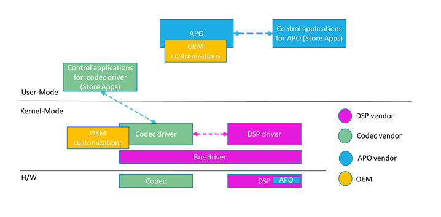

# Universal Windows Drivers for Audio


In Windows 10 you can write a universal audio driver that will work across many types of hardware. This topics discusses the benefits of this approach as well as the differences between different platforms. In addition to the Universal Windows drivers for audio, Windows continues to support previous audio driver technologies, such as WDM.

## <span id="getting_started_with_universal_windows_drivers_for_audio"></span>Getting Started with Universal Windows drivers for Audio


IHVs can develop a Universal Windows driver that works on all devices (desktops, laptops, tablets, phones). This can reduces development time and cost for initial development and later code maintenance.

These tools are available to develop Universal Windows driver support:

-   Visual Studio 2015 Support: There is a driver setting to set “Target Platform” equal to “Universal”. For more information about setting up the driver development environment, see [Getting Started with Universal Windows Drivers](https://msdn.microsoft.com/windows-drivers/develop/getting_started_with_universal_drivers).

-   APIValidator Tool: You can use the ApiValidator.exe tool to verify that the APIs that your driver calls are valid for a Universal Windows driver. This tool is part of the Windows Driver Kit (WDK) for Windows 10, and runs automatically if you are using Visual Studio 2015 . For more information, see [Validating Universal Windows Drivers](https://msdn.microsoft.com/windows-drivers/develop/validating_universal_drivers).

-   Updated DDI reference documentation: The DDI reference documentation is being updated to indicate which DDIs are supported by Universal Windows drivers. For more information, see [Audio Devices Reference](https://msdn.microsoft.com/library/windows/hardware/ff536192).

## <span id="create_a_universal_audio_driver"></span>Create a Universal Audio Driver


For step-by-step guidance, see [Getting Started with Universal Windows Drivers](https://msdn.microsoft.com/windows-drivers/develop/getting_started_with_universal_drivers). Here is a summary of the steps:

1. Load the universal audio sysvad sample to use as starting point for your universal audio driver. Alternatively, start with the empty WDM driver template and add in code from the universal sysvad sample as needed for your audio driver.

2. In the project properties, set Target Platform to "Universal".

3. Create an installation package: If your target is device running Windows 10 for desktop editions (Home, Pro, Enterprise, and Education), use a configurable INF file. If your target is device running Windows 10 Mobile, use PkgGen to generate an .spkg file.

4. Build, install, deploy, and debug the driver for Windows 10 for desktop editions or Windows 10 Mobile.

## <span id="sample_code"></span>Sample Code


Sysvad and SwapAPO have been converted to be Universal Windows driver samples. For more information, see [Sample Audio Drivers](sample-audio-drivers.md).

## <span id="available_programming_interfaces_for_universal_windows_drivers_for_audio"></span>Available Programming Interfaces for Universal Windows drivers for Audio


Starting with Windows 10, the driver programming interfaces are part of OneCoreUAP-based editions of Windows. By using that common set, you can write a Universal Windows driver. Those drivers will run on both Windows 10 for desktop editions and Windows 10 Mobile, and other Windows 10 versions.

The following DDIs to are available when working with universal audio drivers.

-   [Audio Drivers Event Sets](https://msdn.microsoft.com/library/windows/hardware/ff536195)

-   [Audio Drivers Interfaces](https://msdn.microsoft.com/library/windows/hardware/ff536196)

-   [Audio Drivers Property Sets](https://msdn.microsoft.com/library/windows/hardware/ff536197)

-   [Audio Drivers Structures](https://msdn.microsoft.com/library/windows/hardware/ff536198)

-   [Audio Topology Nodes](https://msdn.microsoft.com/library/windows/hardware/ff536219)

-   [High Definition Audio DDI Reference](https://msdn.microsoft.com/library/windows/hardware/ff536445)

-   [Port Class Audio Driver Reference](https://msdn.microsoft.com/library/windows/hardware/ff537764)

## <span id="_convert_an_existing_audio_driver_to_a_universal_windows_driver"></span> Convert an Existing Audio Driver to a Universal Windows driver


Follow this process to convert an existing audio driver to a Universal Windows driver.

1. Determine whether your existing driver calls will run on OneCoreUAP Windows. Check the requirements section of the reference pages. For more information see [Audio Devices Reference](https://msdn.microsoft.com/library/windows/hardware/ff536192).

2. Recompile your driver as a Universal Windows driver. In the project properties, set Target Platform to "Universal".

3. Use the ApiValidator.exe tool to verify that the DDIs that your driver calls are valid for a Universal Windows driver. This tool is part of the Windows Driver Kit (WDK) for Windows 10, and runs automatically if you are using Visual Studio 2015. For more information, see [Validating Universal Windows Drivers](https://msdn.microsoft.com/windows-drivers/develop/validating_universal_drivers).

4. If the driver calls interfaces that are not part of OneCoreUAP, compiler displays errors.

5. Replace those calls with alternate calls, or create a code workaround, or write a new driver.


## <span id="creating-a-componentized-audio-driver-installation"></span> Creating a componentized audio driver installation

### Overview

To create a smoother and more reliable install experience and to better support component servicing, divide the driver installation process into the following components.

- DSP (if present) and Codec
- APO
- OEM Customizations

Optionally, separate INF files can be used for the DSP and Codec.

This diagram summarizes a componentized audio installation.



A separate extension INF file is used to customize each base driver component for a particular system. Customizations include tuning parameters and other system-specific settings. For more information, see 
[Using an Extension INF File](https://docs.microsoft.com/windows-hardware/drivers/install/using-an-extension-inf-file).

An extension INF file must be a universal INF file. For more information, see [Using a Universal INF File](https://docs.microsoft.com/windows-hardware/drivers/install/using-a-universal-inf-file).

For information about adding software using INF files, see [Using a Component INF File](https://docs.microsoft.com/windows-hardware/drivers/install/using-a-component-inf-file).


### Submitting componentized INF files

APO INF packages must be submitted to the Hardware Dev Center separately from the base driver package. For more information about creating packages, see [Windows HLK Getting Started](https://docs.microsoft.com/windows-hardware/test/hlk/getstarted/windows-hlk-getting-started).


### SYSVAD  componentized INF files

To see an example of componentized INF files examine the [sysvad/TabletAudioSample](https://github.com/Microsoft/Windows-driver-samples/tree/master/audio/sysvad/TabletAudioSample), on Github. 

| File name                              | Description                                                                    |
|----------------------------------------|--------------------------------------------------------------------------------|
| ComponentizedAudioSample.inf           | The base componentized sample audio INF file.                                  |
| ComponentizedAudioSampleExtension.inf  | The extension driver for the sysvad base with additional OEM customizations.   |
| ComponentizedApoSample.inf             | An APO sample extension INF file.                                              |

The traditional INF files continue to be available in the SYSVAD sample.

| File name                      | Description                                                                    |
|--------------------------------|--------------------------------------------------------------------------------|
| tabletaudiosample.inf          | A desktop monolitic INF file that contains all of the information needed to install the driver. |
| phoneaudiosample.inf           | A phone monolitic INF file that contains all of the information needed to install the driver.   |


### APO vendor specific tuning parameters and feature configuration

All APO vendor system specific settings, parameters, and tuning values must be installed via an extension INF package. In many cases, this can be performed in a simple manner with the [INF AddReg directive](https://docs.microsoft.com/windows-hardware/drivers/install/inf-addreg-directive). In more complex cases, a tuning file can be used.  
 
Base driver packages must not depend on these customizations in order to function (although of course functionality may be reduced).  


### Programmatically launching UWP Hardware Support Apps

To programmatically launch a UWP Hardware Support App, based on a driver event (for example, when a new audio device is connected), use the Windows Shell APIs. The Windows 10 Shell APIs support a method for launching UWP UI based on resource activation, or directly via [IApplicationActivationManager](https://msdn.microsoft.com/library/windows/desktop/hh706903.aspx). You can find more details on automated launching for UWP applications in [Automate launching Windows 10 UWP apps](https://docs.microsoft.com/windows/uwp/xbox-apps/automate-launching-uwp-apps#launch-activation).  

### APO and device driver vendor use of the AudioModules API

The Audio Modules API/DDI is designed to standardize the communication transport (but not the protocol) for commands passed between a UWP application or user-mode service to a kernel driver module or DSP processing block. Audio Modules requires a driver implementing the correct DDI to support module enumeration and communication. The commands are passed as binary and interpretation/definition is left up to the creator.  
 
Audio Modules is not currently designed to facilitate direct communication between a UWP app and a SW APO running in the audio engine. 

For more information about audio modules, see [Implementing Audio Module Communication](https://docs.microsoft.com/windows-hardware/drivers/audio/implementing-audio-module-communication) and [Configure and query audio device modules](https://docs.microsoft.com/windows-hardware/drivers/audio/configure-and-query-audiodevicemodules).


### APO HWID strings construction  
 
APO Hardware IDs incorporate both standard information and vendor-defined strings. 

They are constructed as follows: 

```syntax
APO\VEN_v(4)&AID_a(4)&SUBSYS_ n(4)s(4) &REV_r(4) 
APO\VEN_v(4)&AID_a(4)&SUBSYS_ n(4)s(4) 
APO\VEN_v(4)&AID_a(4) 
```

Where: 

- v(4) is the 4-character identifier for the APO device vendor. This will be managed by Microsoft.  
- a(4) is the 4-character identifier for the APO, defined by the APO vendor.  
- n(4) is the 4-character PCI SIG-assigned identifier for the vendor of the subsystem for the parent device. This is typically the OEM identifier. 
- s(4) is the 4-character vendor-defined subsystem identifier for the parent device. This is typically the OEM product identifier. 


### Plug and Play INF version and date evaluation for driver update   

The Windows Plug and Play system evaluates the date and the driver version to determine which drive to install when multiple drivers exist.  For more information, see [How Windows Ranks Drivers](https://docs.microsoft.com/windows-hardware/drivers/install/how-setup-ranks-drivers--windows-vista-and-later-). 

To allow the latest driver to be used, be sure and update the date and version, for each new version of the driver.


### APO driver registry key

For third party-defined audio driver/APO registry keys, use the HKR with the exception of HKLM\System\CurrentControlSet. 
 

### Use a Windows Service to facilitate UWP <-> APO communication
 
A Windows Service is not strictly required for management of user-mode components like APOs, however, if your design includes an RPC server to facilitate UWP <-> APO communication, we recommend implementing that functionality in a Windows Service that then controls the APO running in the audio engine.  


## <span id="building_the_sysvad_universal_audio_sample_for_windows_10_desktop"></span>Building the Sysvad Universal Audio Sample for Windows 10 Desktop


Complete the following steps to build the sysvad sample for Windows 10 desktop.

1. Locate the desktop inf file (tabletaudiosample.inf) and set the manufacturer name to a value such as "Contoso"

2. In Solution Explorer, right-click Solution 'sysvad' , and choose Configuration Manager. If you are deploying to a 64 bit version of Windows, set the target platform to x64. Make sure that the configuration and platform settings are the same for all of the projects.

3. Build the all of the projects in the sysvad solution.

4. Locate the output directory for the build from the build. For example it could be located in a directory like this:

` C:\Program Files (x86)\Windows Kits\10\src\audio\sysvad\x64\Debug\package`
5. Navigate to the Tools folder in your WDK installation and locate the PnpUtil tool. For example, look in the following folder: C:\\Program Files (x86)\\Windows Kits\\10\\Tools\\x64\\PnpUtil.exe .

6. Copy the following files to the system that you want to install the sysvad driver:

|                            |                                                                                   |
|----------------------------|-----------------------------------------------------------------------------------|
| TabletAudioSample.sys      | The driver file.                                                                  |
| tabletaudiosample.inf      | An information (INF) file that contains information needed to install the driver. |
| sysvad.cat                 | The catalog file.                                                                 |
| SwapAPO.dll                | A sample driver extension for a UI to manage APOs.                                |
| PropPageExt.dll            | A sample driver extension for a property page.                                    |
| KeywordDetectorAdapter.dll | A sample keyword detector.                                                        |

 

## <span id="Install_and_test_the_driver"></span><span id="install_and_test_the_driver"></span><span id="INSTALL_AND_TEST_THE_DRIVER"></span>Install and test the driver


Follow these steps to install the driver using the PnpUtil on the target system.

1. Open and Administrator command prompt and type the following in the directory that you copied the driver files to.

**pnputil -i -a tabletaudiosample.inf**

2. The sysvad driver install should complete. If there are any errors you can examine this file for additional information: `%windir%\inf\setupapi.dev.log`

3. In Device Manager, on the View menu, choose Devices by type. In the device tree, locate Microsoft Virtual Audio Device (WDM) - Sysvad Sample. This is typically under the Sound, video and game controllers node.

4. On the target computer, open Control Panel and navigate to **Hardware and Sound** &gt; **Manage audio devices**. In the Sound dialog box, select the speaker icon labeled as Microsoft Virtual Audio Device (WDM) - Sysvad Sample, then click Set Default, but do not click OK. This will keep the Sound dialog box open.

5. Locate an MP3 or other audio file on the target computer and double-click to play it. Then in the Sound dialog box, verify that there is activity in the volume level indicator associated with the Microsoft Virtual Audio Device (WDM) - Sysvad Sample driver.

## <span id="building_the_sysvad_universal_audio_sample_for_windows_10_mobile"></span>Building the Sysvad Universal Audio Sample for Windows 10 Mobile


Complete the following steps to build the sysvad sample for Windows 10 Mobile.

1. Locate the Mobile inf file (phoneaudiosample.inf) and set the manufacturer name to a value such as "Contoso"

2. Build the following projects in the sysvad solution:

-   EndPointsCommon

-   PhoneAudioSample

3. Locate the output directory for the build from the . For example with a default location of Visual Studio in could be located in a directory like this:

` C:\Program Files (x86)\Windows Kits\10\src\audio\sysvad\x64\Debug\package`
4. Follow the guidance in [Creating packages](https://msdn.microsoft.com/library/dn756642) to create a package that contains the driver files for a mobile image.

5. To install a mobile driver package (.spkg file), you will need to combine packages into a mobile OS image. Use ImgGen to add the .spkg driver package to a full flash update (FFU) image that can then be flashed to a mobile device. It may be necessary to remove other audio drivers that exist in the mobile image to allow for testing of the sysvad virtual audio driver.

6. After the OS image contains the driver package is running, play a sound clip and validate that the sysvad phone audio sample is functional. You can establish a kernel debugger connection to monitor the sysvad virtual driver on a mobile device.

 

 


