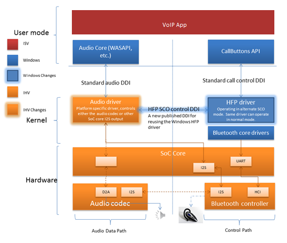

# Windows Bluetooth host controller interface (HCI) Architectural Overview

This topic presents an architectural overview of the Windows 8.1 support for rerouting audio data to bypass the Bluetooth host controller interface (HCI).

Starting with Windows 8.1, the Microsoft operating system has been updated to be compatible with low power system-on-a-chip (SoC) design solutions. The new Windows support is compatible with either Intel-based or ARM-based SoC designs. These new low-power devices will be optimized for “always on” scenarios, so low battery consumption will be a key factor for success.

SoC architectures use the Universal Asynchronous Receiver/Transmitter (UART) transport mode to transmit data to and from the Bluetooth host controller.

Because UARTs cannot provide time sensitive data transmission, a synchronous connection oriented (SCO) bypass channel must be implemented in addition to a UART, to transfer audio data via I2S or some other connection between the audio codec and the Bluetooth radio. This means that audio data must be rerouted to bypass the Bluetooth HCI. The Bluetooth HCI which would normally be used on PCs to transmit audio data.

It is important to note that this feature is simply offloading the same functionality that exists in versions of Windows prior to Windows 8.1, so from a user perspective there are no use cases that are different between the Bluetooth hands-free profile (HFP) on SoC and Bluetooth HFP in Windows on a PC or laptop.

The following diagram shows the software and hardware components that work together to provide this new support in Windows 8.1.

Note that this Windows feature does not support bypass audio streaming using advanced audio distribution profile (A2DP). Windows 8 provides a separate A2DP profile driver that completely supports audio functionality through the standard Bluetooth HCI without requiring any additional audio drivers.

 

 

