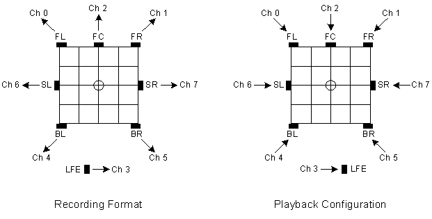

# Channel Mask

In Windows, the [**WAVEFORMATEXTENSIBLE**](https://msdn.microsoft.com/library/windows/hardware/ff538802) structure defines the data format for a multichannel PCM audio stream. This structure specifies parameters such as the number of bits per PCM sample, the number of channels in the stream, and the channel mask. The channel mask specifies the mapping of channels to speakers. The following figure shows the individual bits in the channel mask.

Each bit in the channel mask represents a particular speaker position. If the mask assigns a channel to a particular speaker position, the mask bit that represents that position is set to 1; all mask bits for unassigned speaker positions are set to 0. The WAVEFORMATEXTENSIBLE structure defines additional bits in the channel mask that are not shown in the preceding figure, but these bits have no bearing on the home-theater speaker configurations under discussion and are omitted for simplicity.

The encoding of speaker positions in the channel mask in the preceding figure is similar to that used for the property value of a [**KSPROPERTY\_AUDIO\_CHANNEL\_CONFIG**](https://msdn.microsoft.com/library/windows/hardware/ff537250) property request. For more information, see [**KSAUDIO\_CHANNEL\_CONFIG**](https://msdn.microsoft.com/library/windows/hardware/ff537083).

The following table shows the meaning of each mask bit in the preceding figure.

<table>
<colgroup>
<col width="33%" />
<col width="33%" />
<col width="33%" />
</colgroup>
<thead>
<tr class="header">
<th align="left">Bit Number</th>
<th align="left">Speaker Position</th>
<th align="left">Description</th>
</tr>
</thead>
<tbody>
<tr class="odd">
<td align="left">
0
</td>
<td align="left">
FL
</td>
<td align="left">
Front left
</td>
</tr>
<tr class="even">
<td align="left">
1
</td>
<td align="left">
FR
</td>
<td align="left">
Front right
</td>
</tr>
<tr class="odd">
<td align="left">
2
</td>
<td align="left">
FC
</td>
<td align="left">
Front center
</td>
</tr>
<tr class="even">
<td align="left">
3
</td>
<td align="left">
LFE
</td>
<td align="left">
Low-frequency effects
</td>
</tr>
<tr class="odd">
<td align="left">
4
</td>
<td align="left">
BL
</td>
<td align="left">
Back left
</td>
</tr>
<tr class="even">
<td align="left">
5
</td>
<td align="left">
BR
</td>
<td align="left">
Back right
</td>
</tr>
<tr class="odd">
<td align="left">
6
</td>
<td align="left">
FLC
</td>
<td align="left">
Front left of center
</td>
</tr>
<tr class="even">
<td align="left">
7
</td>
<td align="left">
FRC
</td>
<td align="left">
Front right of center
</td>
</tr>
<tr class="odd">
<td align="left">
8
</td>
<td align="left">
BC
</td>
<td align="left">
Back center
</td>
</tr>
<tr class="even">
<td align="left">
9
</td>
<td align="left">
SL
</td>
<td align="left">
Side left
</td>
</tr>
<tr class="odd">
<td align="left">
10
</td>
<td align="left">
SR
</td>
<td align="left">
Side right
</td>
</tr>
</tbody>
</table>

 

For example, the **7.1 home theater speakers** configuration is described by a channel mask value of 0x63F, which indicates that the eight channels in the stream are assigned to the following speaker positions (and in the following order): FL, FR, FC, LFE, BL, BR, SL, and SR. For another example, the **7.1 wide configuration speakers** configuration is described by a channel mask value of 0xFF, which indicates that the eight channels in the stream are assigned to the following speaker positions: FL, FR, FC, LFE, BL, BR, FLC, and FRC.

The following figure shows the correspondence between the channel mask 0x63F and the **7.1 home theater speakers** configuration.

The left side of the preceding figure shows the recording of audio content into the **7.1 home theater speakers** stream format. The small circle at the center of the grid represents the listener's position. Each small, black rectangle represents a microphone. The eight channels are numbered from 0 to 7. The FL microphone records into channel 0, the FR microphone records into channel 1, and so on.

The right side of the preceding figure shows the same 7.1-channel stream being played back through an eight-speaker surround configuration. In this case, each small, black rectangle represents a speaker. Seven of the speakers are mapped to positions on the grid surrounding the listener. The mapping does not assign a grid position to the LFE speaker (subwoofer); this omission is based on the assumption that these speakers typically produce only low-frequency sounds, which are nondirectional.

 

 

