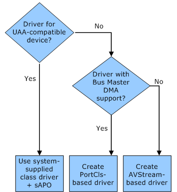

# Custom Audio Driver Type Decision Tree

Use this decision tree with Step 3 of [Roadmap for Developing WDM Audio Drivers](roadmap-for-developing-wdm-audio-drivers.md). The tree helps you determine the type of audio driver to learn about. The system-supplied port class driver (PortCls) provides a set of port drivers that implement most of the basic functionality. These port drivers simplify the development process for the driver developer. High definition (HD) audio and AC97 drivers are typically based on the PortCls class driver, whereas USB and 1394 drivers are usually based on the AVStream class.

If your audio device is based on the universal audio architecture (UAA) standard, it is UAA-compatible. A UAA-compatible audio device can use the system-supplied UAA class drivers and does not need a custom driver, but you can provide your own [Windows Audio Processing Objects](windows-audio-processing-objects.md).

If your audio device is not UAA-compatible or it is UAA-compatible but you want to implement customized features, you must decide whether you want to develop a driver with Bus Master DMA support. If you want to provide Bus Master DMA support, for example, you must develop a PortCls-based audio driver.

For information about how to develop custom audio drivers and how to choose a port driver, see the following topics:

[Custom Audio Drivers](custom-audio-drivers.md)  
Provides an overview of PortCls and AVStream audio drivers and discusses the pros and cons of each type.

[AVStream Overview](stream.avstream_overview)  
Provides an architectural overview of AVStream-based drivers and highlights the cases where this type of driver is the best choice.

You must also decide about the data format that your audio driver will use and the range of formats it will support. For more information about data formats and ranges, see [Audio Data Formats and Data Ranges](audio-data-formats-and-data-ranges.md).

To complete steps for audio driver development, see [Roadmap for Developing WDM Audio Drivers](roadmap-for-developing-wdm-audio-drivers.md).

 

 

[Send comments about this topic to Microsoft](mailto:wsddocfb@microsoft.com?subject=Documentation%20feedback%20[audio\audio]:%20Custom%20Audio%20Driver%20Type%20Decision%20Tree%20%20RELEASE:%20%287/14/2016%29&body=%0A%0APRIVACY%20STATEMENT%0A%0AWe%20use%20your%20feedback%20to%20improve%20the%20documentation.%20We%20don't%20use%20your%20email%20address%20for%20any%20other%20purpose,%20and%20we'll%20remove%20your%20email%20address%20from%20our%20system%20after%20the%20issue%20that%20you're%20reporting%20is%20fixed.%20While%20we're%20working%20to%20fix%20this%20issue,%20we%20might%20send%20you%20an%20email%20message%20to%20ask%20for%20more%20info.%20Later,%20we%20might%20also%20send%20you%20an%20email%20message%20to%20let%20you%20know%20that%20we've%20addressed%20your%20feedback.%0A%0AFor%20more%20info%20about%20Microsoft's%20privacy%20policy,%20see%20http://privacy.microsoft.com/en-us/default.aspx. "Send comments about this topic to Microsoft")

