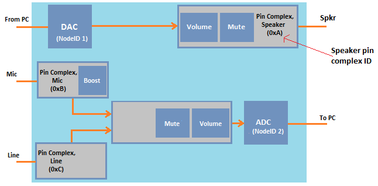

# Customizing HD Audio Driver Volume Settings


The ability to customize the in box HD audio default audio volume and microphone boost levels to suit a specific PC, provides OEMs with some flexibility in their audio adapter installation parameters.

**Note**  The process described here can only be used if the default Microsoft HD Audio driver is being used.

 

By default, the HD Audio class function driver sets the audio volume and the microphone boost levels at predetermined values to ensure a pleasant “out of the box” experience for the user.

The HD Audio class function driver, which I shall now refer to as the Audio Class driver, uses various hard-coded default values that cannot be customized for any particular PC. As such, OEMs are not able to override these values to meet their own requirements. And one of the most important settings to adjust is the volume level, as users are sensitive to the loudness or quietness of their audio systems, especially during first-time use.

The Audio Class driver has been redesigned to allow you to override the hard-coded default values. The mechanism for overriding the Audio Class driver’s hard-coded values involves writing an INF file that wraps the Audio Class driver’s inbox INF file (hdaudio.inf), and using this wrapper INF to specify the desired values.

The following diagram which shows a sample HD Audio codec topology. Note that there are IDs for the individual nodes, as well as IDs for the pin complexes.

The pin complexes represent the physical connectors for the associated device (e.g. speaker, mic, or line).

To specify a custom audio volume level or microphone boost level, use the wrapper INF file to specify custom levels per pin complex ID. The levels are expressed as DWORDs that represent the default kernel streaming (KS) decibel levels that the class driver should return.

When the HD Audio class driver receives a GET request for KSPROPERTY\_AUDIO\_VOLUMELEVEL, the driver determines whether or not there is a default volume (or Mic boost) value in the registry for the path that contains the node that received the request. If there is a value in the registry, but there is no previously cached value, the default value in the registry will be applied to the device, and also returned in the KSPROPERTY\_AUDIO\_VOLUMELEVEL response. If there is no value in the registry, the HD Audio class driver retrieves a default value from the sub-device graph implementation.

Starting with Windows Vista, the default values are as follows:

-   Endpoint volume defaults to max minus 6 dB for all device types.

-   Microphone boost defaults to 0 dB.

The following steps summarize the algorithm that is used by the Audio Class driver to determine the default values to return in response to a GET request for KSPROPERTY\_AUDIO\_VOLUMELEVEL:

1. Determine the pin complex at which the path containing the queried volume node terminates.

2. Perform a registry lookup to see if a volume or microphone boost default value has been provided for the pin complex found in step 1.

3. If a value is found in the registry, then the driver sets that value to the minimum, if it falls below the minimum value supported by the amplifier. Otherwise the value is set to the maximum, if it falls above the maximum value supported by the amplifier. If the value found in the registry is within the range supported by the amplifier, then the value is returned in response to the GET request. In addition, the driver programs the associated HD Audio amplifier widget with this value when rendering to or capturing from the pin complex.

The following folder tree shows the layout for the driver instance key that holds the default values.

&lt;Driver Key&gt;
DefaultVolumeLevels
Pin Complex (2 digit HEX, not preceded by “0x”)
Volume (DWORD in KS DB steps)
Boost (DWORD in KS DB steps)

The KS DB stepping values are defined as follows:
-2147483648 is -infinity decibels (attenuation)

-2147483647 is -32767.99998474 decibels (attenuation)

+2147483647 is +32767.99998474 decibels (gain)

For more information on the unit of measurement that is used (1/65536 dB), see [**KSPROPERTY\_AUDIO\_VOLUMELEVEL**](https://msdn.microsoft.com/library/windows/hardware/ff537309).

To override the wdmudio.inf file, use the Include and Needs directives as shown in this code segment from the *Microsoft Virtual Audio Device Driver Sample* available as part of the [Windows Driver Kit (WDK) 8.1 Samples](https://go.microsoft.com/fwlink/p/?LinkId=618052).

```inf
;Copyright (c) Microsoft Corporation. All rights reserved.
;
...
[MSVAD_Simple.NT]
Include=ks.inf,wdmaudio.inf
Needs=KS.Registration, WDMAUDIO.Registration
...
```

For more information about the Include and Needs directives, see [**INF DDInstall Section**](https://msdn.microsoft.com/library/windows/hardware/ff547344) and [Source Media for INF Files](https://msdn.microsoft.com/library/windows/hardware/ff552302).

The following is a sample INF wrapper that wraps the INF file for the Audio Class driver.

```text
;Copyright (c) Microsoft Corporation. All rights reserved.
;
;Module Name:
;    HDAUDVOL.INF
;
;Abstract:
;    Wrapper INF file for installing the Microsoft UAA Function Driver for High
;    Definition Audio with specific INF overrides

[Version]
Signature="$Windows NT$"
Class=MEDIA
ClassGuid={4d36e96c-e325-11ce-bfc1-08002be10318}
Provider=Microsoft
DriverVer=07/28/2012,6.2.9201.0
CatalogFile=hdaudvol.cat

[Manufacturer]
Microsoft = Microsoft,ntamd64,ntarm

[ControlFlags]
ExcludeFromSelect = *

;;====================================================================================
;; Edit the PNP ID (HDAUDIO\FUNC_01...) below to match the codec + subsystem you are ;; configuring.
;;====================================================================================

[Microsoft]
%HdAudModel_DefaultVolume_DeviceDesc% = HdAudModel_DefaultVolume, HDAUDIO\FUNC_01&VEN_10EC&DEV_0889&SUBSYS_00000000&REV_1000

[Microsoft.ntamd64]
%HdAudModel_DefaultVolume_DeviceDesc% = HdAudModel_DefaultVolume, HDAUDIO\FUNC_01&VEN_10EC&DEV_0889&SUBSYS_00000000&REV_1000

[Microsoft.ntarm]
%HdAudModel_DefaultVolume_DeviceDesc% = HdAudModel_DefaultVolume, HDAUDIO\FUNC_01&VEN_10EC&DEV_0889&SUBSYS_00000000&REV_1000

;;===================== HdAudModel_DefaultVolume ==============================

[HdAudModel_DefaultVolume]
Include=hdaudio.inf
Needs=HDAudModel
AddReg=HdAudModel_DefaultVolume.HdAudInit

[HdAudModel_DefaultVolume.HW]
Include=hdaudio.inf
Needs=HdAudModel.HW

[HdAudModel_DefaultVolume.Services]
Include=hdaudio.inf
Needs=HdAudModel.Services

[HdAudModel_DefaultVolume.Interfaces]
Include=hdaudio.inf
Needs=HdAudModel.Interfaces

[HdAudModel_DefaultVolume.HdAudInit]
;;====================================================================================
;; Units are in KS dB so 1dB == 65536 (0x00010000)
;; ======================================================================================
HKR,DefaultVolumeLevels\18,Volume,1,00,00,FE,FF ; Set to 0xFFFE0000 to set to -2dB
HKR,DefaultVolumeLevels\18,Boost,1,00,00,0A,00 ; Set to 0x000A0000 to set to 10dB

[Strings]
HdAudModel_DefaultVolume_DeviceDesc = "High Definition Audio Device"
```

Because an HKR relative path is specified, the exact driver registry path will be determined based on the specific INF file section that is used. For more information about HKR relative paths, see [**INF AddReg Directive (Windows Drivers)**](https://msdn.microsoft.com/library/windows/hardware/ff546320). The following two registry paths are examples, your registry path will likely be different.

HKEY\_LOCAL\_MACHINE\\SYSTEM\\CurrentControlSet\\Control\\Class\\{4d36e96c-e325-11ce-bfc1-08002be10318}\\0002

- or -

HKEY\_LOCAL\_MACHINE\\SYSTEM\\CurrentControlSet\\Control\\Class\\{4d36e96c-e325-11ce-bfc1-08002be10318}\\0002\\DeviceInterfaces\\eAuxIn

## <span id="related_topics"></span>Related topics
[Default Audio Volume Settings](default-audio-volume-settings.md)  
[**KSPROPERTY\_AUDIO\_VOLUMELEVEL**](https://msdn.microsoft.com/library/windows/hardware/ff537309)  


