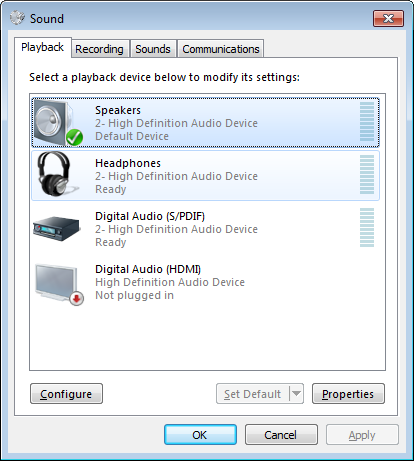
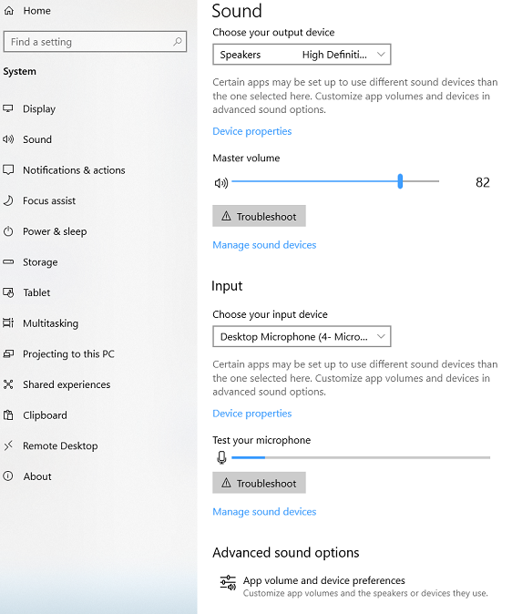
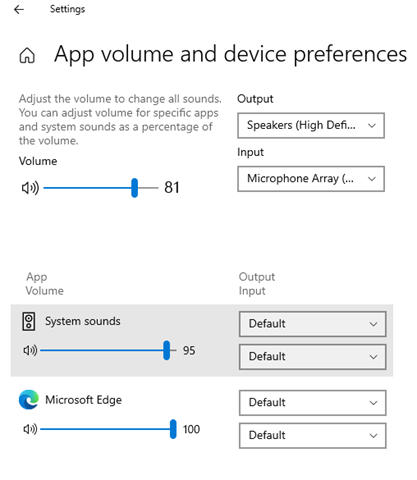
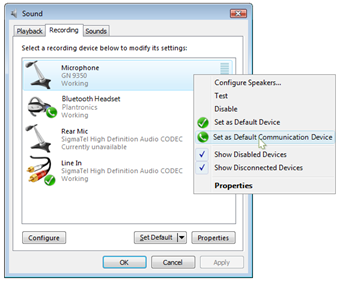

# Default Audio Endpoint Selection Starting in Windows 10

The Windows 10 audio subsystem uses an algorithm with enhanced heuristics for default audio endpoint selection. This topic describes these heuristics and how the Windows 10 audio subsystem uses them to select the default audio endpoint. For you to best understand the new Windows 10 selection mechanism, this topic also explains how default audio endpoint selection occurs in Windows 7. The target audience of this topic is OEMs and IHVs.

This information applies to the Windows 10 operating system.

References and resources discussed here are listed at the end of this topic.

## Introduction

Most PC audio devices contain multiple logically independent audio features. In Windows 7 and Windows 10 each feature is exposed as a separate audio endpoint. Endpoints are listed in the Control Panel Sound application, as shown in the following example dialog box from Windows 7.

And in the new sound settings page available in Windows 10.

Only one audio endpoint at a time can be set as the default for a specific console or communications role. However, starting in Windows 10 there is the option to target a different endpoint for these roles to different applications using the App volume and device preferences page.

The Windows 7 and Windows 10 audio subsystems use similar algorithms to determine the default audio endpoint when no user preference has been specified. However, the Windows 10 algorithm is different from Windows 7 in the way that it handles user selection of the default and that it handles a per-application preference.

This topic describes how the default audio endpoint is selected in Windows 10. For a better understanding of what is new to Windows 10, default audio endpoint selection in Windows 7 is also explained.

## Basic Algorithm for Default Audio Endpoint Selection

The Windows 7 and Windows 10 audio subsystems use a similar algorithm to determine the default audio endpoint. The algorithm operates as follows:

- Loop through all ACTIVE endpoints to find an endpoint set as a preferred default by the user for this application (new for Windows 10)
  - If an endpoint is identified, it is returned, and the process completes.
- If no endpoint identified, loop through all ACTIVE endpoints to find an endpoint set as the preferred default by the user for the system (selection modified for Windows 10).
  - If an endpoint is identified, it is returned, and the process completes.
- If no endpoint identified, loop through all ACTIVE endpoints to find the endpoint with the highest &quot;rank&quot; property for the requested role, and does not have a never set as default [PKEY_AudioDevice_NeverSetAsDefaultEndpoint](./pkey-audiodevice-neversetasdefaultendpoint.md) property set. (rank weighting values modified for Windows 10).
  - If an endpoint is identified, it is returned, and the process completes.
- If no endpoint is identified, the request fails indicating E\_NOTFOUND.

There are four endpoint states: ACTIVE, UNPLUGGED, DISABLED, and NOT PRESENT, that are defined in [DEVICE_STATE_XXX Constants](/windows/win32/coreaudio/device-state-xxx-constants). The audio subsystem considers only ACTIVE endpoints (in the present and enabled state) when it determines the default audio endpoint. Any events that cause an endpoint's state to change from or to the ACTIVE state can potentially affect the current default audio endpoint. Such events include inserting an audio device, unplugging a device, and installing a new audio device. In response to such operations, the Windows audio subsystem runs the default audio endpoint heuristic algorithm to determine the new default audio endpoint.

## The Endpoint Timestamp Property In Windows 7

The endpoint timestamp property is a property key containing the system time. In Windows 7, an endpoint's timestamp property is created or updated when it is set as the default audio endpoint through the Control Panel Sound application.

A timestamp property is associated to each role, and the timestamp property is used by the default selection algorithm to identify which endpoints have been set as the preferred default by the user for that role. The algorithm will identify the endpoint with the newest timestamp property as the default endpoint.

## The Level property in Windows 10

The timestamp property that was used in Windows 7 for the user default preference did not allow for automatic selection of a newly attached device after the initial default selection. For example, if a user set the internal speaker as the default endpoint at any time in the past and later attached new USB headphones, the system would never move to the USB headphones without a manual selection.

Starting in Windows 10, user default selection is built as a tree-like structure of past preferences which considers what endpoints were available at the time of the default selection done by the user. The reason for this is that when a user selects a default endpoint, they are communicating their preference for that endpoint relative to what other endpoints were active at the time of the selection. The user is not communicating an absolute preference for the selected device forever and in all situations.

Use and creation of the Timestamp Property has been removed from Windows 10, replaced by the Level property. The level property is used to build the tree-like structure of user preferences. Like the timestamp property, there is a level property associated to each role. The level property is created or updated any time the user selects a default endpoint though the sound control panel, the sound settings page, or the audio control in the system tray.

The default assignment algorithm works as follows:

When an endpoint is selected as a default, that endpoint is moved to the top of the tree-like structure by assigning it the highest available level. The next level down in the tree would contain one or more endpoints which either have been selected in the past as a default, or were active at the time of this selection but have never been selected by the user. Each subsequent selection brings the desired endpoint to the top of the list, moving prior selections down and grouping active, but as yet unselected, endpoints together to create tie conditions. In the event that all endpoints in the system are set as a default, the resulting structure becomes a simple ordered list with one endpoint at each level.

The default determination algorithm works as follows:

First, active endpoints without a level value are rank compared, with the endpoint with the highest rank selected to be default. This way endpoints which have been recently added are given a first opportunity to be the default because they are the newest in the system and connected after the user selected the previous default.

Next, if all active endpoints contain a level, then the endpoint with the highest level, without a tie, is chosen as the default. Having the highest level indicates that at some point in the past the user has set this endpoint as the default while the other endpoints, with a lower level value, were active.

Finally, if all endpoints contain a level value, and the endpoints with the highest level values are all tied, the endpoint rank is then used to break the tie. This indicates that these endpoints were active at the time of a default selection, but were not themselves selected. We have no indication of user preference between these endpoints, so the automated ranking system is used.

It is worth noting that with this new algorithm, a &quot;new&quot; endpoint is given increased weighting for becoming the default. This means that driver behavior that causes an audio endpoint to appear new to a system has the potential to trigger a default change.

Examples of driver behaviors and events which result in a loss of user settings on audio endpoints and will make an audio endpoint appear &quot;new&quot; to the system, potentially triggering a change in the default device, are:

- Installing a different driver. For example, switching between the HDAudio class driver and the matching 3rd party driver for the hardware. This is expected and by design, as the user settings and available endpoints are not assumed to be the same between two or more unrelated driver installations.
- Uninstalling and reinstalling the driver. Uninstalling the audio driver causes AudioEndpointBuilder to delete the user settings associated to the driver. Installing a new driver will cause AudioEndpointBuilder to create new audio endpoints. This is expected behavior and by design, however this behavior should be avoided by automated installers when it results in an unexpected loss of user settings.
- Any changes to the audio endpoint filter reference string or pin ID. Audio endpoints are identified by the reference string passed to PnP when the KS interface was created, along with the pin ID for the external connector. Changing these values will cause a new audio endpoint to be created. This new audio endpoint will not contain the user settings associated to the prior reference string and connector pin ID. Reference strings and connector pin IDs must not change for the life of the driver installation, including across driver updates.
- A HDMI or display audio device changing the terminal type or sink ID. The terminal type and sink ID are expected to change when the user attaches a different display to the system, a different display is a new endpoint with new user settings associated to it. However, changing these values when there is no corresponding change to attached display will be perceived as a loss of user settings. The sink ID and terminal type must remain constant for the attached display.

## The Windows 10 Default Audio Endpoint Heuristic

The Windows 10 default audio endpoint heuristic for automatic endpoint selection is the same as the Windows 7 heuristic, with some minor modifications to the factor weightings to give a better user experience.

The default selection heuristic starts by collecting information about the audio endpoint; the factors. Each factor is then weighted and the resulting weighted values for all the factors are summed. The resulting sum is called the endpoint rank. A rank value is calculated for each role for each endpoint (console and communications).

The endpoint with the highest rank is then chosen as the default for the requested role.

### Windows 10 Heuristic Factors

The Windows 10 audio subsystem considers the following endpoint characteristics, or _factors_, to select the default audio endpoint:

- [Jack detection capability](./ksproperty-jack-description2.md)
- [Form factor](/windows/win32/api/mmdeviceapi/ne-mmdeviceapi-endpointformfactor)
- [KSNodeType](./audio-topology-nodes.md)
- [Bus type](../install/devpkey-device-enumeratorname.md)
- [General location](/windows/win32/api/devicetopology/ns-devicetopology-ksjack_description)
- [Geometric location](/windows/win32/api/devicetopology/ns-devicetopology-ksjack_description)
- SubtypeSpecific
- Additional factors may exist which do not affect the Console or Communications roles, and are outside of the scope of this documentation.

Windows 10 defines a set of enum values for every supported endpoint factor and stores them in the registry. Detailed descriptions of these factors and their corresponding enumerant value sets follow.

#### [Jack Detection Capability](./ksproperty-jack-description2.md)

An endpoint with this capability implies that audio drivers can notify the audio subsystem when the audio peripheral device that is connected to an endpoint is plugged in or unplugged. Audio endpoints that support jack detection capability are called dynamic endpoints, and those that do not provide this support are called static endpoints. To support jack detection capability, audio device drivers must support the KSPROPERTY\_JACK\_DESCRIPTION2 property. For more information about this property, see [KSPROPERTY\_JACK\_DESCRIPTION2](./ksproperty-jack-description2.md).

| **Jack detection capability enum values** |
| --- |
| Supported |
| NotSupported |

The Windows 10 default audio device heuristic treats all USB audio endpoints and Bluetooth audio endpoints as jack detection capable.

#### [Form Factor](/windows/win32/api/mmdeviceapi/ne-mmdeviceapi-endpointformfactor)

An audio endpoint's form factor indicates the physical attributes of the audio endpoint with which the user interacts, such as headphones, speakers, or S/PDIF. To determine an endpoint's form factor, the audio subsystem uses built-in fixed logic to map the Kernel Streaming (KS) pin's category ([KSNodeType](./audio-topology-nodes.md)), which is exposed by the audio driver, to a specific form factor. For more information, see [EndpointFormFactor](/windows/win32/api/mmdeviceapi/ne-mmdeviceapi-endpointformfactor).

| **Endpoint form factor enum values** |
| --- |
| RemoteNetworkDevice |
| Speakers |
| LineLevel |
| Headphones |
| Microphone |
| Headset |
| Handset |
| UnknownDigitalPassthrough |
| SPDIF |
| DigitalAudioDisplayDevice |
| UnknownFormFactor |

#### [KSNodeType](./audio-topology-nodes.md)

The audio driver selects the KSNodeType for a KS pin on an endpoint because the driver has detailed knowledge about the audio device that might be connected to an audio jack. Therefore, KsNodeType reveals more specific knowledge on the endpoint than its form factor does.

| **KSNodeType enum values** |
| --- |
| KSNODETYPE\_SPEAKER |
| KSNODETYPE\_MICROPHONE\_ARRAY |
| KSNODETYPE\_HEADPHONES |

For more detailed information about KsNodeType, see [Pin Category Property](pin-category-property.md).

#### [Bus Type](../install/devpkey-device-enumeratorname.md)

This factor represents the bus type from which the audio device that exposed the audio endpoints was enumerated.

| **Bus type enum values** |
| --- |
| BTHENUM |
| BTHHFENUM |
| USB |
| HDAUDIO |
| PCI |
| Unknown |

The audio subsystem favors endpoints on a certain bus type over other bus types when all other endpoint characteristics are identical. For example, the system gives Bluetooth headphones priority over on-board HD Audio headphones to provide a better communications experience for the user; that is, when an end-user introduces a Bluetooth headphone device to this PC, the system makes it the default device.

#### [General Location](/windows/win32/api/devicetopology/ns-devicetopology-ksjack_description)

General location indicates the physical gross location of the jack or device to which the audio endpoint is connected.

| **General location enum values** |
| --- |
| PrimaryBox (on the primary system chassis, accessible to the user) |
| Internal (on the motherboard, not accessible without opening the box) |
| Separate (such as a mobile box) |
| Other |

#### [Geometric Location](/windows/win32/api/devicetopology/ns-devicetopology-ksjack_description)

Geometric location indicates the geometric location of the jack or device to which the audio endpoint is connected.

| **Geometric location enum values** |
| --- |
| eGeoLocRear |
| eGeoLocFront |
| eGeoLocLeft |
| eGeoLocRight |
| eGeoLocTop |
| eGeoLocBottom |
| eGeoLocRearOPanel |
| eGeoLocRiser |

#### SubtypeSpecific

The subtype specific property allows for future extensions of a heuristic value that is dependent upon the pin category property of the endpoint. It allows for a Supported/NotSupported capability.

| **SubtypeSpecific capability enum values** |
| --- |
| Supported |
| NotSupported |

Currently the only subtype specific property is related to microphone array geometry. In the context of the [microphone array geometry](/windows-hardware/drivers/ddi/ksmedia/ns-ksmedia-ksaudio_mic_array_geometry), &quot;Supported&quot; means front/back geometry. &quot;NotSupported&quot; indicates some other geometry. If more than one microphone array is present, a preference for front/back geometry may be taken.

### Windows 10 Heuristic Details

The Windows 10 default audio endpoint heuristic weights each endpoint factor. The higher a factor's priority is, the greater its weight. This topic uses _WeightFactor\_Xxx_ to identify a factor's priority.

In addition, the Windows 10 heuristic assigns a rank value (_nRankXxx_ in this topic) to each enum value within a factor category. This rank value establishes the relative importance among all enum values under the same factor.

These _WeightFactor\_Xxx_ and _nRankXxx_ values are stored in the registry during operating system installation. Registry storage makes it easier for OEMs to customize the default audio endpoint's selection process. The set of parameters for the heuristic's rank calculation depends on the endpoint's characteristics. The following table shows an example set of parameters.

| **Weight of endpoint factor** | **Rank value of endpoint factor** |
| --- | --- |
| _WeightFactor\_JackDet_ | _nRankJackDet_ |
| _WeightFactor\_SubType_ | _nRankSubType_ |
| _WeightFactor\_FormFactor_ | _nRankFormFactor_ |
| _WeightFactor\_BusType_ | _nRankBusType_ |
| _WeightFactor\_GenLoc_ | _nRankGenLoc_ |
| _WeightFactor\_GeoLoc_ | _nRankGeoLoc_ |
| WeightFactor\_SubtypeSpecific | nRankSubtypeSpecific |

The audio subsystem calculates an endpoint's weighted rank across all its factors, as follows:

_WeightedRankValue =_

_WeightFactor\_JackDet \* nRankJackDet +_

_WeightFactor\_SubType \* nRankSubType +_

_WeightFactor\_FormFactor \* nRankFormFactor +_

_WeightFactor\_BusType \* nRankBusType +_

_WeightFactor\_GenLoc \* nRankGenLoc +_

_WeightFactor\_GeoLoc \* nRankGeoLoc |_

_WeightFactor\_SubtypeSpecific \* nRankSubtypeSpecific._

The audio subsystem calculates the weighted rank value for all active endpoints and selects the endpoint that has the highest rank as the default audio endpoint.

The Windows 10 default audio endpoint selection heuristic mechanism also supports an exception feature. This feature allows the system or an OEM to cause the audio subsystem to designate an endpoint that matches a specific set of characteristics with very high or very low weighted rank values. Such designations make the system's heuristic more flexible when it deals with unexpected scenarios.

The heuristics for the console device role and the communication device role are separate, but the mechanism is precisely the same, with different order for the factors based on roles.

## Windows 10 Inbox Heuristic Settings

Windows 10 ships with settings that are based on the heuristic details in this topic. The default console audio endpoint and default communications audio endpoint have different settings. This section describes the settings for both types of endpoints.

### Inbox Heuristic Settings for the Default Console Audio Endpoint

This section describes the default heuristic settings for each factor for a console audio endpoint. The factors are listed in priority order; that is, Windows 10 gives highest priority to the first factor in the following list when the audio subsystem determines the default console endpoint. NOTE: These values may change in the future, the registry keys are the definitive source for information on the current values.

#### Jack Detection Capability

Endpoints with jack detection capability provide the most up-to-date information to the system on whether an audio peripheral device is physically attached to the system and when it is plugged in or unplugged. This information helps create a better end-user experience, so Windows 10 sets this factor as the highest priority factor. An endpoint with jack detection capability has a higher priority than endpoints without this capability, no matter how other factors compare.

#### Form Factor

Windows 10 uses a different form factor priority order than Windows 7 does, the values have been adjusted based on user feedback and studies.

Windows 10 sets form factor priority for render console endpoints in the following priority order:

- Headphones and Headset
- Speakers
- LineLevel
- DigitalAudioDisplayDevice
- S/PDIF
- Anything else (treated with the same lowest priority; that is, with_nRankFormFactor_ equal to zero)

Windows 10 sets form factor priority for capture console endpoints in the following priority order:

- Headset
- Microphone
- LineLevel
- Anything else (treated with the same lowest priority; that is, with _nRankFormFactor_ equal to zero)

For example, consider a system with three audio console render endpoints:

- An HD audio _static_ headphone endpoint (a headphone without jack detection capability).
- A static S/PDIF Out endpoint.
- A _dynamic_ speakers endpoint (speakers with jack detection support).

The audio subsystem uses the Windows 10 system heuristic and chooses the dynamic speakers endpoint as the default console render audio endpoint, even though the speakers' form factor is prioritized below the headphone's form factor. The speakers endpoint is chosen because it is jack detection capable, which has a higher priority over form factor, whereas the headphones do not have this capability.

If a dynamic USB headphones endpoint is introduced into the above example, the Windows 7 audio subsystem chooses this endpoint as the default console render endpoint. This choice is because the headphones form factor has higher priority than the speakers form factor when both devices support jack detection.

#### KSNodeType

As mentioned earlier, KSNodeType provides more detailed information than that indicated by form factor for an audio device that is connected to an endpoint. Windows 10 defines three microphone related KSNodeTypes to further prioritize endpoints with the microphone form factor but different KSNodeType. They are ranked in priority order as follows:

- KSNODETYPE\_PROCESSING\_MICROPHONE\_ARRAY
- KSNODETYPE\_MICROPHONE\_ARRAY
- KSNODETYPE\_OMNI\_DIRECTIONAL\_MICROPHONE
- Anything else (treated with the same lowest priority; that is, with _nRankSubType_ equal to zero)

For example, consider a system with two audio capture endpoints:

- A built-in static microphone array endpoint with KSNODETYPE\_MICROPHONE\_ARRAY.
- A static microphone endpoint with KSNODETYPE\_MICROPHONE.

When the audio subsystem uses the system heuristic to choose the default console capture audio endpoint, it selects the microphone array endpoint. The microphone array is selected because, although both endpoints have the same jack detection capability and form factor, the microphone array's KsNodeType is prioritized higher than that of the microphone. That is, KSNODETYPE\_MICROPHONE\_ARRAY is prioritized higher than KSNODETYPE\_MICROPHONE, which is not listed and falls into the &quot;anything else&quot; category.

For more information about KsNodeType, see [Pin Category Property](pin-category-property.md).
 
#### Bus Type

Windows 10 ranks the enum values for endpoint bus types in the following priority order, from highest to lowest priority:

- USB
- HDAudio and UnknownBusType (typically a SOC system)
- PCI
- BTHENUM
- BTHHFENUM
- Others (treated with the same lowest priority; that is, with _nRankBusType_ equal to zero)

#### General Location

Windows 10 ranks the enum values for general location in the following priority order, from highest to lowest priority:

- PrimaryBox and Internal
- Others (treated with the same lowest priority; that is, _nRankGenLoc_ is equal to zero)

Audio drivers report the general location information of their endpoints through the [KSPROPERTY_JACK_DESCRIPTION](ksproperty-jack-description.md) property. For details, see [Jack Description Property](jack-description-property.md).

#### Geometric Location

Windows 10 ranks the enum values for geometric location in the following priority order, from highest to lowest priority:

- Front and InsideMobileLid
- Bottom, Left, OutsideMobileLid, Rear, Right, and Top
- RearPanel
- Others (treated with the same lowest priority; that is, with _nRankGeoLoc_ equal to zero)

Audio drivers report the geometric location information of their endpoints through the [KSPROPERTY_JACK_DESCRIPTION](ksproperty-jack-description.md) property. For details, see [Jack Description Property](jack-description-property.md).

#### Exceptions

In addition to the preceding heuristic factors, Windows 10 has 3 exceptions for the default console device heuristic. Windows 7 only had 1 exception.

The first exception, present in both Windows 7 and 10, prevents obvious communication-oriented endpoints—such as Handset and Speakerphone—from being chosen as the default console endpoint. Specifically, the audio subsystem downgrades the _WeightedRankValue_ result for endpoints that have one of the following KSNodeType values:

- KSNODETYPE\_SPEAKER\_AND\_HEADSET
- KSNODETYPE\_SPEAKERS\_STATIC\_JACK
- KSNODETYPE\_HANDSET
- KSNODETYPE\_SPEAKERPHONE\_NO\_ECHO\_REDUCTION
- KSNODETYPE\_ECHO\_SUPPRESSING\_SPEAKERPHONE
- KSNODETYPE\_ECHO\_CANCELING\_SPEAKERPHONE
- KSNODETYPE\_PHONE\_LINE
- KSNODETYPE\_TELEPHONE
- KSNODETYPE\_DOWN\_LINE\_PHONE
- Cellular audio specific endpoints which exist in mobile scenarios

The second exception, present only on Windows 10, also prevents obvious communications-oriented endpoints from being chosen as the default console endpoint. Unlike the first exception, this exception also considers the bus type. The reason for this is that many popular USB headphones use the following KSNodeTypes, even though the devices are not communications specific. The Windows 7 ranking algorithm downgraded these KSNodeTypes for the default console endpoint for all bus types. For Windows 10 these KSNodeTypes are only downgraded for non-usb bus types.

- KSNODETYPE\_PERSONAL\_MICROPHONE
- KSNODETYPE\_COMMUNICATION\_SPEAKER
- KSNODETYPE\_HEADSET

For the third exception, a preference is explicitly introduced for &quot;personal&quot; endpoints —such as Headphones and Headsets— which are physically attached to the system with a wire. Some examples would be wired USB headsets and wired 3.5mm headphones. Unlike the previous 2 exceptions, this exception upgrades these endpoints to be preferred for the default console endpoint. This exception is new for Windows 10 and is for improved user privacy, preferring endpoints which only the user can hear over loud speaker endpoints which others can hear.

### Inbox Heuristic Settings for the Default Communication Audio Endpoint

This section describes the default heuristic settings of each factor for a communication audio endpoint. The factors are listed in priority order; that is, Windows 10 gives highest priority to the first factor in the following list when it calculates the default communications endpoint. The only difference between the heuristics of console default endpoints and communications default endpoints is in the form factor settings and the exception rule.

#### Jack Detection Capability

The jack detection capability heuristic settings are the same for both default communication audio endpoints and default console audio endpoints.

#### Form Factor

Different priority lists are created for render communications default devices and capture communications default devices.

The form factor priority for communications default capture endpoints in priority order (from highest priority to lowest) is as follows:

- Headset
- Handset
- Microphone
- LineLevel

The form factor priority for communications default render endpoints in priority order (from highest priority to lowest) is as follows:

- Headset
- Handset
- Headphones
- Speakers
- LineLevel
- DigitalAudioDisplayDevice (HDMI or DisplayPort)
- S/PDIF
- Anything else (treated with the same lowest priority; that is, with _nRankFormFactor_ equal to zero)

#### KSNodeType

The KsNodeType heuristic settings are the same for both default communication audio endpoints and default console audio endpoints.

#### Bus Type

The bus type heuristic settings are the same for both default communication audio endpoints and default console audio endpoints.

#### General Location

Windows 10 ranks the enum values for general location in the following priority order, from highest to lowest priority:

- Separate
- PrimaryBox
- Internal
- Others (treated with the same lowest priority; that is, _nRankGenLoc_ is equal to zero)

Audio drivers report the general location infomation of their endpoints through the KSPROPERTY\_JACK\_DESCRIPTION property. For details, see &quot;Jack Description Property **&quot;** on the MSDN Web site.

#### Geometric Location

Windows 10 ranks the enum values for geometric location in the following priority order, from highest to lowest priority:

- Front and InsideMobileLid
- Others (treated with the same lowest priority; that is, with _nRankGeoLoc_ equal to zero)

Audio drivers report the geometric location information of their endpoints through the KSPROPERTY\_JACK\_DESCRIPTION property. For details, see &quot;Jack Description Property&quot; on the MSDN Web site.

#### Exceptions

In addition to the preceding heuristic factors, Windows 10 also has three exceptions implemented for the default communications device heuristic, whereas Windows 7 only had one.

The first exception prefers obvious communication-oriented endpoints—such as Handset and Speakerphone—for being chosen as the default communications endpoint. Specifically, the audio subsystem upgrades the _WeightedRankValue_ result for endpoints with a KSNodeType that matches any of the following values:

- KSNODETYPE\_PERSONAL\_MICROPHONE
- KSNODETYPE\_HEADSET
- KSNODETYPE\_PHONE\_LINE
- KSNODETYPE\_DOWN\_LINE\_PHONE
- KSNODETYPE\_COMMUNICATION\_SPEAKER
- KSNODETYPE\_HANDSET
- KSNODETYPE\_TELEPHONE
- KSNODETYPE\_SPEAKERPHONE\_NO\_ECHO\_REDUCTION
- KSNODETYPE\_ECHO\_SUPPRESSING\_SPEAKERPHONE
- KSNODETYPE\_ECHO\_CANCELING\_SPEAKERPHONE

The second exception avoids endpoints which are obvious console-oriented endpoints which are unsuitable for communications usage:

- KSNODETYPE\_SPEAKERS\_STATIC\_JACK
- Special audio endpoints which only exist in mobile scenarios, which are not usable for communications audio

At the time of this writing, a third exception exists to prefer cellular audio endpoints. This exception exists only for mobile scenarios with cellular capability and is outside of the scope of this documentation. As this type of endpoint will only exist on mobile systems, this exception can safely be ignored.

## Windows 10 OEM Heuristics Customization

All heuristic settings are controlled through registry settings. Windows 10 is shipped with the inbox default audio endpoint selection behavior. You can customize your systems to meet specific market needs. 

## See also

[Jack Description Property](jack-description-property.md)

[KSPROPERTY\_JACK\_DESCRIPTION2](ksproperty-jack-description2.md)

[Pin Category Property](pin-category-property.md)

[SetupPreferredAudioDevices](setuppreferredaudiodevices.md)