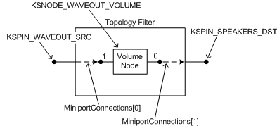

# Exposing Filter Topology


## <span id="exposing_filter_topology"></span><span id="EXPOSING_FILTER_TOPOLOGY"></span>


A miniport driver describes the internal topology of a KS filter in terms of pins, nodes, and connections. This topology specifies the data-flow paths through the filter and also defines the logical targets--pins and nodes--for property requests. The intra-filter topology is a logical representation of the internal structure of the hardware device that underlies the filter. The miniport driver describes this topology with static arrays of pin, node, and connection descriptors.

-   Pins are specified in a static array of [**PCPIN\_DESCRIPTOR**](https://msdn.microsoft.com/library/windows/hardware/ff537721) structures. Each pin has an ID that is its ordinal in the array.

-   Nodes are specified in a static array of [**PCNODE\_DESCRIPTOR**](https://msdn.microsoft.com/library/windows/hardware/ff537720) structures. Each node has an ID that is its ordinal in the array.

-   Connections (pin-to-pin, pin-to-node, or node-to-node) are specified in a static array of [**PCCONNECTION\_DESCRIPTOR**](https://msdn.microsoft.com/library/windows/hardware/ff537688) structures.

The miniport driver exposes these three arrays in the [**PCFILTER\_DESCRIPTOR**](https://msdn.microsoft.com/library/windows/hardware/ff537694) structure that it outputs from its [**IMiniport::GetDescription**](https://msdn.microsoft.com/library/windows/hardware/ff536765) method.

### <span id="Example"></span><span id="example"></span><span id="EXAMPLE"></span>Example

The following code example specifies the internal topology of a simple KS filter that has one input pin and one output pin. The filter contains a single node, which is a volume-level control.

```cpp
#define KSPIN_WAVEOUT_SRC  0
#define KSPIN_SPEAKERS_DST  1

PCPIN_DESCRIPTOR 
MiniportPins[] =
{
    {   // Pin 0 -- KSPIN_WAVEOUT_SRC
        0,0,0,  // InstanceCount
        NULL,   // AutomationTable
        {       // KsPinDescriptor
            0,                                          // InterfacesCount
            NULL,                                       // Interfaces
            0,                                          // MediumsCount
            NULL,                                       // Mediums
            SIZEOF_ARRAY(PinDataRangePointersBridge),   // DataRangesCount
            PinDataRangePointersBridge,                 // DataRanges
            KSPIN_DATAFLOW_IN,                          // DataFlow
            KSPIN_COMMUNICATION_NONE,                   // Communication
            &KSNODETYPE_LEGACY_AUDIO_CONNECTOR,         // Category
            NULL,                                       // Name
            0                                           // Reserved
        }
    },
    {   // Pin 1 -- KSPIN_SPEAKERS_DST
        0,0,0,  // InstanceCount
        NULL,   // AutomationTable
        {       // KsPinDescriptor
            0,                                          // InterfacesCount
            NULL,                                       // Interfaces
            0,                                          // MediumsCount
            NULL,                                       // Mediums
            SIZEOF_ARRAY(PinDataRangePointersBridge),   // DataRangesCount
            PinDataRangePointersBridge,                 // DataRanges
            KSPIN_DATAFLOW_OUT,                         // DataFlow
            KSPIN_COMMUNICATION_NONE,                   // Communication
            &KSNODETYPE_SPEAKER,                        // Category
            &KSAUDFNAME_VOLUME_CONTROL,                 // Name (This name shows up as the 
                                                        // playback panel name in SndVol32)
            0                                           // Reserved
        }
    }
};

#define KSNODE_WAVEOUT_VOLUME  0

PCNODE_DESCRIPTOR TopologyNodes[] =
{
    {   // KSNODE_WAVEOUT_VOLUME
        0,                      // Flags
        &AutomationVolume,      // AutomationTable
        &KSNODETYPE_VOLUME,     // Type
        &KSAUDFNAME_WAVE_VOLUME // Name
    }
};

PCCONNECTION_DESCRIPTOR MiniportConnections[] =
{ //FromNode---------------FromPin------------ToNode-----------------ToPin
  { PCFILTER_NODE,         KSPIN_WAVEOUT_SRC, KSNODE_WAVEOUT_VOLUME, 1 },
  { KSNODE_WAVEOUT_VOLUME, 0,                 PCFILTER_NODE,         KSPIN_SPEAKERS_DST }
};
```

The following figure shows the topology of the filter that is described by the preceding sample code.



This filter is a simple example of a [topology filter](topology-filters.md), which an adapter driver forms by binding its [IMiniportTopology](https://msdn.microsoft.com/library/windows/hardware/ff536712) object to an [IPortTopology](https://msdn.microsoft.com/library/windows/hardware/ff536896) object that the PortCls system driver creates. The filter's input (sink) and output (source) pins are named KSPIN\_WAVEOUT\_SRC and KSPIN\_SPEAKERS\_DST. Both pins carry analog signals. The **mixer** API exposes the connections to these pins as source and destination mixer lines (MIXERLINE\_COMPONENTTYPE\_SRC\_WAVEOUT and MIXERLINE\_COMPONENTTYPE\_DST\_SPEAKERS), respectively.

The following table illustrates a potential source of confusion when discussing the mapping of KS pins to mixer lines.

<table>
<colgroup>
<col width="33%" />
<col width="33%" />
<col width="33%" />
</colgroup>
<thead>
<tr class="header">
<th align="left">Pin name</th>
<th align="left">Mixer API terminology</th>
<th align="left">KS filter terminology</th>
</tr>
</thead>
<tbody>
<tr class="odd">
<td align="left"><p>KSPIN_WAVEOUT_SRC</p></td>
<td align="left"><p>Source mixer line</p></td>
<td align="left"><p>Sink pin</p></td>
</tr>
<tr class="even">
<td align="left"><p>KSPIN_SPEAKERS_DST</p></td>
<td align="left"><p>Destination mixer line</p></td>
<td align="left"><p>Source pin</p></td>
</tr>
</tbody>
</table>

 

Note that KSPIN\_WAVEOUT\_SRC is a source mixer line, and KSPIN\_SPEAKERS\_DST is a source pin. For more information, see the discussion of KS and mixer-line terminology in [Kernel Streaming Topology to Audio Mixer API Translation](kernel-streaming-topology-to-audio-mixer-api-translation.md).

Also note that the name "KSPIN\_WAVEOUT\_SRC" contains "WAVEOUT" not because the pin carries wave-formatted digital data, but because it carries the analog signal that is generated by a wave filter, which is a filter of type WaveCyclic or WavePci. The wave filter represents the portion of the audio adapter's hardware that converts a wave stream into an analog signal. Pin KSPIN\_SPEAKERS\_DST outputs an analog signal that drives a set of speakers.

The filter contains a single node, KSNODE\_WAVEOUT\_VOLUME, which the **mixer** API represents as a volume control (MIXERCONTROL\_CONTROLTYPE\_VOLUME). The KS node type for the volume control is [**KSNODETYPE\_VOLUME**](https://msdn.microsoft.com/library/windows/hardware/ff537208). All nodes of this type support the [**KSPROPERTY\_AUDIO\_VOLUMELEVEL**](https://msdn.microsoft.com/library/windows/hardware/ff537309) property, which a client of the filter uses to control the volume level.

The volume node has two "logical" pins, which are numbered 0 and 1. The two connections that are specified by the MiniportConnections array are represented in the figure by dashed arrows that point in the direction of data flow. Each connection is described by one of the two elements in the array.

The KSPIN\_WAVEOUT\_SRC and KSPIN\_SPEAKERS\_DST pins are both [*bridge pins*](https://msdn.microsoft.com/library/windows/hardware/ff556272#wdkgloss_bridge_pin), which means that they represent hardwired connections in the adapter. In the preceding sample code, the two pin descriptors in the MiniportPins array both specify their IRP-flow direction as KSPIN\_COMMUNICATION\_NONE, which is appropriate because bridge pins neither send nor receive IRPs. The two pin descriptors also refer to a PinDataRangePointersBridge array, which is defined as follows:

```cpp
static KSDATARANGE PinDataRangesBridge[] =
{
   {
      sizeof(KSDATARANGE),
      0, 0, 0,
      STATICGUIDOF(KSDATAFORMAT_TYPE_AUDIO),
      STATICGUIDOF(KSDATAFORMAT_SUBTYPE_ANALOG),
      STATICGUIDOF(KSDATAFORMAT_SPECIFIER_NONE)
   }
};

static PKSDATARANGE PinDataRangePointersBridge[] =
{
    &PinDataRangesBridge[0]
};
```

The PinDataRangePointersBridge array defines the data range for a bridge pin that carries an analog audio signal. For more information, see the discussion of bridge pins in [Audio Filter Graphs](audio-filter-graphs.md).

For an example of a more complex topology, see [Topology Filters](topology-filters.md).

 

 


