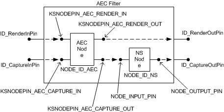

# Exposing Hardware-Accelerated Capture Effects


## <span id="exposing_hardware_accelerated_capture_effects"></span><span id="EXPOSING_HARDWARE_ACCELERATED_CAPTURE_EFFECTS"></span>


In Windows XP and later, the WDM audio framework supports hardware acceleration of audio-capture effects that are exposed through DirectSound. These effects include acoustic echo cancellation (AEC) and noise suppression (NS). For information about how a DirectSoundCapture application enables use of hardware-accelerated AEC and NS, see the Microsoft Windows SDK documentation.

A miniport driver can expose hardware acceleration for any subset of these effects, depending on the capabilities of the underlying device. To expose the hardware's capabilities for AEC and NS effects, each pin on the AEC filter that the driver implements should meet these requirements:

-   The pin should include an individual node in its node chain to represent each hardware effect that is to be incorporated into the graph. The KS node types for AEC and NS effects are specified by the following GUIDs:
    [**KSNODETYPE\_ACOUSTIC\_ECHO\_CANCEL**](https://msdn.microsoft.com/library/windows/hardware/ff537150)
    [**KSNODETYPE\_NOISE\_SUPPRESS**](https://msdn.microsoft.com/library/windows/hardware/ff537182)
-   The AEC and NS nodes on the pin should support the [KSPROPSETID\_General](https://msdn.microsoft.com/library/windows/hardware/ff566576) property set and should provide information about the manufacturer when queried for the [**KSPROPERTY\_GENERAL\_COMPONENTID**](https://msdn.microsoft.com/library/windows/hardware/ff565171) property.

-   The AEC and NS nodes on the pin should support the [KSPROPSETID\_TopologyNode](https://msdn.microsoft.com/library/windows/hardware/ff537491) property set and its two properties:

    [**KSPROPERTY\_TOPOLOGYNODE\_ENABLE**](https://msdn.microsoft.com/library/windows/hardware/ff537431) enables an effect.

    [**KSPROPERTY\_TOPOLOGYNODE\_RESET**](https://msdn.microsoft.com/library/windows/hardware/ff537434) resets the effect to its default state.

-   The AEC and NS nodes on the pin should support the following properties of the [KSPROPSETID\_Audio](https://msdn.microsoft.com/library/windows/hardware/ff537440) property set:
    [**KSPROPERTY\_AUDIO\_CPU\_RESOURCES**](https://msdn.microsoft.com/library/windows/hardware/ff537255)
    [**KSPROPERTY\_AUDIO\_ALGORITHM\_INSTANCE**](https://msdn.microsoft.com/library/windows/hardware/ff537240)
-   The pin should support the following properties of the KSPROPSETID\_Audio property set:
    [**KSPROPERTY\_AUDIO\_POSITION**](https://msdn.microsoft.com/library/windows/hardware/ff537297)
    [**KSPROPERTY\_AUDIO\_LATENCY**](https://msdn.microsoft.com/library/windows/hardware/ff537286)
-   The pin should expose its data-range capabilities (see [Pin Data-Range and Intersection Properties](pin-data-range-and-intersection-properties.md)).

The specific requirements for exposing hardware-accelerated AEC and NS nodes are presented below.

### <span id="Acoustic_Echo_Cancellation"></span><span id="acoustic_echo_cancellation"></span><span id="ACOUSTIC_ECHO_CANCELLATION"></span>Acoustic Echo Cancellation

A PCM miniport driver exposes hardware support for AEC in the form of a topology for both the capture and render streams that meets this additional requirement:

-   The pin must include an AEC node ([**KSNODETYPE\_ACOUSTIC\_ECHO\_CANCEL**](https://msdn.microsoft.com/library/windows/hardware/ff537150)), which must be specified in its proper position in the ordered node chain (see below).

### <span id="Noise_Suppression"></span><span id="noise_suppression"></span><span id="NOISE_SUPPRESSION"></span>Noise Suppression

A PCM miniport driver exposes hardware support for NS in the form of a topology for the capture stream that meets this additional requirement:

-   The pin must include an NS node ([**KSNODETYPE\_NOISE\_SUPPRESS**](https://msdn.microsoft.com/library/windows/hardware/ff537182)), which must be specified in its proper position in the ordered node chain (see below).

### <span id="Node-Chain_Ordering"></span><span id="node-chain_ordering"></span><span id="NODE-CHAIN_ORDERING"></span>Node-Chain Ordering

Currently, the DirectSound capture-effects architecture requires that the nodes be specified in the order in which they are requested by the application. As a result, the order in which the miniport driver specifies its nodes must match the order that is used by the [AEC system filter](aec-system-filter.md) (Aec.sys), which implements the AEC and NS algorithms in software.

To enable hardware acceleration, the driver must specify the effects that are implemented by the hardware in the following order:

[**KSNODETYPE\_ADC**](https://msdn.microsoft.com/library/windows/hardware/ff537153)

[**KSNODETYPE\_ACOUSTIC\_ECHO\_CANCEL**](https://msdn.microsoft.com/library/windows/hardware/ff537150)

[**KSNODETYPE\_NOISE\_SUPPRESS**](https://msdn.microsoft.com/library/windows/hardware/ff537182)

Note that this list can omit any unimplemented effects as long as the relative ordering is preserved.

### <span id="AEC_Node_Pin_Assignments"></span><span id="aec_node_pin_assignments"></span><span id="AEC_NODE_PIN_ASSIGNMENTS"></span>AEC Node Pin Assignments

An adapter driver uses an array of [**PCCONNECTION\_DESCRIPTOR**](https://msdn.microsoft.com/library/windows/hardware/ff537688) structures to specify the connections within a filter. Each array element describes one connection, which can be node-to-node, node-to-pin, or pin-to-pin. For details, see [Nodes and Connections](nodes-and-connections.md).

To use the PCCONNECTION\_DESCRIPTOR structure, the driver writer assigns "logical" pins to nodes. These are "pins" on the nodes themselves and are used solely to specify the connections inside the filter. This is in contrast to the external pins on the filter, which are used to connect to other filters.

The following table shows the pin IDs that the adapter driver should assign to the four logical pins on the AEC node.

<table>
<colgroup>
<col width="33%" />
<col width="33%" />
<col width="33%" />
</colgroup>
<thead>
<tr class="header">
<th align="left">Pin ID Parameter Name</th>
<th align="left">Value</th>
<th align="left">Meaning</th>
</tr>
</thead>
<tbody>
<tr class="odd">
<td align="left"><p>KSNODEPIN_AEC_RENDER_IN</p></td>
<td align="left"><p>1</p></td>
<td align="left"><p>Sink pin (node input) for render stream</p></td>
</tr>
<tr class="even">
<td align="left"><p>KSNODEPIN_AEC_RENDER_OUT</p></td>
<td align="left"><p>0</p></td>
<td align="left"><p>Source pin (node output) for render stream</p></td>
</tr>
<tr class="odd">
<td align="left"><p>KSNODEPIN_AEC_CAPTURE_IN</p></td>
<td align="left"><p>2</p></td>
<td align="left"><p>Sink pin (node input) for capture stream</p></td>
</tr>
<tr class="even">
<td align="left"><p>KSNODEPIN_AEC_CAPTURE_OUT</p></td>
<td align="left"><p>3</p></td>
<td align="left"><p>Source pin (node output) for capture stream</p></td>
</tr>
</tbody>
</table>

 

The pin IDs in the preceding table are defined in the header file Ksmedia.h.

The following code example shows how an adapter driver can specify the internal topology of an AEC filter that contains both an AEC node and an NS node:

```cpp
    // AEC Filter Topology

    // Pin IDs for external pins on AEC filter
    #define ID_CaptureOutPin   0   // microphone stream
    #define ID_CaptureInPin    1
    #define ID_RenderOutPin    2   // speaker stream
    #define ID_RenderInPin     3

    // Generic pin IDs for simple node with one input and one output
    #define NODE_INPUT_PIN     1
    #define NODE_OUTPUT_PIN    0

    // Node IDs
    #define NODE_ID_AEC        0   // acoustic echo cancellation
    #define NODE_ID_NS         1   // noise suppression

    // The array below defines the internal topology of an
    // AEC filter that contains an AEC node and an NS node.

    const PCCONNECTION_DESCRIPTOR AecConnections[] = {
        { PCFILTER_NODE, ID_RenderInPin,       NODE_ID_AEC,    KSNODEPIN_AEC_RENDER_IN  },
        { NODE_ID_AEC,   KSNODEPIN_AEC_RENDER_OUT,   PCFILTER_NODE,  ID_RenderOutPin    },
        { PCFILTER_NODE, ID_CaptureInPin,      NODE_ID_AEC,    KSNODEPIN_AEC_CAPTURE_IN },
        { NODE_ID_AEC,   KSNODEPIN_AEC_CAPTURE_OUT,  NODE_ID_NS,     NODE_INPUT_PIN     },
        { NODE_ID_NS,    NODE_OUTPUT_PIN,      PCFILTER_NODE,  ID_CaptureOutPin   }
    };
```

The AecConnections array in the preceding code example defines the filter topology that is shown in the following figure.



The preceding figure represents each connection inside the filter with a dashed arrow that points in the direction of data flow. A total of five connections appear in the figure. Each connection corresponds to one of the five elements in the AecConnections array in the code example.

 

 


