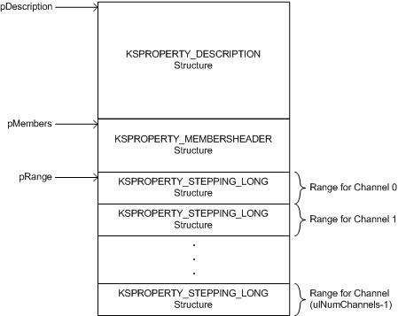
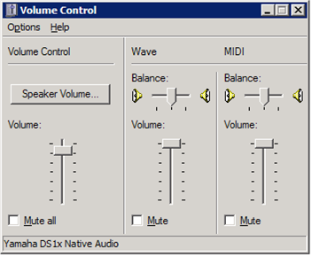
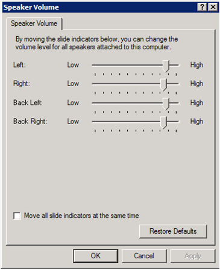

# Exposing Multichannel Nodes


## <span id="exposing_multichannel_nodes"></span><span id="EXPOSING_MULTICHANNEL_NODES"></span>


In versions of Microsoft Windows prior to Windows XP, WDM audio drivers do not have a streamlined way of exposing multichannel nodes of the following types:

[**KSNODETYPE\_VOLUME**](https://msdn.microsoft.com/library/windows/hardware/ff537208)

[**KSNODETYPE\_MUTE**](https://msdn.microsoft.com/library/windows/hardware/ff537178)

[**KSNODETYPE\_TONE**](https://msdn.microsoft.com/library/windows/hardware/ff537205)

In particular, no mechanism exists for explicitly querying a node for the number of channels that it supports. Although workarounds exist for this problem, they have drawbacks. For example, a client can use the [**KSPROPERTY\_AUDIO\_VOLUMELEVEL**](https://msdn.microsoft.com/library/windows/hardware/ff537309) property to iteratively query a volume node ([**KSNODETYPE\_VOLUME**](https://msdn.microsoft.com/library/windows/hardware/ff537208)) for the volume level of each channel--0, 1, and so on--until the request returns an error indicating that no more channels exist. However, this technique requires multiple queries and is too inefficient to handle newer multichannel audio devices. In Windows XP and later operating systems, this limitation is resolved by defining two additional flag bits in the **Flags** member of the [**KSPROPERTY\_MEMBERSHEADER**](https://msdn.microsoft.com/library/windows/hardware/ff565189) structure, which the property handler outputs in response to a basic-support query:

-   KSPROPERTY\_MEMBER\_FLAG\_BASICSUPPORT\_MULTICHANNEL

    During a basic-support property request on a node, the handler sets this flag bit to indicate that the **MembersCount** member of KSPROPERTY\_MEMBERSHEADER contains the number of channels that the node supports. For Windows Vista and later Windows operating systems, this flag must be set for every channel property.

-   KSPROPERTY\_MEMBER\_FLAG\_BASICSUPPORT\_UNIFORM

    The handler performs a bitwise OR between this flag bit and the KSPROPERTY\_MEMBER\_FLAG\_BASICSUPPORT\_MULTICHANNEL flag bit to indicate that a single property value is applied uniformly across all channels in a node. For example, if the hardware provides only a single volume-level control for all channels, the basic-support handler for the volume node sets the KSPROPERTY\_MEMBER\_FLAG\_BASICSUPPORT\_UNIFORM flag to indicate this restriction. If this flag is not set, the volume level for each channel can be controlled independently of the volume levels for the other channels.

    **Note**   The KSPROPERTY\_MEMBER\_FLAG\_BASICSUPPORT\_UNIFORM flag is not used by the Windows Vista operating system.

     

In miniport drivers for Windows XP and later, the property handler for a multichannel volume node should set the KSPROPERTY\_MEMBER\_FLAG\_BASICSUPPORT\_MULTICHANNEL bit in response to a KSPROPERTY\_AUDIO\_VOLUMELEVEL basic-support query. The handler returns an array of [**KSPROPERTY\_STEPPING\_LONG**](https://msdn.microsoft.com/library/windows/hardware/ff565631) structures--one for each channel exposed by the node--and sets **MembersSize** to **sizeof**(KSPROPERTY\_STEPPING\_LONG). Each array element describes a channel's minimum and maximum volume levels and the delta between successive values in the range. A different range can be specified for each individual channel so that channels with non-uniform ranges can be exposed correctly. For example, a subwoofer channel might have a range that differs from that of the other channels.

The following code example shows how to handle a [basic-support query for an audio property](basic-support-queries-for-audio-properties.md) with non-uniform property values. Variable pDescription in the first line of code below points to the [**KSPROPERTY\_DESCRIPTION**](https://msdn.microsoft.com/library/windows/hardware/ff565132) structure at the beginning of the data buffer into which the handler writes the basic-support information:

```cpp
  //
  // Fill in the members header.
  //
  PKSPROPERTY_MEMBERSHEADER pMembers = PKSPROPERTY_MEMBERSHEADER(pDescription + 1);

  pMembers->MembersFlags = KSPROPERTY_MEMBER_STEPPEDRANGES;
  pMembers->MembersSize = sizeof(KSPROPERTY_STEPPING_LONG);
  pMembers->MembersCount = ulNumChannels;
  pMembers->Flags = KSPROPERTY_MEMBER_FLAG_BASICSUPPORT_MULTICHANNEL;

  //
  // Fill in the stepped range with the driver default.
  //
  PKSPROPERTY_STEPPING_LONG pRange = PKSPROPERTY_STEPPING_LONG(pMembers + 1);
  pRange->Reserved = 0;

  for (ULONG i=0; i<ulNumChannels; i++)
  {
      pRange[i].Bounds.SignedMinimum = ulChannelMin[i];
      pRange[i].Bounds.SignedMaximum = ulChannelMax[i];
      pRange[i].SteppingDelta = ChannelStepping[i];
  }

  pPropertyRequest->ValueSize = sizeof(KSPROPERTY_DESCRIPTION) +
                                sizeof(KSPROPERTY_MEMBERSHEADER) + 
                                ulNumChannels * sizeof(KSPROPERTY_STEPPING_LONG);
```

The following figure shows the layout of the data buffer for this example. The pDescription, pMembers, and pRange pointers are shown pointing to their respective offsets within the buffer.



For this example, the handler sets **MembersCount** to **ulNumChannels**, the number of channels. The size in bytes of the range array is

**MembersSize** \* **MembersCount**

Note that if the KSPROPERTY\_MEMBER\_FLAG\_BASICSUPPORT\_UNIFORM flag were set in this example, the handler would set all of the KSPROPERTY\_STEPPING\_LONG structures in the array to the same range.

The basic-support handler for a tone node's [**KSPROPERTY\_AUDIO\_BASS**](https://msdn.microsoft.com/library/windows/hardware/ff537242), [**KSPROPERTY\_AUDIO\_TREBLE**](https://msdn.microsoft.com/library/windows/hardware/ff537308), or [**KSPROPERTY\_AUDIO\_MID**](https://msdn.microsoft.com/library/windows/hardware/ff537290) property operates in similar fashion.

If a multichannel node has a property with a per-channel property value of type BOOL, the basic-support handler must fill in values for a stepping range array. In this case, the handler sets the members to the values shown in the code example that follows. Two examples of this type of property are the [**KSPROPERTY\_AUDIO\_MUTE**](https://msdn.microsoft.com/library/windows/hardware/ff537293) property of a mute node and the [**KSPROPERTY\_AUDIO\_BASS\_BOOST**](https://msdn.microsoft.com/library/windows/hardware/ff537245) property of a tone node.

The following code example shows how to handle the basic-support request for a multichannel node, in the case of a property with a per-channel property value of type BOOL:

```cpp
  //
  // Fill in the members header.
  //
  PKSPROPERTY_MEMBERSHEADER pMembers = PKSPROPERTY_MEMBERSHEADER(pDescription + 1);

  pMembers->MembersFlags = KSPROPERTY_MEMBER_STEPPEDRANGES;
  pMembers->MembersSize = sizeof (KSPROPERTY_STEPPING_LONG);
  pMembers->MembersCount = ulNumChannels;
  pMembers->Flags = KSPROPERTY_MEMBER_FLAG_BASICSUPPORT_MULTICHANNEL;

  pPropertyRequest->ValueSize = sizeof(KSPROPERTY_DESCRIPTION) +
                                sizeof(KSPROPERTY_MEMBERSHEADER) + 
                                ulNumChannels * sizeof(KSPROPERTY_STEPPING_LONG);

  //
  // Fill in the stepped range with values in FOR loop.
  //
  PKSPROPERTY_STEPPING_LONG pRange = PKSPROPERTY_STEPPING_LONG(pMembers + 1);
  pRange->Reserved = 0;

  for (ULONG i=0; i<ulNumChannels; i++)
  {
      pRange[i].Bounds.SignedMinimum = 0;
      pRange[i].Bounds.SignedMaximum = 1;
      pRange[i].SteppingDelta = 1;
  }
```

Notice that in the preceding code example, the FOR loop uses a zero (0) and a one (1) to set the minimum and maximum values for the per-channel ranges. This is because we're configuring a multichannel node with a per-channel property value of type BOOL.

If the channel property is uniform, a bitwise OR operation can be performed between the KSPROPERTY\_MEMBER\_FLAG\_BASICSUPPORT\_UNIFORM flag and the KSPROPERTY\_MEMBER\_FLAG\_BASICSUPPORT\_MULTICHANNEL flag and the result assigned to the pMembers-&gt;Flags member. This value is used to indicate that the hardware applies the same property value uniformly across all channels in a node.

Using the KSPROPERTY\_MEMBER\_FLAG\_UNIFORM and KSPROPERTY\_MEMBER\_FLAG\_MULTICHANNEL flags eliminates the need to group the channels into pairs and expose a separate stereo volume node for each pair of channels, as is done in the Ac97 sample driver in the Windows Driver Kit (WDK). Because Windows versions earlier than Windows XP do not support these flags, the basic-support handler for your driver must use the [IPortClsVersion](https://msdn.microsoft.com/library/windows/hardware/ff536877) interface to query for the Portcls.sys version in order to determine whether to use these flags.

The topology parser (in the kernel-mode [WDMAud system driver](user-mode-wdm-audio-components.md#wdmaud_system_driver), Wdmaud.sys) obtains an audio device's topology from its WDM audio driver. The parser exposes that device as a traditional mixer device through the legacy Windows Multimedia **mixer** API. In Windows XP and later, WDMAud uses the KSPROPERTY\_MEMBER\_FLAG\_BASICSUPPORT\_MULTICHANNEL flag to determine the number of channels to report in the **cChannels** member of the MIXERLINE structure. Additionally, if the node's basic-support handler specifies the KSPROPERTY\_MEMBER\_FLAG\_BASICSUPPORT\_UNIFORM flag, WDMAud sets the MIXERCONTROL\_CONTROLF\_UNIFORM flag in the corresponding MIXERCONTROL structure. Through this flag, applications can determine whether they can adjust each channel individually or all channels uniformly through a master control. For more information about MIXERCONTROL, MIXERLINE, and the **mixer** API, see the Microsoft Windows SDK documentation.

In Windows XP and later, the SndVol32 volume-control program (see [SysTray and SndVol32](systray-and-sndvol32.md)) displays controls for multichannel devices, as shown in the following figure.



If SndVol32 detects a line that has more than two channels, it replaces the normal pan control with a button labeled **Speaker Volume**, which appears above the main volume slider in the preceding figure. Clicking on the **Speaker Volume** button will bring up a dialog displaying controls for all of the channels for a particular line, as shown in the following figure.



Because the **mixer** API exposes channels by number, it infers the channel names from the speaker configuration that is currently selected in the **Advanced Audio Properties** dialog in the Windows multimedia control panel (Mmsys.cpl).

For example, if a device exposes four channels on a line and the user has selected "Quadraphonic speakers", the channel names will be "Left" (channel 0), "Right" (channel 1), "Back Left" (channel 2), and "Back Right" (channel 3), as shown in the preceding figure. Changing the speaker configuration to "Surround sound speakers" will result in a channel mapping of "Left" (channel 0), "Right" (channel 1), "Front Center" (channel 2), and "Back Center" (channel 3).

At the driver level, the KSPROPERTY\_AUDIO\_CHANNEL\_CONFIG property uses a mask value of KSAUDIO\_SPEAKER\_QUAD or KSAUDIO\_SPEAKER\_SURROUND to represent a quadraphonic or surround speaker configuration, respectively. Header file Ksmedia.h defines these values as follows:

```cpp
  #define KSAUDIO_SPEAKER_QUAD      (SPEAKER_FRONT_LEFT | SPEAKER_FRONT_RIGHT | \
                                     SPEAKER_BACK_LEFT | SPEAKER_BACK_RIGHT)

  #define KSAUDIO_SPEAKER_SURROUND  (SPEAKER_FRONT_LEFT | SPEAKER_FRONT_RIGHT | \
                                     SPEAKER_FRONT_CENTER | SPEAKER_BACK_CENTER)
```

Either mask contains four bits that specify the speaker positions of the four channels. In either case, the KSPROPERTY\_AUDIO\_VOLUMELEVEL property identifies these same four channels as channels 0, 1, 2, and 3, respectively.

If the node's basic-support handler sets the KSPROPERTY\_MEMBER\_FLAG\_BASICSUPPORT\_UNIFORM flag bit, the sliders shown in the **Speaker Volume** dialog move in unison with changes made to any single slider.

 

 


