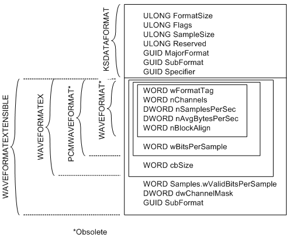

# Extensible Wave-Format Descriptors

## 

The following figure shows the data-format descriptor for a wave audio stream.

As indicated in the figure, the amount of additional format information following the [**KSDATAFORMAT**](https://msdn.microsoft.com/library/windows/hardware/ff561656) structure varies depending on the data format.

Audio systems use this type of format descriptor in several ways:

-   A format descriptor like the one shown in the preceding figure is passed as a call parameter to a miniport driver's **NewStream** method (for example, see [**IMiniportWaveCyclic::NewStream**](https://msdn.microsoft.com/library/windows/hardware/ff536723)).

-   The *ResultantFormat* parameter of the [**IMiniport::DataRangeIntersection**](https://msdn.microsoft.com/library/windows/hardware/ff536764) method points to a buffer into which the method writes a format descriptor like the one shown in the preceding figure.

-   The [**KSPROPERTY\_PIN\_DATAINTERSECTION**](https://msdn.microsoft.com/library/windows/hardware/ff565198) get-property request retrieves a format descriptor like the one shown in the preceding figure.

-   The [**KSPROPERTY\_PIN\_PROPOSEDATAFORMAT**](https://msdn.microsoft.com/library/windows/hardware/ff565206) set-property request accepts a format descriptor like the one shown in the preceding figure.

-   A similar format is used for the [**KsCreatePin**](https://msdn.microsoft.com/library/windows/hardware/ff561652) function's *Connect* call parameter. This parameter points to the [**KSPIN\_CONNECT**](https://msdn.microsoft.com/library/windows/hardware/ff563531) structure at the beginning of a buffer that also contains a format descriptor. The format descriptor, which immediately follows the KSPIN\_CONNECT structure, begins with a KSDATAFORMAT structure like the one shown in the preceding figure.

The format information that follows the KSDATAFORMAT structure should be either a [**WAVEFORMATEXTENSIBLE**](https://msdn.microsoft.com/library/windows/hardware/ff538802) structure or a [**WAVEFORMATEX**](https://msdn.microsoft.com/library/windows/hardware/ff538799) structure. WAVEFORMATEXTENSIBLE is an extended version of WAVEFORMATEX that can describe a broader range of formats than WAVEFORMATEX. WAVEFORMATEX is an extended version of the pre-WDM WAVEFORMAT structure. WAVEFORMAT is obsolete and is not supported by the WDM audio subsystem in any version of Microsoft Windows.

Similarly, the PCMWAVEFORMAT structure is an extended version of WAVEFORMAT that is obsolete, but for which the WDM audio subsystem provides limited support.

For information about WAVEFORMAT and PCMWAVEFORMAT, see the Microsoft Windows SDK documentation.

The four wave-format structures--WAVEFORMAT, PCMWAVEFORMAT, WAVEFORMATEX, and WAVEFORMATEXTENSIBLE--all begin with the same five members, starting with **wFormatTag**. The preceding figure shows these four structures superimposed on each other to highlight the portions of the structures that are identical. PCMWAVEFORMAT and WAVEFORMATEX extend WAVEFORMAT by adding a **wBitsPerSample** member, but WAVEFORMATEX also adds a **cbSize** member. WAVEFORMATEXTENSIBLE extends WAVEFORMATEX by adding three members, beginning with **Samples**.wValidBitsPerSample. (**Samples** is a union whose other member, **wValidSamplesPerBlock**, is used instead of **wValidBitsPerSample** for some compressed formats.) The **wFormatTag** member, which immediately follows the end of the KSDATAFORMAT structure in the buffer, specifies what kind of format information follows KSDATAFORMAT. The [KMixer system driver](kernel-mode-wdm-audio-components.md#kmixer_system_driver) supports only PCM formats that use one of the three format tags shown in the following table.

<table>
<colgroup>
<col width="50%" />
<col width="50%" />
</colgroup>
<thead>
<tr class="header">
<th align="left">wFormatTag Value</th>
<th align="left">Meaning</th>
</tr>
</thead>
<tbody>
<tr class="odd">
<td align="left">
WAVE_FORMAT_PCM
</td>
<td align="left">
Integer PCM data format specified by WAVEFORMATEX or PCMWAVEFORMAT.
</td>
</tr>
<tr class="even">
<td align="left">
WAVE_FORMAT_IEEE_FLOAT
</td>
<td align="left">
Floating-point PCM data format specified by WAVEFORMATEX.
</td>
</tr>
<tr class="odd">
<td align="left">
WAVE_FORMAT_EXTENSIBLE
</td>
<td align="left">
Extended data format specified by WAVEFORMATEXTENSIBLE.
</td>
</tr>
</tbody>
</table>

 

In fact, KMixer supports only a subset of the PCM formats that can be described by these tag values (and it supports no non-PCM formats). USB audio devices (see [USBAudio Class System Driver](kernel-mode-wdm-audio-components.md#usbaudio_class_system_driver)) are restricted to this subset because all PCM-formatted USB audio streams pass through KMixer. (Some non-PCM USB audio streams can bypass KMixer; for more information, see [USB Audio Support for Non-PCM Formats](usb-audio-support-for-non-pcm-formats.md).) However, in Windows XP and earlier, DirectSound applications can overcome KMixer's restrictions by connecting directly to hardware pins on WaveCyclic and WavePci devices that support formats not supported by KMixer. For more information, see [DirectSound Hardware Acceleration in WDM Audio](directsound-hardware-acceleration-in-wdm-audio.md).

Note the ambiguity in the meaning of the WAVE\_FORMAT\_PCM tag value in the preceding table--it can specify either a WAVEFORMATEX or PCMWAVEFORMAT structure. However, these two structures are nearly identical. The only difference is that WAVEFORMATEX contains a **cbSize** member and PCMWAVEFORMAT does not. According to the WAVEFORMATEX specification, **cbSize** is ignored if **wFormatTag** = WAVE\_FORMAT\_PCM (because **cbSize** is implicitly zero); **cbSize** is used for all other formats. Thus, in the case of a PCM format, PCMWAVEFORMAT and WAVEFORMATEX contain the same information and can be treated identically.

WAVEFORMATEX can specify only a subset of the formats that WAVEFORMATEXTENSIBLE can specify. Unlike WAVEFORMATEX, WAVEFORMATEXTENSIBLE can do the following:

1.  Specify the number of bits per sample separately from the size of the sample container. For example, a 20-bit sample can be stored left-justified within a three-byte container. WAVEFORMATEX, which fails to distinguish the number of data bits per sample from the sample container size, is unable to describe such a format unambiguously.

2.  Assign specific speaker locations to audio channels in multichannel streams. WAVEFORMATEX lacks this capability and can adequately support only mono and (two-channel) stereo streams.

Any format that is described by WAVEFORMATEX can also be described by WAVEFORMATEXTENSIBLE. For information about converting a WAVEFORMATEX structure to WAVEFORMATEXTENSIBLE, see [Converting Between Format Tags and Subformat GUIDs](converting-between-format-tags-and-subformat-guids.md).

WAVEFORMATEX is sufficient for describing formats with sample sizes of 8 or 16 bits, but WAVEFORMATEXTENSIBLE is necessary to adequately describe formats with a sample precision of greater than 16 bits. Here are two examples:

-   A stream with a sample precision of 24 bits can use a 32-bit container size for efficient processing, but can be converted to use a 24-bit container to improve storage efficiency without loss of data.

-   When processing a stream with 24-bit sample data, a rendering device that provides only 20 bits of precision can use dithering to improve the fidelity of its output signal. Dithering, however, requires additional processing time, and if the original stream is accurate to only 20 bits, the additional processing is unnecessary.

In both of these examples, preserving signal quality while making the right tradeoff between processing and storage efficiency is possible only if both the sample precision and container size are known.

If a simple format can be unambiguously described by either a WAVEFORMATEX or a WAVEFORMATEXTENSIBLE structure, an audio driver has the option of selecting either structure to describe the format. However, audio drivers have typically used WAVEFORMATEX to specify mono and (two-channel) stereo PCM formats with 8-bit or 16-bit samples, and some older applications might expect all audio drivers to use WAVEFORMATEX to specify these formats.

If a driver supports an audio format that can be unambiguously specified as either a WAVEFORMATEX or a WAVEFORMATEXTENSIBLE structure, the driver should recognize the format regardless of which of the two structures a client application or component uses to specify the structure. For example, if an audio device supports a 44.1-kHz, 16-bit, stereo PCM format, the miniport driver's KSPROPERTY\_PIN\_PROPOSEDATAFORMAT property handler and its implementation of the **NewStream** method should accept that format regardless of whether the format is specified as a WAVEFORMATEX or a WAVEFORMATEXTENSIBLE structure.

To simplify the processing of format data, drivers typically use WAVEFORMATEXTENSIBLE structures to internally represent formats. This approach might require the conversion of an input WAVEFORMATEX structure to an internal WAVEFORMATEXTENSIBLE representation, or the conversion of an internal WAVEFORMATEXTENSIBLE representation to an output WAVEFORMATEX structure.

When converting a format descriptor from WAVEFORMATEX to WAVEFORMATEXTENSIBLE, if the **wFormatTag** member of the WAVEFORMATEX structure is either WAVE\_FORMAT\_PCM or WAVE\_FORMAT\_IEEE\_FLOAT, set the **dwChannelMask** member of the WAVEFORMATEXTENSIBLE structure to either SPEAKER\_FRONT\_CENTER (for a mono stream) or SPEAKER\_FRONT\_LEFT | SPEAKER\_FRONT\_RIGHT (for a stereo stream). The SPEAKER\_FRONT\_*XXX* constants are defined in header file Ksmedia.h.

In all Windows releases except for Windows 98 "Gold", KMixer supports a range of WAVEFORMATEXTENSIBLE PCM formats that have multiple channels and have up to 32 bits per sample.

The subset of WAVEFORMATEX PCM formats that KMixer supports differs between Windows releases, as shown in the following table.

<table>
<colgroup>
<col width="33%" />
<col width="33%" />
<col width="33%" />
</colgroup>
<thead>
<tr class="header">
<th align="left">Windows Release</th>
<th align="left">Packed Sample Sizes</th>
<th align="left">Number of Channels</th>
</tr>
</thead>
<tbody>
<tr class="odd">
<td align="left">
Windows 98 &quot;Gold&quot;
</td>
<td align="left">
8, 16, 24, and 32 bits
</td>
<td align="left">
Multichannel
</td>
</tr>
<tr class="even">
<td align="left">
Windows 98 SE
</td>
<td align="left">
8 and 16 bits only
</td>
<td align="left">
Mono and stereo only
</td>
</tr>
<tr class="odd">
<td align="left">
Windows 98 SE + hotfix
</td>
<td align="left">
8, 16, 24, and 32 bits
</td>
<td align="left">
Mono and stereo only
</td>
</tr>
<tr class="even">
<td align="left">
Windows 2000
</td>
<td align="left">
8 and 16 bits only
</td>
<td align="left">
Mono and stereo only
</td>
</tr>
<tr class="odd">
<td align="left">
Windows Me
</td>
<td align="left">
8, 16, 24, and 32 bits
</td>
<td align="left">
Mono and stereo only
</td>
</tr>
<tr class="even">
<td align="left">
Windows XP and later
</td>
<td align="left">
8 and 16 bits only
</td>
<td align="left">
Mono and stereo only
</td>
</tr>
</tbody>
</table>

 
In WAVEFORMATEXTENSIBLE, **dwBitsPerSample** is the container size, and **wValidBitsPerSample** is the number of valid data bits per sample. Containers are always byte-aligned in memory, and the container size must be specified as a multiple of eight bits.

Before the WAVEFORMATEXTENSIBLE structure was defined, vendors had to register each new wave format with Microsoft so that an official, 16-bit format tag could be assigned to the format. (The format tag is contained in the **wFormatTag** member of the WAVEFORMATEX structure.) A list of registered format tags appears in public header file Mmreg.h (for example, WAVE\_FORMAT\_MPEG).

With WAVEFORMATEXTENSIBLE, registering formats is no longer necessary. Vendors can independently assign GUIDs to their new formats as needed. (The format GUID is contained in the **SubFormat** member of WAVEFORMATEXTENSIBLE.) However, Microsoft lists some of the more popular format GUIDs in public header file Ksmedia.h (for example, KSDATAFORMAT\_SUBTYPE\_MPEG). Before defining a new format GUID, vendors should check the list of KSDATAFORMAT\_SUBTYPE\_*XXX* constants in Ksmedia.h to determine whether an appropriate GUID has already been defined for a particular format.

When using WAVEFORMATEXTENSIBLE, set **wFormatTag** to WAVE\_FORMAT\_EXTENSIBLE and **SubFormat** to the appropriate format GUID. For integer PCM formats, set **SubFormat** to KSDATAFORMAT\_SUBTYPE\_PCM. For PCM formats that encode sample values as floating-point numbers, set **SubFormat** to KSDATAFORMAT\_SUBTYPE\_IEEE\_FLOAT. For either of these formats, set **cbSize** to **sizeof**(WAVEFORMATEXTENSIBLE)**-sizeof**(WAVEFORMATEX). For information about using WAVEFORMATEXTENSIBLE to describe non-PCM data formats, see [Supporting Non-PCM Wave Formats](supporting-non-pcm-wave-formats.md).

 

 

