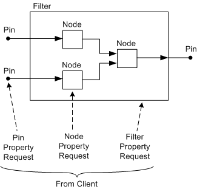

# Filter, Pin, and Node Properties

## 

Microsoft Windows Driver Model (WDM) audio drivers represent an audio device as a KS filter, and they represent a hardware buffer on the device as a pin on the filter. When a client sends a property request to one of these filter or pin objects, the port driver receives the request and routes the request to the appropriate property handler in the port driver or miniport driver.

Audio devices support three kinds of properties:

-   **Filter properties**

    A filter property is a property of the filter as a whole rather than a property of a particular pin or node within the filter. Requests for filter properties specify filter handles, but they do not specify node IDs.

-   **Pin properties**

    A pin property is a property of a particular pin instance on the filter. Requests for these properties specify pin handles, but they do not specify node IDs.

-   **Node properties**

    A node property is a property of a topology node within the filter. A request for a node property specifies a filter handle or pin handle, plus a node ID.

Whether a node-property request specifies a filter or pin handle depends on whether the node is unique to the filter. For more information, see the following Node Properties section.

The following figure shows these three kinds of property request: a pin-property request sent to a pin instance, a node-property request sent to a node (on a filter or pin instance), and a filter-property request sent to a filter instance.

Typically, the port driver handles most requests for filter and pin properties, and the miniport driver handles requests for node properties.

The port driver supplies its own built-in handlers for the filter and pin properties that are used by the [SysAudio system driver](kernel-mode-wdm-audio-components.md#sysaudio_system_driver) (see [KSPROPSETID\_Sysaudio](https://msdn.microsoft.com/library/windows/hardware/ff537489) and [KSPROPSETID\_Sysaudio\_Pin](https://msdn.microsoft.com/library/windows/hardware/ff537490)) and [WDMAud system driver](user-mode-wdm-audio-components.md#wdmaud_system_driver). A miniport driver does not need to implement handlers for properties that the port driver handles. A typical miniport driver provides few, if any, handlers for filter and pin properties. The miniport driver supplies the handlers for node properties that represent hardware-dependent features of the audio device. The port drivers supply no built-in handling of node properties, with the exception of [**KSPROPERTY\_TOPOLOGY\_NAME**](https://msdn.microsoft.com/library/windows/hardware/ff565809).

When both the port driver and miniport driver supply handlers for the same property, the port driver uses its own handler and ignores the miniport driver's handler.

### Filter Descriptors

The port driver obtains pointers to the miniport driver's property handlers by calling the [**IMiniport::GetDescription**](https://msdn.microsoft.com/library/windows/hardware/ff536765) method. Through this method, the port driver retrieves a pointer to the miniport driver's filter descriptor, which is a structure of type [**PCFILTER\_DESCRIPTOR**](https://msdn.microsoft.com/library/windows/hardware/ff537694). This structure specifies the miniport driver's property handlers for filter, pin, and node properties:

-   The PCFILTER\_DESCRIPTOR structure's **AutomationTable** member points to the automation table for the filter. This table specifies the miniport driver's property handlers for filter properties.

-   The PCFILTER\_DESCRIPTOR structure's **Pins** member contains the automation tables for the pins. Each table specifies the property handlers for the pin properties of a particular pin type.

-   The PCFILTER\_DESCRIPTOR structure's **Nodes** member contains the automation tables for the topology nodes inside the filter. Each table specifies the property handlers for the node properties of a particular node type.

### Filter Properties

The port driver accesses the miniport driver's filter-property handlers through the **AutomationTable** member of PCFILTER\_DESCRIPTOR. Typically, this automation table contains few handlers because the port driver supplies its own built-in handlers for all the filter properties that SysAudio and WDMAud use to query and configure audio devices.

However, the miniport driver can supply handlers for filter properties such as [**KSPROPERTY\_GENERAL\_COMPONENTID**](https://msdn.microsoft.com/library/windows/hardware/ff565171) that provide hardware-dependent information that is not available to the port driver. Two of the sample audio drivers in the Microsoft Windows Driver Kit (WDK) handle the KSPROPERTY\_GENERAL\_COMPONENTID property. For more information, see the miniport driver implementations in the Msvad and Sb16 samples.

All the port drivers in Portcls.sys provide handling for the [KSPROPSETID\_Pin](https://msdn.microsoft.com/library/windows/hardware/ff566584) and [KSPROPSETID\_Topology](https://msdn.microsoft.com/library/windows/hardware/ff566598) property sets. All the properties in these sets are filter properties, with the exception of [**KSPROPERTY\_TOPOLOGY\_NAME**](https://msdn.microsoft.com/library/windows/hardware/ff565809), which is a node property (that uses a filter handle, not a pin handle, to specify the target for the request). The port drivers support the following subset of the KSPROPSETID\_Pin properties:

[**KSPROPERTY\_PIN\_CATEGORY**](https://msdn.microsoft.com/library/windows/hardware/ff565192)

[**KSPROPERTY\_PIN\_CINSTANCES**](https://msdn.microsoft.com/library/windows/hardware/ff565193)

[**KSPROPERTY\_PIN\_COMMUNICATION**](https://msdn.microsoft.com/library/windows/hardware/ff565194)

[**KSPROPERTY\_PIN\_CONSTRAINEDDATARANGES**](https://msdn.microsoft.com/library/windows/hardware/ff565195)

[**KSPROPERTY\_PIN\_CTYPES**](https://msdn.microsoft.com/library/windows/hardware/ff565196)

[**KSPROPERTY\_PIN\_DATAFLOW**](https://msdn.microsoft.com/library/windows/hardware/ff565197)

[**KSPROPERTY\_PIN\_DATAINTERSECTION**](https://msdn.microsoft.com/library/windows/hardware/ff565198)

[**KSPROPERTY\_PIN\_DATARANGES**](https://msdn.microsoft.com/library/windows/hardware/ff565199)

[**KSPROPERTY\_PIN\_GLOBALCINSTANCES**](https://msdn.microsoft.com/library/windows/hardware/ff565200)

[**KSPROPERTY\_PIN\_INTERFACES**](https://msdn.microsoft.com/library/windows/hardware/ff565201)

[**KSPROPERTY\_PIN\_MEDIUMS**](https://msdn.microsoft.com/library/windows/hardware/ff565202)

[**KSPROPERTY\_PIN\_NAME**](https://msdn.microsoft.com/library/windows/hardware/ff565203)

[**KSPROPERTY\_PIN\_NECESSARYINSTANCES**](https://msdn.microsoft.com/library/windows/hardware/ff565204)

[**KSPROPERTY\_PIN\_PHYSICALCONNECTION**](https://msdn.microsoft.com/library/windows/hardware/ff565205)

[**KSPROPERTY\_PIN\_PROPOSEDATAFORMAT**](https://msdn.microsoft.com/library/windows/hardware/ff565206)

[**KSPROPERTY\_PIN\_PROPOSEDATAFORMAT2**](https://msdn.microsoft.com/library/windows/hardware/dn567589)

These properties provide information about the pin factories belonging to a filter. Typically, clients query the filter for these properties before creating pin instances. The port drivers support all four of the KSPROPSETID\_Topology properties, which provide information about the filter's internal topology.

In addition, the DMus port driver provides a handler for the [**KSPROPERTY\_SYNTH\_MASTERCLOCK**](https://msdn.microsoft.com/library/windows/hardware/ff537403) property, which is a get-only property of a DirectMusic filter. KSPROPERTY\_SYNTH\_MASTERCLOCK is a member of the [KSPROPSETID\_SynthClock](https://msdn.microsoft.com/library/windows/hardware/ff537487) property set.

### Pin Properties

The port driver accesses the miniport driver's pin-property handlers through the **Pins** member of PCFILTER\_DESCRIPTOR. This member points to an array of pin descriptors, and each descriptor points to the automation table for a pin type (identified by a pin ID, which is simply the array index).

Typically, these automation tables contain few entries because the port driver supplies its own handlers for all the pin properties that SysAudio and WDMAud use. A miniport driver has the option of supplying handlers for one or more pin properties that the port driver does not handle, but only clients that know about these properties can send property requests for them.

With the exception of the Topology port driver, all the port drivers in Portcls.sys supply built-in handlers for the following pin properties:

[**KSPROPERTY\_CONNECTION\_STATE**](https://msdn.microsoft.com/library/windows/hardware/ff565110)

[**KSPROPERTY\_CONNECTION\_DATAFORMAT**](https://msdn.microsoft.com/library/windows/hardware/ff565103)

[**KSPROPERTY\_CONNECTION\_ALLOCATORFRAMING**](https://msdn.microsoft.com/library/windows/hardware/ff565099)

[**KSPROPERTY\_STREAM\_ALLOCATOR**](https://msdn.microsoft.com/library/windows/hardware/ff565684)

[**KSPROPERTY\_STREAM\_MASTERCLOCK**](https://msdn.microsoft.com/library/windows/hardware/ff565713)

[**KSPROPERTY\_AUDIO\_POSITION**](https://msdn.microsoft.com/library/windows/hardware/ff537297)

[**KSPROPERTY\_DRMAUDIOSTREAM\_CONTENTID**](https://msdn.microsoft.com/library/windows/hardware/ff537351)

Some of the properties in this list require hardware-dependent information from the miniport driver. When the port driver receives an IRP containing a request for one of these properties, it does not pass the IRP to the miniport driver. Instead, the port driver handles the request itself, but its handler obtains the information it needs by calling an entry point in the miniport driver. For example, the port driver supplies its own property handler for KSPROPERTY\_AUDIO\_POSITION requests. This handler simply calls the miniport driver stream's **GetPosition** method (for example, [**IMiniportWavePciStream::GetPosition**](https://msdn.microsoft.com/library/windows/hardware/ff536727)) to get the current position.

### Node Properties

The port driver accesses the miniport driver's node-property handlers through the **Nodes** member of PCFILTER\_DESCRIPTOR. This member points to an array of node descriptors, and each descriptor points to the automation table for a node type (identified by a node ID, which is simply the array index). Typically, all or most of the property handlers belonging to a miniport driver reside in the **Nodes** array. An audio driver represents the hardware controls in an audio device as topology nodes, and it uses the property mechanism to provide clients with access to the hardware-dependent control settings.

As described previously, a client sends a filter-property request to a filter handle, and a pin-property request to a pin handle. Unlike a filter or pin instance, a node is not a kernel object and does not have a handle. A client sends a node-property request to either a pin handle or a filter handle, but the request also specifies a node ID to indicate that the request is for a node property rather than a pin or filter property.

The following are general rules for determining whether a node property should use a filter handle or pin handle:

-   If a filter contains several instances of a particular pin type, and each pin of that type contains a node with a particular node ID, then each pin instance contains an instance of the node. In this case, a node-property request must specify a pin handle (rather than just a filter handle) to distinguish among several instances of the same node type. The combination of pin handle and node ID unambiguously identifies a particular node instance as the target for the request.

-   If a filter contains only one instance of a particular node, a node property request specifies a filter handle. The combination of filter handle and node ID is sufficient to unambiguously identify the node that is the target for the request.

Before implementing a handler for a particular node property, however, the driver writer should refer to [Audio Drivers Property Sets](https://msdn.microsoft.com/library/windows/hardware/ff536197) to check whether the target for the property should be specified as a filter handle or pin handle.

The port drivers in Portcls.sys currently do not provide built-in handling of node properties, with the exception of KSPROPERTY\_TOPOLOGY\_NAME.

### Overspecified and Underspecified Property Requests

Drivers should be prepared to deal with property requests from clients that do not follow the preceding rules. Requests can be either overspecified or underspecified:

-   **Overspecified requests**

    If a property request requires only a filter handle, but the client sends the request to a pin handle instead, the target for the request is overspecified. However, drivers typically treat the request as valid; that is, they treat the request as though it had been sent to the filter containing the pin.

-   **Underspecified requests**

    If a property request requires a pin handle, but a client sends the request to a filter handle instead, the target for the request is underspecified. For example, if a filter contains several pin instances with the same node type, and a client sends a request for a property of that node type to a filter handle rather than a pin handle, the driver has no way to determine which node instance should receive the request. In this case, the behavior depends on the driver. Instead of automatically failing all underspecified requests, some drivers treat an underspecified set-property request as valid. In this case, the interpretation is that the request sets the default value for the specified node ID. When a pin factory creates a new node instance, the property belonging to the new node is initialized to the default value. A request that changes the default value has no effect on node instances created before the request. In addition, drivers uniformly fail underspecified get-property requests because the handler has no way to determine which node instance to query for the property.

### Exceptions to the Rules

For historical reasons, a few audio properties have behavioral quirks that violate these general rules. The following are examples:

-   As described in [Applying Speaker-Configuration Settings](applying-speaker-configuration-settings.md), a client can change an audio device's speaker configuration by setting the [**KSPROPERTY\_AUDIO\_CHANNEL\_CONFIG**](https://msdn.microsoft.com/library/windows/hardware/ff537250) property of a 3-D node ([**KSNODETYPE\_3D\_EFFECTS**](https://msdn.microsoft.com/library/windows/hardware/ff537148)). The speaker-configuration setting is global because it changes the speaker configuration for all streams that are part of the mix that the device plays through the speakers. According to the general rule, a node-property request that affects the filter as a whole should specify a filter handle (plus a node ID). However, this particular property requires a pin handle instead of a filter handle. The pin handle designates the pin instance containing the 3-D node that is the target for the request.

-   [**KSPROPERTY\_SYNTH\_VOLUME**](https://msdn.microsoft.com/library/windows/hardware/ff537409) and [**KSPROPERTY\_SYNTH\_MASTERCLOCK**](https://msdn.microsoft.com/library/windows/hardware/ff537403) are properties of a synth node ([**KSNODETYPE\_SYNTHESIZER**](https://msdn.microsoft.com/library/windows/hardware/ff537203)). Although both are node properties, requests for these properties do not include node IDs. (Note that the property descriptor for the request is a structure of type [**KSPROPERTY**](https://msdn.microsoft.com/library/windows/hardware/ff564262), not [**KSNODEPROPERTY**](https://msdn.microsoft.com/library/windows/hardware/ff537143).) This behavior violates the general rule that a node property requires a node ID. Despite this discrepancy, a miniport driver that supports either property should supply the property handler through the **Nodes** member of PCFILTER\_DESCRIPTOR (instead of the **Pins** member).

 

 

