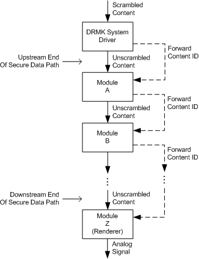

# Forwarding DRM Content IDs

## 

The [DRMK system driver](kernel-mode-wdm-audio-components.md#drmk_system_driver) unscrambles an audio playback stream containing protected content. DRMK implements a KS filter that takes an input stream containing the scrambled data, unscrambles it, and feeds the unscrambled stream into a data path consisting of some number of kernel-resident modules. These modules can be KS filters or other types of drivers. The data path typically ends in an audio-rendering device that converts the digital content to an analog signal that can be played through speakers.

Before allowing the unscrambled content to enter the data path, DRMK verifies that the data path is secure. To do so, DRMK authenticates each module in the data path, beginning with the module at the upstream end of the data path and moving downstream to the other end of the data path. The following figure illustrates this process.

In the preceding figure, the solid arrows represent the data path, and the dashed arrows represent the communications necessary to verify that the data path is secure. The unscrambled data enters the path only after DRMK has finished authenticating all of the modules in that path.

After DRMK authenticates each module, that module provides DRMK with information about the next module in the data path so that it can also be authenticated. As each module is authenticated, it receives the DRM content ID that identifies the stream.

Beginning at the upstream end of the secure data path, DRMK forwards the content ID to module A, which in turn forwards the content ID to module B. This process continues until the content ID is forwarded to module Z, the last module in the secure data path.

The following figure shows a pair of adjacent modules in the data path.

The module on the upstream side calls one of the following [DRM functions](https://msdn.microsoft.com/library/windows/hardware/ff536356) to provide DRMK with information about the downstream module and to forward the content ID to that module:

[**DrmForwardContentToDeviceObject**](https://msdn.microsoft.com/library/windows/hardware/ff536351)

[**DrmForwardContentToInterface**](https://msdn.microsoft.com/library/windows/hardware/ff536353)

[**DrmAddContentHandlers**](https://msdn.microsoft.com/library/windows/hardware/ff536347)

Each of these "forwarding" functions provides DRMK with the DRM content ID that identifies the protected stream, and with information that DRMK needs to authenticate the downstream module. The choice of which of these three functions to call depends on the type of interface that the two adjacent modules use to communicate with each other as they manage the transfer of protected content:

1.  If the upstream module calls [**IoCallDriver**](https://msdn.microsoft.com/library/windows/hardware/ff548336) to communicate with the downstream module, the downstream module is a part of a WDM driver. In this case, the upstream module calls **DrmForwardContentToDeviceObject** to provide DRMK with the device object representing the downstream module. DRMK uses the device object to authenticate the downstream module.

2.  If the two modules communicate through a COM interface that the downstream module implements, the upstream module calls **DrmForwardContentToInterface**. This call provides DRMK with a pointer to the downstream module's COM interface. DRMK calls only the **IUnknown** methods in this interface and makes no assumptions about the other methods, although the two modules themselves must agree on what these methods do. DRMK verifies that the entry point for each method in the interface belongs to an authenticated module. If the entry points are distributed among several modules, DRMK authenticates all of these modules.

3.  If the two modules use neither a COM interface nor the **IoCallDriver** function to communicate, the upstream module calls **DrmAddContentHandlers** to provide DRMK with a list of entry points to "content handlers" that are implemented in the downstream module. DRMK does not call the content handlers and makes no assumptions regarding the functions they perform. DRMK does, however, authenticate the module (or modules) in which the entry points reside.

After being authenticated, the downstream module requires the following information:

-   The DRM content ID that identifies the stream containing the protected content. The module requires this ID to inform DRMK of any module, further downstream, to which it plans to send the protected content.

-   The DRM content rights associated with the protected content. The module requires the content rights in order to enforce the appropriate level of security.

Each of the three forwarding functions provides this information to the module in a slightly different manner:

1.  The **DrmForwardContentToDeviceObject** function sends a [**KSPROPERTY\_DRMAUDIOSTREAM\_CONTENTID**](https://msdn.microsoft.com/library/windows/hardware/ff537351) set-property request to the downstream module's device object. This request forwards the stream's content ID and content rights to the downstream module.

2.  The **DrmForwardContentToInterface** function queries the downstream module's COM interface for the [IDrmAudioStream](https://msdn.microsoft.com/library/windows/hardware/ff536568) interface. If the query succeeds, the function calls the [**IDrmAudioStream::SetContentId**](https://msdn.microsoft.com/library/windows/hardware/ff536570) method to forward the content ID and content rights to the downstream module.

3.  In the case of the **DrmAddContentHandlers** function, the caller (the upstream module) is responsible for forwarding the stream's content ID and content rights to the downstream module. Once **DrmAddContentHandlers** returns with a success code indicating that the downstream module has been authenticated, the upstream module passes the content ID and content rights to the downstream module by calling one of its content handlers.

If the upstream module is a WaveCyclic or WavePci miniport driver, it can call the appropriate DRM function indirectly through one of the following methods:

[**IDrmPort2::ForwardContentToDeviceObject**](https://msdn.microsoft.com/library/windows/hardware/ff536579)

[**IDrmPort::ForwardContentToInterface**](https://msdn.microsoft.com/library/windows/hardware/ff536586)

[**IDrmPort2::AddContentHandlers**](https://msdn.microsoft.com/library/windows/hardware/ff536575)

For more information, see [DRM Functions](https://msdn.microsoft.com/library/windows/hardware/ff536356).

For simplicity, the preceding discussion assumes that each module in the data path accepts a stream from a single source and forwards that stream to at most one downstream module. In fact, a module can forward a stream to two or more downstream modules, but it must first authenticate each downstream module by calling one of the three forwarding functions. Similarly, a module can mix together several input streams, but it must respect the content rights of the input streams by providing the appropriate level of protection to the mixed output stream. For more information, see the discussion of the [**DrmCreateContentMixed**](https://msdn.microsoft.com/library/windows/hardware/ff536348) function in [Content IDs and Content Rights](content-ids-and-content-rights.md).

A typical secure data path consists of the [KMixer system driver](kernel-mode-wdm-audio-components.md#kmixer_system_driver) followed by a wave filter that represents the audio rendering device. The filter is implemented as a WaveCyclic or WavePci miniport driver in combination with the corresponding port driver. To verify that the data path is secure, DRMK forwards the content ID to KMixer, which in turn forwards the content ID to the filter. The port driver, which implements the generic filter functionality, receives the content ID and forwards it to the miniport driver. Specifically, the port driver calls the **DrmForwardContentToInterface** function to forward the content ID to the stream object that the miniport driver has instantiated to represent the wave-output pin on the audio rendering device. One of the parameter values for this call is a pointer to the stream object's [IMiniportWaveCyclicStream](https://msdn.microsoft.com/library/windows/hardware/ff536715) or [IMiniportWavePciStream](https://msdn.microsoft.com/library/windows/hardware/ff536725) interface. Through this interface, the function queries the stream object for its **IDrmAudioStream** interface and calls that interface's **SetContentId** method.

For more information, see the implementations of the **SetContentId** method in the sb16 and msvad sample drivers in the Microsoft Windows Driver Kit (WDK).

 

 

