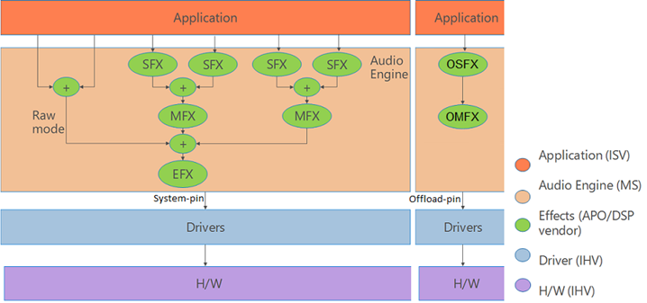

# Hardware-Offloaded Audio Processing

Hardware-offloaded audio processing allows the main audio processing tasks to be performed outside the computer's main CPU.

Audio processing can be very computationally intensive. So in many scenarios, it may be beneficial to allow a dedicated processor to take care of processing tasks like, for example, mixing, and applying effects.

When you implement a driver for offloaded audio, you develop a driver that is able to process offloaded audio streams, and to expose that ability to the Windows audio system.

The following topics in this section discuss driver development, the application impact and other issues that you should be aware of when you develop an audio driver for an audio adapter that implements a hardware audio engine to handle offloaded audio streams.

[Hardware Offloaded Audio Driver Implementation](driver-implementation-details.md)

[Helper Interfaces for Offloaded Audio Processing](helper-interfaces-for-offloaded-audio-processing.md)

[Glitch Reporting for Offloaded Audio](glitch-reporting-for-offloaded-audio.md)

For information on offloaded APOs, see [Hardware Offloaded APO Effects](implementing-hardware-offloaded-apo-effects.md)

## Hardware-Offloaded Audio Processing Architectural Overview

### The software audio engine

The following diagram shows the Windows software audio engine.

Audio streams arrive in the software audio engine from the Windows audio session API (WASAPI) layer, and possibly through a higher-level API such as Media Foundation. In the software audio engine stream effects (SFX), can be applied on a per-stream basis before the separate streams are mixed, and then passed through any available endpoint effects (EFX) and sent to the rendering hardware and speakers.

## The hardware audio engine

The hardware audio engine is implemented in the audio adapter, and largely mirrors the functionality of the software audio engine. And although Windows supports hardware-offloaded audio processing, the audio driver for a given audio adapter is responsible for exposing the underlying capabilities of the audio hardware, using the topology shown in the following diagram.

The hardware audio engine must accept a single host process stream and up to n offloaded streams. These offloaded streams are routed directly from the application layer to be processed in hardware. In other words, the offloaded streams will not be passed through the software audio engine. The diagram shows an implementation that was designed to handle up to three offloaded streams. The host process stream is the final output from the software mixer of all the streams that were processed in the software audio engine. Each hardware audio engine must also contain a hardware mixer.

In order to maintain parity with the software audio engine and the WASAPI interface, it is necessary for the hardware audio engine to provide the final audio output stream back to the audio stack in the form of a loopback stream. This is especially critical for applications and scenarios that rely on Acoustic Echo Cancellation, which requires knowledge of the final output stream to cancel echoes and prevent feedback.

In order to implement a path for a loopback stream, the audio driver is responsible for exposing a loopback pin. This pin will return the audio data from the final audio engine output, if the data is encoded to a PCM format. Otherwise, the post-mixing (but pre-encoding) result will be returned. This means that in the case of audio data that is processed with a hardware EFX that encodes to a non-PCM format, the loopback stream is taken directly after the hardware mixer, before the EFX stage in the hardware audio engine. For information about the KS-filter topology that represents the hardware audio engine, see [Hardware Offloaded Audio Driver Implementation](driver-implementation-details.md).

## The integrated audio architecture

The following diagram shows an overview of the resulting architecture when a hardware audio engine works with the Windows software audio engine.

In a scenario where the audio driver has indicated its support for offloaded audio processing, the first n (in this case, three) streams that are initialized will be routed directly from the WASAPI layer to the hardware audio engine, bypassing the software audio engine. Any new audio streams subsequent to the n supported by the hardware audio engine will be routed through the software audio engine for processing. The resulting stream from the software audio engine is then sent to the hardware audio engine as a host process stream. The host process stream is mixed with the first n streams, EFX processing is applied, and the resulting stream is then sent to the speakers.

## The KS Filter Topology

In Windows 8 and later operating systems, support has been provided for an on-board hardware audio engine to process audio streams. When you develop such an audio adapter, the associated audio driver must expose this fact to the user mode audio system in a specific manner, so that the audio system can discover, use and properly expose the features of this adapter and its driver.

To make it possible for audio drivers to expose the hardware capabilities of these new audio adapters, Windows 8 introduced a KS-filter topology that the driver must use:

As shown in the preceding figure, a KS-filter topology represents the data paths through the hardware, and also shows the functions that are available on those paths. In the case of an audio adapter that can process offloaded audio, there are the following inputs and outputs (called pins) on the KS-filter:

- One Host Process pin. This represents the input into the KS-filter from the software audio engine.

- One Loopback pin. This represents an output from the hardware audio engine to the Windows audio session API (WASAPI) layer.

- A number of Offloaded-audio pins. Although the figure shows only one pin of this type, an IHV is free to implement any number (n) of pins.

The actual service in the user mode audio system that "leads" to the discovery of the audio adapter and its driver, is the AudioEndpointBuilder. The AudioEndpointBuilder service monitors the **KSCATEGORY\_AUDIO** class for device interface arrivals and removals. When an audio device driver registers a new instance of the **KSCATEGORY\_AUDIO** device interface class, a device interface arrival notification is fired off. The AudioEndpointBuilder service detects the device interface arrival notification and uses an algorithm to examine the topology of the audio devices in the system so that it can take appropriate action.

When you develop your audio driver to support an adapter that is capable of processing offloaded-audio, your driver must use the [**KSNODETYPE\_AUDIO\_ENGINE**](./ksnodetype-audio-engine.md) audio endpoint to expose the capabilities of the hardware audio engine. For more information about the audio endpoint discovery process, see [Audio Endpoint Builder Algorithm](audio-endpoint-builder-algorithm.md).

## User Interface Considerations

You developed your audio driver to control the underlying hardware capabilities of an audio adapter that is capable of processing offloaded-audio. This means that your driver has the best knowledge about how to control the adapter's features. So you must develop a UI that will expose the features of the adapter to the end user in the form of options that they can select, enable and/or disable.

If however, you already have a UI that is used for controlling audio processing objects (APOs) that you developed, this UI could be extended to work with your new audio adapter. In this case, your extensions to the UI would provide software control for the APOs, and hardware control for the adapter.

## Application Impact

The functionality described for this new type of audio adapter and its associated driver, can be used by UWP apps via WASAPI, Media Foundation, Media Engine, or the HTML 5 &lt;audio&gt; tags. Note that Wave and DSound cannot be used, as they are not available to UWP apps. Also note that Desktop applications cannot use the offloading capabilities of audio adapters that support hardware-offloaded audio. These applications can still render audio, but only through the host pin which makes use of the software audio engine.

If a UWP app streams media content and uses Media Foundation, Media Engine, or the HTML 5 &lt;audio&gt; tags, the app is automatically opted-in for hardware offloading as long as the proper audio category has been set for the stream. Opting-in for hardware offloading is done on a per stream basis.

UWP apps that use WASAPI or streaming communications have to explicitly opt-in for hardware offloading.

## Related topics

[Hardware Offloaded Audio Driver Implementation](driver-implementation-details.md)

[Windows Audio Processing Objects](windows-audio-processing-objects.md)
