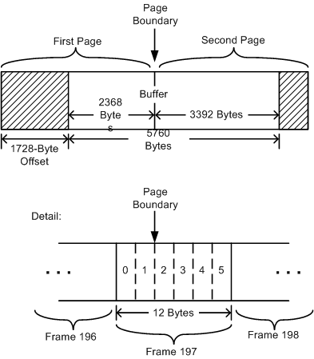
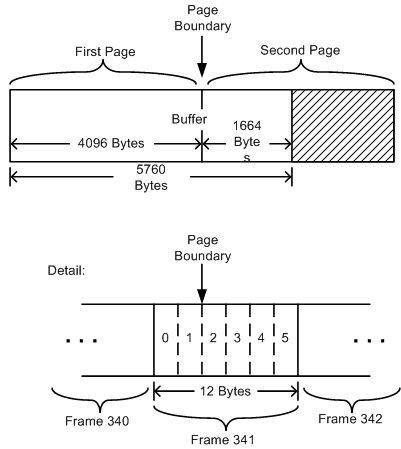

# Hardware Requirements for WavePci Devices

## 

When choosing the features of a new hardware design, vendors should follow these general principles:

-   Instead of trying to simply move all processing to hardware, vendors should weigh the cost of each feature against its impact on performance.

-   When considering the potential value of a hardware feature, a vendor should evaluate that feature in terms of its impact on the system as a whole rather than focusing narrowly on a particular subsystem such as audio.

-   By judiciously selecting which features to accelerate in hardware, vendors can relieve the CPU workload and improve memory usage, thereby making more of the system's resources available to other tasks.

Historically, not all audio hardware designs have succeeded in following these principles.

When playing audio content or mixing multiple streams, some WDM audio drivers needlessly consume a lot of CPU time and bus bandwidth. Such deficiencies are usually the result of flawed hardware designs and inefficient driver implementations. Hardware design flaws can also prevent an audio driver from handling certain wave formats or necessitate workarounds that require software intervention.

The purpose of the WaveCyclic device model is to accommodate the hardware limitations of older audio devices. New hardware designs should be fully compliant with WavePci.

A WavePci device that can perform true scatter/gather DMA eliminates the need for the CPU to spend time copying audio data between buffers. Unlike WaveCyclic, WavePci has no inherent need for data copying, making it the preferred miniport driver for multistream or hardware-accelerated audio devices. A well-designed WavePci device should consume almost no CPU resources, making it possible to send large numbers of audio streams (64 or more) to the hardware for 3-D processing and mixing.

A WavePci device requires a bus-master DMA controller supporting scatter/gather DMA transfers. Hardware designs should not place arbitrary limits on the kinds of data transfers that the DMA controller can handle. A WavePci device should meet the following requirements:

-   **The device must be a bus master.**

    It should be able to autonomously access system memory without intervention from the operating system and without using system DMA resources.

-   **The device must be able to handle data transfers of arbitrary length.**

    It should handle mappings (see [**IPortWavePciStream::GetMapping**](https://msdn.microsoft.com/library/windows/hardware/ff536909)) larger than a memory page. A device with a transfer limitation of 4 kilobytes, for example, does not fit the full requirements for WavePci. On 64-bit CPUs that support Microsoft Windows, the page size is 8 kilobytes, which makes it likely that some mappings will be larger than 4 kilobytes in size. Data transfers that exceed 32 kilobytes in a single mapping are theoretically possible, depending on physical memory fragmentation. At the other extreme, a mapping size of one byte is possible.

-   **The device should handle data transfers to or from any location in system memory.**

    Data transfers that straddle 32-kilobyte or larger power-of-two boundaries are quite likely. A computer can now contain more than 4 gigabytes of RAM, and in those systems, mappings can be located higher than 4 gigabytes in physical memory in the case of either a 64-bit CPU or the x86 physical address extension (PAE). To achieve the best performance on these machines, vendors should create devices that support 64-bit addressing. Otherwise, data copying in software is required. Data copying has historically been required for devices with 24-bit addressing on systems with more than 16 megabytes of RAM. Devices should use WaveCyclic instead of WavePci if they cannot read from or write to anywhere in physical memory. A driver can make this decision at device startup time (see [**IRP\_MN\_START\_DEVICE**](https://msdn.microsoft.com/library/windows/hardware/ff551749)) after it has had a chance to determine whether its address reach is sufficient to access the full address range of the system memory bus.

-   **The device should handle data transfers with arbitrary alignment.**

    Mappings can begin and end on arbitrary byte boundaries in memory. A frame of audio data can be split between mappings, with the samples for the first few channels at the end of the first mapping and the samples for the remaining channels in the second mapping. For an example, see [Wave Filters](wave-filters.md). For some sample sizes, even a sample container can be split between mappings. If the device requires that transfers must be on cache-line boundaries, or if the device requires that the transfers are strictly aligned to audio-frame boundaries (for example, assuming that the transfer size divides evenly into four, in the stereo 16-bit case), this device is not adequate for complete WavePci compliance. Note that a noncompliant piece of hardware can be exposed as a WavePci device by limiting the data ranges or formats that the driver exposes (for example, only certain bit depths or only certain channel configurations).

Regarding the last point in the preceding list, a WavePci device's scatter/gather DMA engine should handle buffers that straddle memory page boundaries. For example, a buffer containing 10 milliseconds worth of 16-bit PCM audio samples for a 48-kHz, 5.1-channel wave stream has the following size:

(6 samples/frame)\*(2 bytes/sample)\*(48K frames/second)\*(10 milliseconds) = 5760 bytes

This exceeds the memory page size (4096 bytes), which means that the buffer contains either one or two page boundaries, depending on how it is positioned in memory. The buffer contains an integral number (480) of frames of audio data, but one or two of these frames might straddle page boundaries.

For this reason, the scatter/gather DMA hardware for a WavePci device should be designed to handle audio frames (such as frame 197 in the following figure) that are split between two physically noncontiguous pages in memory.

At the top of the preceding figure is a 5760-byte buffer that straddles the boundary between two pages. In this example, the buffer begins at a 1728-byte offset from the start of the first page, which aligns the start of the buffer to a 64-byte boundary in memory. Assume that each audio frame occupies 12 bytes and contains six channels. The first page contains all of frames 0 through 196 but only the first four bytes of frame 197.

At the bottom of the figure is a detailed view of audio frame 197, which shows that only the samples for channels 0 and 1 fall within the first page. The samples for channels 2 through 5 are contained in the second page.

Although the two pages appear next to each other at the top of the figure, they are, in fact, contiguous only in kernel virtual memory. Because the pages containing the buffer are noncontiguous in physical memory, a scatter/gather DMA controller, which uses physical addresses, must specify the two parts of the buffer as two separate entries in its transfer queue. The WavePci port driver automatically splits the buffer into two separate physical mappings at the page boundary.

Even if the preceding example is changed to align the buffer with the start of the first page, the split-frame problem does not disappear. The following figure demonstrates this point. In this case, frame 341 gets split at the page boundary with the samples for channels 0 and 1 again falling within the first page and the samples for channels 2 through 5 located in the second page.

A WavePci device whose scatter/gather DMA controller does not properly handle split audio frames is limited in the kinds of audio data formats it can handle, although software workarounds might help alleviate some hardware design flaws. For more information, see [WavePci Latency](wavepci-latency.md).

 

 

