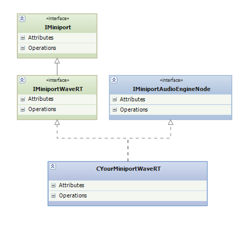

# Helper Interfaces for Offloaded Audio Processing


This topic presents the helper interfaces that Microsoft has added to its audio port-class driver (PortCls), to simplify the implementation of drivers that support offloaded-audio processing.

When you develop your WaveRT miniport driver that will work with an audio adapter that is capable of processing hardware-offloaded audio streams, your miniport driver works with PortCls to stream and/or process audio data.

PortCls has been updated to handle all the offload-related kernel streaming (KS) properties, and that is what makes it simple to develop a WaveRT miniport driver to expose support for processing hardware-offloaded audio streams. As a result of the updates, PortCls only calls the underlying miniport driver for hardware and/or driver-specific operations via two newly defined interfaces:

-   [**IMiniportAudioEngineNode**](https://msdn.microsoft.com/library/windows/hardware/dn302040)

-   [**IMiniportStreamAudioEngineNode**](https://msdn.microsoft.com/library/windows/hardware/dn265090)

You must develop two classes to work with these interfaces, one for each interface.

## <span id="Working_with_IMiniportAudioEngineNode"></span><span id="working_with_iminiportaudioenginenode"></span><span id="WORKING_WITH_IMINIPORTAUDIOENGINENODE"></span>Working with IMiniportAudioEngineNode


The class that you develop to work with **IMiniportAudioEngineNode**, must also inherit from [IMiniportWaveRT](https://msdn.microsoft.com/library/windows/hardware/ff536737). The methods defined in **IMiniportAudioEngineNode** allow your driver to use KS properties that access the audio engine via a KS filter handle. The class/interface hierarchy is as follows:



So if, for example, you develop a class called CYourMiniportWaveRT, then as you can see from the preceding diagram, CYourMiniportWaveRT must implement all the methods (shown as Operations) defined for the two parent interfaces.

A skeletal template for such a class would contain the following code:

```ManagedCPlusPlus
class CMiniportWaveRT : 
    public IMiniportWaveRT,
    public IMiniportAudioEngineNode,
    public CUnknown
{
...

    IMP_IMiniportWaveRT;
    IMP_IMiniportAudioEngineNode;
...

};
```

The *Portcls.h* header file defines these interfaces.

## <span id="Working_with_IMiniportStreamAudioEngineNode"></span><span id="working_with_iminiportstreamaudioenginenode"></span><span id="WORKING_WITH_IMINIPORTSTREAMAUDIOENGINENODE"></span>Working with IMiniportStreamAudioEngineNode


The class that you develop to work with the second interface, **IMiniportStreamAudioEngineNode**, must also inherit from [IMiniportWaveRTStreamNotification](https://msdn.microsoft.com/library/windows/hardware/ff536739). The methods defined in **IMiniportStreamAudioEngineNode** allow your driver to use KS properties that access the audio engine via a pin instance handle. The class/interface hierarchy is as follows:


So if, for example, you develop a class called CYourMiniportWaveRTStream, then as you can see from the preceding diagram, CYourMiniportWaveRTStream must implement all the methods defined for the two parent interfaces.

A skeletal template for such a class would contain the following code:

```ManagedCPlusPlus
class CMiniportWaveRTStream : 
    public IMiniportWaveRTStreamNotification,
    public IMiniportStreamAudioEngineNode,
    public CUnknown
{
...
    IMP_IMiniportWaveRTStream;
    IMP_IMiniportWaveRTStreamNotification;
    IMP_IMiniportStreamAudioEngineNode;
...

};
```

The *Portcls.h* header file defines these interfaces. And for more information about how to develop a driver that can handle hardware-offloaded audio streams, see [Driver Implementation Details](driver-implementation-details.md).

 

 


