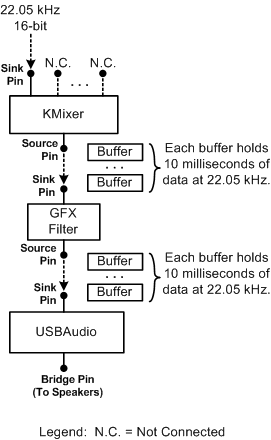
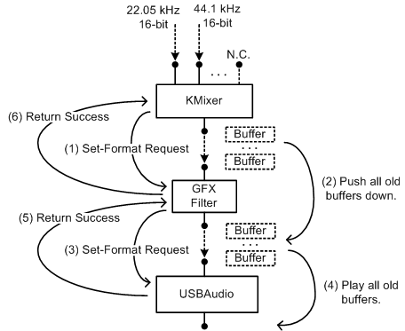
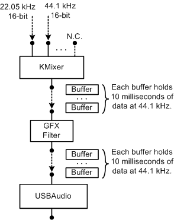

# How KMixer Handles Set-Format Requests

## 

The [KMixer system driver](kernel-mode-wdm-audio-components.md#kmixer_system_driver) is designed to preserve the quality of the playback streams that it mixes together. If possible, KMixer automatically adjusts the sample rate of the mixed stream that it outputs through its source (output) pin to match that of the playback stream with the highest sample rate. As playback streams are dynamically connected to and disconnected from KMixer's sink (input) pins, KMixer tries to adjust the sample rate at its source pin accordingly. For more information, see [KMixer Behavior](kmixer-behavior.md).

Of course, KMixer can change the sample rate of the mixed stream only if the downstream filter (whose sink pin connects to KMixer's source pin) is able to handle the new sample rate. The mixed stream from KMixer might feed directly into the sink pin of an audio wave-rendering device, or a [GFX filter](gfx-filters.md) might be inserted into the stream's data path between KMixer's source pin and the audio device's sink pin.

To request the sample-rate change, KMixer sends a set-format ([**KSPROPERTY\_CONNECTION\_DATAFORMAT**](https://msdn.microsoft.com/library/windows/hardware/ff565103) set-property) request packet to the downstream filter's sink pin. Before reconfiguring its source pin to run at the new sample rate, KMixer waits until the downstream filter returns the request packet to KMixer with a completion code indicating that the request succeeded. The downstream filter might need to reject the original request, forcing KMixer to back off to a less demanding sample rate that the downstream filter can handle. Meanwhile, KMixer holds off mixing of any new playback data until the process of negotiating the new stream format completes and the downstream filter has been reconfigured.

The following figure shows a portion of an audio filter graph containing the KMixer system driver, a GFX filter, and the [USBAudio class system driver](kernel-mode-wdm-audio-components.md#usbaudio_class_system_driver).

In this example, KMixer inputs a single playback stream in a stereo PCM format with 16-bit samples and a 22.05-kHz sample rate. Each frame of audio data contains a pair of samples (for the two channels) and occupies four bytes. KMixer outputs a mixed stream in the same format. The stream passes through the GFX filter to the USBAudio driver. USBAudio feeds the stream to the USB audio device, which in turn plays the stream through a pair of speakers (not shown).

At the top of the preceding figure, only one KMixer sink pin is instantiated. This pin is connected to the source of the 22.05-kHz playback stream. The other KMixer sink pins are marked "N.C." to indicate that they are not connected.

KMixer outputs its mixed data to a set of buffers. Each buffer is attached to an IRP (one buffer per IRP) and holds 10 milliseconds of data. The buffer storage consists of a contiguous block of virtual memory, but it does not, in general, occupy contiguous pages in physical memory. Taking into account that the audio frame size is four bytes, that the sample rate is 22.05-kHz, and that each buffer contains 10 milliseconds of data, the buffer size per IRP is calculated to be approximately 882 bytes:

(4 bytes)\*(22.05 kHz)\*(10 milliseconds) = 882 bytes

(The size cannot be exactly 882 bytes because the buffer contains an integral number of four-byte audio frames.) If the GFX filter performs in-place processing of the data in these buffers, it passes these same IRPs to USBAudio as it finishes processing them.

In the following figure, a client (typically the [SysAudio system driver](kernel-mode-wdm-audio-components.md#sysaudio_system_driver)) has instantiated a second KMixer sink pin and connected a new playback stream to this pin.

The new stream has a stereo format with 16-bit samples and a 44.1-kHz sample rate. If possible, KMixer will reconfigure its source pin to match the 44.1-kHz sample rate of the new playback stream. Of course, KMixer can make this change only if the GFX filter can configure itself to handle the new sample rate. Similarly, the GFX filter can configure itself to run at the new sample rate only if the USB audio device can handle this sample rate.

In the preceding figure, the steps in the format negotiation are numbered one through six:

1.  KMixer sends the set-format request to the GFX sink pin.

2.  Assume that the GFX filter is able to handle the requested format. The data queued at the filter's sink pin, however, is still in the old, 22.05-kHz format. Before relaying the set-format request to USBAudio, the GFX filter must first push all of its old-format buffers down to USBAudio.

3.  After pushing the last of its old-format buffers down to USBAudio, the GFX filter sends the set-format request to USBAudio's sink pin.

4.  Assume that USBAudio determines that the USB audio device can handle the requested format. Before reconfiguring the device to begin playing at the new, 44.1-kHz sample rate, however, USBAudio must finish playing all of the buffers containing data in the old, 22.05-kHz format.

5.  After playing the last of the old-format buffers, USBAudio configures the device to play data in the new format and then returns the set-format request packet to the GFX filter along with a completion code indicating that the request succeeded.

6.  Upon receiving the successful completion code from USBAudio, the GFX filter configures itself to run at the new sample rate. The filter then returns the request packet to KMixer along with a completion code indicating that the request succeeded. When KMixer receives the successful completion code from the GFX filter, it configures its output pin to handle the new format and begins mixing data in that format.

If at step (2) or (4) the GFX filter or USBAudio is unable to handle the requested format, it fails the request and KMixer continues the negotiation by requesting an alternate format. For more information about this process, see [KMixer Behavior](kmixer-behavior.md). For this example, however, assume that the set-format request succeeds.

The following figure shows the buffering of data in the new 44.1-kHz format.

Each buffer still contains 10 milliseconds of data but is twice as large as in the first figure because the sample rate has doubled.

A typical GFX filter processes each buffer of audio data as follows:

1.  Receives the buffer from KMixer.

2.  Performs in-place processing of the buffer contents.

3.  Passes the processed buffer to USBAudio to be rendered.

Because the sample rates at the GFX filter's input and output pins are the same, the GFX filter simply acts as go-between for KMixer and USBAudio during the process of negotiating a format change. The GFX filter usually accepts whatever sample rate KMixer and USBAudio find mutually acceptable.

Although a vendor has the option of designing a GFX filter to support different sample rates at its input and output pins, this capability can be expensive in terms of both processing time and the complexity of the GFX implementation. In this case, the GFX filter contains an SRC node ([**KSNODETYPE\_SRC**](https://msdn.microsoft.com/library/windows/hardware/ff537190)) and uses separate buffers for the input and output streams. In addition, the GFX filter must play a more active role in the format negotiation with KMixer to ensure that it can support the requested sample rate.

 

 

--------------------
[Send comments about this topic to Microsoft](mailto:wsddocfb@microsoft.com?subject=Documentation%20feedback%20[audio\audio]:%20How%20KMixer%20Handles%20Set-Format%20Requests%20%20RELEASE:%20%287/18/2016%29&body=%0A%0APRIVACY%20STATEMENT%0A%0AWe%20use%20your%20feedback%20to%20improve%20the%20documentation.%20We%20don't%20use%20your%20email%20address%20for%20any%20other%20purpose,%20and%20we'll%20remove%20your%20email%20address%20from%20our%20system%20after%20the%20issue%20that%20you're%20reporting%20is%20fixed.%20While%20we're%20working%20to%20fix%20this%20issue,%20we%20might%20send%20you%20an%20email%20message%20to%20ask%20for%20more%20info.%20Later,%20we%20might%20also%20send%20you%20an%20email%20message%20to%20let%20you%20know%20that%20we've%20addressed%20your%20feedback.%0A%0AFor%20more%20info%20about%20Microsoft's%20privacy%20policy,%20see%20http://privacy.microsoft.com/default.aspx. "Send comments about this topic to Microsoft")

