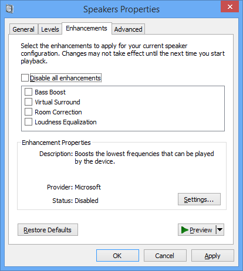
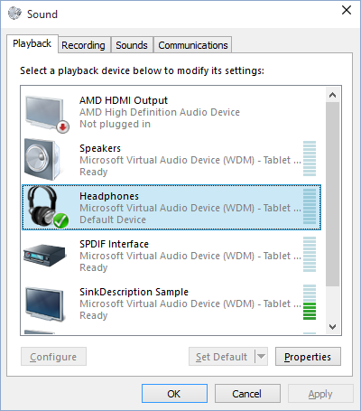

# Implementing a UI for Configuring APO Effects


This topic describes how to implement a user interface (UI) that allows a user to configure the effects. For general information about APOs, see [Audio Processing Object Architecture](audio-processing-object-architecture.md).

## <span id="Overview"></span><span id="overview"></span><span id="OVERVIEW"></span>Overview


An APO commonly provides a UI that allows a user to configure the effects. This UI can, for example, allow the user to select from several different signal processing algorithms. Microsoft provides a configuration UI for the standard Windows APOs. If a custom APO has user-accessible settings, the developer must provide an appropriate configuration UI. The configuration UI is installed with the device driver and is associated with the APO by a registration process.

**Note**   Manufacturers can replace this property page with a custom property page that is designed to support their APOs. Manufacturers can also opt to not have any UI at all, if their custom APO does not have user-accessible settings.

 

The standard enhancements tab is shown below.



There are three options available for the configuring the enhancements UI:

1. Specify no PKEY\_SYSFX\_UiClsid at all – no enhancements tab will be shown.
2. Specify PKEY\_SYSFX\_UiClsid equal to the well-known CLSID for the standard built-in enhancements property page UI - the built-in enhancements tab will be shown.
3. Create your own property page with your own custom CLSID and set the PKEY\_SYSFX\_UiClsid equal to your custom CLSID - your custom tab will be shown.
This screen shot shows the custom property page for the SYSVAD Swap APO sample.


This screen shot shows the Sound applet in the Control Panel.



Adding a new property page to the Sound applet in the Control Panel, involves adding a new tab to the system-supplied Sound applet. This means that when the custom APOs are registered and initialized, their property page will be available along with the system-supplied enhancements page. It is difficult and complicated to implement communication across the property pages of two different APOs. It is possible that some default settings on the enhancements page will conflict with feature settings on the new property page.

Therefore the most practical approach here is to implement a separate UI for configuring the custom APOs that you developed to replace the system-supplied APOs.

## <span id="How_to_Implement_a_UI_for_Configuring_the_Effects"></span><span id="how_to_implement_a_ui_for_configuring_the_effects"></span><span id="HOW_TO_IMPLEMENT_A_UI_FOR_CONFIGURING_THE_EFFECTS"></span>How to Implement a UI for Configuring the Effects


The CLSID of the system effect's UI APO is available from the audio endpoint’s property store. The Audio Control Panel item gets this CLSID from the audio endpoint that is currently in context. When the Audio Control Panel item launches the appropriate custom system effect UI, it passes it the audio endpoint. The UI can then access the endpoint property store to read and adjust property settings. The UI should also register for property store notifications in case some other program modifies the settings.

If you design the custom APO using the **CBaseAudioProcessingObject** base class and wrap the system-supplied APOs, you can replace the default property page.

Microsoft supplies an enhancements property page for the Sound applet on the Control Panel. This is the default property page that is associated with the system-supplied system effects APO. Vendors can replace this default property page with a custom page by implementing and registering a custom property page provider.

See [About Property Sheets](https://go.microsoft.com/fwlink/p/?linkid=106006) and [Replacing the Default Property Page](replacing-the-default-property-page.md) for information about how to replace the enhancements property page.

To design and implement the custom property page provider, perform the following steps.

1.  Create a custom property page. See [Creating property sheets](https://go.microsoft.com/fwlink/p/?linkid=106006) for more information.

2.  Package your property page as a DLL. See [Creating and using a DLL](https://go.microsoft.com/fwlink/p/?linkid=106014) topic for more information on packaging your custom page as a DLL.

3.  Modify your [INF file](https://msdn.microsoft.com/library/windows/hardware/ff549520) to install and register the DLL for the property page.

    The following INF file fragment shows how to modify the INF file to register your custom property page.

    ```inf
    [SysFx.AddReg]
    ...
    HKR,"FX\\0",%PKEY_SYSFX_UiClsid%,,%SYSFX_UI_CLSID%
    ...
    [Strings]
    PKEY_SYSFX_UiClsid = "{D04E05A6-594B-4FB6-A80D-01AF5EED7D1D},3"
    SYSFX_UI_CLSID     = "{YOUR GUID GOES HERE}"
    ```

    And as a result of the preceding INF file instructions, the installation process modifies the appropriate registry key as follows.

    ```text
    HKLM
     SOFTWARE
      Microsoft
      Windows
       CurrentVersion
      MMDevices
      Audio
       Render
      Endpoint
      FXProperties
       ...
      "{D04E05A6-594B-4FB6-A80D-01Af5EED7D1D},3"=
                         "{YOUR CLSID GOES HERE}"
    ```

    The CLSID of the default property page is replaced with the CLSID of your custom property page.

4.  In a global AddReg section in the INF file, register the CLSID with COM.

    The sample INF file sections, taken from the SYSVAD tabletaudiosample.inf file, shows how to do this. The \[SWAPAPO.AddReg\] section is in the global AddReg section. The \[SWAPAPO.I.Association0.AddReg\] is part of the AddReg section for the specific KSCATEGORY\_AUDIO interfaces.

    ```inf
    [SWAPAPO.AddReg]
    …

    ; Effects UI page COM registration
    HKCR,CLSID\%FX_UI_CLSID%,,,"CplPage Class"
    HKCR,CLSID\%FX_UI_CLSID%\InProcServer32,,,%11%\PropPageExt.dll
    HKCR,CLSID\%FX_UI_CLSID%\InProcServer32,ThreadingModel,,"Apartment"
    …

    [SWAPAPO.I.Association0.AddReg]
    …

    HKR,FX\0,%PKEY_FX_UserInterfaceClsid%,,%FX_UI_CLSID%

    …
    [Strings]
    FX_UI_CLSID     = "{YOUR GUID GOES HERE}"
     
    ```

**Using or wrapping windows effects**

If you are using the Windows-provided effects directly or wrapping them, complete these steps:

1.  Follow step 3 above, to register your CLSID in the effects property store.

2.  Follow step 4 above, to register the CLSID with COM. In addition, you will need to invoke the supplied wdmaudio.inf via *Include* and *Needs* statements in your INF file as shown below.

    ```cpp
    [YourGlobalSection]
    Include=wdmaudio.inf
    Needs=mssysfx.CopyFilesAndRegister
    ```

## <span id="SYSVAD_SwapAPO_UI_Sample_Code"></span><span id="sysvad_swapapo_ui_sample_code"></span><span id="SYSVAD_SWAPAPO_UI_SAMPLE_CODE"></span>SYSVAD SwapAPO UI Sample Code


Using the SYVAD Swap APO code sample as a template can accelerate the custom APO development process. For general information about SWAP APO sample, see [Implementing Audio Processing Objects](implementing-audio-processing-objects.md).

**Example Code**

There are six projects in the SYSVAD sample The PropPageExtensions project contains the sample code for an example APO property page.

|                    |                                                            |
|--------------------|------------------------------------------------------------|
| **Project**        | **Description**                                            |
| PropPageExtensions | Sample code for example custom property page UI extensions |

 

The following code samples are useful to look at as you work on developing your custom UI.

|                         |                                                                                                      |
|-------------------------|------------------------------------------------------------------------------------------------------|
| **Name**                | **Description**                                                                                      |
| SwapPropPage.cpp        | Implementation of the CSwapPropPage class                                                            |
| CplExt.cpp              | Implementation of DLL Exports for the control panel extensions                                       |
| UIWidgets.cpp           | Implementation of CUIWidget and derived classes                                                      |
| AdvEndpointPropPage.cpp | Implementation of CAdvEndpointPropPage                                                               |
| Parts.cpp               | Implementation of CPart and derived classes.                                                         |
| TopologyExaminers.cpp   | Implementation of methods to support examining the audio topology, such as connectors and endpoints. |

 

The following header files are used in the property page extensions sample.

|                       |
|-----------------------|
| **Name**              |
| swapproppage.h        |
| uiwidgets.h           |
| advendpointproppage.h |
| parts.h               |
| topologyexaminers.h   |

 

To become familiar with the PropPageExtensions sample, you might want to review the headers and then examine the source code related to defining the text on the properties page. If your requirements are similar to what the sample code provides, you may be able to reuse much of the code that creates and updates the custom UI page.

## <span id="related_topics"></span>Related topics
[Audio Processing Object Architecture](audio-processing-object-architecture.md)  
[Windows Audio Processing Objects](windows-audio-processing-objects.md)  
[Implementing Audio Processing Objects](implementing-audio-processing-objects.md)  


