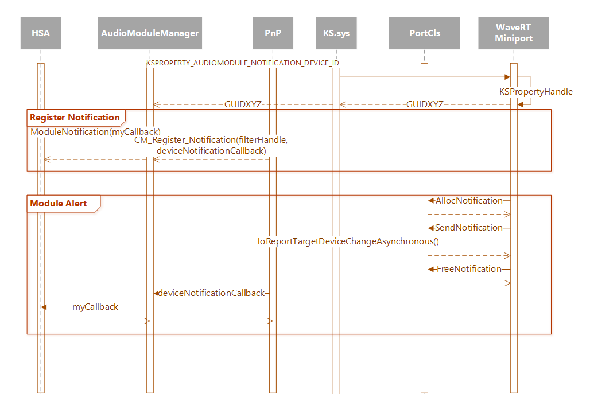

Implementing Audio Module Communication
========================================================================================

An Audio Module	is a distinct piece of audio processing logic performing a relatively atomic function. An audio module may reside in the audio driver or in audio DSP. An example audio module would be DSP-based audio processing.

Starting in Windows 10, release 1703, there are both  APIs and DDIs to support communication from  Universal Windows Platform (UWP) apps and kernel mode device drivers.

This topic provides information on Implementing Audio Module Communication in the kernel device driver. 

For information on how to send commands and receive change notifications from audio device modules using a UWP app, see [Configure and query audio device modules](https://docs.microsoft.com/windows-hardware/drivers/audio/configure-and-query-audiodevicemodules).

## Why Use Audio Modules?

OEMs typically bundle a configuration application on their system that allows the customer to control aspects of this audio system and tune it to their preference. The audio subsystem can contain various components such as on-host audio processing objects, hardware DSP processing, and specialized hardware such as a smart amp (all in addition to the audio codec itself). In most cases these components are created and sold by different vendors. Historically, IHVs have created their own private APIs to integrate with one another and send information between the individual components. Existing WIN32 configuration applications then would leverage these private APIs.

The [Universal Windows Platform (UWP)](https://docs.microsoft.com/windows/uwp/get-started/universal-application-platform-guide), provides a set of APIs that enable a single application to run across a breadth of devices. UWP also introduced a new look-and-feel that has become the customer expectation for applications running on Windows 10. 
So many OEMs would like to build their audio configuration applications on UWP. However, a core security feature of UWP (the AppContainer sandbox) prevents communication from an application to other components in the audio subsystem. This renders the private APIs previously used by configuration apps inaccessible in UWP. 

Starting in Windows 10, release 1703, the Audio Modules UWP API allows the configuration application and user mode components to communicate with modules in the kernel and hardware layer that are discoverable through a new KS property set.
Audio IHV and ISVs can write applications and services that can communicate with their hardware modules using a well-defined interface provided by Windows. For more information about the audio modules API, see [Windows.Media.Devices Namespace](https://docs.microsoft.com/uwp/api/Windows.Media.Devices)


<span id="Audio_Module_Definitions"></span>Audio Module Definitions
-----------------------------------------------------------------------------------------------------------------------------------------------------------------------------
These definitions are specific to audio modules.

Term | Definition
------------ | -------------
Audio Module	| A distinct piece of audio processing logic performing a relatively atomic function. May reside in the audio driver or in audio DSP. An example audio module would be an Audio Processing Object (APO).


<span id="Common_Definitions"></span>Common Audio Definitions
-----------------------------------------------------------------------------------------------------------------------------------------------------------------------------
These definitions are typically used when working with audio drivers.

Term | Definition
------------ | -------------
OEM	| Original Equipment Manufacturer
IHV	| Independent Hardware Vendor
ISV	| Independent Software Vendor
 |
HSA	| Hardware Support Application
UWP	| Universal Windows Platform
 | 
APO	| Audio Processing Object
DSP	| Digital Signal Processing

<span id="Architecture"></span>Architecture 
-----------------------------------------------------------------------------------------------------------------------------------------------------------------------------
Audio Modules puts in place a Windows supported mechanism to send messages between user mode and kernel mode audio components. An important distinction is that Audio Modules standardizes the transport pipeline. It does not establish the communication protocol over that transport and relies on the ISVs and IHVs to define the protocol. The intent is to allow existing third party designs to migrate easily to Audio Modules with very little changes.

<Diagram Pending>

The Audio Module API provides access to the modules through two different targeting methods: the KS wave filter and an initialized KS pin (stream). The placement and access to specific modules is implementation specific.

HSAs and other applications will only be able to access the modules available through the filter handle. The individual APOs loaded on a stream are the only objects that will have access to the stream targeted audio modules.

For more information about APOs, see [Windows Audio Processing Objects](https://msdn.microsoft.com/windows/hardware/drivers/audio/windows-audio-processing-objects).

### Sending Commands

Audio Module client’s avenue to query and change parameters is to send commands to the audio modules in the kernel and hardware components in the audio subsystem. The command structure of the Audio Modules API is loosely defined and formalizes the way that modules are discovered and identify themselves. However, the detailed command structure must be designed and implemented by the involved ISV and IHV to establish the protocol for what messages can be sent and the expected response.

### Module Notifications to Audio Module Clients

The audio miniport also has a way to notify and pass information to Audio Module clients if the client has subscribed to notifications on a specific module. The information passed in these notifications is not defined by the Audio Module API, rather it is defined by the ISV and/or IHV.

### Enable, Disable and General Topology Information

The Audio Modules APIs define how to enumerate and send commands to the modules. However, the APIs do not explicitly define how Audio Module clients can enable or disable specific modules. Also, it does not establish a way for clients to find topology information or the placement of modules in relation to one another. IHVs and ISVs can determine if this functionality is needed an decide how to implement it.

The recommended approach is exposing a global driver module. The global driver module would handle custom commands for these topology specific requests.

<span id="Audio_Module_DDIs"></span>Audio Module DDIs
-----------------------------------------------------------------------------------------------------------------------------------------------------------------------------
 
**Kernel Streaming Audio Module Properties** 

A new KS Property Set, identified by [KSPROPSETID_AudioModule](https://msdn.microsoft.com/library/windows/hardware/mt808144(v=vs.85).aspx), has been defined for three properties specific to audio modules. 

A PortCls miniport driver needs to directly handle the response for each property as no helper interface is provided.

#### ksmedia.h:

``` C++
#define STATIC_KSPROPSETID_AudioModule \
    0xc034fdb0, 0xff75, 0x47c8, 0xaa, 0x3c, 0xee, 0x46, 0x71, 0x6b, 0x50, 0xc6
DEFINE_GUIDSTRUCT("C034FDB0-FF75-47C8-AA3C-EE46716B50C6", KSPROPSETID_AudioModule);
#define KSPROPSETID_AudioModule DEFINE_GUIDNAMED(KSPROPSETID_AudioModule)

typedef enum {
    KSPROPERTY_AUDIOMODULE_DESCRIPTORS            = 1,  
    KSPROPERTY_AUDIOMODULE_COMMAND                = 2,
    KSPROPERTY_AUDIOMODULE_NOTIFICATION_DEVICE_ID = 3,
} KSPROPERTY_AUDIOMODULE;
```

### Audio Module Descriptors

Support for the [KSPROPERTY_AUDIOMODULE_DESCRIPTORS](https://msdn.microsoft.com/library/windows/hardware/mt808142(v=vs.85).aspx) property identifies the driver as being Audio Module aware. The property will be queried through the filter or pin handle and a KSPROPERTY is passed as the input buffer for the DeviceIoControl call. [KSAUDIOMODULE_DESCRIPTOR](https://msdn.microsoft.com/library/windows/hardware/mt808137(v=vs.85).aspx) has been defined to describe each module within the audio hardware. An array of these descriptors is returned in response to this request

#### ksmedia.h:

``` C++
#define AUDIOMODULE_MAX_NAME_SIZE 128

typedef struct _KSAUDIOMODULE_DESCRIPTOR
{
    GUID    ClassId; 
    ULONG   InstanceId;
    ULONG   VersionMajor;
    ULONG   VersionMinor;
    WCHAR   Name[AUDIOMODULE_MAX_NAME_SIZE];
} KSAUDIOMODULE_DESCRIPTOR, *PKSAUDIOMODULE_DESCRIPTOR;
```
For more information, see [KSAUDIOMODULE_DESCRIPTOR](https://msdn.microsoft.com/library/windows/hardware/mt808137(v=vs.85).aspx).

### Audio Module Command

Support for the [KSPROPERTY_AUDIOMODULE_COMMAND](https://msdn.microsoft.com/library/windows/hardware/mt808141(v=vs.85).aspx) property allows Audio Module clients to send custom commands to query and set parameters on Audio Modules. The property can be sent through the filter or pin handle and a [KSAUDIOMODULE_PROPERTY](https://msdn.microsoft.com/library/windows/hardware/mt808139(v=vs.85).aspx) is passed as the input buffer for the DeviceIoControl call. A client can optionally send additional information immediately adjacent to the [KSAUDIOMODULE_PROPERTY](https://msdn.microsoft.com/library/windows/hardware/mt808139(v=vs.85).aspx) in the input buffer to send custom commands.

#### ksmedia.h:

``` C++
#define AUDIOMODULE_MAX_DATA_SIZE 64000

typedef struct _KSPAUDIOMODULE_PROPERTY
{
    KSPROPERTY Property;
    GUID       ClassId;
    ULONG      InstanceId;
} KSAUDIOMODULE_PROPERTY, *PKSPAUDIOMODULE_PROPERTY;

```
For more information, see [KSAUDIOMODULE_PROPERTY](https://msdn.microsoft.com/library/windows/hardware/mt808139(v=vs.85).aspx).


### Audio Module Notification Device ID

Support for the [KSPROPERTY_AUDIOMODULE_NOTIFICATION_DEVICE_ID](https://msdn.microsoft.com/library/windows/hardware/mt808143(v=vs.85).aspx) is required to enable the miniport to signal notifications and pass information to Audio Module clients. The lifetime of this ID is tied to the lifetime of the audio device being exposed and active to the Windows Audio stack. The property can be sent through the filter or pin handle and a KSPROPERTY is passed as the input buffer for the DeviceIoControl call.

For more information, see [KSAUDIOMODULE_PROPERTY](https://msdn.microsoft.com/library/windows/hardware/mt808139(v=vs.85).aspx).


<span id="PortCls_Helper"></span>PortCls Helper - Audio Module Notifications
-----------------------------------------------------------------------------------------------------------------------------------------------------------------------------
 A new port interface has been added to assist driver developers to send notifications to Audio Module clients. 

#### PortCls.h:

``` C++
typedef struct _PCNOTIFICATION_BUFFER 
{
    UCHAR NotificationBuffer[1];
} PCNOTIFICATION_BUFFER, *PPCNOTIFICATION_BUFFER;

DECLARE_INTERFACE_(IPortClsNotifications,IUnknown)
{
    DEFINE_ABSTRACT_UNKNOWN()   // For IUnknown

    STDMETHOD_(NTSTATUS, AllocNotificationBuffer)
    (   THIS_
        _In_    POOL_TYPE       PoolType,
        _In_    USHORT          NumberOfBytes,
        _Out_   PPCNOTIFICATION_BUFFER* NotificationBuffer
    )   PURE;
    
    STDMETHOD_(void, FreeNotificationBuffer)
    (   THIS_
        _In_    PPCNOTIFICATION_BUFFER NotificationBuffer
    )   PURE;
    
    STDMETHOD_(void, SendNotificationBuffer)
    (   THIS_
        _In_    const GUID*     NotificationId,
        _In_    PPCNOTIFICATION_BUFFER NotificationBuffer
    )   PURE;
};

//
// Audio module notification definitions.
//
#define STATIC_KSNOTIFICATIONID_AudioModule \
    0x9C2220F0, 0xD9A6, 0x4D5C, 0xA0, 0x36, 0x57, 0x38, 0x57, 0xFD, 0x50, 0xD2
DEFINE_GUIDSTRUCT("9C2220F0-D9A6-4D5C-A036-573857FD50D2", KSNOTIFICATIONID_AudioModule);
#define KSNOTIFICATIONID_AudioModule DEFINE_GUIDNAMED(KSNOTIFICATIONID_AudioModule)

typedef struct _KSAUDIOMODULE_NOTIFICATION {
    union {
        struct {
            GUID        DeviceId;
            GUID        ClassId;
            ULONG       InstanceId;
            ULONG       Reserved;
        } ProviderId;
        LONGLONG        Alignment;
    };
} KSAUDIOMODULE_NOTIFICATION, *PKSAUDIOMODULE_NOTIFICATION;


```
For more information, see:

 [IPortClsNotifications](https://msdn.microsoft.com/library/windows/hardware/mt808133(v=vs.85).aspx)
	
 [IPortClsNotifications::AllocNotificationBuffer](https://msdn.microsoft.com/library/windows/hardware/mt808134(v=vs.85).aspx)

 [IPortClsNotifications::FreeNotificationBuffer](https://msdn.microsoft.com/library/windows/hardware/mt808135(v=vs.85).aspx)	
	
 [IPortClsNotifications::SendNotificationBuffer](https://msdn.microsoft.com/library/windows/hardware/mt808136(v=vs.85).aspx)	

### Calling Sequence

The miniport will call into their port to create and send the notification.  The general call sequence is shown in this diagram.




 


