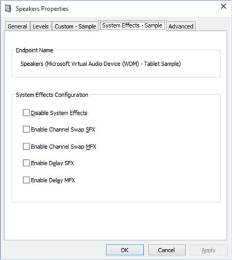

# Implementing Audio Processing Objects


This topic describes how to implement an audio processing object (APO). For general information about APOs, see [Audio Processing Object Architecture](audio-processing-object-architecture.md).

## <span id="Implementing_Custom_APOs"></span><span id="implementing_custom_apos"></span><span id="IMPLEMENTING_CUSTOM_APOS"></span>Implementing Custom APOs


Custom APOs are implemented as in-process COM objects, so they run in user mode and are packaged in a dynamic-link library (DLL). There are three types of APO, based on where they are inserted in the signal processing graph.

-   Stream effects (SFX)
-   Mode effects (MFX)
-   Endpoint effects (EFX)

Each logical device can be associated with one APO of each type. For more information on modes and effects, see [Audio Signal Processing Modes](audio-signal-processing-modes.md).

You can implement an APO by basing your custom class on the CBaseAudioProcessingObject base class, which is declared in the Baseaudioprocessingobject.h file. This approach involves adding new functionality into the CBaseAudioProcessingObject base class to create a customized APO. The CBaseAudioProcessingObject base class implements much of the functionality that an APO requires. It provides default implementations for most of the methods in the three required interfaces. The primary exception is the [**IAudioProcessingObjectRT::APOProcess**](https://msdn.microsoft.com/library/windows/hardware/ff536506) method.

Perform the following steps to implement your custom APOs.

1.  Create custom APO com objects to provide the desired audio processing.
2.  Optionally create a user interface for configuring the custom APOs.
3.  Create an INF file to install and register the APOs and the custom user interface.

For more information on implementing a custom properties page, see [Implementing a UI for Configuring APO Effects](implementing-a-ui-for-configuring-apo-effects.md). The screen shot below shows the SwapAPO properties.



## <span id="Design_Considerations_for_Custom_APO_Development"></span><span id="design_considerations_for_custom_apo_development"></span><span id="DESIGN_CONSIDERATIONS_FOR_CUSTOM_APO_DEVELOPMENT"></span>Design Considerations for Custom APO Development


All custom APOs must have the following general characteristics:

-   The APO must have one input and one output connection. These connections are audio buffers and can have multiple channels.
-   An APO can modify only the audio data that is passed to it through its [**IAudioProcessingObjectRT::APOProcess**](https://msdn.microsoft.com/library/windows/hardware/ff536506) routine. The APO cannot change the settings of the underlying logical device, including its KS topology.
-   In addition to IUnknown, APOs must expose the following interfaces:

    • [IAudioProcessingObject](https://msdn.microsoft.com/library/windows/hardware/ff536501). An interface that handles setup tasks such as initialization and format negotiation.

    • [IAudioProcessingObjectConfiguration](https://msdn.microsoft.com/library/windows/hardware/ff536502). The configuration interface.

    • [IAudioProcessingObjectRT](https://msdn.microsoft.com/library/windows/hardware/ff536505). A real-time interface that handles audio processing. It can be called from a real-time processing thread.

    • [IAudioSystemEffects](https://msdn.microsoft.com/library/windows/hardware/ff536514). The interface that makes the audio engine recognize a DLL as a systems effects APO.

-   All APOs must have real-time system compatibility. This means that:

    • All methods that are members of real-time interfaces must be implemented as nonblocking members. They must not block, use paged memory, or call any blocking system routines.

    • All buffers that are processed by the APO must be nonpageable. All code and data in the process path must be nonpageable.

    • APOs should not introduce significant latency into the audio processing chain.

-   Custom APOs must not expose the IAudioProcessingObjectVBR interface.

**Note**  For detailed information about the required interfaces, see the Audioenginebaseapo.h and Audioenginebaseapo.idl files in the Windows Kits\\&lt;build number&gt;\\Include\\um folder.

 

## <span id="Using_Sample_Code_to_Accelerate_the_Development_Process"></span><span id="using_sample_code_to_accelerate_the_development_process"></span><span id="USING_SAMPLE_CODE_TO_ACCELERATE_THE_DEVELOPMENT_PROCESS"></span>Using Sample Code to Accelerate the Development Process


Using the SYSVAD Swap APO code sample as a template can accelerate the custom APO development process. The Swap sample is the sample that was developed to illustrate some features of audio processing objects. The Swap APO sample swaps the left channel with the right channel and implements both SFX and MFX effects. You can enable and disable the channel swap audio effects using the properties dialog.

The SYSVAD audio sample is available on the [Windows Driver Samples GitHub](https://github.com/Microsoft/Windows-driver-samples).

You can browse the Sysvad audio sample here:

<https://github.com/Microsoft/Windows-driver-samples/tree/master/audio/sysvad>

**Download and extract the Sysvad audio sample from GitHub**

Follow these steps to download and open the SYSVAD sample.

a. You can use GitHub tools to work with the samples. You can also download the universal driver samples in one zip file.

<https://github.com/Microsoft/Windows-driver-samples/archive/master.zip>

b. Download the master.zip file to your local hard drive.

c. Right click *Windows-driver-samples-master.zip*, and choose **Extract All**. Specify a new folder, or browse to an existing one that will store the extracted files. For example, you could specify *C:\\DriverSamples\\* as the new folder into which the files will be extracted.

d. After the files are extracted, navigate to the following subfolder.

*C:\\DriverSamples\\Audio\\Sysvad*

**Open the driver solution in Visual Studio**

In Microsoft Visual Studio, Click **File** &gt; **Open** &gt; **Project/Solution...** and navigate to the folder that contains the extracted files (for example, *C:\\DriverSamples\\Audio\\Sysvad*). Double-click the *Sysvad* solution file to open it.

In Visual Studio locate the Solution Explorer. (If this is not already open, choose **Solution Explorer** from the **View** menu.) In Solution Explorer, you can see one solution that has six projects.

**SwapAPO Example Code**

There are five projects in the SYSVAD sample, one of which is of primary interest to the APO developer.

|                    |                                       |
|--------------------|---------------------------------------|
| **Project**        | **Description**                       |
| SwapAPO            | Sample code for an example APO.       |

 

The other projects in the Sysvad sample are summarized below.

|                        |                                            |
|------------------------|--------------------------------------------|
| **Project**            | **Description**                            |
| PhoneAudioSample       | Sample code for a mobile audio driver.     |
| TabletAudioSample      | Sample code for an alternate audio driver. |
| KeywordDetectorAdapter | Sample code for a keyword detector adapter |
| EndpointsCommon        | Sample code for common endpoints.          |

 

The primary header files for the SwapAPO sample is swapapo.h. The other primary code elements are summarized below.

|                      |                                                                   |
|----------------------|-------------------------------------------------------------------|
| **File**             | **Description**                                                   |
| Swap.cpp             | C++ code that contains the implementation of the Swap APO.        |
| SwapAPOMFX.cpp       | Implementation of CSwapAPOMFX                                     |
| SwapAPOSFX.cpp       | Implementation of CSwapAPOSFX                                     |
| SwapAPODll.cpp       | Implementation of DLL Exports.                                    |
| SwapAPODll.idl       | Definition of COM interfaces and coclasses for the DLL.           |
| SwapAPOInterface.idl | The interface and type definitions for Swap APO functionality.    |
| swapapodll.def       | COM exports definitions                                           |

 

## <span id="Implementing_the_COM_Object_Audio_Processing_Code"></span><span id="implementing_the_com_object_audio_processing_code"></span><span id="IMPLEMENTING_THE_COM_OBJECT_AUDIO_PROCESSING_CODE"></span>Implementing the COM Object Audio Processing Code


You can wrap a system-supplied APO by basing your custom class on the **CBaseAudioProcessingObject** base class, which is declared in the Baseaudioprocessingobject.h file. This approach involves introducing new functionality into the **CBaseAudioProcessingObject** base class to create a customized APO. The **CBaseAudioProcessingObject** base class implements much of the functionality that an APO requires. It provides default implementations for most of the methods in the three required interfaces. The primary exception is the [**IAudioProcessingObjectRT::APOProcess**](https://msdn.microsoft.com/library/windows/hardware/ff536506) method.

By using **CBaseAudioProcessingObject**, you can more easily implement an APO. If an APO has no special format requirements and operates on the required float32 format, the default implementations of the interface methods that are included in **CBaseAudioProcessingObject** should be sufficient. Given the default implementations, only three main methods must be implemented: [**IAudioProcessingObject::IsInputFormatSupported**](https://msdn.microsoft.com/library/windows/hardware/ff536511), [**IAudioProcessingObjectRT::APOProcess**](https://msdn.microsoft.com/library/windows/hardware/ff536506), and **ValidateAndCacheConnectionInfo**.

To develop your APOs based on the **CBaseAudioProcessingObject** class, perform the following steps:

1.  Create a class that inherits from **CBaseAudioProcessingObject**.

    The following C++ code example shows the creation of a class that inherits from **CBaseAudioProcessingObject**. For an actual implementation of this concept, follow instructions in the **Audio Processing Objects Driver Sample** section to go to the Swap sample, and then refer to the *Swapapo.h* file.

    ```cpp
    // Custom APO class - LFX
    Class MyCustomAPOLFX: public CBaseAudioProcessingObject
    {
     public:
    //Code for custom class goes here
    ...
    };
    ```

    **Note**   Because the signal processing that is performed by an SFX APO is different from the signal processing that is performed by an MFX or an EFX APO, you must create separate classes for each.

     

2.  Implement the following three methods:

    -   [**IAudioProcessingObject::IsInputFormatSupported**](https://msdn.microsoft.com/library/windows/hardware/ff536511). This method handles format negotiation with the audio engine.

    -   [**IAudioProcessingObjectRT::APOProcess**](https://msdn.microsoft.com/library/windows/hardware/ff536506). This method uses your custom algorithm to perform signal processing.

    -   **ValidateAndCacheConnectionInfo**. This method allocates memory to store format details, for example, channel count, sampling rate, sample depth, and channel mask.

The following C++ code example shows an implementation of the [**APOProcess**](https://msdn.microsoft.com/library/windows/hardware/ff536506) method for the sample class that you created in step 1. For an actual implementation of this concept, follow instructions in the **Audio Processing Objects Driver Sample** section to go to the Swap sample, and then refer to the *Swapapolfx.cpp* file.

```cpp
// Custom implementation of APOProcess method
STDMETHODIMP_ (Void) MyCustomAPOLFX::APOProcess (...)
{
// Code for method goes here. This code is the algorithm that actually
// processes the digital audio signal.
...
}
```

The following code example shows an implementation of the **ValidateAndCacheConnectionInfo** method. For an actual implementation of this method, follow instructions in the **Audio Processing Objects Driver Sample** section to go to the Swap sample, and then refer to the *Swapapogfx.cpp* file.

```cpp
// Custom implementation of the ValidateAndCacheConnectionInfo method.
HRESULT CSwapAPOGFX::ValidateAndCacheConnectionInfo( ... )
{
// Code for method goes here.
// The code should validate the input/output format pair.
...
}
```

**Note**  The remaining interfaces and methods that your class inherits from **CBaseAudioProcessingObject** are described in detail in the Audioenginebaseapo.idl file.

 

For desktop PCs, you can provide a user interface to configure the features that you added to the custom APO. For more information about this, see [Implementing a UI for Configuring APOs](implementing-a-ui-for-configuring-sapos.md).

## <span id="Replacing_System-supplied_APOs"></span><span id="replacing_system-supplied_apos"></span><span id="REPLACING_SYSTEM-SUPPLIED_APOS"></span>Replacing System-supplied APOs


When implementing the APO interfaces, there are two approaches: you can write your own implementation, or you can call into the inbox APOs.

This pseudocode illustrates wrapping a system APO.

```cpp
CMyWrapperAPO::CMyWrapperAPO {
    CoCreateInstance(CLSID_InboxAPO, m_inbox);
}

CMyWrapperAPO::IsInputFormatSupported {
    Return m_inbox->IsInputFormatSupported(…);
}
```

This pseudocode illustrates creating your own custom APO.

```cpp
CMyFromScratchAPO::IsInputFormatSupported {
    my custom logic
}
```

When you develop your APOs to replace the system-supplied ones, you must use the same names in the following list, for the interfaces and methods. Some of the interfaces have more methods in addition to the listed required methods. See the reference pages for those interfaces to determine if you want to implement all the methods or only the required ones.

The rest of the implementation steps are the same as a custom APO.

Implement the following interfaces and methods for the COM component:

-   [IAudioProcessingObject](https://msdn.microsoft.com/library/windows/hardware/ff536501). The required methods for this interface are: [**Initialize**](https://msdn.microsoft.com/library/windows/hardware/ff536510) and [**IsInputFormatSupported.**](https://msdn.microsoft.com/library/windows/hardware/ff536511)
-   [IAudioProcessingObjectConfiguration](https://msdn.microsoft.com/library/windows/hardware/ff536502). The required methods for this interface are: [**LockForProcess**](https://msdn.microsoft.com/library/windows/hardware/ff536503) and [**UnlockForProcess**](https://msdn.microsoft.com/library/windows/hardware/ff536504)
-   [IAudioProcessingObjectRT](https://msdn.microsoft.com/library/windows/hardware/ff536505). The required method for this interface is [**APOProcess**](https://msdn.microsoft.com/library/windows/hardware/ff536506) and it is the method that implements the DSP algorithm.
-   [IAudioSystemEffects](https://msdn.microsoft.com/library/windows/hardware/ff536514). This interface makes the audio engine recognize a DLL as an APO.

## <span id="Working_with_Visual_Studio_and_APOs"></span><span id="working_with_visual_studio_and_apos"></span><span id="WORKING_WITH_VISUAL_STUDIO_AND_APOS"></span>Working with Visual Studio and APOs


When working with APOs in Visual Studio, perform these tasks for each APO project.

**Link to the CRT**

Drivers that are targeting Windows 10 should dynamically link against the universal CRT.

If you need to support Windows 8,1, enable static linking by setting the project properties in C/C++, Code Generation. Set "Runtime Library" to */MT* for release builds or */MTd* for debug builds. This change is made, because for a driver it is difficult to redistribute the MSVCRT&lt;n&gt;.dll binary. The solution is to statically link libcmt.dll. For more information see [/MD, /MT, /LD (Use Run-Time Library)](https://msdn.microsoft.com/library/2kzt1wy3.aspx) .

**Disable Use of an Embedded Manifest**

Disable Use of an Embedded Manifest by setting project properties for your APO project. Select **Manifest Tool**, **Input and Output**. Then change "Embed Manifest" from the default of *Yes* to *No*. If you have an embedded manifest, this triggers the use of certain APIs which are forbidden within a protected environment. This means that your APO will run with DisableProtectedAudioDG=1, but when this test key is removed, your APO will fail to load, even if it is WHQL-signed.

## <span id="Packaging_your_APO_with_a_Driver"></span><span id="packaging_your_apo_with_a_driver"></span><span id="PACKAGING_YOUR_APO_WITH_A_DRIVER"></span>Packaging your APO with a Driver


When you develop your own audio driver and wrap or replace the system-supplied APOs, you must provide a driver package for installing the driver and APOs. For Windows 10, please see [Universal Windows Drivers for Audio](audio-universal-drivers.md). Your audio related driver packages should follow the policies and packaging model detailed there.  

The custom APO is packaged as a DLL, and any configuration UI is packaged as a separate UWP or Desktop Bridge app. The APO device INF copies the DLLs to the system folders that are indicated in the associated INF CopyFile directive. The DLL that contains the APOs must register itself by including an AddReg section in the INF file.

The following paragraphs and INF file fragments show the modifications that are necessary to use the standard INF file to copy and register APOs.

The tabletaudiosample.inf and phoneaudiosample.inf files included with the Sysvad sample illustrate how the SwapApo.dll APOs are registered.

## <span id="_Registering_APOs_for_Processing_Modes_and_Effects_in_the_INF_File"></span><span id="_registering_apos_for_processing_modes_and_effects_in_the_inf_file"></span><span id="_REGISTERING_APOS_FOR_PROCESSING_MODES_AND_EFFECTS_IN_THE_INF_FILE"></span> Registering APOs for Processing Modes and Effects in the INF File


You can register APOs for specific modes using certain allowable combinations of registry keys. For more information on which effects are available and general information about APOs, see [Audio Processing Object Architecture](audio-processing-object-architecture.md).

Refer to these reference topics for information on each of the APO INF file settings.

[PKEY\_FX\_StreamEffectClsid](https://msdn.microsoft.com/library/windows/hardware/mt238383)

[PKEY\_FX\_ModeEffectClsid](https://msdn.microsoft.com/library/windows/hardware/mt238382)

[PKEY\_FX\_EndpointEffectClsid](https://msdn.microsoft.com/library/windows/hardware/mt238381)

[PKEY\_SFX\_ProcessingModes\_Supported\_For\_Streaming](https://msdn.microsoft.com/library/windows/hardware/mt238385)

[PKEY\_MFX\_ProcessingModes\_Supported\_For\_Streaming](https://msdn.microsoft.com/library/windows/hardware/mt238384)

[PKEY\_EFX\_ProcessingModes\_Supported\_For\_Streaming](https://msdn.microsoft.com/library/windows/hardware/mt238380)

The following INF file samples show how to register audio processing objects (APOs) for specific modes. They illustrate the possible combinations available from this list.

-   PKEY\_FX\_StreamEffectClsid with PKEY\_SFX\_ProcessingModes\_Supported\_For\_Streaming
-   PKEY\_FX\_ModeEffectClsid with PKEY\_MFX\_ProcessingModes\_Suppoted\_For\_Streaming
-   PKEY\_FX\_ModeEffectClsid without PKEY\_MFX\_ProcessingModes\_Suppoted\_For\_Streaming
-   PKEY\_FX\_EndpointEffectClsid without PKEY\_EFX\_ProcessingModes\_Supported\_For\_Streaming

There is one additional valid combination that is not shown in these samples.

-   PKEY\_FX\_EndpointEffectClsid with PKEY\_EFX\_ProcessingModes\_Supported\_For\_Streaming

**SYSVAD Tablet Multi-Mode Streaming Effect APO INF Sample**

This sample shows a multi-mode streaming effect being registered using AddReg entries in the SYSVAD Tablet INF file.

This sample code is from the SYSVAD audio sample and is available on GitHub: <https://github.com/Microsoft/Windows-driver-samples/tree/master/audio/sysvad>.

This sample illustrates this combination of system effects:

-   PKEY\_FX\_StreamEffectClsid with PKEY\_SFX\_ProcessingModes\_Supported\_For\_Streaming

-   PKEY\_FX\_ModeEffectClsid with PKEY\_MFX\_ProcessingModes\_Suppoted\_For\_Streaming

```inf
[SWAPAPO.I.Association0.AddReg]
; Instruct audio endpoint builder to set CLSID for property page provider into the
; endpoint property store
HKR,EP\0,%PKEY_AudioEndpoint_ControlPanelPageProvider%,,%AUDIOENDPOINT_EXT_UI_CLSID%

; Instruct audio endpoint builder to set the CLSIDs for stream, mode, and endpoint APOs
; into the effects property store
HKR,FX\0,%PKEY_FX_StreamEffectClsid%,,%FX_STREAM_CLSID%
HKR,FX\0,%PKEY_FX_ModeEffectClsid%,,%FX_MODE_CLSID%
HKR,FX\0,%PKEY_FX_UserInterfaceClsid%,,%FX_UI_CLSID%

; Driver developer would replace the list of supported processing modes here
; Concatenate GUIDs for DEFAULT, MEDIA, MOVIE
HKR,FX\0,%PKEY_SFX_ProcessingModes_Supported_For_Streaming%,%REG_MULTI_SZ%,%AUDIO_SIGNALPROCESSINGMODE_DEFAULT%,%AUDIO_SIGNALPROCESSINGMODE_MEDIA%,%AUDIO_SIGNALPROCESSINGMODE_MOVIE%

; Concatenate GUIDs for DEFAULT, MEDIA, MOVIE
HKR,FX\0,%PKEY_MFX_ProcessingModes_Supported_For_Streaming%,%REG_MULTI_SZ%,%AUDIO_SIGNALPROCESSINGMODE_DEFAULT%,%AUDIO_SIGNALPROCESSINGMODE_MEDIA%,%AUDIO_SIGNALPROCESSINGMODE_MOVIE%

;HKR,FX\0,%PKEY_EFX_ProcessingModes_Supported_For_Streaming%,0x00010000,%AUDIO_SIGNALPROCESSINGMODE_DEFAULT%
```

Note that in the sample INF file, the EFX\_Streaming property is commented out because the audio processing has transitioned to kernel mode above that layer, so that streaming property is not necessary and would not be used. It would be valid to specify a PKEY\_FX\_EndpointEffectClsid for discovery purposes, but it would be an error to specify PKEY\_EFX\_ProcessingModes\_Supported\_For\_Streaming. This is because the mode mix / tee happens lower in the stack, where it is not possible to insert an endpoint APO.

**Componentized APO Installation**

Starting with Windows 10, release 1809, APO registration with the audio engine uses the componentized audio driver model. Using audio componentization creates a smoother and more reliable install experience and better supports component servicing. For more information, see [Creating a componentized audio driver installation](https://docs.microsoft.com/windows-hardware/drivers/audio/audio-universal-drivers#span-idcreating-a-componentized-audio-driver-installationspan-creating-a-componentized-audio-driver-installation).

The following example code is extracted from the public ComponentizedAudioSampleExtension.inf and ComponentizedApoSample.inf. Refer to the SYSVAD audio sample which is available on GitHub here: <https://github.com/Microsoft/Windows-driver-samples/tree/master/audio/sysvad>.
 
The registration of the APO with the audio engine is done using a newly created APO device. For the audio engine to make use of the new APO device it must be a PNP child of the audio device, sibling of the audio endpoints. The new componentized APO design does not allow for an APO to be registered globally and used by multiple different drivers. Each driver must register its own APO's.

The installation of the APO is done in two parts. First, the driver extension INF will add an APO device to the system:
 
```inf
[DeviceExtension_Install.Devices]
AddDevice = SwapApo,,Apo_AddDevice
 
[Apo_AddDevice]
HardwareIds = APO\VEN_SMPL&CID_APO
Description = "Audio Proxy APO Sample"
Capabilities = 0x00000008 ; SWDeviceCapabilitiesDriverRequired
```

This APO device triggers the second part, the installation of the APO INF, in the SYSVAD sample this is done in ComponentizedApoSample.inf. This INF file is dedicated to the APO device. It specifies the device class as AudioProcessingObject and adds all of the APO properties for CLSID registration and registering with the audio engine. 
 
```inf
[Version]
Signature   = "$WINDOWS NT$"
Class       = AudioProcessingObject
ClassGuid   = {5989fce8-9cd0-467d-8a6a-5419e31529d4}
 
[ApoComponents.NT$ARCH$]
%Apo.ComponentDesc% = ApoComponent_Install,APO\VEN_SMPL&CID_APO
 
[Apo_AddReg]
; CLSID registration
HKCR,CLSID\%SWAP_FX_STREAM_CLSID%,,,%SFX_FriendlyName%
HKCR,CLSID\%SWAP_FX_STREAM_CLSID%\InProcServer32,,0x00020000,%%SystemRoot%%\System32\swapapo.dll
HKCR,CLSID\%SWAP_FX_STREAM_CLSID%\InProcServer32,ThreadingModel,,"Both"
…
;Audio engine registration
HKR,AudioEngine\AudioProcessingObjects\%SWAP_FX_STREAM_CLSID%,"FriendlyName",,%SFX_FriendlyName%
...
```

When this INF installs the componentized APO, on a desktop system "Audio Processing Objects" will be shown in Windows Device Manager. 


**Bluetooth Audio Sample APO INF Sample**

This sample illustrates this combination of system effects:

-   PKEY\_FX\_StreamEffectClsid with PKEY\_SFX\_ProcessingModes\_Supported\_For\_Streaming

-   PKEY\_FX\_ModeEffectClsid with PKEY\_MFX\_ProcessingModes\_Suppoted\_For\_Streaming

This sample code supports Bluetooth hands-free and stereo devices.

```inf
; wdma_bt.inf – example usage
...
[BthA2DP]
Include=ks.inf, wdmaudio.inf, BtaMpm.inf
Needs=KS.Registration,WDMAUDIO.Registration,BtaMPM.CopyFilesOnly,mssysfx.CopyFilesAndRegister
...
[BTAudio.SysFx.Render]
HKR,"FX\\0",%PKEY_ItemNameDisplay%,,%FX_FriendlyName%
HKR,"FX\\0",%PKEY_FX_StreamEffectClsid%,,%FX_STREAM_CLSID%
HKR,"FX\\0",%PKEY_FX_ModeEffectClsid%,,%FX_MODE_CLSID%
HKR,"FX\\0",%PKEY_FX_UiClsid%,,%FX_UI_CLSID%
HKR,"FX\\0",%PKEY_FX_Association%,,%KSNODETYPE_ANY%
HKR,"FX\\0",%PKEY_SFX_ProcessingModes_Supported_For_Streaming%,0x00010000,%AUDIO_SIGNALPROCESSINGMODE_DEFAULT%
HKR,"FX\\0",%PKEY_MFX_ProcessingModes_Supported_For_Streaming%,0x00010000,%AUDIO_SIGNALPROCESSINGMODE_DEFAULT%
...
[Strings]
FX_UI_CLSID      = "{5860E1C5-F95C-4a7a-8EC8-8AEF24F379A1}"
FX_STREAM_CLSID  = "{62dc1a93-ae24-464c-a43e-452f824c4250}"
PKEY_FX_StreamEffectClsid   = "{D04E05A6-594B-4fb6-A80D-01AF5EED7D1D},5"
PKEY_FX_ModeEffectClsid     = "{D04E05A6-594B-4fb6-A80D-01AF5EED7D1D},6"
PKEY_SFX_ProcessingModes_Supported_For_Streaming = "{D3993A3F-99C2-4402-B5EC-A92A0367664B},5"
PKEY_MFX_ProcessingModes_Supported_For_Streaming = "{D3993A3F-99C2-4402-B5EC-A92A0367664B},6"
AUDIO_SIGNALPROCESSINGMODE_DEFAULT = "{C18E2F7E-933D-4965-B7D1-1EEF228D2AF3}"
```

**APO INF Audio Sample**

This sample INF file illustrates the following combination of system effects:

-   PKEY\_FX\_StreamEffectClsid with PKEY\_SFX\_ProcessingModes\_Supported\_For\_Streaming

-   PKEY\_FX\_ModeEffectClsid with PKEY\_MFX\_ProcessingModes\_Suppoted\_For\_Streaming

-   PKEY\_FX\_EndpointEffectClsid without PKEY\_EFX\_ProcessingModes\_Supported\_For\_Streaming

```inf
[MyDevice.Interfaces]
AddInterface=%KSCATEGORY_AUDIO%,%MyFilterName%,MyAudioInterface
 
[MyAudioInterface]
AddReg=MyAudioInterface.AddReg
 
[MyAudioInterface.AddReg]
;To register an APO for discovery, use the following property keys in the .inf (or at runtime when registering the KSCATEGORY_AUDIO device interface):
HKR,"FX\\0",%PKEY_FX_StreamEffectClsid%,,%FX_STREAM_CLSID%
HKR,"FX\\0",%PKEY_FX_ModeEffectClsid%,,%FX_MODE_CLSID%
HKR,"FX\\0",%PKEY_FX_EndpointEffectClsid%,,%FX_MODE_CLSID%
 
;To register an APO for streaming and discovery, add the following property keys as well (to the same section):
HKR,"FX\\0",%PKEY_SFX_ProcessingModes_For_Streaming%,%REG_MULTI_SZ%,%AUDIO_SIGNALPROCESSINGMODE_DEFAULT%,%AUDIO_SIGNALPROCESSINGMODE_MOVIE%,%AUDIO_SIGNALPROCESSINGMODE_COMMUNICATIONS%
 
;To register an APO for streaming in multiple modes, use a REG_MULTI_SZ property and include all the modes:
HKR,"FX\\0",%PKEY_MFX_ProcessingModes_For_Streaming%,%REG_MULTI_SZ%,%AUDIO_SIGNALPROCESSINGMODE_DEFAULT%,%AUDIO_SIGNALPROCESSINGMODE_MOVIE%,%AUDIO_SIGNALPROCESSINGMODE_COMMUNICATIONS%
```

**Define a custom APO and CLSID APO INF Sample**

This sample shows how to define your own CLSID for a custom APO. This sample uses the MsApoFxProxy CLSID {889C03C8-ABAD-4004-BF0A-BC7BB825E166}. CoCreate-ing this GUID instantiates a class in MsApoFxProxy.dll which implements the IAudioProcessingObject interfaces and queries the underlying driver via the KSPROPSETID\_AudioEffectsDiscovery property set.

This INF file sample shows the \[BthHfAud\] section, which pulls in \[MsApoFxProxy.Registration\] from wdmaudio.inf \[BthHfAud.AnlgACapture.AddReg.Wave\], which then registers PKEY\_FX\_EndpointEffectClsid as the well-known CLSID for MsApoFxProxy.dll.

This INF file sample also illustrates the use of this combination of system effects:

-   PKEY\_FX\_EndpointEffectClsid without PKEY\_EFX\_ProcessingModes\_Supported\_For\_Streaming

```inf
;wdma_bt.inf
[BthHfAud]
Include=ks.inf, wdmaudio.inf, BtaMpm.inf
Needs=KS.Registration, WDMAUDIO.Registration, BtaMPM.CopyFilesOnly, MsApoFxProxy.Registration
CopyFiles=BthHfAud.CopyList
AddReg=BthHfAud.AddReg

; Called by needs entry in oem inf 
[BthHfAudOEM.CopyFiles]
CopyFiles=BthHfAud.CopyList

[BthHfAud.AnlgACapture.AddReg.Wave]
HKR,,CLSID,,%KSProxy.CLSID%
HKR,"FX\\0",%PKEY_FX_Association%,,%KSNODETYPE_ANY%
HKR,"FX\\0",%PKEY_FX_EndpointEffectClsid%,,%FX_DISCOVER_EFFECTS_APO_CLSID%
#endif
```

This sample INF file shows the \[MsApoFxProxy.Registration\] and \[MsApoFxProxy.AddReg\] sections. This registers the well-known GUID with COM using the \[MsApoFxProxy.CopyList\] section. This section copies MsApoFxProxy.dll into C:\\Windows\\system32.

```inf
; wdmaudio.inf – this is where WmaLfxGfxDsp.dll is registered
...
;; MsApoFxProxy.Registration section can be called by OEM&#39;s to install the discover-effects APO
[MsApoFxProxy.Registration]
AddReg = MsApoFxProxy.AddReg
CopyFiles = MsApoFxProxy.CopyList

[MsApoFxProxy.CopyList]
MsApoFxProxy.dll,,,0x100
...
[MsApoFxProxy.AddReg]
; Discover Effects APO COM registration
HKCR,CLSID\%FX_DISCOVER_EFFECTS_APO_CLSID%,,,%FX_DiscoverEffectsApo_FriendlyName%
HKCR,CLSID\%FX_DISCOVER_EFFECTS_APO_CLSID%\InProcServer32,,,%11%\MsApoFxProxy.dll
HKCR,CLSID\%FX_DISCOVER_EFFECTS_APO_CLSID%\InProcServer32,ThreadingModel,,"Both"

; Discover Effects APO registration
HKCR,AudioEngine\AudioProcessingObjects\%FX_DISCOVER_EFFECTS_APO_CLSID%, "FriendlyName", ,%FX_DiscoverEffectsApo_FriendlyName%
HKCR,AudioEngine\AudioProcessingObjects\%FX_DISCOVER_EFFECTS_APO_CLSID%, "Copyright", ,%MsCopyRight%
HKCR,AudioEngine\AudioProcessingObjects\%FX_DISCOVER_EFFECTS_APO_CLSID%, "MajorVersion", 0x00010001, 1
HKCR,AudioEngine\AudioProcessingObjects\%FX_DISCOVER_EFFECTS_APO_CLSID%, "MinorVersion", 0x00010001, 1
HKCR,AudioEngine\AudioProcessingObjects\%FX_DISCOVER_EFFECTS_APO_CLSID%, "Flags", 0x00010001, 0x0000000d
HKCR,AudioEngine\AudioProcessingObjects\%FX_DISCOVER_EFFECTS_APO_CLSID%, "MinInputConnections", 0x00010001, 1
HKCR,AudioEngine\AudioProcessingObjects\%FX_DISCOVER_EFFECTS_APO_CLSID%, "MaxInputConnections", 0x00010001, 1
HKCR,AudioEngine\AudioProcessingObjects\%FX_DISCOVER_EFFECTS_APO_CLSID%, "MinOutputConnections", 0x00010001, 1
HKCR,AudioEngine\AudioProcessingObjects\%FX_DISCOVER_EFFECTS_APO_CLSID%, "MaxOutputConnections", 0x00010001, 1
HKCR,AudioEngine\AudioProcessingObjects\%FX_DISCOVER_EFFECTS_APO_CLSID%, "MaxInstances", 0x00010001, 0xffffffff
HKCR,AudioEngine\AudioProcessingObjects\%FX_DISCOVER_EFFECTS_APO_CLSID%, "NumAPOInterfaces", 0x00010001, 1
HKCR,AudioEngine\AudioProcessingObjects\%FX_DISCOVER_EFFECTS_APO_CLSID%, "APOInterface0", ,"{FD7F2B29-24D0-4B5C-B177-592C39F9CA10}"
...
```

## <span id="APO_Registration"></span><span id="apo_registration"></span><span id="APO_REGISTRATION"></span>APO Registration


APO registration is used to support a process that dynamically matches the effects to endpoints using a weighted calculation. The weighted calculation uses the following property stores. Every audio interface has zero or more *endpoint property stores* and *effects property stores* registered either via the .inf or at runtime. The most specific endpoint property store and the most specific effects property store have the highest weights and are used. All other property stores are ignored.

Specificity is calculated as follows:

Endpoint property stores weighting

1. FX with specific KSNODETYPE
2. FX with KSNODETYPE\_ANY
3. MSFX with specific KSNODETYPE
4. MSFX with KSNODETYPE\_ANY

Effects property stores weighting

1. EP with specific KSNODETYPE
2. EP with KSNODETYPE\_ANY
3. MSEP with specific KSNODETYPE
4. MSEP with KSNODETYPE\_ANY

Numbers must start at 0 and increase sequentially: MSEP\\0, MSEP\\1, …, MSEP\\n If (for example) EP\\3 is missing, Windows will stop looking for EP\\n and will not see EP\\4, even if it exists

The value of PKEY\_FX\_Association (for effects property stores) or PKEY\_EP\_Association (for endpoint property stores) is compared against the KSPINDESCRIPTOR.Category value for the pin factory at the hardware end of the signal path, as exposed by Kernel Streaming.

Only Microsoft inbox class drivers (which can be wrapped by a third-party developer) should use MSEP and MSFX; all third-party drivers should use EP and FX.

**APO Node Type Compatibility**

The following INF file sample illustrates setting the PKEY\_FX\_Association key to a GUID associated with the APO.

```inf
;; Property Keys
PKEY_FX_Association = "{D04E05A6-594B-4fb6-A80D-01AF5EED7D1D},0"
"
```

```inf
;; Key value pairs
HKR,"FX\\0",%PKEY_FX_Association%,,%KSNODETYPE_ANY%
```

Because an audio adapter is capable of supporting multiple inputs and outputs, you must explicitly indicate the type of kernel streaming (KS) node type that your custom APO is compatible with. In the preceding INF file fragment, the APO is shown to be associated with a KS node type of %KSNODETYPE\_ANY%. Later in this INF file, KSNODETYPE\_ANY is defined as follows:

```inf
[Strings]
;; Define the strings used in MyINF.inf
...
KSNODETYPE_ANY      = "{00000000-0000-0000-0000-000000000000}"
KSNODETYPE_SPEAKER  = "{DFF21CE1-F70F-11D0-B917-00A0C9223196}"
...
```

A value of **NULL** for KSNODETYPE\_ANY means that this APO is compatible with any type of KS node type. To indicate, for example, that your APO is only compatible with a KS node type of KSNODETYPE\_SPEAKER, the INF file would show the KS node type and APO association as follows:

```inf
;; Key value pairs
...
HKR,"FX\\0",%PKEY_FX_Association%,,%KSNODETYPE_SPEAKER%
...
```

For more information about the GUID values for the different KS node types, see the Ksmedia.h header file.

## <span id="Troubleshooting_APO_Load_Failures"></span><span id="troubleshooting_apo_load_failures"></span><span id="TROUBLESHOOTING_APO_LOAD_FAILURES"></span>Troubleshooting APO Load Failures


The following information is provided to help you understand how failure is monitored for APOs. You can use this information to troubleshoot APOs that fail to get incorporated into the audio graph.

The audio system monitors APO return codes to determine whether APOs are being successfully incorporated into the graph. It monitors the return codes by tracking the HRESULT values that are returned by any one of the designated methods. The system maintains a separate failure count value for each SFX, MFX and EFX APO that is being incorporated into the graph.

The audio system monitors the returned HRESULT values from the following four methods.

-   CoCreateInstance

-   IsInputFormatSupported

-   IsOutputFormatSupported

-   LockForProcess

The failure count value is incremented for an APO every time one of these methods returns a failure code. The failure count is reset to zero when an APO returns a code that indicates that it was successfully incorporated into the audio graph. A successful call to the [**LockForProcess**](https://msdn.microsoft.com/library/windows/hardware/ff536503) method is a good indication that the APO was successfully incorporated.

For [**CoCreateInstance**](https://msdn.microsoft.com/library/windows/desktop/ms686615) in particular, there are a number of reasons why the returned HRESULT code could indicate a failure. The three primary reasons are as follows:

-   The graph is running protected content, and the APO is not properly signed.

-   The APO is not registered.

-   The APO has been renamed or tampered with.

Also, if the failure count value for an SFX, MFX or EFX APO reaches a system-specified limit, the SFX, MFX and EFX APOs are disabled by setting the PKEY\_Endpoint\_Disable\_SysFx registry key to '1'. The system-specified limit is currently a value of 10.

## <span id="Mobile_and_Windows_Desktop_APOs"></span><span id="mobile_and_windows_desktop_apos"></span><span id="MOBILE_AND_WINDOWS_DESKTOP_APOS"></span>Mobile and Windows Desktop APOs


This section describes the differences between Windows Mobile and Windows Desktop APOs.

-   Adding custom UI for configuring APOs properties is not supported on Windows Mobile.
-   ATL is not supported in Windows Mobile.
-   Windows Mobile does not support co-installers. For more information, see [INF files for Windows Phone drivers](https://sysdev.microsoft.com/Hardware/oem/docs/Driver_Development/INF_files_for_Windows_Phone_drivers).

## <span id="related_topics"></span>Related topics
[Implementing a UI for Configuring APO Effects](implementing-a-ui-for-configuring-apo-effects.md)  
[Windows Audio Processing Objects](windows-audio-processing-objects.md)  


