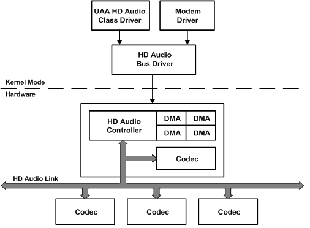

# Intel's HD Audio Architecture

The Intel High Definition Audio Specification (see the [Intel HD Audio](https://go.microsoft.com/fwlink/p/?linkid=42508) website) describes an audio hardware architecture that is being developed as the successor to the Intel AC'97 codec and controller specification. The operating system's UAA driver components can service an audio solution that exposes the HD Audio register set and connects to the system's internal bus without requiring a solution-specific driver from the hardware vendor.

The HD Audio architecture provides a uniform programming interface for digital audio controllers. Typically, today's audio codecs conform to the AC'97 industry standard, and digital controllers connect to one or more AC'97 codecs through another industry standard, AC-Link. Although these standards help to ensure that codecs and links are implemented consistently, no standard currently exists that defines the interface to the digital audio controller. Vendors tend to have very similar solutions for their system-integrated AC'97 digital audio controllers, but each AC'97 solution is likely to be different enough to require a separate driver. The HD Audio architecture is intended to eliminate the requirement for solution-specific drivers by specifying a base register set that is uniform across all implementations.

A bus controller that conforms to the HD Audio architecture:

-   Provides controller hardware version information.

-   Provides hardware configuration information, including the number of serial data-out (SDO) lines and DMA engines.

-   Manages the amount of bus bandwidth available on the HD Audio Link.

-   Accepts unsolicited responses and wake-up events from codecs.

-   Queues codec commands and codec responses in separate ring buffers.

-   Provides a collection of input, output, and bidirectional DMA engines that perform scatter/gather transfers and can stream data between codecs and cyclic buffers in memory without intervention by the host processor.

The following figure shows a diagram of the UAA driver architecture for HD Audio devices in Windows Vista. In the figure, the software components that are labeled UAA HD Audio Class Driver and HD Audio Bus Driver are provided by Microsoft. The component labeled Modem Driver is provided by an independent hardware vendor.

The UAA HD Audio class driver provides the streaming interface to the operating system audio stack above the driver (not shown in the preceding figure).

The HD Audio bus driver directly accesses the hardware registers in the HD Audio controller and provides the DDI that the UAA HD Audio class driver or modem driver uses to manage the DMA engines and to send commands to the codecs. The HD Audio bus driver handles all interrupts, Plug and Play notifications, and power management events on behalf of audio devices on the HD Audio Link.

The HD Audio controller provides the DMA engines and command buffers that are used to transfer commands and data to codecs on the HD Audio Link. The boxes labeled Codec in the preceding figure can be either audio or modem codecs, and they can be connected either to removable peripherals through external jacks or to fixed internal peripherals, such as mobile PC speakers.

 

 

