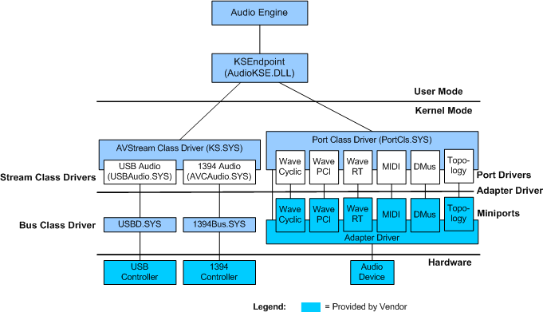

# Introduction to Port Class

## 

Most hardware drivers for PCI and DMA-based audio devices are based on the Port Class library, which is accessible through the PortCls system driver (Portcls.sys). PortCls is an audio port-class driver that Microsoft includes as part of the operating system. PortCls supplies a set of port drivers that implement most of the generic kernel streaming (KS) filter functionality. Therefore, PortCls simplifies the task of the audio driver developer. The hardware vendor only has to supply a set of miniport drivers to handle the hardware-specific functions of an audio adapter.

Although hardware vendors have the option to implement their own KS filters for their audio devices, this option is both difficult and unnecessary for typical audio devices. You can develop a KS filter to conform to either Stream.sys, the Stream class driver, or Avstream.sys, the AVStream class driver. But a KS filter that is based on Stream.sys cannot take advantage of the improvements that are only available in AVStream. For more information about KS filters and PortCls, see [Getting Started with WDM Audio Drivers](getting-started-with-wdm-audio-drivers.md).

The internal implementation of PortCls can evolve to take advantage of kernel streaming improvements in successive Windows releases while it maintains compatibility with existing drivers.

PortCls is implemented in the Portcls.sys system file as an export driver (a kernel-mode DLL) and contains the following items:

-   A set of helper functions that can be called by the adapter driver

-   A collection of *audio port* drivers

It is the responsibility of the hardware vendor of an audio device, to provide an *adapter driver*. The adapter driver includes initialization and miniport driver-management code (including the [**DriverEntry**](https://msdn.microsoft.com/library/windows/hardware/ff544113) function) and a collection of *audio miniport* drivers.

When the operating system loads the adapter driver, the adapter driver creates a set of miniport driver objects and prompts the PortCls system driver to create a corresponding set of port driver objects. (The code example in [Subdevice Creation](subdevice-creation.md) illustrates this process.) These port drivers are typically a subset of those that are available in the Portcls.sys file. Each miniport driver binds itself to a matching port driver from Portcls.sys to form a complete *subdevice* driver. The combination port-and-miniport subdevice driver is a KS filter (see [Audio Filters](audio-filters.md)). For example, a typical adapter driver might contain three miniport drivers: WaveRT, DMusUART, and Topology (with [IMiniportWaveRT](https://msdn.microsoft.com/library/windows/hardware/ff536737), [IMiniportDMus](https://msdn.microsoft.com/library/windows/hardware/ff536699), and [IMiniportTopology](https://msdn.microsoft.com/library/windows/hardware/ff536712) interfaces). During initialization, these miniport drivers are bound to the WaveRT, DMus, and Topology port drivers (with [IPortWaveRT](https://msdn.microsoft.com/library/windows/hardware/ff536920), [IPortDMus](https://msdn.microsoft.com/library/windows/hardware/ff536879), and [IPortTopology](https://msdn.microsoft.com/library/windows/hardware/ff536896) interfaces) that are contained in the Portcls.sys file. Each of these three subdevice drivers takes the form of a KS filter. The three filters together expose the complete functionality of the audio adapter.

Typically, the port drivers provide the majority of the functionality for each class of audio subdevice. For example, the WaveRT port driver does most of the work that is required to stream audio data to a DMA-based audio device, whereas the miniport driver provides device-specific details such as the DMA address and device name.

Audio adapter drivers and miniport drivers are typically written in Microsoft C++ and make extensive use of COM interfaces. The port-miniport driver architecture promotes modular design. Miniport driver writers should implement their driver as a C++ class derived from the [IMiniport](https://msdn.microsoft.com/library/windows/hardware/ff536698) interface, which is defined in the header file Portcls.h. Hardware initialization takes place at driver load time--typically in the **Init** method of the **IMiniport**-derived class (for example, [**IMiniportWaveRT::Init**](https://msdn.microsoft.com/library/windows/hardware/ff536759)). For more information about COM implementations of audio miniport drivers, see [COM in the Kernel](com-in-the-kernel.md).

The following diagram illustrates the relationship between port and miniport drivers and their position in the audio stack.

In the preceding diagram, the KSEndpoint component is a system-supplied file that is provided with Windows Vista and later versions of Windows. This component is provided in the form of a DLL (Audiokse.dll). KSEndpoint abstracts the kernel-mode device endpoint, and provides the audio engine with access to the abstracted endpoint. For more information about the audio engine, see [Exploring the Windows Vista Audio Engine](exploring-the-windows-vista-audio-engine.md).

The legend in the preceding diagram shows the boxes that represent driver components that the vendor provides. Note that the upper edge of each miniport driver interfaces to the lower edge of each port driver. For example, the WaveRT port driver exposes an **IPortWaveRT** interface to the WaveRT miniport driver, which exposes an **IMiniportWaveRT** interface to the port driver. These interfaces are sometimes referred to as *upper-edge* and *lower-edge* interfaces.

The port class and AVStream class drivers are similar in that they are both WDM drivers and they both support the WDM kernel streaming architecture. However, port class drivers differ from AVStream class drivers in the areas of multiprocessor handling and reentrancy. Port class drivers do the following:

-   Use a three-tiered approach that combines the class driver, port drivers, and vendor-supplied miniport drivers.

-   Have a restricted number of audio functions, allowing miniport drivers to operate closer to the audio hardware.

-   Allow several port or miniport drivers to be linked for a specific device. This feature allows for better support for multifunction cards.

-   Do not support external buses (for example, USB). All port drivers support devices that reside on the system buses (PCMCIA, and PCI).

The terminology for describing WDM audio ports and miniport drivers differs in some respects from the terms that are used for other classes of Windows drivers. These differences are explained in [WDM Audio Terminology](wdm-audio-terminology.md).

This section discusses the following topics:

[Implementation of Function-Specific Interfaces](implementation-of-function-specific-interfaces.md)

[PortCls Support by Operating System](portcls-support-by-operating-system.md)

 

 

