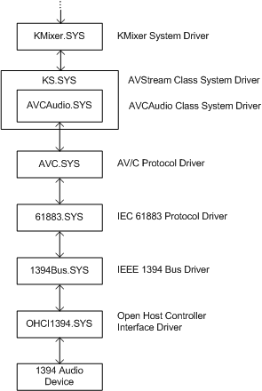

# Kernel-Mode WDM Audio Components

## 

The kernel-mode Microsoft Windows Driver Model (WDM) audio components are:

WDMAud System Driver

SysAudio System Driver

KMixer System Driver

Redbook System Driver

SBEmul System Driver

SWMidi System Driver

DMusic System Driver

AEC System Driver

DRMK System Driver

Splitter System Driver

Port Class Adapter Driver and PortCls System Driver

USB Audio Class System Driver (Usbaudio.sys)

AVCAudio Class System Driver

### WDMAud System Driver

The kernel-mode WDMAud system driver (Wdmaud.sys) is paired with the user-mode WDMAud system driver (Wdmaud.drv). The pair of WDMAud drivers translate between user-mode Microsoft Windows multimedia system calls and kernel-streaming I/O requests. WDMAud performs I/O for the following APIs: **waveIn**, **waveOut**, **midiIn**, **midiOut**, **mixer**, and **aux** (described in the Microsoft Windows SDK documentation). The kernel-mode WDMAud driver is a kernel streaming (KS) filter and a client of the SysAudio system driver.

### SysAudio System Driver

The SysAudio system driver (Sysaudio.sys) builds the filter graphs that render and capture audio content. The SysAudio driver represents audio filter graphs as [virtual audio devices](virtual-audio-devices.md) and registers each virtual audio device as an instance of a KSCATEGORY\_AUDIO\_DEVICE device interface. (Adapter drivers should not register themselves in this category, which is reserved exclusively for SysAudio.) For example, a virtual MIDI device might represent a filter graph that is created by connecting the SWMidi driver, the KMixer driver, and a port/miniport driver. The client communicates only with the virtual audio device rather than with the individual devices that make up the virtual audio device. Transparent to the client, the SysAudio driver configures all the KS filters in the filter graph that are connected together to form the virtual audio device. The following audio stream sources use the graphs that SysAudio builds:

-   DirectSound (See Microsoft Windows SDK documentation.)

-   Windows multimedia APIs **waveIn**, **waveOut**, **midiIn**, **midiOut**, **mixer**, and **aux** (See Windows SDK documentation.)

-   Redbook CD digital audio (See Redbook System Driver.)

-   Sound Blaster emulator (See SBEmul System Driver.)

-   Kernel-mode software synthesizers (See SWMidi System Driver and DMusic System Driver.)

-   DRMK System Driver

### KMixer System Driver

The KMixer system driver (Kmixer.sys) is the KS filter that does the following:

-   Mixing of multiple PCM audio streams

-   High-quality format conversion

-   Bit-depth conversion

-   Speaker configuration and channel mapping

In addition to simple 8- and 16-bit, mono and stereo data formats, the KMixer driver supports:

-   PCM and IEEE floating-point data

-   Bit depths greater than 16 bits, and multichannel formats with more than two channels

-   Head-related transfer function (HRTF) 3-D processing

For information about the volume ranges and the default volume levels in the various versions of Windows, see [Default Audio Volume Settings](default-audio-volume-settings.md).

### Redbook System Driver

The Redbook system driver (Redbook.sys) is the KS filter that manages the rendering of CD digital audio. The Redbook driver is a client of the SysAudio system driver. The system routes CD digital audio through the file system to the Redbook driver and then to the SysAudio driver. The CD digital audio is rendered on the preferred wave output device (as set in the Multimedia property pages in Control Panel).

### SBEmul System Driver

The SBEmul system driver (Sbemul.sys) provides Sound Blaster emulation for MS-DOS applications. The SBEmul driver is a client of the SysAudio system driver. To render and capture content, the SysAudio driver uses the preferred wave and MIDI devices (as set in the Multimedia property pages in Control Panel).

Sound Blaster emulation is supported only in Windows 98/Me.

### SWMidi System Driver

The SWMidi system driver (Swmidi.sys) is the KS filter that provides software-emulated General MIDI (GM) and high-quality Roland GS wavetable synthesis. A **midiOut***Xxx* application uses SWMidi when a hardware synthesizer is unavailable. The SWMidi filter receives as input a time-stamped MIDI stream from the WDMAud system driver and outputs a PCM wave stream to the KMixer system driver. SWMidi mixes all of its voices internally to form a single two-channel output stream with a PCM wave format.

### DMusic System Driver

The DMusic system driver (Dmusic.sys) is the KS filter that supports software-emulated, high-quality, downloadable sound (DLS) synthesis. The DMusic driver is a system-supplied port class miniport driver. It exposes a single DirectMusic pin, which supports a [DirectMusic stream data range](directmusic-stream-data-range.md). The DMusic filter receives as input a time-stamped MIDI stream from the DirectMusic system component and outputs a PCM wave stream to the KMixer system driver. The DMusic driver mixes all of its voices internally to form a single two-channel output stream with a PCM wave format. A DirectMusic application must explicitly select the kernel-mode software synth, Dmusic.sys, to use it in place of DirectMusic's default, user-mode synth.

### AEC System Driver

The AEC system driver (Aec.sys) supports full-duplex DirectSound applications by implementing AEC (acoustic echo cancellation) and noise-suppression algorithms in software. For more information, see [DirectSound Capture Effects](directsound-capture-effects.md).

### DRMK System Driver

The DRMK system driver (Drmk.sys) is the KS filter that decrypts audio streams containing DRM-protected content. For more information, see [Digital Rights Management](digital-rights-management.md).

### Splitter System Driver

The Splitter system driver (Splitter.sys) is the KS filter that creates two or more output streams from a single input capture stream. The Splitter driver transparently copies the input stream to two more output streams independently of the format of the input stream.

The Splitter driver is supported by Windows Me, and Microsoft Windows XP and later. For more information, see [AVStream Splitters](https://msdn.microsoft.com/library/windows/hardware/ff554255).

### Port Class Adapter Driver and PortCls System Driver

A port class adapter driver uses the port/miniport driver architecture to support an audio device. The PortCls driver includes built-in driver support for ISA and PCI audio devices. Although the PortCls system driver (Portcls.sys) also provides the framework for vendor-supplied port class adapter drivers, Microsoft recommends that vendors use a system-supplied port class adapter driver to support ISA and PCI audio devices. The PortCls framework might also be useful for constructing drivers for audio devices on other hardware buses or for software-only devices. For more information, see [Introduction to Port Class](introduction-to-port-class.md).

### USB Audio Class System Driver (Usbaudio.sys)

The USBAudio class system driver (Usbaudio.sys) provides driver support for USB Audio devices that comply with the Universal Serial Bus Device Class Definition for Audio Devices. For more information about this class system driver, see [USB Audio Class System Driver (Usbaudio.sys)](usb-audio-class-system-driver--usbaudio-sys-.md).

### AVCAudio Class System Driver

The AVCAudio class system driver (Avcaudio.sys) is an AVStream minidriver that provides driver support for audio devices that reside on an IEEE 1394 bus. The AVCAudio driver and associated support for IEEE 1394 audio devices are available in Windows XP and later.

To work with the system-supplied drivers, hardware vendors should design their audio devices to comply with the appropriate sections of the following specifications:

-   IEC 61883-1 and IEC 61883-6 (IEC 60958)

-   AV/C Digital Interface Command Set General Specification Ver. 3.0

-   AV/C Audio Subunit Specification 1.0

-   Connection and Compatibility Management Specification 1.0

-   AV/C Media Stream Format Information and Negotiation

-   Updates to the AV/C Audio Subunit Specifications currently in process

These specifications are available at the [1394 Trade Association](https://go.microsoft.com/fwlink/p/?linkid=8728) website. The AVCAudio driver supports a subset of the features that are described in these specifications.

When an audio device identifies itself as an IEEE 1394-compliant audio device during Plug and Play device enumeration, the system automatically loads the AVCAudio driver to drive the device. AVCAudio drives the device directly, without the aid of a proprietary adapter driver. This means that a device that complies with the appropriate IEEE 1394 specifications requires no proprietary adapter driver.

Microsoft recommends that hardware vendors use the AVCAudio driver for their IEEE 1394 audio devices instead of writing proprietary adapter drivers.

The following figure shows the driver hierarchy for an IEEE 1394 audio device in Windows XP. In Windows XP and later, all of the driver components shown in this figure are provided by Microsoft with the operating system.

For more information about the driver components in the figure, see the following sections:

[AVStream Overview](https://msdn.microsoft.com/library/windows/hardware/ff554240)

[AV/C Client Drivers](https://msdn.microsoft.com/library/windows/hardware/ff556364)

[IEEE 1394 Bus](https://msdn.microsoft.com/library/windows/hardware/ff537207)

 

 

