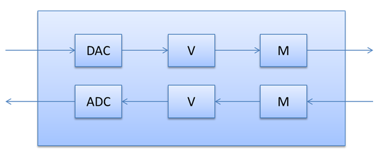

# Kernel Streaming Considerations

The Kernel Streaming considerations topic clarifies the requirements and other special considerations beyond those for all audio drivers. These are kernel streaming considerations that are more related to Bluetooth bypass audio streaming.

The audio driver should fully support the WaveRT port driver, including “pull mode.” For more information, see [Introducing the WaveRT Port Driver](introducing-the-wavert-port-driver.md). And although there is no requirement to implement a hardware audio engine for the synchronous connection oriented (SCO) bypass output, there is no harm in doing so.

The Windows logo requirements for format support include an exception for Bluetooth.

The audio driver should support the formats that are possible through the sideband hardware. This is typically 8KHz mono audio streaming.

## Topology

All Bluetooth Hands-Free devices support both capture and render. So the audio driver should expose a kernel streaming (KS) topology for the Hands-Free device as shown in the following diagram, to support both render and capture.

**Note**  The audio driver developer can choose whether or not to implement a single filter for both capture and render paths, or separate filters. However, the HFP device only allows a single file object on the GUID\_DEVINTERFACE\_BLUETOOTH\_HFP\_SCO\_HCIBYPASS device interface. Therefore a design that uses two filters needs to allow both filters to share the single file object.

 

The DAC and ADC nodes represent the analog/digital conversions, but do not support any KS properties.

The volume nodes support [**KSPROPERTY\_AUDIO\_VOLUMELEVEL**](https://msdn.microsoft.com/library/windows/hardware/ff537309) and [**KSEVENT\_CONTROL\_CHANGE**](https://msdn.microsoft.com/library/windows/hardware/ff537128) by sending the SETVOLUME and GETVOLUMESTATUSUPDATE IOCTLs to the HFP driver.

The volume node should be implemented as follows:

-   If the Bluetooth headset supports volume control, then the audio driver should include a volume node in its KS topology. The audio driver's volume property handlers send the above IOCLTs to the Bluetooth HFP driver to handle the volume.

-   If the Bluetooth headset does not implement a hardware volume, and the codec (or DSP) has a hardware volume, the audio driver should handle the volume control on the codec (or DSP).

-   If the Bluetooth headset and the audio device do not have hardware volume controls, no volume node should be presented and Windows will insert a software volume control node.

The mute node is optional. The audio driver should implement the mute node, if and only if the DSP or audio codec provides the capability to mute the bypass PCM signal before passing it to the Bluetooth controller. The mute nodes support [**KSPROPERTY\_AUDIO\_MUTE**](https://msdn.microsoft.com/library/windows/hardware/ff537293).

## Property requests

The audio driver uses the following KS properties to obtain information about any audio jack or jacks in the audio path. And the audio driver can also use the appropriate property request to make or break a connection to any Bluetooth audio device in the audio path.

**KSPROPERTY\_JACK\_DESCRIPTION**

This property returns a [**KSJACK\_DESCRIPTION**](https://msdn.microsoft.com/library/windows/hardware/ff537136) structure. The audio driver should set the [**KSPROPERTY\_JACK\_DESCRIPTION**](https://msdn.microsoft.com/library/windows/hardware/ff537364) fields as follows.
ChannelMapping = KSAUDIO\_SPEAKER\_MONO
Color = 0
ConnectionType = eConnTypeOtherDigital
GeoLocation = eGeoLocNotApplicable
GenLocation = eGenLocOther
PortConnection = ePortConnUnknown
IsConnected = &lt;*BOOL for current connection status*&gt;
**KSPROPERTY\_JACK\_DESCRIPTION2**

This property returns a [**KSJACK\_DESCRIPTION2**](https://msdn.microsoft.com/library/windows/hardware/ff537138) structure. The audio driver should set the [**KSPROPERTY\_JACK\_DESCRIPTION2**](https://msdn.microsoft.com/library/windows/hardware/ff537365) fields as follows.
DeviceStateInfo = 0
JackCapabilities = JACKDESC2\_PRESENCE\_DETECT\_CAPABILITY
**KSPROPERTY\_ONESHOT\_RECONNECT**

The audio driver’s filter should support [**KSPROPERTY\_ONESHOT\_RECONNECT**](https://msdn.microsoft.com/library/windows/hardware/ff537369). To create and initialize this structure, the audio driver sends [**IOCTL\_BTHHFP\_DEVICE\_REQUEST\_CONNECT**](https://msdn.microsoft.com/library/windows/hardware/dn265114) to the HFP driver. The HFP driver completes this request, and then attempts to connect to the Bluetooth audio device asynchronously.
**KSPROPERTY\_ONESHOT\_DISCONNECT**

The audio driver’s filter should support [**KSPROPERTY\_ONESHOT\_DISCONNECT**](https://msdn.microsoft.com/library/windows/hardware/hh706181). To create and initialize this structure, the audio driver sends [**IOCTL\_BTHHFP\_DEVICE\_REQUEST\_DISCONNECT**](https://msdn.microsoft.com/library/windows/hardware/dn265115) to the HFP driver. The HFP driver completes this request, and then attempts to disconnect from the Bluetooth audio device asynchronously.
When an audio driver supports these properties, the Sound dialog box in the Control Panel exposes Connect and Disconnect commands for the HFP endpoint.

## Related topics
[Theory of Operation](theory-of-operation.md)  

