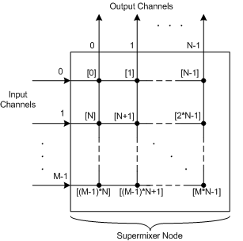

# KSPROPERTY\_AUDIO\_MIX\_LEVEL\_TABLE


The KSPROPERTY\_AUDIO\_MIX\_LEVEL\_TABLE property specifies the mix levels for a supermixer node ([**KSNODETYPE\_SUPERMIX**](ksnodetype-supermix.md)). It provides information for all input and output channels.

## <span id="ddk_ksproperty_audio_mix_level_table_ks"></span><span id="DDK_KSPROPERTY_AUDIO_MIX_LEVEL_TABLE_KS"></span>


### <span id="Usage_Summary_Table"></span><span id="usage_summary_table"></span><span id="USAGE_SUMMARY_TABLE"></span>Usage Summary Table

<table>
<colgroup>
<col width="20%" />
<col width="20%" />
<col width="20%" />
<col width="20%" />
<col width="20%" />
</colgroup>
<thead>
<tr class="header">
<th align="left">Get</th>
<th align="left">Set</th>
<th align="left">Target</th>
<th align="left">Property descriptor type</th>
<th align="left">Property value type</th>
</tr>
</thead>
<tbody>
<tr class="odd">
<td align="left"><p>Yes</p></td>
<td align="left"><p>Yes</p></td>
<td align="left"><p>Pin</p></td>
<td align="left"><p><a href="https://msdn.microsoft.com/library/windows/hardware/ff537143" data-raw-source="[&lt;strong&gt;KSNODEPROPERTY&lt;/strong&gt;](https://msdn.microsoft.com/library/windows/hardware/ff537143)"><strong>KSNODEPROPERTY</strong></a></p></td>
<td align="left"><p>Array of <a href="https://msdn.microsoft.com/library/windows/hardware/ff537089" data-raw-source="[&lt;strong&gt;KSAUDIO_MIXLEVEL&lt;/strong&gt;](https://msdn.microsoft.com/library/windows/hardware/ff537089)"><strong>KSAUDIO_MIXLEVEL</strong></a> structures</p></td>
</tr>
</tbody>
</table>

 

The property value (operation data) is an array of KSAUDIO\_MIXLEVEL structures that specifies the mix levels for all M\*N input-output paths in a supermixer node with M input channels and N output channels. The array contains M\*N elements:

```cpp
  KSAUDIO_MIXLEVEL  MixLevel[M*N];
```

The following table shows the mapping of array elements to the supermixer node's M\*N input-output paths.

<table>
<colgroup>
<col width="50%" />
<col width="50%" />
</colgroup>
<thead>
<tr class="header">
<th align="left">Array Element</th>
<th align="left">Input-Output Path</th>
</tr>
</thead>
<tbody>
<tr class="odd">
<td align="left"><p>MixLevel[0]</p></td>
<td align="left"><p>Input channel 0 to output channel 0</p></td>
</tr>
<tr class="even">
<td align="left"><p>MixLevel[1]</p></td>
<td align="left"><p>Input channel 0 to output channel 1</p></td>
</tr>
<tr class="odd">
<td align="left"><p>MixLevel[N-1]</p></td>
<td align="left"><p>Input channel 0 to output channel N-1</p></td>
</tr>
<tr class="even">
<td align="left"><p>MixLevel[N]</p></td>
<td align="left"><p>Input channel 1 to output channel 0</p></td>
</tr>
<tr class="odd">
<td align="left"><p>MixLevel[N+1]</p></td>
<td align="left"><p>Input channel 1 to output channel 1</p></td>
</tr>
<tr class="even">
<td align="left"><p>MixLevel[2N-1]</p></td>
<td align="left"><p>Input channel 1 to output channel N-1</p></td>
</tr>
<tr class="odd">
<td align="left"><p>MixLevel[M*N-1]</p></td>
<td align="left"><p>Input channel M-1 to output channel N-1</p></td>
</tr>
</tbody>
</table>

 

The following figure illustrates the mapping of MixLevel array elements to input-output paths. The index of the MixLevel array element controlling each input-output path is shown in square brackets.



If no path connects input channel *i* to output channel *j*, the filter should set the **Mute** member of array element MixLevel\[*i*\*N+*j*\] to **TRUE**.

The size of the KSAUDIO\_MIXLEVEL array is calculated from the [**KSAUDIO\_MIXCAP\_TABLE**](https://msdn.microsoft.com/library/windows/hardware/ff537088) structure that is retrieved from [**KSPROPERTY\_AUDIO\_MIX\_LEVEL\_CAPS**](ksproperty-audio-mix-level-caps.md). If the structure's **InputChannels** and **OutputChannels** members contain the values *m* and *n*, the array size is

*m* \* *n* \* **sizeof**(KSAUDIO\_MIXLEVEL)

### <span id="Return_Value"></span><span id="return_value"></span><span id="RETURN_VALUE"></span>Return Value

A KSPROPERTY\_AUDIO\_MIX\_LEVEL\_TABLE property request returns STATUS\_SUCCESS to indicate that it has completed successfully. Otherwise, the request returns an appropriate error status code.

Remarks
-------

The filter will succeed a KSPROPERTY\_AUDIO\_MIX\_LEVEL\_TABLE set-property request that specifies a mix-level value (**Level** member of KSAUDIO\_MIXLEVEL) that is beyond the range of the filter but will (silently) clamp the value to the supported range. In a subsequent request to get this property, however, the filter will output the actual value used.

Requirements
------------

<table>
<colgroup>
<col width="50%" />
<col width="50%" />
</colgroup>
<tbody>
<tr class="odd">
<td align="left"><p>Header</p></td>
<td align="left">Ksmedia.h (include Ksmedia.h)</td>
</tr>
</tbody>
</table>

## <span id="see_also"></span>See also


[**KSNODEPROPERTY**](https://msdn.microsoft.com/library/windows/hardware/ff537143)

[**KSAUDIO\_MIXCAP\_TABLE**](https://msdn.microsoft.com/library/windows/hardware/ff537088)

[**KSPROPERTY\_AUDIO\_MIX\_LEVEL\_CAPS**](ksproperty-audio-mix-level-caps.md)

[**KSAUDIO\_MIXLEVEL**](https://msdn.microsoft.com/library/windows/hardware/ff537089)

[**KSNODETYPE\_SUPERMIX**](ksnodetype-supermix.md)

 

 


