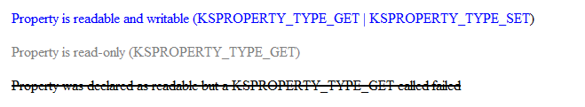

# KsStudio - Properties and Events

This topic describes how to use the [KSStudio Utility](ksstudio-utility.md) to work with properties and events.

## Working with Properties
 
Properties for which a filter declares support are shown as a subitem of each filter, pin instance, and node. These Properties are grouped by PropertySet and are displayed using the following font conventions: 

Shown in a blue font - Property is readable and writable (KSPROPERTY_TYPE_GET | KSPROPERTY_TYPE_SET) 

Shown in a gray font - Property is read-only (KSPROPERTY_TYPE_GET) 

Shown in a black font that is striked through - Property was declared as readable but a KSPROPERTY_TYPE_GET called failed 

You can change the value of a property by double clicking on the current value. After changing the value, hit ENTER, and the new value will be sent to the driver. If the call fails, the failure will be logged.

## Working with Events 

Events for which a filter declares support are shown as a subitem of each filter, pin instance, and node. These Events are grouped by EventSet. Events are disabled by default. To enable an Event, right-click on it and choose Enable from the popup menu. This ungrays the Event lightbulb icon. When the Event is signaled (as in the case of the user pressing a button on the corresponding hardware) the Event lightbulb lights up for 200 ms. 

## See also

[KSStudio Utility](ksstudio-utility.md)

[KSStudio - Filters and Filter Factories](ksstudio-utility-filters-and-filter-factories.md)

[KSStudio - Pins and Nodes](ksstudio-utility-pins-and-nodes.md)

[KSStudio - KS Monitor](ksstudio-utility-ks-monitor.md)

[KSStudio - Usage Examples](ksstudio-utility-usage-examples.md)

 

