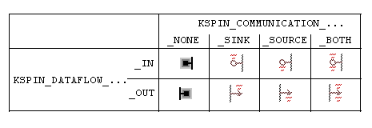

# KsStudio - Pins and nodes

This topic describes how pin factories and pin instantiation can be displayed using the [KSStudio Utility](ksstudio-utility.md).

## Pin Factories 

An audio filter's pin factories describe all of the pins that the filter can instantiate. In general, KS Filters host one or more pin factories. For more information see [Pin Factories](pin-factories.md).

In the *Object Topology View* of the KSStudio Utility, pin factories are located on a filter such that dataflow is drawn from left to right. The various pin types and their representations are shown below. 

**Communication Flow and Data Flow** 

## Pin Instantiation 

There are several ways to instantiate a pin in KSStudio. 

- Manual instantiation. This method is useful if you want to control the format of the pin. Right-click on a pin factory and choose Instantiate from the popup menu. This produces the `KSPIN_CONNECT` parameters dialog. 

This dialog shows an appropriate structure (based on `KSPIN_CONNECT`) used to instantiate a pin. The structure shown is the result of a call to the filters Data Range Intersection handler. The members of the structure and substructures can be changed by double clicking on them. The PinToHandle member can be populated by choosing a pin instance from the .ConnectTo tree in the bottom of the dialog. When the dialog is confirmed, the KSPIN_CONNECT structure is passed as a parameter to KsCreatePin. 

- Automatic Instantiation. This method is used to connect pins together. It is much easier than Manual instantiation, but allows no control over the pin format. Instead it relies on the format degotiation mechanisms of the pins themselves. Simply drag a pin factory onto a pin instance or another pin. The negotiation mechanism is different for different combinations of endpoints: 

  - *Drag Communication Source Pin Factory A onto Communication Sink Pin Instance B*. Format negotiation is trivial here since the format of the instantiated pin (B) is already set. The pin factory (A) is simply instantiated specifying the handle of instantiated pin (B) as the PinConnectTo parameter, and the the format of the instantiated pin (B) as the data format. Dragging a Pin Instance onto a Pin Factory is a minor variation of this method that achieves the same result. 

  - *Drag Communication Source Pin Factory A onto Communication Sink Pin Factory B*. Format negotiation here is accomplished using the DataRange Intersection mechansim. The DataRange of the source pin factory (A) is submitted to the DataRange Intersection handler of the sink pin factory (B). If this call succeeds, then Pin Factory B is instantiated with this format. Pin Factory A is then instantiated with the same format, and with the handle of now Pin Instance (B) as the `PinHandleTo` member. Dragging a communication sink pin factory onto a communication source pin is a minor variation of this method that achieves the same result. 

For each pin instantiated using the above methods, representations of the pin instance are added to both the *Object Topology View* and *Object Details View*. 

## Nodes

Nodes are used to describe the path of data flow through a filter. They are also used to declare the scope of effect that results from a property call as described below in "Properties and Events on Nodes". 

To view a filter's nodes in the graph view, right-click on the filter and chose "view nodes". 

When you click on a node in the graph view, the following UI actions are invoked: 

- Every path through the selected node is highlighted in the filter 

- The corresponding representation of the node in the tree view is selected 

Note that orphaned nodes (nodes with no connections) are drawn in the upper left corner of the filters graphical domain. 

## Properties and Events on Nodes 

Property and Event calls are made via communication targets (filters and pins). As a parameter to these property and event calls, a node ordinal may be specified. In this sense, a property call is said to be *on* a node, *through* a pin or filter. 

KSStudio visually represents these relationships in both the *Object Topology View* and in the *Object Details View*. 

When a pin is instantiated, nodes are added as child items of the pin instance in the *Object Details View*. Properties on these nodes are queried on the nodes, through the pin. Note that most properties on nodes make sense only through the pin or through the filter, but not through both. 

## See also

[KSStudio Utility](ksstudio-utility.md)

[KSStudio - Filters and Filter Factories](ksstudio-utility-filters-and-filter-factories.md)

[KSStudio - KSProperties and Events](ksstudio-utility-ksproperties-and-events.md)

[KSStudio - KS Monitor](ksstudio-utility-ks-monitor.md)

[KSStudio - Usage Examples](ksstudio-utility-usage-examples.md)

 

